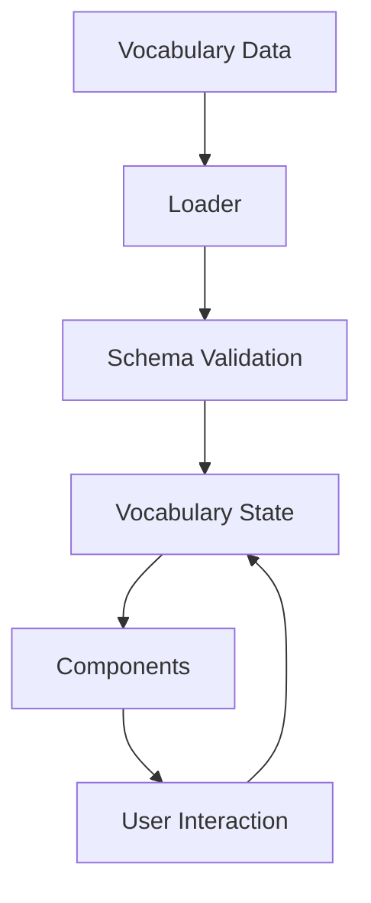

# Vocabulary Feature - GitHub Copilot Instructions

**Last Updated**: 13 December 2025
**Status**: Active
**Apply To**: `src/lib/components/vocabulary/**`, `src/lib/state/vocabulary*.ts`, `src/lib/data/vocabulary.ts`, `src/lib/schemas/vocabulary.ts`

---

## Feature Overview

The vocabulary feature is the core of the Bulgarian-German Learning App, enabling users to:
- Search and browse bilingual vocabulary (745+ enriched entries)
- View word details with examples and definitions
- Practice vocabulary in both directions (DE→BG, BG→DE)
- Mark words as favorites for focused practice
- Access enriched content from Langenscheidt dictionary

**Key Characteristics**:
- Bilingual: German ↔ Bulgarian
- Direction-aware: Supports both DE→BG and BG→DE modes
- Enriched: Definitions, examples, and grammatical information
- Offline-capable: All data bundled at build time

---

## Architecture

### Component Structure

```
src/lib/components/vocabulary/
├── VocabularyCard.svelte          # Individual vocabulary item display
├── WordDetailModal.svelte         # Detailed word view with examples
├── DefinitionLink.svelte          # Interactive definition display
├── EnrichmentBadge.svelte         # Visual indicator for enriched content
└── VocabularySearch.svelte        # Search functionality (planned)
```

### State Management



**State Files**:
- `src/lib/state/vocabulary-state.svelte.ts` - Vocabulary-specific state
- `src/lib/state/app-state.ts` - Global state (language mode, etc.)

---

## Key Patterns and Conventions

### 1. Direction-Aware Display

**Pattern**: Always display content based on the current language mode (`DE_BG` or `BG_DE`)

```svelte
<script lang="ts">
  // ✅ CORRECT: Direction-aware display
  let { item, languageMode = 'DE_BG' } = $props();

  // Derived state for direction-aware display
  let sourceText = $derived(languageMode === 'DE_BG' ? item.german : item.bulgarian);
  let targetText = $derived(languageMode === 'DE_BG' ? item.bulgarian : item.german);
  let directionArrow = $derived(languageMode === 'DE_BG' ? '→' : '←');
</script>

<div class="vocabulary-item">
  <span class="source-text">{sourceText}</span>
  <span class="direction-arrow">{directionArrow}</span>
  <span class="target-text">{targetText}</span>
</div>
```

**Anti-Pattern**:
```svelte
<!-- ❌ WRONG: Hardcoded direction -->
<div class="vocabulary-item">
  <span>{item.german} → {item.bulgarian}</span>
</div>
```

### 2. State Management

**Pattern**: Use the vocabulary state singleton for all vocabulary-related state

```typescript
// ✅ CORRECT: Use vocabularyState singleton
import { vocabularyState } from '$lib/state/vocabulary-state.svelte';

// Update state through methods
vocabularyState.setSearchQuery('Hallo');
vocabularyState.toggleFavorite('123');
```

**Anti-Pattern**:
```typescript
// ❌ WRONG: Create new state instances
const localState = {
  searchQuery: '',
  favorites: new Set<string>()
};
```

### 3. Data Validation

**Pattern**: Always validate vocabulary data using Zod schemas

```typescript
// ✅ CORRECT: Validate with Zod
import { VocabularyItemSchema } from '$lib/schemas/vocabulary';

function processVocabularyItem(item: unknown) {
  return VocabularyItemSchema.parse(item);
}
```

**Anti-Pattern**:
```typescript
// ❌ WRONG: No validation
function processVocabularyItem(item: any) {
  return item; // Unsafe!
}
```

### 4. Search Implementation

**Pattern**: Implement debounced search with 300ms delay

```typescript
// ✅ CORRECT: Debounced search
export function createDebouncedSearch() {
  let timeoutId: number | null = $state(null);

  return (query: string) => {
    if (timeoutId) clearTimeout(timeoutId);

    timeoutId = window.setTimeout(() => {
      vocabularyState.setSearchQuery(query);
    }, 300);
  };
}
```

**Anti-Pattern**:
```typescript
// ❌ WRONG: Immediate search on every keystroke
function handleSearchInput(query: string) {
  vocabularyState.setSearchQuery(query); // Performance issues!
}
```

---

## Data Schema

**Vocabulary Item Schema** (`src/lib/schemas/vocabulary.ts`):

```typescript
export const VocabularyItemSchema = z.object({
  id: z.string(),
  german: z.string(),
  bulgarian: z.string(),
  partOfSpeech: z.enum(['noun', 'verb', 'adjective', 'adverb', 'preposition', 'phrase']),
  difficulty: z.number().int().min(1).max(5),
  categories: z.array(z.string()),
  exampleSentences: z.array(
    z.object({
      german: z.string(),
      bulgarian: z.string()
    })
  ).optional(),
  definitions: z.array(
    z.object({
      german: z.string(),
      bulgarian: z.string()
    })
  ).optional(),
  alternatives: z.array(z.string()).optional(),
  isEnriched: z.boolean().default(false)
});
```

---

## Feature-Specific Gotchas

### 1. Cyrillic Character Handling

**Issue**: Search functionality must handle Cyrillic characters properly

**Solution**:
```typescript
// ✅ CORRECT: Locale-aware string comparison
function normalizeForSearch(text: string): string {
  return text
    .toLocaleLowerCase('bg') // Handle Cyrillic properly
    .normalize('NFD')        // Normalize accents
    .replace(/[\u0300-\u036f]/g, ''); // Remove diacritics
}

// Usage in search
const normalizedQuery = normalizeForSearch(searchQuery);
const normalizedGerman = normalizeForSearch(item.german);
const normalizedBulgarian = normalizeForSearch(item.bulgarian);
```

### 2. Language Direction Persistence

**Issue**: Language direction must persist across page reloads

**Solution**:
```typescript
// ✅ CORRECT: Update both state and localStorage
function setLanguageMode(mode: 'DE_BG' | 'BG_DE') {
  appState.setLanguageMode(mode);
  localStorage.setItem('app-language-mode', mode);
}
```

### 3. Missing Translations

**Issue**: Some words may have missing translations or examples

**Solution**:
```svelte
<!-- ✅ CORRECT: Graceful fallback -->
<div class="definition">
  {#if item.definitions && item.definitions.length > 0}
    {#each item.definitions as definition}
      <p>{definition.german} - {definition.bulgarian}</p>
    {/each}
  {:else}
    <p class="no-definition">No definitions available</p>
  {/if}
</div>
```

### 4. Performance with Large Datasets

**Issue**: Performance degradation with 700+ vocabulary items

**Solutions**:
- Use `$derived` for computed values to avoid unnecessary recalculations
- Implement virtual scrolling for large lists
- Memoize expensive computations

```svelte
<script lang="ts">
  // ✅ CORRECT: Efficient filtering with derived state
  let filteredVocabulary = $derived(
    vocabularyState.vocabulary.filter(item =>
      normalizeForSearch(item.german).includes(normalizeForSearch(vocabularyState.searchQuery)) ||
      normalizeForSearch(item.bulgarian).includes(normalizeForSearch(vocabularyState.searchQuery))
    )
  );
</script>
```

---

## Testing Patterns

### Unit Tests

**Pattern**: Test state management and utility functions

```typescript
// tests/unit/vocabulary-state.test.ts
import { vocabularyState } from '$lib/state/vocabulary-state.svelte';
import { describe, it, expect } from 'vitest';

describe('Vocabulary State', () => {
  it('should initialize with empty search query', () => {
    expect(vocabularyState.searchQuery).toBe('');
  });

  it('should update search query', () => {
    vocabularyState.setSearchQuery('Hallo');
    expect(vocabularyState.searchQuery).toBe('Hallo');
  });

  it('should toggle favorite status', () => {
    vocabularyState.toggleFavorite('123');
    expect(vocabularyState.favorites.has('123')).toBe(true);

    vocabularyState.toggleFavorite('123');
    expect(vocabularyState.favorites.has('123')).toBe(false);
  });
});
```

### Component Tests

**Pattern**: Test component behavior with Playwright

```typescript
// tests/components/VocabularyCard.test.ts
import { test, expect } from '@playwright/experimental-ct-svelte';
import VocabularyCard from '$lib/components/vocabulary/VocabularyCard.svelte';

test('VocabularyCard displays content in correct direction', async ({ mount }) => {
  const component = await mount(VocabularyCard, {
    props: {
      item: {
        id: '1',
        german: 'Hallo',
        bulgarian: 'Здравей',
        partOfSpeech: 'noun',
        difficulty: 1,
        categories: ['greeting']
      },
      languageMode: 'DE_BG'
    }
  });

  // Verify DE→BG direction
  await expect(component).toContainText('Hallo → Здравей');

  // Change direction
  await component.update({
    props: {
      languageMode: 'BG_DE'
    }
  });

  // Verify BG→DE direction
  await expect(component).toContainText('Здравей ← Hallo');
});
```

### E2E Tests

**Pattern**: Test complete user flows

```typescript
// tests/e2e/vocabulary.test.ts
import { test, expect } from '@playwright/test';

test('Vocabulary search works in both languages', async ({ page }) => {
  await page.goto('/vocabulary');

  // Search in German
  await page.fill('input[placeholder="Suche nach Wörtern..."]', 'Hallo');
  await expect(page.locator('.vocabulary-item:first-child')).toContainText('Hallo → Здравей');

  // Switch to Bulgarian
  await page.click('button:has-text("BG")');

  // Verify search still works in Bulgarian
  await expect(page.locator('input[placeholder="Търсене на думи..."]')).toHaveValue('Hallo');
  await expect(page.locator('.vocabulary-item:first-child')).toContainText('Здравей ← Hallo');
});
```

---

## Integration Patterns

### Event Bus Integration

**Pattern**: Use EventBus for cross-feature communication

```typescript
// Subscribe to vocabulary events
import { eventBus } from '$lib/services/event-bus';

const unsubscribe = eventBus.subscribe('vocabulary-practice', (data) => {
  console.log(`Practicing word: ${data.itemId}`);
  // Update practice statistics or UI
});

// Emit vocabulary events
function startPractice(itemId: string) {
  eventBus.emit('vocabulary-practice', { itemId, timestamp: Date.now() });
}

// Cleanup
onDestroy(unsubscribe);
```

### State Integration

**Pattern**: Integrate vocabulary state with global app state

```typescript
// src/lib/state/app-state.ts
import { vocabularyState } from './vocabulary-state.svelte';

class AppState {
  // ... other state

  get vocabulary() {
    return vocabularyState;
  }

  // Sync language mode with vocabulary state
  setLanguageMode(mode: 'DE_BG' | 'BG_DE') {
    this.languageMode = mode;
    vocabularyState.setLanguageMode(mode);
    localStorage.setItem('app-language-mode', mode);
  }
}
```

---

## Enrichment System Integration

**Pattern**: Integrate with the vocabulary enrichment system

```typescript
// ✅ CORRECT: Use enrichment pipeline
import { enrichVocabulary } from '$lib/services/enrichment-pipeline';

async function loadAndEnrichVocabulary() {
  const rawVocabulary = await loadVocabulary();
  const enrichedVocabulary = await enrichVocabulary(rawVocabulary);
  vocabularyState.setVocabulary(enrichedVocabulary);
}
```

**Enrichment Commands**:
```bash
# Run full enrichment pipeline
pnpm run enrich:vocabulary

# Validate vocabulary without scraping
pnpm run enrich:vocabulary:validate

# Use cached enrichment data
pnpm run enrich:vocabulary:cache

# Dry run (preview changes)
pnpm run enrich:vocabulary:dry
```

---

## Accessibility Requirements

**Pattern**: Ensure WCAG 2.1 AA compliance

```svelte
<!-- ✅ CORRECT: Accessible vocabulary card -->
<div
  class="vocabulary-item"
  role="article"
  aria-label={`Vocabulary item: ${sourceText} ${directionArrow} ${targetText}`}
>
  <span class="source-text" aria-hidden="true">{sourceText}</span>
  <span class="direction-arrow" aria-hidden="true">{directionArrow}</span>
  <span class="target-text" aria-hidden="true">{targetText}</span>

  <!-- Screen reader-only text -->
  <span class="sr-only">
    {sourceText} in {languageMode === 'DE_BG' ? 'German' : 'Bulgarian'},
    {targetText} in {languageMode === 'DE_BG' ? 'Bulgarian' : 'German'}
  </span>
</div>
```

**Key Accessibility Requirements**:
- Proper ARIA attributes for interactive elements
- Keyboard navigation support
- Sufficient color contrast
- Screen reader announcements for language changes
- Focus management during modal interactions

---

## Performance Optimization

**Pattern**: Optimize for performance with 700+ vocabulary items

```svelte
<script lang="ts">
  // ✅ CORRECT: Virtual scrolling for large lists
  import { VirtualList } from '$lib/components/VirtualList.svelte';

  // ✅ CORRECT: Memoize expensive computations
  const getItemKey = (item: VocabularyItem) => item.id;

  // ✅ CORRECT: Use derived state for filtering
  let filteredVocabulary = $derived(
    vocabularyState.vocabulary.filter(item =>
      normalizeForSearch(item.german).includes(normalizeForSearch(vocabularyState.searchQuery)) ||
      normalizeForSearch(item.bulgarian).includes(normalizeForSearch(vocabularyState.searchQuery))
    )
  );
</script>

<!-- ✅ CORRECT: Virtual list implementation -->
<VirtualList
  items={filteredVocabulary}
  itemSize={80}
  height={600}
  getKey={getItemKey}
>
  {#snippet renderItem({ item })}
    <VocabularyCard {item} languageMode={vocabularyState.languageMode} />
  {/snippet}
</VirtualList>
```

---

## Future Enhancements

1. **Advanced Search**:
   - Fuzzy search
   - Category filtering
   - Difficulty level filtering

2. **Personalization**:
   - User-specific difficulty ratings
   - Adaptive learning paths
   - Spaced repetition integration

3. **Collaboration**:
   - Shared vocabulary lists
   - User-contributed examples
   - Community ratings

4. **Multimedia**:
   - Audio pronunciation
   - Image associations
   - Video examples

5. **Analytics**:
   - Learning progress tracking
   - Common mistakes analysis
   - Personalized recommendations

---

## When You're Stuck

1. **Check the gotchas section** above for common issues
2. **Verify data integrity**: Run `pnpm run verify:vocabulary`
3. **Test with a subset**: Use `pnpm run enrich:vocabulary:pilot` for testing
4. **Inspect state**: `console.log(vocabularyState)`
5. **Check browser console** for runtime errors
6. **Review similar components** in the codebase
7. **Ask Copilot for help** using these instructions:
   ```
   Copilot, help me implement [specific feature] for the vocabulary system.
   Follow the patterns in .github/instructions/vocabulary-feature.md
   Here's the current code: [paste relevant code]
   Here's the issue: [describe problem]
   ```

---

**Next Steps**: Implement the [vocabulary search enhancement](https://github.com/username/BulgarianApp-Fresh/issues/123)