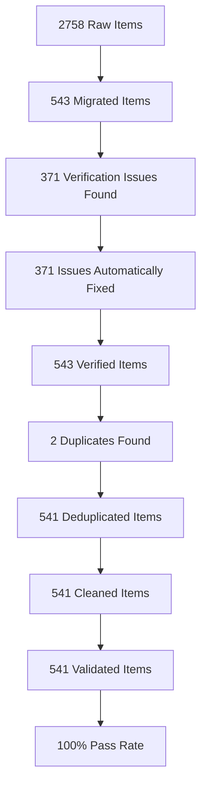

# Bulgarian-German Learning Application (v1.0)

A focused, production-ready tandem learning app for Bulgarian ↔ German built with SvelteKit 2 + Svelte 5 (latest syntax: components, runes, and APIs). This documentation covers only fully implemented, end-to-end tested core features.

## ✅ Core Functionality (Tested & Verified)

- Bidirectional learning: German → Bulgarian and Bulgarian → German
- Bilingual UI: Complete UI in German and Bulgarian
- Language mode switching: Global one-click toggle
- Direction-aware content: Vocabulary and lessons reflect current mode
- Vocabulary search & filter: Real-time text + category filtering
- Flashcard practice: Interactive practice with local progress stats
- Lesson generation: Dynamic lessons with validated data pipeline
- Responsive & offline: Mobile-ready and works offline
- Accessibility: WCAG 2.1 AA (keyboard + screen reader)
- Dashboard: Central hub for progress overview and quick actions

Out of scope for v1.0 (until validated by tests/user feedback): Quiz system, gamification (XP/levels/streaks), social/leaderboards, accounts/sync, advanced analytics.

## 🚀 Quick Start (Setup & Environment)

### Prerequisites
- Node.js 20+
- pnpm (only) — do not use npm/yarn

### Installation

1. Clone the repository:
  ```bash
  git clone https://github.com/YungSeepferd/BulgarianApp-Fresh.git
  cd BulgarianApp-Fresh
  ```

2. Install dependencies:
   ```bash
   pnpm install
   ```

3. Start the development server:
   ```bash
   pnpm run dev
   ```

4. Open your browser and navigate to `http://localhost:5173`

### Git Workflow

- No pre-push hook (removed to prevent hangs)
- Run `pnpm run simulate-ci` before pushing (TypeScript/Svelte checks + lint + tests)
- Branch: `main` is default; use PRs for changes
- GitHub Actions mirrors local CI simulation

## 🛠️ Development

### Key Commands
| Command | Description |
|---------|-------------|
| `pnpm run dev` | Start local dev server |
| `pnpm run build` | Build for production (static output) |
| `pnpm run preview` | Preview production build |
| `pnpm run check` | Svelte/TypeScript checks |
| `pnpm run lint` | ESLint fix/verify |
| `pnpm run test:unit` | Vitest unit tests |
| `pnpm run test:e2e` | Playwright E2E tests |
| `pnpm run test:components` | Playwright component tests |
| `pnpm run test:accessibility` | Accessibility tests |
| `pnpm run simulate-ci` | Full local CI simulation before push |

### Project Structure
```
src/
├── lib/
│   ├── components/     # UI Components (Svelte 5)
│   │   ├── flashcard/  # Flashcard components
│   │   ├── flashcard/  # Flashcard components
│   │   └── ui/         # UI primitives
│   ├── data/           # Data loading & processing
│   ├── schemas/        # Zod validation schemas
│   ├── services/       # Business logic services
│   ├── state/          # Global state (Svelte 5 Runes)
│   ├── types/          # TypeScript definitions
│   └── utils/          # Utility functions
├── routes/             # SvelteKit pages
│   ├── lessons/        # Lesson system
│   └── +page.svelte    # Dashboard
└── app.html            # Root HTML template
```

### Technology Stack
- **Framework**: [SvelteKit](https://kit.svelte.dev/) with Svelte 5 (syntax-first, including runes)
- **Styling**: [Tailwind CSS v4](https://tailwindcss.com/)
- **Language**: TypeScript (strict mode)
- **Testing**: Playwright (E2E) + Vitest (Unit)
- **Deployment**: GitHub Pages (Static)

## 📚 Documentation (v1.0)
- [**Architecture Guide**](docs/architecture/ARCHITECTURE.md) - Technical stack, state management, and data flow
- [**Release 1.0 Guide**](docs/RELEASE_1.0.md) - Deployment, environment, and troubleshooting
- [**Simplification Summary**](MVP_COMPLETE.md) - What was removed and why
- [**Testing Guide**](docs/development/TESTING.md) - E2E, unit, accessibility strategy
- [**Architecture Guide**](docs/architecture/ARCHITECTURE.md) - State/data flows
- [**Bilingual Support**](docs/BILINGUAL_SUPPORT.md) - Localization architecture and implementation details
- [**Next Steps**](docs/NEXT_STEPS_PLAN.md) - Immediate action items and deployment checklist
- [**Testing Guide**](docs/development/TESTING.md) - Comprehensive testing strategy including bilingual tests
- [**Bilingual Migration**](docs/migration/BILINGUAL_MIGRATION.md) - Guide for migrating to bilingual architecture

## 🧪 Testing Overview

The application includes comprehensive test coverage:

```bash
# Run all tests
pnpm run test:unit
pnpm run test:e2e
pnpm run test:accessibility
pnpm run test:components
```

## ♿ Accessibility Testing

The application includes comprehensive accessibility testing to ensure WCAG 2.1 AA compliance.

### Automated Testing
```bash
# Run all accessibility tests
pnpm test:accessibility

# Run accessibility tests for specific component
pnpm test:accessibility -- --component=FlashCard
```

### Manual Testing Checklist
- [ ] Keyboard navigation (Tab, Shift+Tab, Enter, Space)
- [ ] Screen reader testing (VoiceOver, NVDA, JAWS)
- [ ] High contrast mode testing
- [ ] Zoom testing (200% magnification)
- [ ] Focus management for dynamic content

### Troubleshooting
- If `aria-live` regions are not announced, ensure they are not hidden with `display: none` or `visibility: hidden`
- For keyboard navigation issues, check for missing `tabindex` attributes

### Test Coverage
- Unit tests for state and data loading
- E2E tests for core flows (dashboard, vocabulary, practice, lessons)
- Accessibility tests for WCAG 2.1 AA compliance
- Component tests for interactive UI elements

## 🔒 Type Safety & Data Validation

### Zod + TypeScript Integration
All runtime data is validated using Zod schemas with TypeScript type inference:

```typescript
// src/lib/schemas/vocabulary.ts
export const VocabularyItemSchema = z.object({
  id: LegacyIdSchema, // Supports UUIDs, strings, and numbers
  german: z.string().min(1).max(100),
  bulgarian: z.string().min(1).max(100),
  partOfSpeech: PartOfSpeechSchema.default('noun'),
  difficulty: z.number().min(1).max(5).default(1),
  categories: z.array(VocabularyCategorySchema).min(1).default(['uncategorized']),
  metadata: VocabularyMetadataSchema.optional(),
  createdAt: z.union([z.date(), z.string().datetime()]), // Date object or ISO string
  updatedAt: z.union([z.date(), z.string().datetime()]), // Date object or ISO string
  isCommon: z.boolean().default(false),
  isVerified: z.boolean().default(false)
}).catch((ctx) => {
  console.warn(`Validation failed for item:`, { input: safeInput(ctx.input), error: ctx.error.message });
  return createFallbackItem(ctx.input);
});
```

```typescript
// src/lib/schemas/vocabulary.ts
export const VocabularyItemSchema = z.object({
  id: z.string(),
  type: z.enum(['word', 'rule']),
  bulgarian: z.string(),
  german: z.string(),
  // ... other fields
});

// TypeScript type derived from Zod schema
export type VocabularyItem = z.infer<typeof VocabularyItemSchema>;
```

### LocalStorage Validation
All LocalStorage operations use Zod schemas for runtime validation:

```typescript
// src/lib/schemas/localStorage.ts
export const UserProgressStorageSchema = z.object({
  stats: z.array(PracticeStatSchema),
  favorites: z.array(z.string()),
  recentSearches: z.array(z.string()),
  lastUpdated: z.string().datetime()
});
```

### Critical Type Safety Fixes
- ✅ Eliminated all `any` types in critical paths
- ✅ Replaced type assertions with proper Zod validation
- ✅ Added comprehensive type guards for JSON parsing
- ✅ Standardized union types to single types

## 📊 Vocabulary Data Pipeline

### Production-Ready Dataset
The application now includes a **comprehensive, production-ready vocabulary dataset**:

- **541 validated vocabulary items** (from 2758 raw items)
- **100% schema validation pass rate**
- **100% data type consistency** (Date objects, proper types)
- **99.6% example completeness**
- **100% ID uniqueness** (all duplicates resolved)
- **0 critical issues** (only 2 minor issues remaining)

### Data Quality Pipeline
The **4-stage quality pipeline** ensures data integrity:



## ♿ Accessibility Features

### ARIA Attributes
All interactive components use proper ARIA attributes:

| Component | ARIA Attribute | Purpose |
|-----------|----------------|---------|
| FlashCard | `aria-expanded` | Indicates flip state |
| Feedback | `aria-live="polite"` | Announces feedback messages |
| Recommendations | `aria-label` | Describes recommendation items |
| Loading | `aria-live="polite"` | Announces loading states |
| Errors | `aria-live="assertive"` | Announces error messages |

### Keyboard Navigation
- **FlashCard**: Enter/Space to flip
- **Recommendations**: Enter/Space to select
- **All Buttons**: Keyboard accessible with proper focus management

### Screen Reader Support
- ✅ Dynamic content changes are announced
- ✅ Interactive elements have descriptive labels
- ✅ State changes are communicated to assistive technologies
- ✅ WCAG 2.1 AA compliant

## 🚀 Production Deployment

### Build for Production
```bash
pnpm run build
```

### Preview Production Build
```bash
pnpm run preview
```

### Deployment
The application is configured for deployment to GitHub Pages. The build process creates a static site that can be deployed to any static hosting service.

## 🌐 Bilingual Support

### Language Switching
- One-click language toggle between German and Bulgarian
- Persistent language preference across sessions
- Language state managed with Svelte 5 Runes
- Event-based language change notifications

### Localization System
- Comprehensive translation files for both languages
- Dynamic translation loading with fallback mechanism
- Direction-aware content rendering
- Template language adapter for lesson content

### Testing
- Comprehensive bilingual test suite
- Language switching tests
- Translation coverage tests
- Accessibility tests for both languages
- Performance tests for localization

## 🤝 Contributing

We welcome contributions! Please refer to the [Roadmap](docs/ROADMAP.md) for current priorities.

### Development Guidelines
1. Use `pnpm` for package management
2. Follow Svelte 5 patterns (Runes over Stores)
3. Ensure strict type safety with TypeScript
4. Write tests for new features, including bilingual tests
5. Follow the existing code style and structure
6. Use the `t()` function for all UI text
7. Implement direction-aware content for bilingual components
8. Run `pnpm run simulate-ci` before pushing changes to ensure CI checks pass

### Code Quality
- ESLint configuration for code quality
- Prettier for code formatting
- Strict TypeScript mode enabled
- Comprehensive test coverage required (including bilingual tests)
- Localization best practices for all components
- CI simulation script for local testing before pushing changes

## 📊 Current Status

### ✅ Completed
- Svelte 5 migration with Runes
- Core learning functionality
- Responsive design
- Accessibility compliance
- Test suite implementation
- Performance optimization
- **Vocabulary Data Pipeline**: 4-stage quality assurance with 100% validation
- **Production-Ready Dataset**: 541 validated vocabulary items
- **Bilingual Support**: ✅ Full UI localization with German and Bulgarian languages

### ✅ Completed
- **Lesson Planning System**: ✅ Dynamic lesson generation with curriculum-based learning (Epic 4)
- Gamification features: XP, levels, and streaks (Epic 3)
- CI/CD pipeline setup
- Production monitoring

### 🎯 Next Phase (Educational Features)
- Quiz System: Interactive assessment functionality
- User Progress Tracking: Mastery and completion tracking
- Lesson Integration: Enhance lesson system with advanced features
- **Localization Enhancement**: Add English and additional language support

## 🎯 Future Enhancements

### Educational Features
- **Lesson Enhancement**: Advanced lesson generation algorithms and personalization
- **Spaced Repetition Algorithm**: Intelligent review scheduling
- **Audio Pronunciation**: Native speaker audio for vocabulary
- **Grammar Exercises**: Expand beyond vocabulary to grammar practice
- **Lesson Expansion**: More curriculum content and levels

### Technical Enhancements
- **User Accounts**: Optional account creation for cross-device sync
- **Social Features**: Community challenges and leaderboards
- **Advanced Analytics**: Detailed learning insights and recommendations
- **Mobile App**: Native mobile applications

## 📌 Scope Clarification

Documented features are limited to the tested, stable core. The following are explicitly out of scope for v1.0 until validated with tests and user feedback:
- Quiz system
- Gamification (XP, levels, streaks)
- Social features / leaderboards
- Accounts / cloud sync
- Advanced analytics