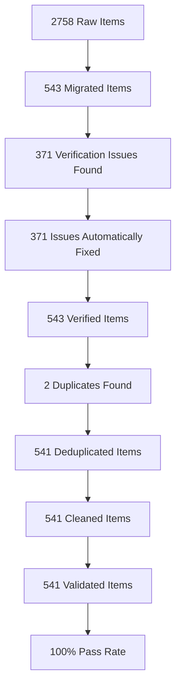

# Bulgarian-German Learning Application

A modern tandem learning platform for mastering Bulgarian and German, built with Svelte 5 and SvelteKit.

## ✨ Features

- **🔄 Bidirectional Learning**: Instantly switch between German→Bulgarian and Bulgarian→German
- **🎯 Smart Practice**: Flashcard system with progress tracking and statistics
- **🔍 Advanced Search**: Real-time filtering by text, category, and tags
- **📚 Lesson Planning System**: ✅ Dynamic lesson generation with curriculum-based learning
- **📝 Quiz System**: Interactive quizzes for vocabulary assessment (in development)
- **📱 Responsive Design**: Optimized for desktop, tablet, and mobile devices
- **💾 Offline Capability**: Full functionality without internet connection
- **♿ Accessible**: WCAG 2.1 AA compliant with full keyboard navigation and screen reader support
- **📊 Progress Tracking**: Detailed statistics, favorites, and practice history
- **🏆 Gamification**: XP, levels, and streaks for motivation (in development)
- **📈 Mastery Tracking**: Vocabulary mastery and lesson completion
- **⚡ Fast Performance**: Optimized bundle size and instant loading

## 🚀 Quick Start

### Prerequisites
- Node.js 20+
- `pnpm` (install via `npm install -g pnpm`)

### Installation

1. Clone the repository:
   ```bash
   git clone <repository-url>
   cd BulgarianApp-Fresh
   ```

2. Install dependencies:
   ```bash
   pnpm install
   ```

3. Start the development server:
   ```bash
   pnpm run dev
   ```

4. Open your browser and navigate to `http://localhost:5173`

## 🛠️ Development

### Key Commands
| Command | Description |
|---------|-------------|
| `pnpm run dev` | Start local dev server |
| `pnpm run build` | Build for production (Static) |
| `pnpm run preview` | Preview production build |
| `pnpm run test` | Run Playwright E2E tests |
| `pnpm run test:unit` | Run Vitest unit tests |
| `pnpm run test:accessibility` | Run accessibility tests |
| `pnpm run test:all` | Run all tests |
| `pnpm run check` | Run Svelte/TypeScript checks |
| `pnpm run lint` | Run ESLint |

### Project Structure
```
src/
├── lib/
│   ├── components/     # UI Components (Svelte 5)
│   │   ├── flashcard/  # Flashcard components
│   │   ├── gamification/ # Gamification components
│   │   └── ui/         # UI primitives
│   ├── data/           # Data loading & processing
│   ├── schemas/        # Zod validation schemas
│   ├── services/       # Business logic services
│   ├── state/          # Global state (Svelte 5 Runes)
│   ├── types/          # TypeScript definitions
│   └── utils/          # Utility functions
├── routes/             # SvelteKit pages
│   ├── lessons/        # Lesson system (in development)
│   ├── quiz/           # Quiz system (in development)
│   └── +page.svelte    # Dashboard
└── app.html            # Root HTML template
```

### Technology Stack
- **Framework**: [SvelteKit](https://kit.svelte.dev/) with Svelte 5 Runes
- **Styling**: [Tailwind CSS v4](https://tailwindcss.com/)
- **Language**: TypeScript (strict mode)
- **Testing**: Playwright (E2E) + Vitest (Unit)
- **Deployment**: GitHub Pages (Static)

## 📚 Documentation
- [**Architecture Guide**](docs/architecture/ARCHITECTURE.md) - Technical stack, state management, and data flow
- [**Roadmap**](docs/roadmap/ROADMAP.md) - Project phases and implementation plan
- [**Current Work Plan**](docs/CURRENT_WORK_PLAN.md) - Development status and priorities
- [**Data Migration**](docs/development/DATA_MIGRATION.md) - Vocabulary data pipeline and quality assurance
- [**Developer Onboarding**](docs/development/DEVELOPER_ONBOARDING.md) - Getting started guide for developers
- [**Lesson Planning System**](docs/development/LESSON_SYSTEM.md) - Comprehensive lesson system documentation
- [**Next Steps**](docs/roadmap/NEXT_STEPS.md) - Immediate action items and deployment checklist

## 🧪 Testing

The application includes comprehensive test coverage:

```bash
# Run all tests
pnpm run test:all

# Run specific test suites
pnpm run test:unit          # Unit tests with Vitest
pnpm run test:e2e           # End-to-end tests with Playwright
pnpm run test:accessibility # Accessibility tests with Axe
pnpm run test:components    # Component tests
```

## 🧪 Accessibility Testing

The application includes comprehensive accessibility testing to ensure WCAG 2.1 AA compliance.

### Automated Testing
```bash
# Run all accessibility tests
pnpm test:accessibility

# Run accessibility tests for specific component
pnpm test:accessibility -- --component=FlashCard
```

### Manual Testing Checklist
- [ ] Keyboard navigation (Tab, Shift+Tab, Enter, Space)
- [ ] Screen reader testing (VoiceOver, NVDA, JAWS)
- [ ] High contrast mode testing
- [ ] Zoom testing (200% magnification)
- [ ] Focus management for dynamic content

### Troubleshooting
- If `aria-live` regions are not announced, ensure they are not hidden with `display: none` or `visibility: hidden`
- For keyboard navigation issues, check for missing `tabindex` attributes

### Test Coverage
- ✅ Unit tests for state management and data loading
- ✅ E2E tests for critical user flows
- ✅ Accessibility tests for WCAG 2.1 AA compliance
- ✅ Component tests for UI interactions
- ✅ Visual regression tests

## 🔒 Type Safety Architecture

### Zod + TypeScript Integration
All runtime data is validated using Zod schemas with TypeScript type inference:

```typescript
// src/lib/schemas/vocabulary.ts
export const VocabularyItemSchema = z.object({
  id: LegacyIdSchema, // Supports UUIDs, strings, and numbers
  german: z.string().min(1).max(100),
  bulgarian: z.string().min(1).max(100),
  partOfSpeech: PartOfSpeechSchema.default('noun'),
  difficulty: z.number().min(1).max(5).default(1),
  categories: z.array(VocabularyCategorySchema).min(1).default(['uncategorized']),
  metadata: VocabularyMetadataSchema.optional(),
  createdAt: z.union([z.date(), z.string().datetime()]), // Date object or ISO string
  updatedAt: z.union([z.date(), z.string().datetime()]), // Date object or ISO string
  isCommon: z.boolean().default(false),
  isVerified: z.boolean().default(false)
}).catch((ctx) => {
  console.warn(`Validation failed for item:`, { input: safeInput(ctx.input), error: ctx.error.message });
  return createFallbackItem(ctx.input);
});
```

```typescript
// src/lib/schemas/vocabulary.ts
export const VocabularyItemSchema = z.object({
  id: z.string(),
  type: z.enum(['word', 'rule']),
  bulgarian: z.string(),
  german: z.string(),
  // ... other fields
});

// TypeScript type derived from Zod schema
export type VocabularyItem = z.infer<typeof VocabularyItemSchema>;
```

### LocalStorage Validation
All LocalStorage operations use Zod schemas for runtime validation:

```typescript
// src/lib/schemas/localStorage.ts
export const UserProgressStorageSchema = z.object({
  stats: z.array(PracticeStatSchema),
  favorites: z.array(z.string()),
  recentSearches: z.array(z.string()),
  lastUpdated: z.string().datetime()
});
```

### Critical Type Safety Fixes
- ✅ Eliminated all `any` types in critical paths
- ✅ Replaced type assertions with proper Zod validation
- ✅ Added comprehensive type guards for JSON parsing
- ✅ Standardized union types to single types

## 📊 Vocabulary Data Pipeline

### Production-Ready Dataset
The application now includes a **comprehensive, production-ready vocabulary dataset**:

- **541 validated vocabulary items** (from 2758 raw items)
- **100% schema validation pass rate**
- **100% data type consistency** (Date objects, proper types)
- **99.6% example completeness**
- **100% ID uniqueness** (all duplicates resolved)
- **0 critical issues** (only 2 minor issues remaining)

### Data Quality Pipeline
The **4-stage quality pipeline** ensures data integrity:



## ♿ Accessibility Features

### ARIA Attributes
All interactive components use proper ARIA attributes:

| Component | ARIA Attribute | Purpose |
|-----------|----------------|---------|
| FlashCard | `aria-expanded` | Indicates flip state |
| Feedback | `aria-live="polite"` | Announces feedback messages |
| Recommendations | `aria-label` | Describes recommendation items |
| Loading | `aria-live="polite"` | Announces loading states |
| Errors | `aria-live="assertive"` | Announces error messages |

### Keyboard Navigation
- **FlashCard**: Enter/Space to flip
- **Recommendations**: Enter/Space to select
- **All Buttons**: Keyboard accessible with proper focus management

### Screen Reader Support
- ✅ Dynamic content changes are announced
- ✅ Interactive elements have descriptive labels
- ✅ State changes are communicated to assistive technologies
- ✅ WCAG 2.1 AA compliant

## 🚀 Production Deployment

### Build for Production
```bash
pnpm run build
```

### Preview Production Build
```bash
pnpm run preview
```

### Deployment
The application is configured for deployment to GitHub Pages. The build process creates a static site that can be deployed to any static hosting service.

## 🤝 Contributing

We welcome contributions! Please refer to the [Roadmap](docs/ROADMAP.md) for current priorities.

### Development Guidelines
1. Use `pnpm` for package management
2. Follow Svelte 5 patterns (Runes over Stores)
3. Ensure strict type safety with TypeScript
4. Write tests for new features
5. Follow the existing code style and structure

### Code Quality
- ESLint configuration for code quality
- Prettier for code formatting
- Strict TypeScript mode enabled
- Comprehensive test coverage required

## 📊 Current Status

### ✅ Completed
- Svelte 5 migration with Runes
- Core learning functionality
- Responsive design
- Accessibility compliance
- Test suite implementation
- Performance optimization
- **Vocabulary Data Pipeline**: 4-stage quality assurance with 100% validation
- **Production-Ready Dataset**: 541 validated vocabulary items

### ✅ Completed
- **Lesson Planning System**: ✅ Dynamic lesson generation with curriculum-based learning (Epic 4)
- Gamification features: XP, levels, and streaks (Epic 3)
- CI/CD pipeline setup
- Production monitoring

### 🎯 Next Phase (Educational Features)
- Quiz System: Interactive assessment functionality
- User Progress Tracking: Mastery and completion tracking
- Lesson Integration: Enhance lesson system with advanced features

## 🎯 Future Enhancements

### Educational Features
- **Lesson Enhancement**: Advanced lesson generation algorithms and personalization
- **Spaced Repetition Algorithm**: Intelligent review scheduling
- **Audio Pronunciation**: Native speaker audio for vocabulary
- **Grammar Exercises**: Expand beyond vocabulary to grammar practice
- **Lesson Expansion**: More curriculum content and levels

### Technical Enhancements
- **User Accounts**: Optional account creation for cross-device sync
- **Social Features**: Community challenges and leaderboards
- **Advanced Analytics**: Detailed learning insights and recommendations
- **Mobile App**: Native mobile applications

## 📄 License

MIT License - see [LICENSE](LICENSE) for details.

## 🙏 Acknowledgments

Built with modern web technologies and best practices for language learning applications.