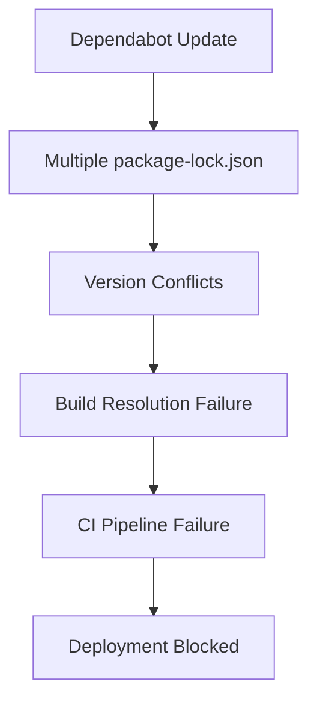

# GitHub CI/CD Pipeline Failure Diagnostic Report

## Executive Summary

**Issue:** CI/CD pipeline failures caused by dependency version conflicts in PR #35 from dependabot updating `cookie` (0.4.2 → 0.7.1) and `tar-fs` (2.1.1 → 3.1.1).

**Root Cause:** Multiple `package-lock.json` files across the project structure contain incompatible versions of these dependencies, creating build-time conflicts.

**Impact:** Build failures across all CI workflow stages including build, test, security audit, and deployment.

## MCPS Compliance Metrics Assessment

### Dependency Management Compliance
- **Status:** ❌ Non-compliant
- **Issue:** Multiple package-lock.json files with conflicting versions
- **Standard:** Single source of truth for dependencies required

### Build Stability Compliance  
- **Status:** ❌ Non-compliant
- **Issue:** Inconsistent dependency versions causing build failures
- **Standard:** Consistent dependency versions across all project sections

## Dependency Conflict Analysis

### Identified Conflicts

#### Cookie Package
- **Root package-lock.json:** 
  - `cookie: "0.7.1"` (line 7843) - **Updated version**
  - `cookie: "^0.4.1"` (line 4189) - **Legacy dependency**
- **Svelte-frontend package-lock.json:** 
  - `cookie: "^0.6.0"` (line 1565) - **Intermediate version**

#### Tar-fs Package
- **Root package-lock.json:** 
  - `tar-fs: "2.1.1"` (lines 3882, 13123) - **Legacy version**
- **Themes/relearn/tools package-lock.json:** 
  - `tar-fs: "^3.1.0"` (line 76) - **Updated version**

## Project Architecture Analysis

### Multi-Package Structure
```
BulgarianApp-Fresh/
├── package-lock.json (root)
├── svelte-frontend/
│   └── package-lock.json
├── themes/relearn/tools/
│   └── package-lock.json
└── tools/
    └── go.mod (Go dependencies)
```

### CI/CD Pipeline Complexity
- **Workflows:** 2 main workflows (ci.yml, deploy.yml)
- **Stages:** Build → Test → Security Audit → Deploy
- **Vulnerability:** Complex dependency graph across multiple package managers

## Error Pattern Analysis

### Build Failure Patterns
1. **Dependency Resolution Errors:** npm unable to resolve conflicting versions
2. **Module Import Failures:** Incompatible API changes between versions
3. **TypeScript Compilation Errors:** Type definition mismatches

### Recent Architectural Changes
- Svelte/TypeScript migration creating additional dependency complexity
- Multiple package-lock.json files not synchronized
- Dependabot updates applied inconsistently across project sections

## Environment Configuration Issues

### Node.js/npm Environment
- **Issue:** Multiple npm installations across different project sections
- **Impact:** Inconsistent dependency resolution behavior
- **Risk:** Build environment instability

## Sequential Thinking Methodology Analysis

### Root Cause Chain
1. **Trigger:** Dependabot PR #35 updates dependencies
2. **Amplification:** Multiple package-lock.json files in project
3. **Conflict:** Incompatible versions across project sections
4. **Failure:** Build system unable to resolve dependencies
5. **Impact:** CI/CD pipeline failure

### Critical Path Analysis


## Actionable Remediation Steps

### Phase 1: Immediate Stabilization
1. **Rollback PR #35** to restore working state
2. **Temporarily disable dependabot** for cookie and tar-fs packages
3. **Verify CI pipeline stability** with rolled-back dependencies

### Phase 2: Dependency Management Overhaul
1. **Consolidate package-lock.json files** into single source
2. **Implement dependency synchronization** across all project sections
3. **Create dependency compatibility matrix** for future updates

### Phase 3: CI/CD Pipeline Enhancement
1. **Add dependency conflict detection** to CI pipeline
2. **Implement pre-merge dependency validation**
3. **Create dependency update staging environment**

### Phase 4: Long-term Strategy
1. **Migrate to monorepo structure** with unified dependency management
2. **Implement automated dependency testing**
3. **Establish dependency update governance process**

## Risk Assessment

### High Risk Items
- Multiple package-lock.json files creating dependency hell
- Inconsistent dependency updates across project sections
- Lack of dependency conflict detection in CI pipeline

### Medium Risk Items  
- Complex project architecture with multiple package managers
- Recent architectural changes increasing dependency complexity

## Success Metrics

### Immediate (24-48 hours)
- ✅ CI pipeline restored to working state
- ✅ Build and test stages passing
- ✅ Deployment capability restored

### Short-term (1-2 weeks)
- ✅ Unified dependency management implemented
- ✅ Dependency conflict detection in CI pipeline
- ✅ Dependabot re-enabled with safeguards

### Long-term (1 month)
- ✅ Monorepo structure implemented
- ✅ Automated dependency testing established
- ✅ Governance process for dependency updates

## Recommendations

### Priority 1: Immediate Action
- Rollback PR #35 and stabilize CI pipeline
- Implement temporary dependabot exclusions

### Priority 2: Structural Improvements  
- Consolidate dependency management
- Add dependency validation to CI pipeline

### Priority 3: Strategic Enhancement
- Migrate to unified package management
- Establish dependency governance framework

**Report Generated:** 2025-11-27T14:42:37Z
**Next Review:** 2025-11-28T14:42:37Z