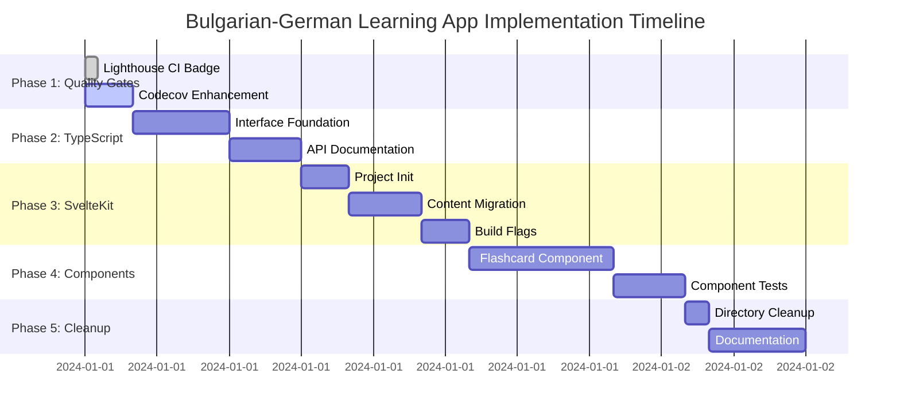

# Next Phase Implementation Plan

## 📋 Executive Summary

This document outlines the comprehensive plan for the next phase of the Bulgarian-German Learning App development, focusing on completing quality gates, establishing SvelteKit foundation, and enhancing type safety while maintaining the existing Hugo-based deployment.

## 🎯 Current Status Assessment

### ✅ Completed Infrastructure
- **TypeScript Migration**: 100% complete with proper type annotations
- **Error Handling**: Enterprise-grade error system with logging and recovery
- **Loading States**: Real-time progress tracking with UI components
- **Workbox Service Worker**: Background sync for offline progress saving
- **Lighthouse CI**: 95+ accessibility score requirement enforced
- **CI/CD Pipeline**: Consolidated workflow with comprehensive quality gates

### 🔄 In Progress
- **Lighthouse CI Badge**: Integration in README.md (currently in progress)

### 📊 Quality Metrics
- **Test Coverage**: Current baseline ~45-60% (target: 80%+)
- **Accessibility**: 95+ Lighthouse score enforced
- **Type Safety**: 100% TypeScript migration complete
- **PWA**: Full offline capability with background sync

## 🚀 Phase 1: Complete Quality Gates (Immediate Priority)

### 1.1 Lighthouse CI Badge Integration
**Status**: In Progress
**Estimated Time**: 30 minutes
**Dependencies**: None

**Tasks**:
- [ ] Complete Lighthouse CI badge addition to README.md
- [ ] Verify badge displays correctly with current scores
- [ ] Test badge updates on CI runs

**Technical Details**:
```markdown
[](https://lhci.vercel.app/api/projects/github/yungseepferd/BulgarianGermanLearningApp)
```

### 1.2 Codecov Enhancement
**Status**: Pending
**Estimated Time**: 2 hours
**Dependencies**: Current CI/CD setup

**Tasks**:
- [ ] Configure Codecov with 80% minimum coverage threshold
- [ ] Add coverage diff checks to prevent regression
- [ ] Update README.md with Codecov badge and percentage
- [ ] Test coverage enforcement in CI/CD

**Technical Implementation**:
```yaml
# Add to .github/workflows/ci.yml
- name: Enforce Coverage Threshold
  run: |
    COVERAGE=$(node -e "console.log(require('./coverage/coverage-summary.json').total.lines.pct)")
    if (( $(echo "$COVERAGE < 80" | bc -l) )); then
      echo "Coverage $COVERAGE% is below 80% threshold"
      exit 1
    fi
```

**Badge Integration**:
```markdown
[](https://codecov.io/gh/yungseepferd/BulgarianGermanLearningApp)
```

## 🏗️ Phase 2: TypeScript Interface Foundation (Parallel Work)

### 2.1 Vocabulary Data Structures
**Status**: Pending
**Estimated Time**: 4 hours
**Dependencies**: None

**Tasks**:
- [ ] Create comprehensive TypeScript interfaces for vocabulary data
- [ ] Add type definitions for flashcard and progress data
- [ ] Update vocabulary API to use new interfaces
- [ ] Add JSDoc documentation for all interfaces

**Technical Specifications**:
```typescript
// src/types/vocabulary.ts
export interface VocabularyEntry {
  id: string;
  bulgarian: string;
  german: string;
  category: VocabularyCategory;
  level: CEFRLevel;
  metadata: VocabularyMetadata;
}

export interface FlashcardData {
  entry: VocabularyEntry;
  direction: 'bg-de' | 'de-bg';
  difficulty: number;
  reviewCount: number;
}

export interface ProgressData {
  userId: string;
  sessionId: string;
  cardsReviewed: number;
  accuracy: number;
  timestamp: Date;
}
```

### 2.2 API Documentation with TypeDoc
**Status**: Pending
**Estimated Time**: 3 hours
**Dependencies**: TypeScript interfaces

**Tasks**:
- [ ] Install and configure TypeDoc
- [ ] Generate comprehensive API documentation
- [ ] Add inline code examples for all public APIs
- [ ] Set up documentation deployment

**Technical Implementation**:
```json
// typedoc.json
{
  "entryPoints": ["assets/js/"],
  "out": "docs/api",
  "theme": "default",
  "includeVersion": true,
  "excludePrivate": true,
  "excludeExternals": true
}
```

## 🎨 Phase 3: SvelteKit Foundation (Major Architecture)

### 3.1 Project Initialization
**Status**: Pending
**Estimated Time**: 2 hours
**Dependencies**: TypeScript interfaces

**Tasks**:
- [ ] Initialize SvelteKit project in `svelte-frontend/` directory
- [ ] Configure adapter-static for GitHub Pages deployment
- [ ] Set up TypeScript configuration
- [ ] Configure build system

**Technical Commands**:
```bash
# Initialize SvelteKit
npm create svelte@latest svelte-frontend
cd svelte-frontend

# Install dependencies
npm install -D @sveltejs/adapter-static
npm install -D mdsvex

# Configure adapter-static
# svelte.config.js updates
```

### 3.2 Content Migration Setup
**Status**: Pending
**Estimated Time**: 3 hours
**Dependencies**: SvelteKit initialization

**Tasks**:
- [ ] Set up mdsvex for Markdown content migration
- [ ] Create content migration scripts
- [ ] Preserve Hugo frontmatter in mdsvex format
- [ ] Test content rendering

**Technical Configuration**:
```javascript
// svelte.config.js
import { mdsvex } from 'mdsvex';
import adapter from '@sveltejs/adapter-static';

const config = {
  extensions: ['.svelte', '.md'],
  kit: {
    adapter: adapter({
      pages: 'build',
      assets: 'build',
      fallback: null,
      precompress: false,
      strict: true
    })
  },
  preprocess: [mdsvex({
    extensions: ['.md'],
    layout: './src/lib/layouts/MarkdownLayout.svelte'
  })]
};
```

### 3.3 Build Flag System
**Status**: Pending
**Estimated Time**: 2 hours
**Dependencies**: SvelteKit setup

**Tasks**:
- [ ] Create build flag to switch between Hugo and SvelteKit
- [ ] Update CI/CD to support both build systems
- [ ] Add environment configuration
- [ ] Test dual deployment capability

**Implementation Strategy**:
```bash
# Environment variable for build system
BUILD_SYSTEM=hugo|sveltekit

# CI/CD updates
- name: Build Hugo
  if: env.BUILD_SYSTEM == 'hugo'
  run: npm run build:hugo

- name: Build SvelteKit
  if: env.BUILD_SYSTEM == 'sveltekit'
  run: cd svelte-frontend && npm run build
```

## 🃏 Phase 4: Component Migration (SvelteKit Implementation)

### 4.1 Flashcard Component Development
**Status**: Pending
**Estimated Time**: 6 hours
**Dependencies**: SvelteKit foundation, TypeScript interfaces

**Tasks**:
- [ ] Create Flashcard.svelte component using existing SM-2 logic
- [ ] Migrate spaced-repetition-system.ts to component architecture
- [ ] Implement proper TypeScript integration
- [ ] Add component tests with Playwright

**Technical Architecture**:
```svelte
<!-- src/lib/components/Flashcard.svelte -->
<script lang="ts">
  import { VocabularyEntry, ProgressData } from '$lib/types/vocabulary';
  import { spacedRepetition } from '$lib/utils/spaced-repetition';
  
  export let entry: VocabularyEntry;
  export let direction: 'bg-de' | 'de-bg' = 'bg-de';
  
  let isFlipped = false;
  let currentDifficulty = 3;
  
  function handleGrade(grade: number) {
    const nextReview = spacedRepetition.calculateNextReview(entry, grade);
    // Update progress and schedule next review
  }
</script>

<div class="flashcard" class:flipped={isFlipped}>
  <!-- Card content with flip animation -->
</div>
```

### 4.2 Component Testing
**Status**: Pending
**Estimated Time**: 3 hours
**Dependencies**: Flashcard component

**Tasks**:
- [ ] Add Playwright component tests for Flashcard.svelte
- [ ] Test keyboard navigation (0-5 keys)
- [ ] Test flip animations and state management
- [ ] Test accessibility compliance

## 🧹 Phase 5: Cleanup & Documentation (Final Polish)

### 5.1 Directory Cleanup
**Status**: Pending
**Estimated Time**: 1 hour
**Dependencies**: None

**Tasks**:
- [ ] Remove unused directories (.windsurf, .claude, .codacy, .gocache, .roocode, .playwright-mcp)
- [ ] Consolidate duplicate utility functions
- [ ] Remove redundant scripts and configuration files

### 5.2 Documentation Updates
**Status**: Pending
**Estimated Time**: 4 hours
**Dependencies**: All previous phases

**Tasks**:
- [ ] Update docs/TECH_DEBT.md with implementation notes
- [ ] Create comprehensive migration guide in docs/MIGRATION_TO_SVELTEKIT.md
- [ ] Add performance benchmarks and migration blockers
- [ ] Update README.md with all badges and concise overview

## 📊 Implementation Timeline



## 🔧 Technical Requirements

### Development Environment
- **Node.js**: 20+ (already configured)
- **TypeScript**: 5.3+ (already configured)
- **SvelteKit**: Latest stable version
- **Adapter-Static**: For GitHub Pages deployment

### Quality Gates
- **Test Coverage**: 80% minimum threshold
- **Accessibility**: 95+ Lighthouse score
- **Type Safety**: Strict TypeScript mode
- **Performance**: Core Web Vitals within budget

### Deployment Strategy
- **Primary**: Hugo on GitHub Pages (maintained)
- **Secondary**: SvelteKit on GitHub Pages (optional)
- **Build Flag**: Environment variable to switch systems
- **Rollback**: Immediate fallback to Hugo if needed

## 🎯 Success Criteria

### Phase 1 Success
- [ ] Lighthouse CI badge displays correctly in README
- [ ] Codecov enforces 80% coverage threshold
- [ ] Coverage diff checks prevent regression

### Phase 2 Success
- [ ] All vocabulary data properly typed
- [ ] API documentation generated and accessible
- [ ] TypeDoc integration working

### Phase 3 Success
- [ ] SvelteKit project builds successfully
- [ ] Content migrates from Hugo to mdsvex
- [ ] Build flag system switches between systems

### Phase 4 Success
- [ ] Flashcard component matches existing functionality
- [ ] Component tests pass with 100% coverage
- [ ] Accessibility compliance maintained

### Phase 5 Success
- [ ] Redundant directories removed
- [ ] Documentation comprehensive and up-to-date
- [ ] Migration guide complete with rollback procedures

## 🚨 Risk Mitigation

### Technical Risks
- **SvelteKit Migration**: Maintain Hugo as fallback during transition
- **Content Migration**: Preserve all existing content and metadata
- **Type Safety**: Gradual interface adoption to avoid breaking changes

### Timeline Risks
- **Complexity**: Each phase builds on previous, allowing for early issue detection
- **Dependencies**: Parallel work streams where possible to optimize timeline
- **Quality Gates**: Automated enforcement prevents regression

### Deployment Risks
- **Dual Systems**: Build flag allows instant rollback
- **GitHub Pages**: Both systems compatible with existing deployment
- **Performance**: Continuous monitoring ensures no degradation

## 📝 Next Steps

1. **Immediate**: Complete Lighthouse CI badge integration (30 minutes)
2. **Today**: Enhance Codecov with 80% threshold (2 hours)
3. **This Week**: TypeScript interface foundation (4 hours)
4. **Next Week**: SvelteKit initialization and setup
5. **Following Week**: Component migration and testing

This plan provides a clear, incremental path to enhancing the Bulgarian-German Learning App while maintaining stability and quality throughout the process.