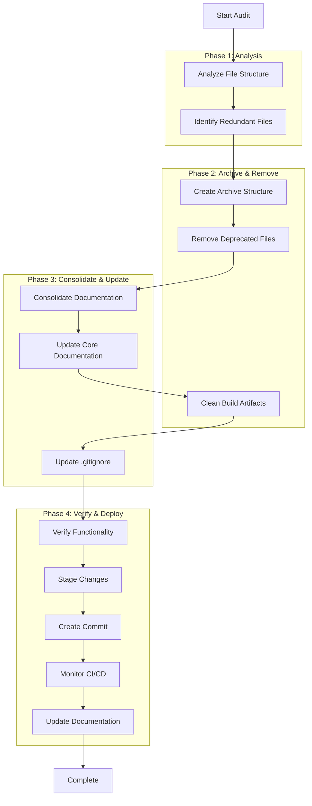

# Project Audit and Optimization Plan

## Overview

This document outlines a comprehensive audit and optimization strategy for the Bulgarian-German Learning App repository. The project has accumulated significant technical debt through multiple development phases, requiring systematic cleanup and reorganization.

## Current Project State

### Issues Identified

1. **Documentation Redundancy**: 60+ overlapping documentation files
2. **Archive Sprawl**: Multiple disorganized archive directories
3. **Build Artifacts**: Temporary files and build outputs cluttering the repository
4. **Deprecated Files**: Completed migration and issue resolution documentation
5. **Poor Organization**: Inconsistent folder structure and naming conventions

## Cleanup Workflow



## Detailed Cleanup Plan

### Phase 1: Analysis and Identification

#### 1.1 File Structure Analysis
- **Root Directory Cleanup**: Remove 15+ redundant documentation files
- **docs/ Directory Reorganization**: Consolidate 30+ documentation files
- **Archive Structure**: Properly organize 60+ historical files

#### 1.2 Redundant File Identification
**Files to Remove:**
- `CLAUDE_MIGRATION_COMPLETE.md` - Migration completed
- `CLAUDE_MIGRATION_LOG.md` - No longer needed
- `ESLINT_FIXING_PLAN.md` - Issues resolved
- `ESLINT_ISSUE_ANALYSIS.md` - Issues resolved
- `TypeScript_Error_Resolution_Plan.md` - Issues resolved
- `TypeScript_Resolution_Workflow.md` - Issues resolved
- `TypeScript_Type_Assertion_Resolution_Report.md` - Issues resolved
- `PHASE_1_COMPLETION_SUMMARY.md` - Historical
- `PHASE_1_EXECUTION_COMPLETE.md` - Historical
- `PHASE_2_EXECUTION_PLAN.md` - Historical
- `PHASE_EXECUTION_ROADMAP.md` - Historical
- `EXECUTION_SUMMARY.md` - Historical
- `FINAL_VALIDATION_REPORT.md` - Historical
- `IMPLEMENTATION_ARTIFACTS.md` - Historical
- `IMPLEMENTATION_STATUS.md` - Historical

**Build Artifacts to Remove:**
- `.tsbuildinfo` - TypeScript build cache
- `eslint-report.json` - ESLint report output
- `coverage/` - Test coverage reports (should be generated)
- `debug-practice-page.png` - Debug screenshot
- `test-pagination.html` - Test file

**Utility Scripts to Remove:**
- `analyze_a1_proficiency.py` - One-time analysis script
- `fix_a1_compliance.py` - One-time fix script
- `fix-duplicate-ids.js` - One-time fix script

### Phase 2: Archive Structure Creation

#### 2.1 New Archive Organization
```
docs/
├── archive/
│   ├── migration/          # Migration documentation
│   ├── phase-reports/       # Phase completion reports
│   ├── testing-reports/     # Historical testing reports
│   └── implementation/      # Implementation documentation
├── audit/                   # Current audit results (keep)
├── api/                     # API documentation (keep)
├── development/             # Development guides (keep)
├── testing/                 # Testing documentation (keep)
├── vocabulary/              # Vocabulary documentation (keep)
└── guides/                  # User guides (keep)
```

#### 2.2 Archive Content Migration
- Move `docs/archive-docs-cleanup/*` to appropriate archive subdirectories
- Consolidate duplicate reports
- Create index files for each archive section

### Phase 3: Documentation Consolidation

#### 3.1 Core Documentation Updates
- **README.md**: Already updated with current project state
- **docs/README.md**: Update to reflect new structure
- **docs/ARCHITECTURE.md**: Update with current SvelteKit + Hugo hybrid state
- **docs/DEVELOPMENT.md**: Update with current development workflow
- **docs/TECH_DEBT.md**: Already updated with current status

#### 3.2 Documentation Consolidation
**Merge or Remove:**
- `API.md` → `docs/API_DOCUMENTATION.md` (keep the newer one)
- `VOCABULARY_API_ARCHITECTURE.md` → `docs/API_DOCUMENTATION.md`
- `VOCABULARY_API_ENHANCEMENT_PLAN.md` → Archive (completed)
- `VOCABULARY_AUDIT_2025.md` → Archive (completed)
- `COMPREHENSIVE_AUDIT_SUMMARY_2025.md` → Archive (completed)

### Phase 4: Build and Development Cleanup

#### 4.1 .gitignore Updates
Add to `.gitignore`:
```
# Build artifacts
.tsbuildinfo
eslint-report.json
coverage/
*.log

# Debug files
debug-*.png
test-*.html

# Temporary files
*.tmp
*.temp
.DS_Store
```

#### 4.2 Script Cleanup
Remove unused scripts from `package.json` if any exist.

### Phase 5: Verification and Testing

#### 5.1 Functionality Verification
- Test Hugo build: `npm run build`
- Test SvelteKit development: `npm run dev`
- Run ESLint: `npm run lint`
- Run tests: `npm run test`

#### 5.2 CI/CD Monitoring
- Watch for any pipeline failures
- Document any issues encountered
- Provide solutions for any problems

## Expected Outcomes

### Before Cleanup
- **Root Files**: 50+ files (many redundant)
- **docs/ Directory**: 100+ files (poorly organized)
- **Archive Files**: 60+ files in disorganized structure
- **Build Artifacts**: Multiple temporary files

### After Cleanup
- **Root Files**: 20-25 essential files
- **docs/ Directory**: 30-40 well-organized files
- **Archive Files**: Properly organized in logical structure
- **Build Artifacts**: Properly excluded via .gitignore

## Risk Mitigation

### Potential Risks
1. **Breaking Functionality**: Removing files that are actually needed
2. **CI/CD Failures**: Cleanup causing pipeline issues
3. **Documentation Loss**: Removing important historical information

### Mitigation Strategies
1. **Incremental Changes**: Clean up in small, verifiable steps
2. **Backup Strategy**: Create branch before major cleanup
3. **Testing**: Verify functionality after each cleanup phase
4. **Documentation**: Preserve important information in organized archives

## Implementation Timeline

### Phase 1: Analysis (1 hour)
- File structure analysis
- Redundancy identification
- Archive planning

### Phase 2: Archive & Remove (2 hours)
- Create new archive structure
- Move files to archives
- Remove deprecated files
- Clean build artifacts

### Phase 3: Consolidate & Update (2 hours)
- Consolidate documentation
- Update core documentation
- Update .gitignore

### Phase 4: Verify & Deploy (1 hour)
- Functionality testing
- CI/CD monitoring
- Final documentation updates

**Total Estimated Time**: 6 hours

## Success Criteria

1. **Reduced Repository Size**: 40% reduction in file count
2. **Improved Organization**: Logical folder structure
3. **Preserved Information**: All important content archived properly
4. **Maintained Functionality**: No broken features
5. **Clean CI/CD**: No pipeline failures
6. **Updated Documentation**: Current project state accurately reflected

## Next Steps

1. Review this plan with stakeholders
2. Create backup branch before starting
3. Execute cleanup in phases
4. Monitor and document any issues
5. Update project documentation with cleanup results