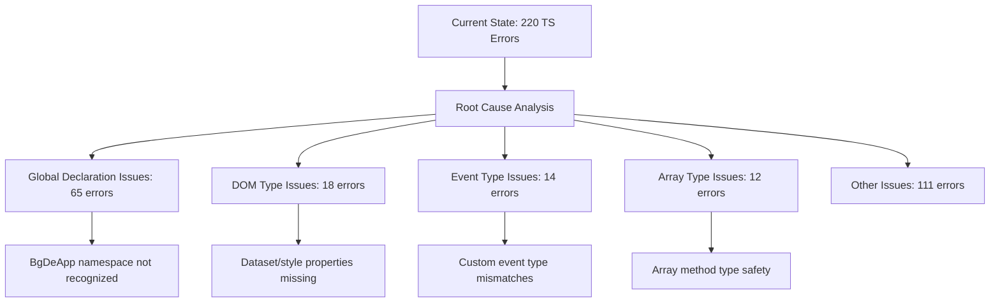
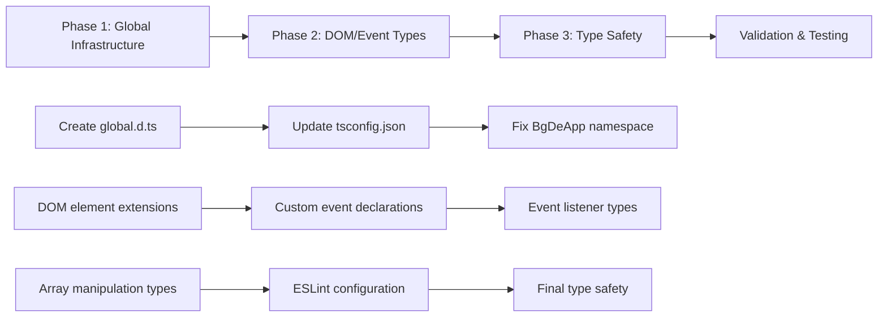
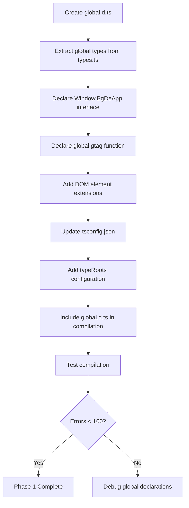
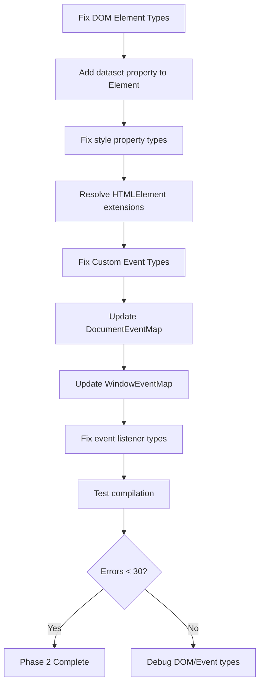
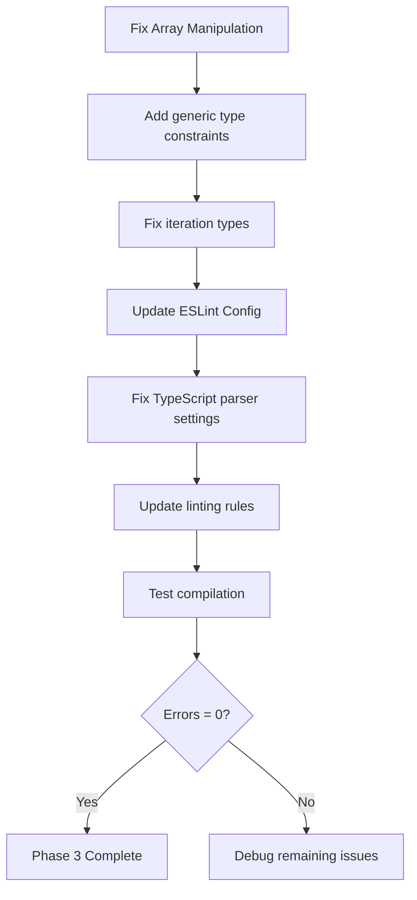
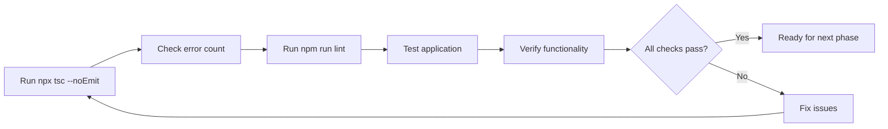
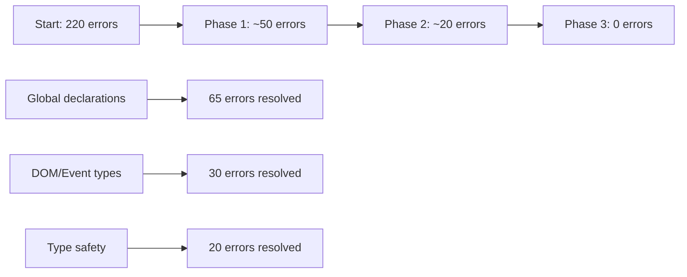
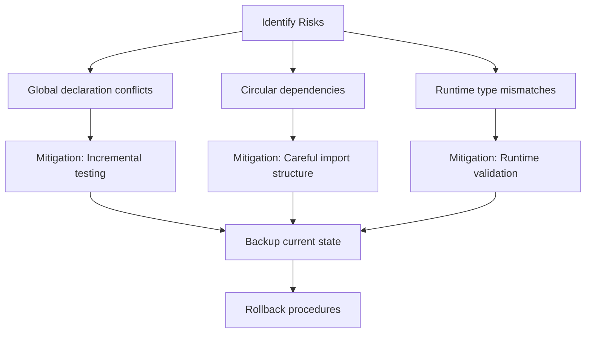
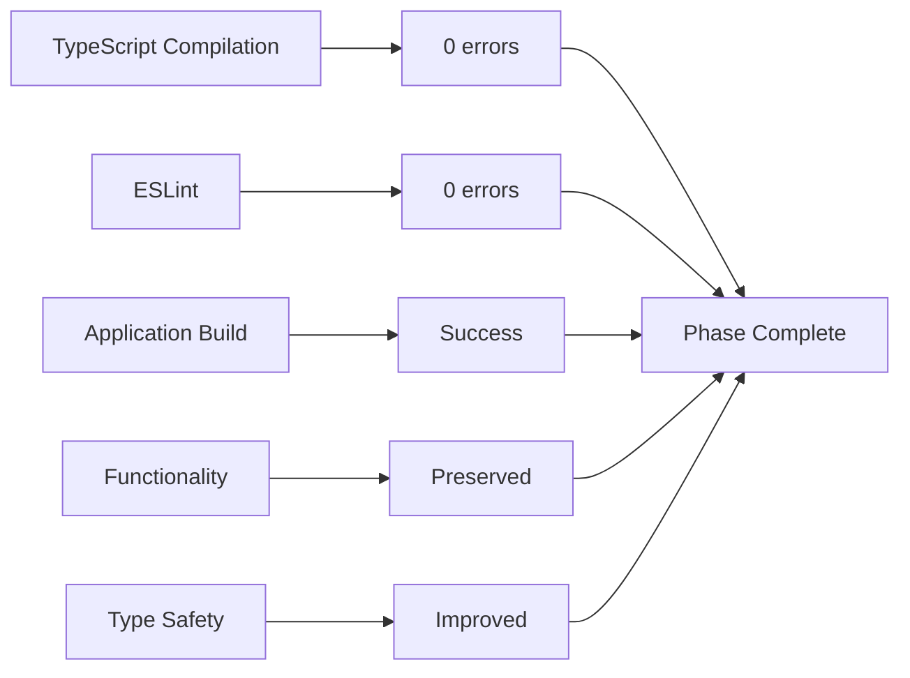

# TypeScript Error Resolution Workflow

## Current State Analysis

## Resolution Strategy

## Implementation Steps

### Phase 1: Global Declaration Infrastructure

### Phase 2: DOM and Event Type Fixes

### Phase 3: Type Safety Improvements

## Validation Process

## Expected Error Reduction

## Risk Management

## Success Metrics

## Next Steps After Resolution

Once TypeScript errors are resolved:

1. **Vocabulary Data Chunking**: Validate lazy loading implementation
2. **Service Worker Integration**: Verify Workbox setup
3. **Accessibility Testing**: Implement axe-core tests
4. **Performance Validation**: Check Lighthouse scores
5. **Documentation Updates**: Record changes and improvements

This systematic approach ensures we resolve all TypeScript compilation errors while maintaining application functionality and improving code quality.