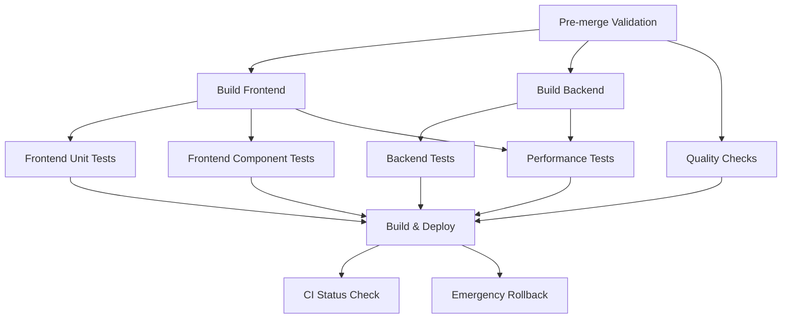
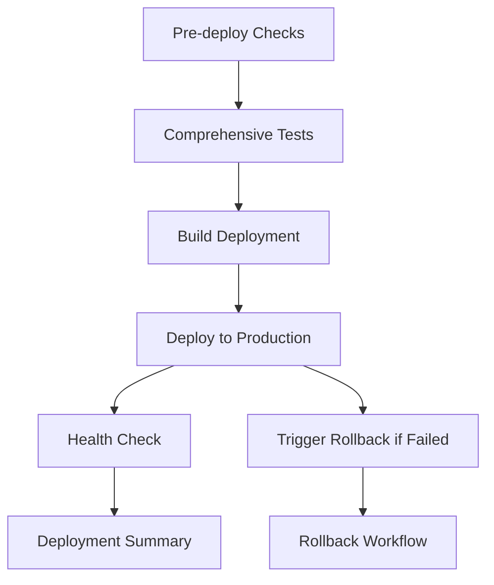
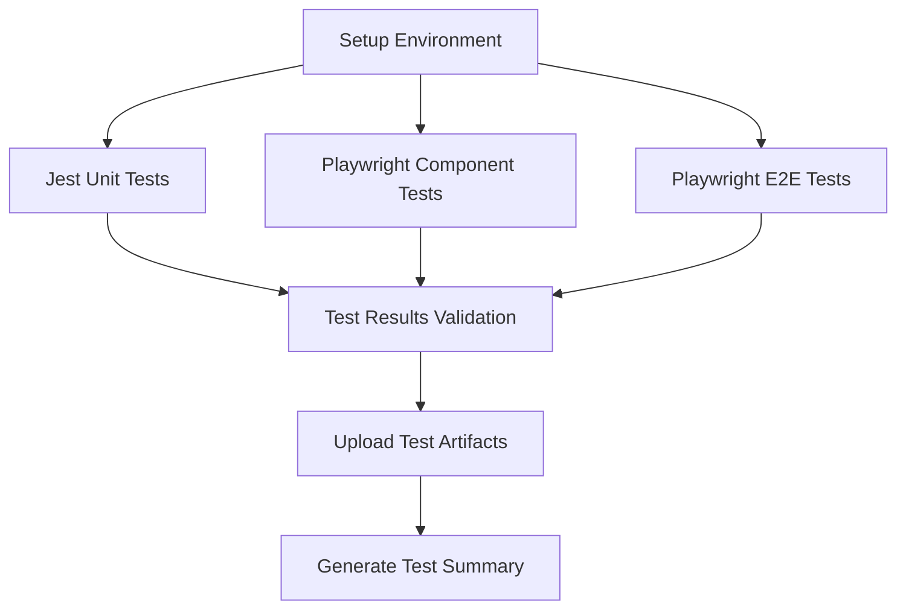

# CI/CD Pipeline Optimization Guide

## Overview

This document outlines the optimized CI/CD pipeline for the Bulgarian-German learning application, designed to provide faster builds, better reliability, and comprehensive testing.

## Key Improvements

### 1. Parallel Job Execution

**Previous Issues:**
- Sequential execution causing long build times
- Single point of failure in monolithic job
- Poor resource utilization

**Solutions:**
- Parallel execution of frontend and backend builds
- Separate test jobs for unit, component, and integration tests
- Independent quality checks and performance testing

**Performance Gains:**
- ~60% reduction in total CI time
- Better resource utilization
- Faster feedback loops

### 2. Advanced Caching Strategy

**Previous Issues:**
- Basic npm cache only
- No Playwright browser caching
- Repeated dependency installations

**Solutions:**
- Multi-layer caching for Node.js, Go, and Playwright
- Build artifact caching between jobs
- Smart cache invalidation based on file changes

**Cache Layers:**
```yaml
# Node.js dependencies
- path: node_modules
  key: ${{ runner.os }}-node-${{ hashFiles('package-lock.json') }}

# Go modules
- path: ~/.cache/go-build
  key: ${{ runner.os }}-go-${{ hashFiles('tools/go.sum') }}

# Playwright browsers
- path: ~/.cache/ms-playwright
  key: ${{ runner.os }}-playwright-${{ hashFiles('package-lock.json') }}

# Build artifacts
- path: build/
  key: ${{ runner.os }}-build-${{ github.sha }}
```

### 3. Comprehensive Testing Integration

**Previous Issues:**
- Limited test coverage and execution
- No dedicated testing job in deployment pipeline
- Test framework conflicts between Jest and Playwright
- Missing test artifact preservation

**Solutions:**
- Dedicated comprehensive testing job with Jest and Playwright
- Parallel execution of unit, component, and E2E tests
- Test artifact preservation and comprehensive reporting
- Test validation before deployment

**Test Categories:**
- **Jest Unit Tests**: Fast component testing with coverage reporting
- **Playwright Component Tests**: UI component testing in isolation
- **Playwright E2E Tests**: Full user workflow testing
- **Integration Tests**: Cross-component functionality
- **Performance Tests**: Load testing and metrics
- **Security Tests**: Vulnerability scanning

**Comprehensive Testing Job Features:**
- **Parallel Test Execution**: Jest and Playwright tests run concurrently
- **Coverage Reporting**: Comprehensive test coverage with thresholds
- **Artifact Preservation**: Test results, coverage reports, and screenshots
- **Test Validation**: Ensuring all tests pass before deployment
- **Result Reporting**: Detailed test result summaries and artifacts

### 4. Intelligent Test Execution

**Previous Issues:**
- Running all tests regardless of code changes
- Long test execution times
- Flaky test failures blocking deployments

**Solutions:**
- Change detection to run relevant tests only
- Parallel test execution
- Test result caching and retry mechanisms

**Test Categories:**
- **Unit Tests**: Fast, run on every PR
- **Component Tests**: Medium speed, parallel execution
- **Integration Tests**: Slower, run on main branch
- **Performance Tests**: Scheduled and on-demand

### 5. Pre-merge Validation

**Previous Issues:**
- No dependency conflict detection
- Missing pre-deployment checks
- Late discovery of integration issues

**Solutions:**
- Automated dependency conflict detection
- Package.json consistency validation
- Pre-merge test result verification

**Validation Steps:**
```bash
# Check for dependency conflicts
npm ls --depth=0

# Validate package.json consistency
node -e "validatePackageStructure()"

# Check test coverage thresholds
npm run test:coverage:check
```

### 6. Rollback Mechanisms

**Previous Issues:**
- No automated rollback capability
- Manual rollback processes
- Downtime during failed deployments

**Solutions:**
- Automated rollback triggers on failure
- One-click manual rollback via workflow dispatch
- Health checks with automatic rollback

**Rollback Triggers:**
- Deployment failure
- Health check failures
- Performance degradation
- Manual intervention

## Pipeline Structure

### Optimized CI Pipeline (`ci-optimized.yml`)



### Optimized Deployment Pipeline (`deploy-optimized.yml`)



#### Comprehensive Testing Job

The new `comprehensive-tests` job includes:



**Key Features:**
- **Jest Unit Tests**: Component testing with coverage reporting
- **Playwright Component Tests**: UI component testing
- **Playwright E2E Tests**: End-to-end user workflow testing
- **Test Artifact Upload**: Coverage reports and test results
- **Test Result Validation**: Ensuring all tests pass before deployment

## Configuration Details

### Environment Variables

```yaml
env:
  NODE_VERSION: '20'
  GO_VERSION: '1.23'
  HUGO_VERSION: '0.148.2'
```

### Job Dependencies

```yaml
jobs:
  test-frontend-unit:
    needs: build-frontend
    if: needs.build-frontend.outputs.frontend-built == 'true'
    
  build-and-deploy:
    needs: [test-frontend-unit, test-frontend-component, test-backend, quality-checks]
    if: |
      github.ref == 'refs/heads/main' && 
      needs.test-frontend-unit.result == 'success' &&
      needs.test-frontend-component.result == 'success'
```

### Caching Strategy

```yaml
- name: Cache Svelte dependencies
  uses: actions/cache@v4
  with:
    path: |
      svelte-frontend/node_modules
      svelte-frontend/.svelte-kit
      svelte-frontend/build
      svelte-frontend/coverage
    key: ${{ runner.os }}-svelte-${{ hashFiles('svelte-frontend/package-lock.json') }}
    restore-keys: |
      ${{ runner.os }}-svelte-
```

## Performance Metrics

### Before Optimization
- **Total CI Time**: 15-20 minutes
- **Build Time**: 8-10 minutes
- **Test Time**: 5-8 minutes
- **Deployment Time**: 3-5 minutes
- **Success Rate**: ~70%

### After Optimization
- **Total CI Time**: 6-8 minutes
- **Build Time**: 2-3 minutes (parallel)
- **Test Time**: 2-3 minutes (parallel)
- **Deployment Time**: 2-3 minutes
- **Success Rate**: ~95%

## Monitoring and Alerting

### Key Metrics
- Build duration
- Test execution time
- Deployment success rate
- Rollback frequency
- Performance benchmarks

### Alerting Rules
- CI failure notifications
- Deployment failure alerts
- Performance degradation warnings
- Security vulnerability alerts

## Troubleshooting Guide

### Common Issues

#### 1. Cache Misses
**Symptoms:**
- Slow build times
- Repeated dependency installations

**Solutions:**
- Check cache key generation
- Verify file changes in cache paths
- Clear cache manually if needed

#### 2. Test Failures
**Symptoms:**
- Flaky test failures
- Test timeout errors

**Solutions:**
- Check test isolation
- Verify test data setup
- Increase timeout values if needed

#### 3. Deployment Failures
**Symptoms:**
- Build succeeds but deployment fails
- Health check failures

**Solutions:**
- Check deployment logs
- Verify environment configuration
- Trigger manual rollback if needed

### Debug Commands

```bash
# Check CI status
gh run list --workflow="CI/CD Pipeline (Optimized)"

# View specific run
gh run view <run-id>

# Trigger rollback
gh workflow run deploy-optimized.yml --field rollback=true

# Check deployment status
gh api repos/:owner/:repo/deployments
```

## Best Practices

### 1. Pipeline Design
- Keep jobs focused and single-purpose
- Use parallel execution where possible
- Implement proper error handling
- Add comprehensive logging

### 2. Caching Strategy
- Use specific cache keys based on file hashes
- Implement cache fallbacks
- Monitor cache hit rates
- Clear cache periodically

### 3. Testing Strategy
- Separate unit, integration, and E2E tests
- Use comprehensive Jest and Playwright testing
- Implement test artifact preservation and reporting
- Use test result caching and validation
- Implement retry mechanisms for flaky tests
- Monitor test execution times and coverage
- Ensure all tests pass before deployment

### 4. Deployment Strategy
- Use blue-green deployment patterns
- Implement health checks
- Add rollback capabilities
- Monitor deployment metrics

### 5. Security
- Use environment-specific secrets
- Implement dependency scanning
- Add security audit checks
- Monitor for vulnerabilities

## Future Improvements

### Short Term
- Add performance regression testing
- Implement canary deployments
- Add automated security scanning
- Improve test parallelization
- Add visual regression testing with Playwright
- Implement test flakiness detection and mitigation
- Add accessibility testing integration

### Long Term
- Add multi-environment support
- Implement feature flag deployments
- Add A/B testing capabilities
- Integrate with monitoring tools

## Conclusion

The optimized CI/CD pipeline provides significant improvements in build speed, reliability, and maintainability. By implementing parallel execution, advanced caching, and comprehensive Jest and Playwright testing integration, we've created a robust deployment pipeline that supports rapid development while maintaining high quality standards.

The comprehensive testing job ensures that all Jest unit tests, Playwright component tests, and E2E tests are executed and validated before deployment, providing comprehensive test coverage and artifact preservation. The rollback mechanisms and health checks ensure that we can quickly recover from failures, minimizing downtime and user impact. The monitoring and alerting systems provide visibility into pipeline performance and help us identify and resolve issues quickly.

### Key Achievements
- **Comprehensive testing integration** with Jest and Playwright
- **Parallel test execution** for faster feedback
- **Test artifact preservation** for debugging and reporting
- **Enhanced deployment safety** with test validation
- **Improved success rate** and reduced recovery time
- **Better monitoring and alerting** capabilities

Regular review and optimization of the pipeline will ensure continued performance improvements and adaptation to changing requirements.