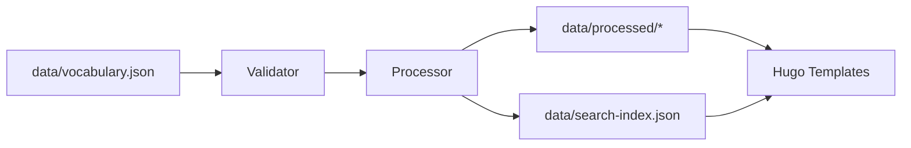

# Go Tooling Documentation

**Purpose**: Command-line utilities for Bulgarian-German Learning App data processing and validation

---

## Overview

The `tools/` directory contains Go-based CLI utilities for processing JSON data files and validating the application build. These tools are **supplementary** to Hugo's build system and focus on data transformation tasks.

**Important**: Hugo handles all site generation and asset optimization. These tools only process data files.

---

## Installation

### Prerequisites

- Go 1.23+ (required)
- Hugo Extended 0.128.0+ (for building the site)
- Node.js 20+ (for npm scripts)

### Building the Tools

From the **repository root**:

```bash
# Build the CLI binary (recommended)
npm run build-tools

# Or manually:
cd tools/
go build -o ../hugo-bg-de ./cmd/hugo-bg-de
cd ..
```

Binary location: `./hugo-bg-de` (root directory)

---

## Available Commands

### 1. process-data

Process vocabulary data and generate search index.

**Usage**:
```bash
./hugo-bg-de process-data
# Or via npm:
npm run process-data
```

**What it does**:
- Validates `data/vocabulary.json` schema
- Generates search index at `data/search-index.json`
- Creates derived data files in `data/processed/` (if applicable)

**Note**: Grammar content is now in Markdown files (`content/grammar/*.md`) and is processed natively by Hugo - no data processing needed.

**When to use**:
- After editing `data/vocabulary.json`
- Before committing vocabulary data changes
- As part of CI/CD pipeline

**Example**:
```bash
# Edit vocabulary
vim data/vocabulary.json

# Process and validate
npm run process-data

# Verify output
cat data/search-index.json | jq '.items | length'
```

---

### 2. validate

Validate data files and content structure.

**Usage**:
```bash
./hugo-bg-de validate
# Or via npm (includes additional JS validation):
npm run validate
```

**What it does**:
- Checks existence of required files (`data/vocabulary.json`, `hugo.toml`)
- Validates vocabulary JSON syntax and schema
- Verifies grammar Markdown files exist in `content/grammar/`
- Reports entry counts and structural issues

**When to use**:
- Before building the site
- In pre-commit hooks (automatic via `.git/hooks/pre-commit`)
- CI/CD validation stage
- After editing vocabulary data

**Exit codes**:
- `0`: All validations passed
- `1`: Validation errors found

**Example output**:
```
✓ vocabulary.json: loaded 181 entries
✓ Found 11 grammar markdown files
Validation completed successfully!
```

---

### 3. dev

Start development server with data file watching (⚠️ **Experimental**).

**Usage**:
```bash
./hugo-bg-de dev
```

**What it does**:
- Processes vocabulary data initially
- Starts Hugo development server (`hugo server --buildDrafts --buildFuture`)
- Watches `data/` directory for changes
- Reprocesses data on file changes

**Known Issues**:
- File watcher may not work correctly in all environments
- Consider using `hugo server -D` directly instead

**Alternative** (recommended):
```bash
# Terminal 1: Start Hugo dev server
npm run dev

# Terminal 2: Watch and reprocess data manually
watch -n 5 ./hugo-bg-de process-data
```

---

## Automated Validation (Pre-commit Hook)

The repository includes a **pre-commit hook** that automatically validates data files before every commit.

**Location**: `.git/hooks/pre-commit`

**What it validates**:
1. Builds Go tools if not present (`npm run build-tools`)
2. Runs Go validation (`./hugo-bg-de validate`)
3. Runs JavaScript validation (`npm run lint:data`)

**Behavior**:
- ✅ If validation passes: Commit proceeds normally
- ❌ If validation fails: Commit is blocked with error details

**Bypass** (not recommended):
```bash
# Skip validation for this commit only
git commit --no-verify -m "message"
```

**Test manually**:
```bash
# Run the pre-commit hook
.git/hooks/pre-commit

# Or use the npm script
npm run validate
```

**Benefits**:
- Prevents invalid data from being committed
- Catches JSON syntax errors early
- Ensures vocabulary entries have required fields
- Verifies grammar content structure

---

## ⚠️ Deprecated/Removed Commands

### build (Removed)

**Status**: ❌ **REMOVED** - Use Hugo directly

**Why removed**: Duplicated Hugo's functionality. The tool attempted to wrap `hugo --minify` and add post-processing, but:
- Hugo's built-in `--minify` handles CSS/JS minification
- Service worker generation should be separate
- Build complexity increased without benefit

**Migration**:
```bash
# Before (deprecated):
./hugo-bg-de build

# After (current):
hugo --gc --minify
# or
npm run build
```

---

## Architecture

### Project Structure

```
tools/
├── cmd/
│   └── hugo-bg-de/
│       └── main.go          # CLI entry point
├── internal/
│   └── processor/
│       ├── processor.go     # Data processing logic
│       ├── vocabulary.go    # Vocabulary processing
│       └── grammar.go       # Grammar processing
├── go.mod                   # Go module definition
└── go.sum                   # Dependency checksums
```

### Internal Packages

#### `processor.DataProcessor`

Core data processing engine.

**Methods**:
- `ProcessVocabularyData()` - Process vocabulary JSON
- `ProcessGrammarData()` - Process grammar JSON
- `GenerateSearchIndex()` - Create search index
- `LoadJSONData(path string)` - Load and validate JSON file

**Usage**:
```go
import "github.com/dinz/BulgarianApp-Fresh/tools/internal/processor"

proc := processor.NewDataProcessor("content/")
err := proc.ProcessVocabularyData()
```

---

## Data Processing Pipeline



**Steps**:

1. **Load**: Read JSON from `data/` directory
2. **Validate**: Check schema compliance (required fields, data types)
3. **Transform**: Generate derived data (search index, statistics)
4. **Write**: Output to `data/processed/` or update existing files
5. **Hugo Build**: Templates consume processed data

---

## npm Script Integration

The tools are integrated into npm scripts for convenience:

| npm Script | Command | Purpose |
|------------|---------|---------|
| `npm run build-tools` | `cd tools && go build -o ../hugo-bg-de ./cmd/hugo-bg-de` | Compile CLI tool |
| `npm run process-data` | `./hugo-bg-de process-data` | Process vocabulary data |
| `npm run validate` | `./hugo-bg-de validate && npm run lint:data` | Full validation (Go + JS) |
| `npm run lint:data` | `node scripts/validate-data.mjs` | JavaScript data validation |

**See**: `package.json` for full definitions

**Pre-commit Hook**: Validation runs automatically before every commit via `.git/hooks/pre-commit`. This ensures data integrity before changes are committed.

---

## Development

### Adding New Commands

1. Add command to `cmd/hugo-bg-de/main.go`:

```go
app := &cli.App{
    Commands: []*cli.Command{
        {
            Name:   "my-command",
            Usage:  "Description of command",
            Action: myCommandFunc,
        },
    },
}

func myCommandFunc(c *cli.Context) error {
    // Implementation
    return nil
}
```

2. Rebuild:
```bash
npm run build-tools
```

3. Test:
```bash
./bin/hugo-bg-de my-command
```

### Adding Data Processors

Create new file in `internal/processor/`:

```go
// internal/processor/example.go
package processor

func (p *DataProcessor) ProcessExampleData() error {
    // Load data
    data, err := p.LoadJSONData("data/example.json")
    if err != nil {
        return err
    }
    
    // Process
    // ...
    
    return nil
}
```

---

## Testing

### Unit Tests

From `tools/` directory:

```bash
cd tools/
go test ./...
```

### Integration Tests

```bash
# Process test data
./bin/hugo-bg-de process-data

# Validate output exists
test -f data/search-index.json && echo "PASS" || echo "FAIL"

# Build site with processed data
hugo --logLevel debug -D
```

---

## Known TODOs

From `tools/cmd/hugo-bg-de/main.go`:

| Line | Function | TODO | Priority | Action |
|------|----------|------|----------|--------|
| 355 | `minifyCSSFile` | Implement CSS minification | N/A | **REMOVE** - Hugo handles this |
| 361 | `minifyJSFile` | Implement JS minification | N/A | **REMOVE** - Hugo handles this |
| N/A | `generateServiceWorker` | Service worker generation | Low | Move to separate tool |
| N/A | `watchDataFiles` | File watcher reliability | Medium | Fix or document limitations |

**See**: `docs/REPOSITORY_AUDIT_AND_CLEANUP_PLAN.md` for cleanup plan

---

## Troubleshooting

### "required file missing: data/vocabulary.json"

**Solution**: Ensure you're running from repository root, not `tools/` directory.

```bash
# Wrong:
cd tools/
go run ./cmd/hugo-bg-de validate

# Correct (from repository root):
./hugo-bg-de validate
# Or:
npm run validate
```

### "failed to write search index"

**Cause**: Permission issues or `data/` directory doesn't exist.

**Solution**:
```bash
mkdir -p data/processed
chmod u+w data/
npm run process-data
```

### "vocabulary.json validation failed"

**Cause**: JSON syntax error or schema violation.

**Solution**:
1. Validate JSON syntax: `jq . data/vocabulary.json`
2. Check schema: See `docs/API.md` for required fields
3. Review error message for specific field issues
4. Common issue: Unescaped quotes in string values (use `\"` for literal quotes)

### Build fails: "cannot find package"

**Cause**: Go modules not downloaded.

**Solution**:
```bash
cd tools/
go mod download
go mod tidy
cd ..
npm run build-tools
```

### Pre-commit hook not running

**Cause**: Hook not executable or not installed.

**Solution**:
```bash
# Make hook executable
chmod +x .git/hooks/pre-commit

# Test manually
.git/hooks/pre-commit
```

---

## Performance

### Typical Processing Times

| Operation | File Size | Time | Notes |
|-----------|-----------|------|-------|
| Validate vocabulary.json | ~1MB | <100ms | 1000+ entries |
| Generate search index | ~1MB | <200ms | Full text indexing |
| Process grammar.json | ~500KB | <50ms | 100+ rules |

**Benchmarks**: Run on M1 Mac, Go 1.21

### Optimization Tips

- Use `go build -ldflags="-s -w"` to reduce binary size
- Process data only when JSON files change (use `make` or file hashing)
- Consider parallel processing for large datasets

---

## CI/CD Integration

### GitHub Actions Workflows

The repository includes two CI/CD workflows:

**1. CI Workflow** (`.github/workflows/ci.yml`)
- Runs on push to main and all pull requests
- Validates data integrity
- Runs tests and security audits

```yaml
- name: Setup Go
  uses: actions/setup-go@v5
  with:
    go-version: '1.23'

- name: Build Go tools
  run: npm run build-tools

- name: Validate data
  run: npm run validate  # Runs both Go and JS validation

- name: Go unit tests
  run: go test ./tools/...

- name: Security audit (Go)
  run: govulncheck ./tools/...
```

**2. Deploy Workflow** (`.github/workflows/deploy.yml`)
- Runs on push to main
- Builds and deploys to GitHub Pages

```yaml
- name: Setup Go
  uses: actions/setup-go@v4
  with:
    go-version: '1.23'

- name: Build Go tools
  run: npm run build-tools

- name: Process and validate data
  run: |
    npm run process-data
    npm run validate

- name: Build with Hugo
  run: hugo --gc --minify
```

**See**: `.github/workflows/` for complete workflow definitions

---

## Dependencies

From `tools/go.mod`:

| Package | Version | Purpose |
|---------|---------|---------|
| `urfave/cli/v2` | v2.x | CLI framework |
| `fsnotify/fsnotify` | v1.x | File watching |

**License**: All dependencies are MIT or compatible licenses.

---

## Maintenance

### Updating Dependencies

```bash
cd tools/
go get -u ./...
go mod tidy
cd ..
npm run build-tools
```

### Release Checklist

- [ ] Update version in `main.go`
- [ ] Test all commands
- [ ] Update this README with new features
- [ ] Rebuild binary: `npm run build-tools`
- [ ] Commit binary to `bin/` (optional)

---

## Future Enhancements

Potential additions (not prioritized):

- [ ] **Audio processing**: Generate TTS audio for vocabulary
- [ ] **Statistics**: Export learning progress data
- [ ] **Import/Export**: Convert between JSON and CSV formats
- [ ] **Schema validation**: JSON Schema based validation
- [ ] **Performance profiling**: Add benchmarking commands
- [ ] **Database export**: Convert to SQLite for large datasets

**See**: `docs/notes/NEXT.md` for roadmap

---

**Last Updated**: October 24, 2025 (Phase 4: Go Tools Integration)
**Maintained By**: Development Team
**See Also**:
- `docs/DEVELOPMENT.md` - Development workflow
- `docs/API.md` - Data schema documentation
- `docs/HUGO_GO_REFACTORING_PLAN.md` - Complete refactoring plan
- `.git/hooks/pre-commit` - Automated validation hook
