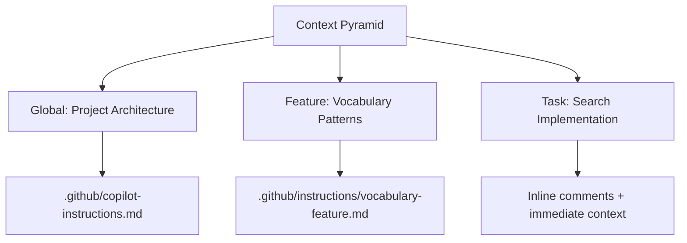

# GitHub Copilot Quick Reference Guide

**Last Updated**: 13 December 2025

---

## 🎯 Quick Start

### Enable Workspace Instructions
```json
// .vscode/settings.json
{
  "github.copilot.chat.codeGeneration.useInstructionFiles": true
}
```

### Key Files to Know
```
.github/
├── copilot-instructions.md          # Global project instructions
├── instructions/                    # Feature-specific instructions
│   ├── vocabulary-feature.md        # Vocabulary feature patterns
│   └── [other-features].md          # Other feature patterns
└── copilot-spaces/                  # GitHub Copilot Spaces
    ├── vocabulary-space.md          # Vocabulary feature space
    └── [other-spaces].md            # Other feature spaces
```

---

## 📚 Instruction Patterns

### 1. Comment-Based Instructions
```typescript
// ✅ IMPERATIVE: Implement debounced search with 300ms delay
// ✅ SPECIFIC: Handle Cyrillic and Latin character sets
// ✅ STRUCTURED: Use this function signature: `function debounceSearch(query: string): void`
```

### 2. Dedicated Instruction Files
```markdown
---
applyTo: "**/*.svelte"
---
# Svelte 5 Patterns

## State Management
- Use `$state`, `$derived`, `$effect` runes
- Never use `export let` for props
- Always use `let { prop } = $props()` for component props

## Component Structure
```svelte
<script lang="ts">
  // State
  let count = $state(0);

  // Props
  let { title = 'Default' } = $props();

  // Derived
  let doubled = $derived(count * 2);

  // Effects
  $effect(() => {
    // Effect with cleanup
    return () => { /* cleanup */ };
  });
</script>
```

### 3. GitHub Copilot Spaces
```markdown
# GitHub Copilot Space: [Feature Name]

## 🎯 Purpose
Provide targeted context for [feature] tasks

## 🗂️ Key Files
- `src/lib/components/[feature]/*.svelte`
- `src/lib/state/[feature]-state.svelte.ts`
- `src/lib/data/[feature].ts`

## 🧩 Key Patterns
### Pattern 1: [Description]
```svelte
<!-- Example code -->
```

## 🚫 Anti-Patterns
| Anti-Pattern | Solution |
|--------------|----------|
| Hardcoded values | Use derived state |
| Direct state mutation | Use state methods |
```

---

## 🏗️ Layered Context Approach



### Context Layer Examples

**Global Context** (`.github/copilot-instructions.md`):
```markdown
# Project Architecture
- Service boundaries: UI, State, Data Flow
- State management: Two-layer pattern
- Data validation: Always use Zod schemas
```

**Feature Context** (`.github/instructions/vocabulary-feature.md`):
```markdown
# Vocabulary Feature Patterns

## Direction-Aware Display
```svelte
<script lang="ts">
  let sourceText = $derived(languageMode === 'DE_BG' ? item.german : item.bulgarian);
  let targetText = $derived(languageMode === 'DE_BG' ? item.bulgarian : item.german);
</script>
```

**Task Context** (Inline comments):
```typescript
// VOCABULARY SEARCH: Implement with 300ms debounce
// - Handle Cyrillic characters with locale-aware normalization
// - Use vocabularyState for state management
```

---

## 🧱 Vertical Feature Slicing

### Feature-Specific Instruction Structure
```
.github/instructions/
├── vocabulary-feature.md       # Vocabulary patterns
├── practice-feature.md         # Practice mode patterns
├── lesson-feature.md           # Lesson generation patterns
└── state-management.md         # State patterns
```

### Benefits
1. **Contained context**: Limits Copilot's focus to relevant patterns
2. **Reduced noise**: Avoids irrelevant suggestions from other features
3. **Improved accuracy**: Higher quality suggestions within feature boundaries
4. **Easier maintenance**: Updates only affect relevant features
5. **Better organization**: Clear separation of concerns

---

## 🌐 GitHub Copilot Spaces

### Space Structure
```markdown
# GitHub Copilot Space: [Feature Name]

## 🎯 Purpose
[Clear purpose statement]

## 📚 Context Layers
1. Global project context
2. Feature-specific context
3. Implementation context

## 🗂️ Key Files
- [List of relevant files]

## 🧩 Key Patterns
### Pattern 1: [Name]
```[language]
[Example code]
```

## 🚫 Anti-Patterns
| Anti-Pattern | Solution |
|--------------|----------|

## 🔗 Integration Points
- Event bus integration
- State management integration
- Data flow patterns
```

### Space Examples
- **Vocabulary Space**: Focused on bilingual vocabulary management
- **Practice Space**: Focused on practice mode and quiz functionality
- **Lesson Space**: Focused on lesson generation and templates
- **State Space**: Focused on state management patterns

---

## 🔄 Living Documents

### Maintenance Process
1. **Before PR**: Update relevant instruction files
2. **During Code Review**: Verify instruction adherence
3. **After Deployment**: Update based on feedback
4. **Quarterly**: Comprehensive review

### Update Checklist
- [ ] Update patterns and examples
- [ ] Add new gotchas and solutions
- [ ] Update key files list
- [ ] Add new integration points
- [ ] Update future enhancements
- [ ] Verify all links are working
- [ ] Update last updated date

### Version Control
```bash
# Create a new branch for instruction updates
git checkout -b update-copilot-instructions

# Make changes to instruction files
git add .github/copilot-instructions.md
git add .github/instructions/*.md

# Commit with descriptive message
git commit -m "feat: update copilot instructions for vocabulary feature patterns"

# Create PR for review
gh pr create --title "Update Copilot instructions" --body "Updated patterns for vocabulary feature"
```

---

## 📈 Metrics and Evaluation

### Key Metrics
| Metric | Target | Measurement Method |
|--------|--------|---------------------|
| Acceptance Rate | >70% | Percentage of Copilot suggestions used without modification |
| Error Rate | <10% | Percentage of suggestions introducing bugs/anti-patterns |
| Context Retention | >80% | Copilot's ability to remember instructions across sessions |
| Productivity Gain | >30% | Time saved compared to manual coding |
| Code Quality | >90% | Adherence to project standards |

### Tracking Implementation
```typescript
// Add to your project
import { trackCopilotMetrics } from '@github/copilot-metrics';

trackCopilotMetrics({
  projectId: 'BulgarianApp-Fresh',
  onSuggestion: (suggestion) => {
    // Track suggestion acceptance/rejection
  },
  onError: (error) => {
    // Track errors from Copilot suggestions
  }
});
```

---

## 🚫 Anti-Patterns and Solutions

| Anti-Pattern | Example | Solution |
|--------------|---------|----------|
| Vague comments | `// Do the thing` | `// Implement debounced search with 300ms delay` |
| Context pollution | Including irrelevant files | Use targeted references: `@github/copilot reference:path/to/file` |
| Over-reliance on defaults | Assuming Copilot knows conventions | Document conventions explicitly in instruction files |
| Language mixing | Unclear language boundaries | Use clear file naming and language-specific instructions |
| Ignoring feedback | Not reviewing suggestions | Always validate and provide feedback |
| Inconsistent patterns | Mixing legacy and modern patterns | Enforce consistent patterns in instruction files |
| Missing cleanup | Not cleaning up effects | Document cleanup requirements |
| Overly complex prompts | Long, unfocused prompts | Break into smaller, focused prompts |

---

## 💡 Effective Prompt Patterns

### 1. Feature Implementation
```
Copilot, implement a [feature name] with these requirements:
- [Requirement 1]
- [Requirement 2]
- [Requirement 3]
- Follow the patterns in [instruction file]
- Use [specific components/tools]
- Ensure [accessibility/performance] compliance

Here's the current structure:
[file structure]

Current code:
```[language]
[current code]
```
```

### 2. Bug Fix
```
Copilot, help me fix this issue with [feature]:
[Error message or description]

Current implementation:
```[language]
[current code]
```

Requirements:
- [Requirement 1]
- [Requirement 2]
- Follow the patterns in [instruction file]
- Maintain [performance/accessibility] standards
```

### 3. Test Generation
```
Copilot, generate comprehensive tests for [component/feature]:
- Test [scenario 1]
- Test [scenario 2]
- Test [scenario 3]
- Follow the testing patterns in [instruction file]
- Use [testing framework]
- Include edge cases for [specific concerns]
```

### 4. Code Review
```
Copilot, review this [component/feature] implementation for:
- Adherence to project patterns
- [Specific concern 1]
- [Specific concern 2]
- [Specific concern 3]
- Follow the guidelines in [instruction file]

```[language]
[code to review]
```
```

### 5. Documentation
```
Copilot, generate documentation for [feature/component]:
- Overview of functionality
- Architecture diagram
- Key patterns and conventions
- Data schema (if applicable)
- Integration points
- Common issues and solutions
- Follow the documentation patterns in the project
- Use Markdown format
```

---

## 🔧 VS Code Settings for Optimal Copilot Experience

```json
// .vscode/settings.json
{
  "github.copilot.chat.codeGeneration.useInstructionFiles": true,
  "github.copilot.chat.codeGeneration.instructionFiles": [
    ".github/copilot-instructions.md",
    ".github/instructions/*.md"
  ],
  "github.copilot.chat.codeGeneration.enableSpaces": true,
  "github.copilot.enable": {
    "*": true,
    "plaintext": false
  },
  "github.copilot.inlineSuggest.enable": true,
  "github.copilot.editor.enableAutoCompletions": true,
  "github.copilot.advanced": {
    "debug.overrideEngine": "copilot-dm",
    "debug.showScores": false,
    "inlineSuggestCount": 3
  }
}
```

---

## 📅 Implementation Roadmap

### Phase 1: Foundation (1-2 weeks)
- [ ] Enhance `.github/copilot-instructions.md`
- [ ] Create feature-specific instruction files
- [ ] Set up GitHub Copilot Spaces
- [ ] Implement metrics tracking
- [ ] Document anti-patterns

### Phase 2: Integration (2-3 weeks)
- [ ] Integrate MCP servers for specialized tools
- [ ] Implement layered context strategy
- [ ] Create training materials
- [ ] Set up CI/CD integration for metrics
- [ ] Conduct team training

### Phase 3: Optimization (Ongoing)
- [ ] Monitor and analyze metrics
- [ ] Refine instructions based on feedback
- [ ] Expand feature coverage
- [ ] Share best practices with community
- [ ] Research new patterns and features

---

## 🎓 Best Practices Summary

1. **Be Specific**: Clear, imperative instructions yield better results
2. **Layer Context**: Global → Feature → Task context hierarchy
3. **Vertical Slice**: Contain context within feature boundaries
4. **Use Spaces**: Centralize feature-specific knowledge
5. **Maintain Living Documents**: Update instructions with code changes
6. **Track Metrics**: Measure effectiveness and identify areas for improvement
7. **Avoid Anti-Patterns**: Prevent context pollution and vague instructions
8. **Iterative Refinement**: Continuously improve based on feedback
9. **Human Oversight**: Always review and validate Copilot suggestions
10. **Document Everything**: Patterns, gotchas, and solutions

---

## 🔗 Resources

1. [GitHub Copilot Documentation](https://docs.github.com/en/copilot)
2. [VS Code Copilot Customization](https://code.visualstudio.com/docs/copilot/customization)
3. [Context Engineering Introduction](https://github.com/coleam00/context-engineering-intro)
4. [Awesome Copilot Instructions](https://github.com/code-and-sorts/awesome-copilot-instructions)
5. [GitHub Copilot Research](https://githubnext.com/projects/copilot-research)
6. [Project Documentation](docs/)
7. [Instruction Files](.github/instructions/)
8. [Copilot Spaces](.github/copilot-spaces/)