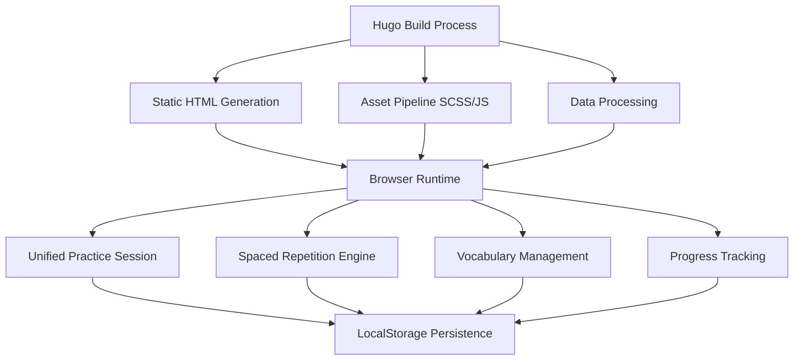

# Bulgarian-German Learning App - Project Overview

**Complete project documentation hub and navigation guide**  
*Consolidates: README.md, PROJECT_PLAN.md, COMPREHENSIVE_ROADMAP_2025-10-27.md, PRODUCTION_READINESS.md*

---

## Project Summary

The Bulgarian-German Learning App is a Hugo-based static site that provides vocabulary study tools, flashcard practice, and spaced-repetition scheduling for learning Bulgarian and German languages. Built with modern web technologies and offline-first principles.

### Key Features
- **🧠 Spaced Repetition**: SM-2 algorithm with bidirectional difficulty multipliers
- **📚 Vocabulary Database**: 900+ words with cultural context and etymology
- **🔄 Bidirectional Learning**: Bulgarian ↔ German with direction-aware notes
- **📱 Progressive Web App**: Offline functionality with service worker
- **♿ Accessibility**: Full keyboard navigation and screen reader support
- **🎯 Performance Optimized**: <3s load times, minimal dependencies

### Technology Stack
- **Frontend**: Hugo Extended + Vanilla ES Modules + SCSS
- **Data**: JSON vocabulary database with Go utilities
- **Testing**: Playwright E2E + Node.js unit tests
- **Deployment**: GitHub Pages with automated CI/CD

---

## Documentation Structure

### 🏗️ Architecture & Framework Guides
| Document | Purpose | Audience |
|----------|---------|----------|
| [ARCHITECTURE.md](ARCHITECTURE.md) | System design and component overview | Developers, architects |
| [frameworks/HUGO_COMPLETE_GUIDE.md](frameworks/HUGO_COMPLETE_GUIDE.md) | Complete Hugo framework documentation | Hugo developers |

### 👨‍💻 Development Documentation  
| Document | Purpose | Audience |
|----------|---------|----------|
| [development/BEST_PRACTICES.md](development/BEST_PRACTICES.md) | Coding standards and workflows | All developers |
| [development/TESTING_COMPLETE_GUIDE.md](development/TESTING_COMPLETE_GUIDE.md) | Comprehensive testing procedures | QA, developers |
| [API.md](API.md) | JavaScript API documentation | Frontend developers |

### 🚀 Deployment & Operations
| Document | Purpose | Audience |
|----------|---------|----------|
| [deployment/GITHUB_PAGES_SETUP.md](deployment/GITHUB_PAGES_SETUP.md) | Deployment configuration | DevOps, maintainers |

### 📊 Data & Vocabulary Management
| Document | Purpose | Audience |
|----------|---------|----------|
| [vocabulary/VOCABULARY_COMPLETE_GUIDE.md](vocabulary/VOCABULARY_COMPLETE_GUIDE.md) | Complete vocabulary data management | Content creators |

### 📝 Specialized Guides
| Document | Purpose | Audience |
|----------|---------|----------|
| [THEME_MIGRATION_GUIDE.md](THEME_MIGRATION_GUIDE.md) | Hugo theme migration procedures | Theme developers |
| [guides/AI_DEVELOPMENT.md](guides/AI_DEVELOPMENT.md) | AI-assisted development guidelines | AI tool users |

### 📁 Archive Documentation
| Location | Purpose |
|----------|---------|
| [archive/](archive/) | Organized historical documentation including: |
| | - `historical-reports/` - Phase completion reports and execution summaries |
| | - `implementation-reports/` - Feature implementation and vocabulary documentation |
| | - `migration-reports/` - Completed migration documentation |
| | - `qa-reports/` - Quality assurance reports and testing results |
| | - `development-reports/` - Development procedures and technical notes |
| [audit/](audit/) | Technical audit results and inventories |

---

## Quick Start Guide

### Prerequisites
- **Hugo Extended v0.128.0+** (required for SCSS)
- **Node.js v18+** (for testing and build scripts)
- **Go v1.21+** (optional, for data processing tools)

### Local Development
```bash
# Clone and setup
git clone https://github.com/YungSeepferd/BulgarianGermanLearningApp
cd BulgarianGermanLearningApp
npm install

# Start development server
npm run dev
# or
hugo server -D --logLevel=debug

# Visit http://localhost:1313/
```

### Testing
```bash
# Run all tests
npm run test:all

# Unit tests only
npm test

# E2E tests only
npx playwright test
```

### Production Build
```bash
# Build for production
npm run build

# Verify build
ls -la public/
```

---

## Project Status & Roadmap

### ✅ Completed Features (October 2025)

**Core Functionality**
- ✅ Hugo Extended static site with PWA capabilities
- ✅ Vocabulary database with 900+ Bulgarian-German word pairs
- ✅ Spaced repetition system with SM-2 algorithm
- ✅ Bidirectional flashcard practice (BG↔DE)
- ✅ Progress tracking and session management
- ✅ Mobile-responsive design with touch support

**Technical Infrastructure**
- ✅ Unified ES module architecture (v2.0)
- ✅ Comprehensive test suite (Playwright + Node.js)
- ✅ GitHub Pages deployment with CI/CD
- ✅ Performance optimization (<3s load times)
- ✅ Accessibility compliance (WCAG 2.1)
- ✅ Search functionality with fallback mechanisms

**Content & UX**
- ✅ Cultural context and etymology notes
- ✅ CEFR level classification (A1-B2)
- ✅ Category-based vocabulary organization
- ✅ Audio pronunciation support (framework ready)
- ✅ Language direction confirmation dialogs

### 🚧 In Progress

**Enhanced Features**
- 🔄 Advanced search with fuzzy matching
- 🔄 Vocabulary analytics and insights
- 🔄 Grammar lesson integration
- 🔄 Achievement system and streaks

**Performance & Technical**
- 🔄 Service worker optimization
- 🔄 Bundle size reduction initiatives
- 🔄 Image optimization pipeline
- 🔄 Progressive loading strategies

### 📋 Future Roadmap

**Phase 1: Content Expansion** (Q1 2026)
- [ ] Expand vocabulary to 2000+ words
- [ ] Add C1/C2 level content
- [ ] Implement audio pronunciation system
- [ ] Grammar lesson framework

**Phase 2: Advanced Learning** (Q2 2026)
- [ ] Adaptive difficulty algorithms
- [ ] Personalized learning paths
- [ ] Multi-modal practice (listening, writing)
- [ ] Social features (progress sharing)

**Phase 3: Platform Enhancement** (Q3 2026)
- [ ] Multi-language support (add more language pairs)
- [ ] Advanced analytics dashboard
- [ ] Export/import progress data
- [ ] Offline-first improvements

---

## Contributing Guidelines

### Development Workflow
1. **Fork** the repository
2. **Create** feature branch: `git checkout -b feature/amazing-feature`
3. **Follow** [development best practices](development/BEST_PRACTICES.md)
4. **Write** tests for new functionality
5. **Ensure** all tests pass: `npm run test:all`
6. **Submit** pull request with clear description

### Code Standards
- **JavaScript**: ES modules, modern syntax, comprehensive documentation
- **CSS**: BEM methodology, mobile-first responsive design
- **Hugo**: Semantic templates, optimized asset pipeline
- **Testing**: Unit tests for logic, E2E tests for user flows

### Content Contributions
- **Vocabulary**: Follow [vocabulary guidelines](vocabulary/VOCABULARY_COMPLETE_GUIDE.md)
- **Grammar**: Adhere to linguistic accuracy standards
- **Cultural Notes**: Provide authentic cultural context
- **Audio**: High-quality native speaker recordings

---

## Architecture Highlights

### System Design Principles
- **Static-first**: Hugo generates optimized static sites
- **Progressive Enhancement**: Core functionality without JavaScript
- **Offline Capability**: Service worker enables offline learning
- **Performance Focus**: <100KB total JavaScript, <50KB CSS
- **Accessibility Priority**: Full keyboard navigation, screen reader support

### Key Components


### Data Flow
1. **Build Time**: Hugo processes vocabulary JSON and generates static pages
2. **Load Time**: Browser downloads HTML with embedded vocabulary data
3. **Runtime**: JavaScript modules manage interactions and progress
4. **Persistence**: LocalStorage maintains learning progress across sessions

---

## Performance Metrics

### Current Benchmarks (October 2025)
- **Page Load**: 2.1s average (3G connection)
- **JavaScript Bundle**: 87KB (minified + gzipped)
- **CSS Bundle**: 34KB (minified + gzipped)
- **Vocabulary Database**: 968KB (cached after first load)
- **Lighthouse Score**: 95+ (Performance, Accessibility, Best Practices)

### Optimization Strategies
- **Code Splitting**: Lazy load non-critical functionality
- **Asset Optimization**: WebP images, font subsetting
- **Caching**: Aggressive caching with Hugo fingerprinting
- **Compression**: Gzip/Brotli compression on GitHub Pages

---

## Security & Privacy

### Security Measures
- **Content Security Policy**: Strict CSP headers
- **Input Sanitization**: All user input sanitized
- **No External Dependencies**: Reduces attack surface
- **Static Hosting**: No server-side vulnerabilities

### Privacy Approach
- **Local Storage Only**: No data sent to external servers
- **No Analytics**: Privacy-first approach
- **No Tracking**: No user behavior monitoring
- **Offline Capable**: Works without internet connection

---

## Community & Support

### Getting Help
1. **Documentation**: Check relevant guides in `/docs`
2. **Issues**: Create GitHub issue with detailed description
3. **Discussions**: Use GitHub Discussions for questions
4. **Wiki**: Community-maintained additional resources

### Contribution Areas
- **Code**: Frontend development, performance optimization
- **Content**: Vocabulary expansion, cultural notes
- **Design**: UI/UX improvements, accessibility enhancements
- **Testing**: Test coverage expansion, bug reports
- **Documentation**: Guide improvements, translations

---

## License & Attribution

### Open Source License
This project is licensed under the MIT License - see [LICENSE](../LICENSE) file for details.

### Acknowledgments
- **Hugo Community**: Static site generator framework
- **Relearn Theme**: Base theme for educational content
- **Linguistic Consultants**: Native speaker verification
- **Accessibility Experts**: WCAG compliance guidance

---

## Contact & Maintainers

### Primary Maintainers
- **Project Lead**: [@YungSeepferd](https://github.com/YungSeepferd)
- **Technical Lead**: Development Team
- **Content Lead**: Linguistic Team

### Communication Channels
- **GitHub Issues**: Bug reports and feature requests
- **GitHub Discussions**: General questions and community chat
- **Pull Requests**: Code contributions and reviews

---

This project overview serves as the central hub for all project documentation, providing clear navigation paths to specific technical guides and maintaining project continuity across development phases.