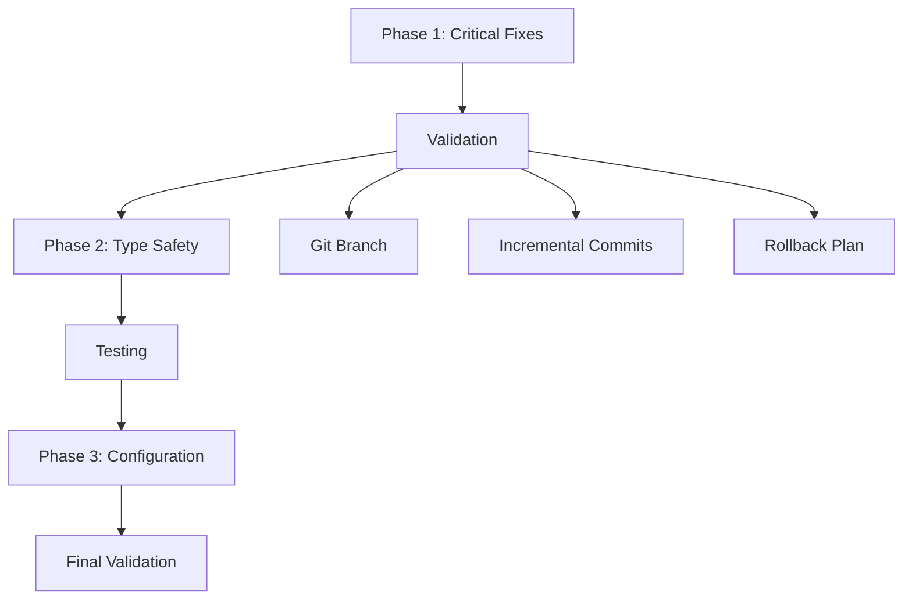

# Technical Debt Remediation Strategy for Bulgarian-German Learning App

## Executive Summary

The Bulgarian-German Learning App has **119 ESLint issues** (10 errors, 109 warnings) with significant technical debt in type safety, code quality, and maintainability. This document outlines a phased remediation strategy to address these issues systematically.

## Current State Assessment

### Critical Issues Identified
- **ESLint Errors**: 10 blocking issues requiring immediate attention
- **Type Safety**: 95+ `any` type warnings across core modules
- **Code Quality**: Unused variables, regex patterns, DOM query inconsistencies
- **Main Modules Affected**: [`vocabulary-manager.ts`](assets/js/modules/vocabulary-manager.ts:1), [`api-client.ts`](assets/js/modules/api-client.ts:1), [`practice-page.ts`](assets/js/modules/practice-page.ts:1)

### Configuration Gaps
- [`tsconfig.json`](tsconfig.json:10): `strict: false`, `noImplicitAny: false`
- [`.eslintrc.json`](.eslintrc.json:87): `@typescript-eslint/no-explicit-any` set to "warn" instead of "error"

## Phased Remediation Plan

### Phase 1: Critical Fixes (3 Days)
**Focus**: Resolve 10 blocking ESLint errors
**Priority**: High - Blocking further development

**Key Deliverables**:
- Fix regex patterns in vocabulary-manager.ts
- Remove unused variables and imports
- Standardize DOM query methods
- Achieve 0 ESLint errors

**Success Metrics**:
- ESLint errors: 0 (from 10)
- TypeScript compilation: Success
- Test coverage: Maintained

### Phase 2: Type Safety (2 Weeks)
**Focus**: Replace `any` types with proper interfaces
**Priority**: High - Critical for maintainability

**Key Deliverables**:
- Create comprehensive TypeScript interfaces
- Update core modules with proper types
- Reduce `any` type usage by 80%
- Improve type coverage to >80%

**Success Metrics**:
- `any` type warnings: <20 (from 95+)
- Type coverage: >80%
- Code maintainability: Significant improvement

### Phase 3: Code Quality & Configuration (1 Week)
**Focus**: Enhance code quality and prevent future debt
**Priority**: Medium - Sustainable practices

**Key Deliverables**:
- Update ESLint/TypeScript configurations
- Create technical debt monitoring scripts
- Standardize code patterns
- Complete documentation

**Success Metrics**:
- ESLint warnings: <20 (from 109)
- Configuration: Strict type checking enabled
- Monitoring: Automated debt tracking

## Implementation Approach

### Risk-Managed Execution

### Key Success Factors
1. **Incremental Changes**: Small, testable modifications
2. **Comprehensive Testing**: Validate after each significant change
3. **Documentation**: Clear implementation guides and status tracking
4. **Team Coordination**: Clear communication of changes and impacts

## Resource Requirements

### Time Allocation
- **Phase 1**: 3 days (1 developer)
- **Phase 2**: 2 weeks (1-2 developers)
- **Phase 3**: 1 week (1 developer)
- **Total**: 4 weeks of focused effort

### Technical Resources
- Development environment with ESLint/TypeScript tooling
- Testing infrastructure for validation
- Version control for safe experimentation
- Documentation system for knowledge sharing

## Expected Outcomes

### Immediate Benefits (Phase 1)
- Elimination of blocking ESLint errors
- Improved code readability and maintainability
- Better developer experience with cleaner codebase

### Medium-term Benefits (Phase 2)
- Enhanced type safety and error detection
- Reduced bug introduction through better typing
- Improved code navigation and IDE support

### Long-term Benefits (Phase 3)
- Sustainable code quality practices
- Automated technical debt monitoring
- Prevention of future debt accumulation

## Risk Assessment and Mitigation

### Technical Risks
| Risk | Impact | Probability | Mitigation |
|------|--------|-------------|------------|
| Breaking changes | High | Medium | Comprehensive testing, incremental changes |
| Performance regression | Medium | Low | Performance testing, monitoring |
| Functionality loss | High | Low | User acceptance testing, rollback plan |

### Project Risks
| Risk | Impact | Probability | Mitigation |
|------|--------|-------------|------------|
| Timeline slippage | Medium | Medium | Phased approach, clear milestones |
| Resource constraints | Medium | Low | Prioritized implementation, external help if needed |
| Knowledge transfer | Low | Medium | Comprehensive documentation |

## Success Metrics and Monitoring

### Quantitative Metrics
- ESLint error/warning counts
- TypeScript compilation success rate
- Test coverage percentages
- Code complexity metrics

### Qualitative Metrics
- Developer satisfaction surveys
- Code review feedback
- Maintenance effort tracking
- Bug frequency reduction

## Next Steps

### Immediate Actions (Week 1)
1. **Review and approve** this remediation strategy
2. **Allocate resources** for Phase 1 implementation
3. **Create implementation branch** for safe experimentation
4. **Begin Phase 1 execution** using the detailed implementation guide

### Medium-term Planning (Weeks 2-4)
1. **Schedule Phase 2** based on Phase 1 success
2. **Prepare TypeScript interface definitions**
3. **Plan team coordination** for larger-scale changes
4. **Set up monitoring** for ongoing quality tracking

## Conclusion

This technical debt remediation strategy provides a clear, phased approach to addressing the 119 ESLint issues in the Bulgarian-German Learning App. By focusing first on critical blocking issues, then systematically improving type safety and code quality, we can transform the codebase into a maintainable, high-quality foundation for future development.

The investment in technical debt reduction will yield significant returns in developer productivity, code reliability, and long-term maintainability.

---
**Strategy Version**: 1.0  
**Created**: 2025-11-27  
**Owner**: Architecture Team  
**Status**: Ready for Implementation