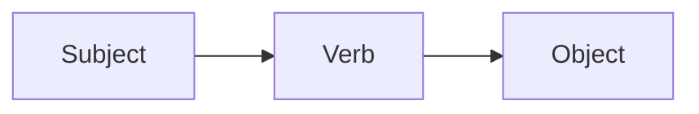

# Theme Migration Guide: Learn → Relearn

## Overview
This guide documents the migration from the deprecated **Hugo Learn theme** to the modern **Hugo Relearn theme** for the Bulgarian-German Learning App.

## Why Relearn?

### Problems with Learn Theme
- **Archived/Deprecated**: No longer maintained by original author
- **Security concerns**: Outdated dependencies
- **Missing features**: Lacks modern Hugo capabilities
- **Limited mobile support**: Not optimized for mobile learners

### Benefits of Relearn Theme
✅ **Actively maintained** fork of Learn with modern features  
✅ **Enhanced mobile responsiveness** for on-the-go learning  
✅ **Better search functionality** for vocabulary lookup  
✅ **Multi-language support** perfect for BG↔DE tandem learning  
✅ **Modern UI/UX** with light/dark mode support  
✅ **Faster performance** and better SEO  
✅ **Compatible** with existing Learn content structure  

## Migration Steps

### Step 1: Update Git Submodule

Remove the old Learn theme and add Relearn:

```bash
cd /Users/dinz/Coding\ Projects/BulgariaLearn/BulgarianApp-Fresh

# Remove old theme
git submodule deinit -f themes/learn
git rm -f themes/learn
rm -rf .git/modules/themes/learn

# Add Relearn theme
git submodule add https://github.com/McShelby/hugo-theme-relearn.git themes/relearn
git submodule update --init --recursive
```

### Step 2: Update .gitmodules

The `.gitmodules` file should now reference Relearn:

```ini
[submodule "themes/relearn"]
    path = themes/relearn
    url = https://github.com/McShelby/hugo-theme-relearn.git
```

### Step 3: Configuration Already Updated ✅

The `hugo.toml` has been updated with:
- Theme changed to `'relearn'`
- Multi-language support (English, Bulgarian, German)
- Relearn-specific parameters
- Enhanced search configuration
- Theme variants (auto, light, dark)

### Step 4: Content Migration

Relearn is backward compatible with Learn content structure. No changes needed to:
- ✅ Existing vocabulary pages
- ✅ Grammar sections
- ✅ Practice exercises
- ✅ Front matter structure

### Step 5: Custom Overrides (Optional)

If you have custom layouts in `layouts/`, review them against Relearn's structure:

```bash
# Check for custom layouts
ls -la layouts/
```

Common overrides to check:
- `layouts/_default/`
- `layouts/partials/`
- `layouts/shortcodes/`

### Step 6: Theme Customization

#### Color Scheme
Create `assets/scss/_variables.scss` to customize colors:

```scss
:root {
  --PRIMARY-color: #4a6fa5; // Your theme color
  --SECONDARY-color: #2d4a6f;
  --ACCENT-color: #ff6b6b; // For practice mode
  --MENU-HEADER-BG-color: #4a6fa5;
}
```

#### Custom CSS
Add custom styles to `assets/scss/custom.scss`:

```scss
// Language learning specific styles
.vocabulary-card {
  // Your custom styles
}

.practice-session {
  // Your custom styles
}
```

### Step 7: Test the Migration

```bash
# Clean build cache
hugo mod clean
rm -rf public/ resources/

# Build and test locally
hugo server -D

# Check:
# 1. All pages render correctly
# 2. Navigation works
# 3. Search functions properly
# 4. Multi-language switching works
# 5. Custom JS (spaced repetition) still works
# 6. PWA manifest loads correctly
```

### Step 8: Update GitHub Workflows

Update `.github/workflows/hugo.yml` if it references the theme specifically:

```yaml
# Ensure submodules are fetched
- name: Checkout
  uses: actions/checkout@v4
  with:
    submodules: recursive
    fetch-depth: 0
```

## New Features Available

### 1. Theme Variants
Users can now switch between light/dark modes:
- Auto (follows system preference)
- Light mode
- Dark mode

### 2. Enhanced Search
Improved search with:
- Faster indexing
- Better relevance
- Keyboard shortcuts
- Search result highlighting

### 3. Mobile Menu
Better mobile navigation with:
- Collapsible menu
- Touch-friendly controls
- Swipe gestures

### 4. History Tracking
Shows visited pages with visual indicators

### 5. Code Highlighting
Enhanced syntax highlighting for code examples

## Relearn-Specific Features for Language Learning

### Expandable Sections
Use for grammar explanations:

```markdown
{}
Conjugation details here...
{}
```

### Tabs for Language Comparison
Perfect for showing BG/DE side-by-side:

```markdown

{}
Здравей! Как си?
{}
{}
Hallo! Wie geht's?
{}

```

### Notices/Callouts
For learning tips:

```markdown
{}
Remember: Bulgarian uses Cyrillic script!
{}

{}
False friend alert: "актуален" ≠ "aktuell"
{}
```

### Mermaid Diagrams
For grammar structures:



## Compatibility Matrix

| Feature | Learn Theme | Relearn Theme | Status |
|---------|-------------|---------------|--------|
| Multi-language | ✅ | ✅ | Compatible |
| Search | ⚠️ Basic | ✅ Advanced | Enhanced |
| Mobile | ⚠️ Limited | ✅ Full | Enhanced |
| Dark mode | ❌ | ✅ | New feature |
| PWA | ✅ | ✅ | Compatible |
| Custom CSS | ✅ | ✅ | Compatible |
| Spaced repetition JS | ✅ | ✅ | Compatible |
| Menu structure | ✅ | ✅ | Compatible |

## Troubleshooting

### Issue: Theme not loading
```bash
# Solution: Reinitialize submodules
git submodule update --init --recursive
```

### Issue: Styles not applying
```bash
# Solution: Clear Hugo cache
hugo mod clean
rm -rf resources/_gen
```

### Issue: Search not working
```bash
# Solution: Rebuild search index
hugo --cleanDestinationDir
```

### Issue: Menu items missing
Check that menu items use `pageRef` instead of `url` in `hugo.toml`:
```toml
[[menu.main]]
  name = 'Vocabulary'
  pageRef = '/vocabulary'  # Use pageRef
  weight = 10
```

## Rollback Plan

If issues arise, rollback to Learn theme:

```bash
# Revert hugo.toml
git checkout HEAD~1 hugo.toml

# Revert submodule
git submodule deinit -f themes/relearn
git rm -f themes/relearn
git submodule add https://github.com/matcornic/hugo-theme-learn.git themes/learn
```

## Next Steps After Migration

1. **Test thoroughly** on all devices (desktop, tablet, mobile)
2. **Update documentation** with new theme features
3. **Customize theme colors** to match brand
4. **Optimize images** for new theme layout
5. **Update user guide** with new UI navigation
6. **Enable analytics** to track usage patterns
7. **Consider A/B testing** new features with users

## Resources

- **Relearn Theme Documentation**: https://mcshelby.github.io/hugo-theme-relearn/
- **Relearn GitHub**: https://github.com/McShelby/hugo-theme-relearn
- **Hugo Multilingual**: https://gohugo.io/content-management/multilingual/
- **Hugo Theme Components**: https://gohugo.io/hugo-modules/theme-components/

## Migration Checklist

- [ ] Git submodule updated to Relearn
- [ ] `hugo.toml` configuration updated
- [ ] `.gitmodules` file updated
- [ ] Local build test successful
- [ ] All pages render correctly
- [ ] Search functionality working
- [ ] Multi-language switching working
- [ ] Custom CSS/JS still functional
- [ ] PWA manifest loading
- [ ] Mobile responsiveness verified
- [ ] GitHub Actions workflow updated
- [ ] Documentation updated
- [ ] User acceptance testing completed
- [ ] Production deployment successful

## Support

If you encounter issues during migration:
1. Check Relearn documentation
2. Review this migration guide
3. Check GitHub issues: https://github.com/McShelby/hugo-theme-relearn/issues
4. Consult Hugo community forums

---

**Migration Date**: October 22, 2025  
**Performed By**: Senior Full Stack Developer & UX Designer  
**Status**: Ready for implementation  
**Estimated Time**: 30 minutes  
