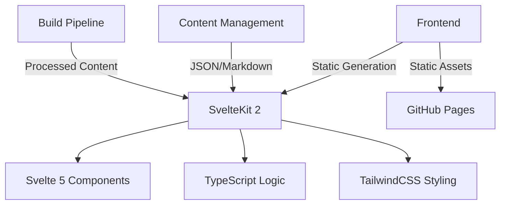
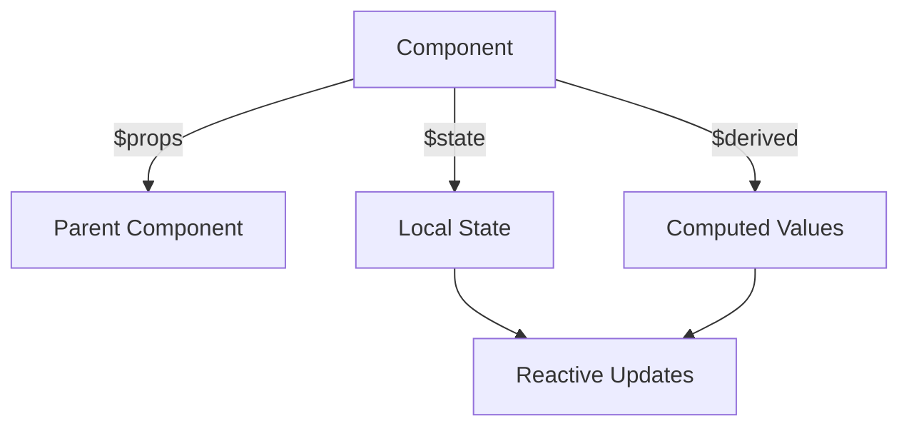
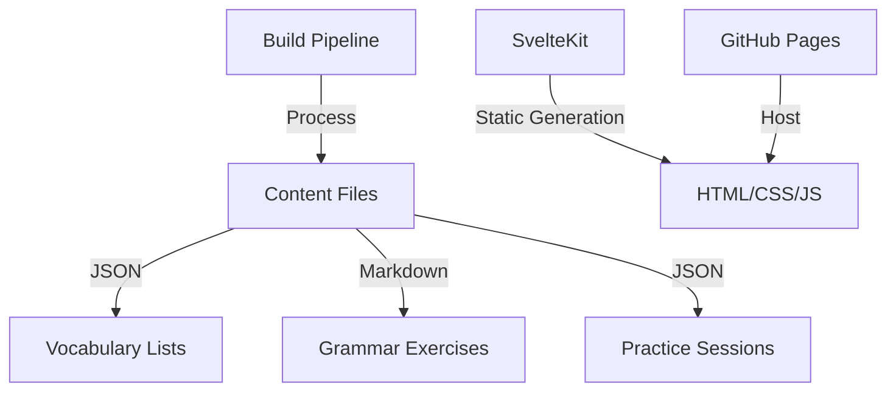
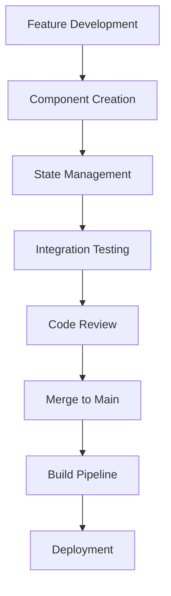
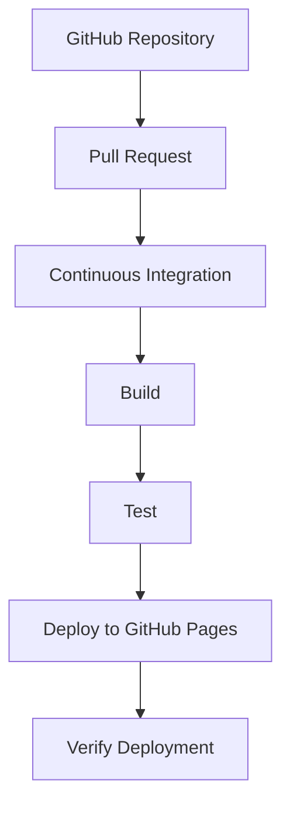

# Technical Design Document (TDD) for Bulgarian-German Learning Application

## Table of Contents
1. [Introduction](#introduction)
2. [Architecture Overview](#architecture-overview)
3. [Svelte 5 Runes Paradigm](#svelte-5-runes-paradigm)
4. [Static Database Strategy](#static-database-strategy)
5. [Project Structure](#project-structure)
6. [Tooling Configuration](#tooling-configuration)
7. [Development Workflow](#development-workflow)
8. [Deployment Pipeline](#deployment-pipeline)
9. [Content Management](#content-management)
## Introduction

The Bulgarian-German Learning Application is a web-based platform designed to help users learn German through interactive vocabulary practice and grammar exercises. The application will be built using SvelteKit 2 with Svelte 5, TypeScript, and TailwindCSS, leveraging static site generation for optimal performance and SEO.
## Architecture Overview

The application follows a modern web architecture with the following key components:



The application uses SvelteKit 2 for server-side rendering and static generation, with Svelte 5 components for the UI. TypeScript is used for type-safe logic, and TailwindCSS provides utility-first styling. Content is managed through static JSON and Markdown files, processed during the build pipeline and deployed to GitHub Pages.
## Svelte 5 Runes Paradigm

Svelte 5 introduces a new reactivity system called "runes" that simplifies state management and component composition. The application will utilize three key runes:

1. `$state` - For managing local component state
2. `$derived` - For creating reactive derived values
3. `$props` - For handling component props with reactivity



Example of a vocabulary card component using Svelte 5 runes:

```svelte
<script>
  let word = $state('Haus');
  let translation = $state('House');
  let examples = $state(['Das Haus ist groß.', 'Ich wohne in einem kleinen Haus.']);

  $: revealed = $derived(false);
  $: currentExample = $derived(examples[0]);

  function toggleReveal() {
    revealed = !revealed;
  }
</script>

<div class="card" on:click={toggleReveal}>
  <h2>{word}</h2>
  {#if revealed}
    <p>{translation}</p>
    <p class="example">{currentExample}</p>
  {/if}
</div>
```

The application will define reusable component snippets for language learning features, leveraging Svelte 5's compile-time optimizations for performance.
## Static Database Strategy

The application will use a static database approach with build-time content processing. Content will be stored in JSON and Markdown files, organized by language learning categories:



Content structure:
- Vocabulary lists in `data/vocab/*.json`
- Grammar exercises in `content/grammar/*.md`
- Practice sessions in `data/practice/*.json`

Build-time processing includes:
1. Content validation
2. Localization handling
3. SEO optimization
4. Static generation with SvelteKit's adapter-static

Example vocabulary JSON structure:
```json
{
  "category": "A1",
  "words": [
    {
      "word": "Haus",
      "translation": "House",
      "partOfSpeech": "noun",
      "examples": ["Das Haus ist groß.", "Ich wohne in einem kleinen Haus."],
      "level": "A1"
    }
  ]
}
```

The static approach ensures fast loading times and SEO-friendly content while maintaining the ability to update content through simple file changes.
## Project Structure

The repository will follow this structure:

```
BulgarianGermanLearningApp/
├── docs/                  # Documentation
│   ├── TechnicalDesignDocument.md
│   └── ArchitectureDiagrams/
├── src/                   # Source files
│   ├── components/        # Reusable Svelte components
│   │   ├── Flashcard.svelte
│   │   ├── GradeControls.svelte
│   │   └── ...
│   ├── lib/               # Utility libraries
│   │   ├── api/           # API clients
│   │   ├── stores/        # Svelte stores
│   │   └── utils/         # Helper functions
│   ├── routes/            # SvelteKit routes
│   │   ├── +page.svelte   # Main page
│   │   ├── vocabulary/     # Vocabulary section
│   │   ├── grammar/       # Grammar section
│   │   └── practice/      # Practice section
│   └── app.css            # Global styles
├── data/                  # Static content
│   ├── vocab/             # Vocabulary JSON files
│   └── practice/          # Practice session JSON files
├── content/               # Markdown content
│   └── grammar/           # Grammar exercises
├── static/                # Static assets
│   ├── images/            # Image assets
│   └── fonts/             # Font files
├── scripts/               # Build scripts
├── tests/                 # Test files
├── .github/               # GitHub configuration
├── svelte.config.js       # SvelteKit configuration
├── vite.config.ts         # Vite configuration
└── package.json          # Project dependencies
```

This structure follows SvelteKit conventions while organizing language learning specific content and components.
## Tooling Configuration

The project uses the following tools and configurations:

1. TypeScript Configuration (`tsconfig.app.json`):
```json
{
  "extends": "@tsconfig/svelte/tsconfig.json",
  "compilerOptions": {
    "target": "ES2022",
    "useDefineForClassFields": true,
    "module": "ESNext",
    "types": ["svelte", "vite/client"],
    "allowJs": true,
    "checkJs": true,
    "moduleDetection": "force"
  },
  "include": ["src/**/*.ts", "src/**/*.js", "src/**/*.svelte"]
}
```

2. Vite Configuration (`vite.config.ts`):
```typescript
import { defineConfig } from 'vite'
import { svelte } from '@sveltejs/vite-plugin-svelte'

export default defineConfig({
  plugins: [svelte({ compilerOptions: { generate: 'dom' } })],
  build: {
    target: 'esnext',
    minify: 'terser',
    sourcemap: true
  }
})
```

3. Svelte Configuration (`svelte.config.js`):
```javascript
import adapter from '@sveltejs/adapter-static';
import { vitePreprocess } from '@sveltejs/vite-plugin-svelte';
import { mdsvex } from 'mdsvex';

const config = {
  preprocess: [
    vitePreprocess(),
    mdsvex({
      extensions: ['.md'],
      layout: false,
      highlight: {
        highlighter: (code, lang) => {
          return `<pre><code class="language-${lang}">${code}</code></pre>`;
        }
      }
    })
  ],
  extensions: ['.svelte', '.md'],
  compilerOptions: {
    runes: true
  },
  kit: {
    adapter: adapter({
      pages: 'build',
      assets: 'build',
      fallback: '404.html',
      precompress: false,
      strict: false
    }),
    paths: {
      base: process.env.NODE_ENV === 'production' ? '/BulgarianGermanLearningApp' : ''
    }
  }
};

export default config;
```

4. ESLint, Prettier, and svelte-check configurations are set up for code quality and formatting.
## Development Workflow

The development workflow follows these steps:



1. Feature Development:
   - Create new Svelte components in the `src/components` directory
   - Implement language learning features using Svelte 5 runes
   - Add new content to JSON/Markdown files in the `data` and `content` directories

2. State Management:
   - Use Svelte stores for global state management
   - Implement reactive state with `$state`, `$derived`, and `$props` runes
   - Create utility functions in the `src/lib/utils` directory

3. Integration Testing:
   - Write tests for new components and features
   - Test content validation and processing scripts
   - Ensure cross-browser compatibility

4. Code Review:
   - Review code changes using GitHub pull requests
   - Ensure adherence to project conventions and best practices
   - Verify type safety with TypeScript

5. Build Pipeline:
   - Run content validation and processing scripts
   - Build the application with SvelteKit
   - Generate static files for deployment

6. Deployment:
   - Deploy to GitHub Pages using the static adapter
   - Verify successful deployment and functionality
## Deployment Pipeline

The deployment pipeline follows these steps:



1. Continuous Integration:
   - Triggered on pull requests to main branch
   - Runs linting, type checking, and tests
   - Validates content files and build configuration

2. Build Process:
   - Uses SvelteKit's static adapter
   - Processes content files during build
   - Generates optimized static files

3. Deployment:
   - Deploys to GitHub Pages
   - Configures custom domain if needed
   - Sets up proper routing with fallback to 404.html

4. Verification:
   - Checks for successful deployment
   - Validates all routes and functionality
   - Ensures content is properly rendered

The deployment pipeline ensures that only properly tested and validated code is deployed to production.
## Content Management

Content management follows these principles:

1. Content Structure:
   - Vocabulary in JSON files (`data/vocab/*.json`)
   - Grammar exercises in Markdown files (`content/grammar/*.md`)
   - Practice sessions in JSON files (`data/practice/*.json`)

2. Content Validation:
   - Schema validation for JSON files
   - Markdown linting for grammar exercises
   - Content consistency checks

3. Content Processing:
   - Build-time validation and transformation
   - Localization support for multiple languages
   - SEO optimization for static content

4. Content Updates:
   - Simple file-based updates for content changes
   - Version control for content files
   - Content review process for new material

Example vocabulary JSON schema:
```json
{
  "type": "object",
  "properties": {
    "category": { "type": "string" },
    "words": {
      "type": "array",
      "items": {
        "type": "object",
        "properties": {
          "word": { "type": "string" },
          "translation": { "type": "string" },
          "partOfSpeech": { "type": "string" },
          "examples": { "type": "array", "items": { "type": "string" } },
          "level": { "type": "string" }
        },
        "required": ["word", "translation"]
      }
    }
  },
  "required": ["category", "words"]
}
```

The content management approach ensures that content is properly structured, validated, and processed during the build pipeline, while maintaining the simplicity of file-based updates.