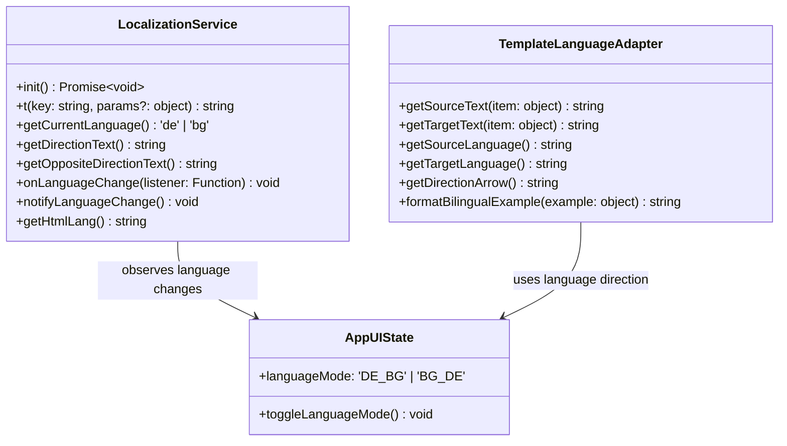
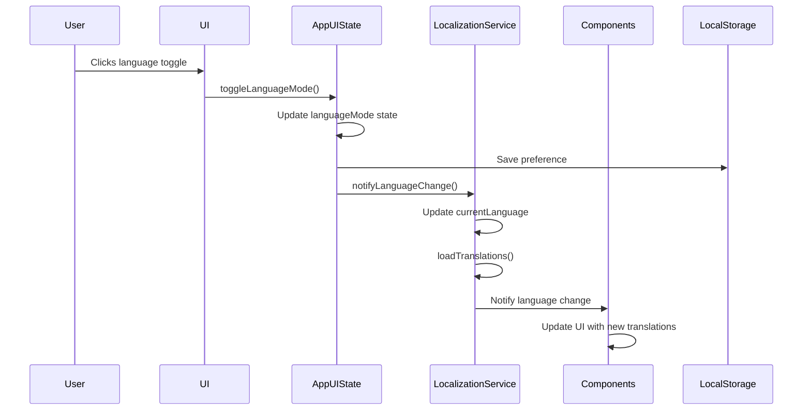

# Bilingual Support Architecture & Implementation

## 🌍 Overview

This document provides comprehensive documentation of the bilingual support system implemented in the Bulgarian-German Learning App. The system enables seamless switching between German and Bulgarian user interfaces, supporting the app's tandem learning approach.

## 🏗️ System Architecture

### Localization Service Architecture



### Key Components

| Component | Location | Purpose |
|-----------|----------|---------|
| **LocalizationService** | `src/lib/services/localization.ts` | Core translation functionality and language management |
| **AppUIState** | `src/lib/state/app-ui.svelte.ts` | Language state management with Svelte 5 Runes |
| **TemplateLanguageAdapter** | `src/lib/services/lesson-generation/template-language-adapter.ts` | Direction-aware content rendering for lessons |
| **Translation Files** | `src/lib/data/translations/` | JSON-based translation dictionaries |
| **Language Change Listeners** | Various components | Dynamic UI updates on language change |

## 🔧 Implementation Details

### 1. Localization Service (`src/lib/services/localization.ts`)

**Core Features:**
- **Dynamic Translation Loading**: Loads translation files on demand
- **Fallback Mechanism**: Graceful fallback to German for missing translations
- **Parameter Substitution**: Supports dynamic values in translations
- **Event System**: Language change notifications
- **Browser Integration**: Works with browser environment

**Key Methods:**
```typescript
// Get translation for a key
static t(key: string, params?: Record<string, string>): string

// Get current language
static getCurrentLanguage(): 'de' | 'bg'

// Register language change listener
static onLanguageChange(listener: LanguageChangeListener): void

// Notify language change
static notifyLanguageChange(): void
```

### 2. Language State Management (`src/lib/state/app-ui.svelte.ts`)

**Key Features:**
- **Svelte 5 Runes Integration**: Uses `$state` for reactive language state
- **Persistence**: Saves language preference to localStorage
- **Migration**: Handles migration from old storage format
- **Event Notification**: Triggers language change events

**Language Toggle Implementation:**
```typescript
toggleLanguageMode() {
    this.languageMode = this.languageMode === 'DE_BG' ? 'BG_DE' : 'DE_BG';
    this.triggerLanguageModePersistence();

    // Notify localization service about language change
    if (browser) {
        try {
            import('../services/localization').then(({ LocalizationService }) => {
                LocalizationService.notifyLanguageChange();
            });
        } catch (error) {
            console.error('Failed to notify language change:', error);
        }
    }
}
```

### 3. Template Language Adapter (`src/lib/services/lesson-generation/template-language-adapter.ts`)

**Key Features:**
- **Direction-Aware Content**: Renders content based on current language direction
- **Language Property Access**: Gets language-specific properties from objects
- **Bilingual Formatting**: Formats examples for both languages
- **Template Selection**: Chooses appropriate templates based on direction

**Example Usage:**
```typescript
// Get text based on current direction
const sourceText = getSourceText(item); // German or Bulgarian based on direction
const targetText = getTargetText(item); // Bulgarian or German based on direction

// Format bilingual example
const formattedExample = formatBilingualExample({
    sentence: "Wie geht es dir?",
    translation: "Как си?"
});
```

### 4. Translation Files (`src/lib/data/translations/`)

**File Structure:**
- `de.json`: German translations
- `bg.json`: Bulgarian translations

**Translation Format:**
```json
{
  "navigation": {
    "dashboard": "Dashboard",
    "vocabulary": "Vokabular"
  },
  "common": {
    "check_answer": "Antwort prüfen",
    "next_word": "Nächstes Wort"
  }
}
```

**Key Translation Categories:**
- **Navigation**: UI navigation elements
- **Common**: Buttons, labels, and common UI elements
- **Feedback**: Practice feedback messages
- **Sections**: Section headings and titles
- **Directions**: Language direction indicators
- **Search**: Search-related text
- **Practice**: Practice mode text
- **Lesson**: Lesson-related text

## 🔄 Language Change Flow



## 🧪 Testing

### Test Files
- **Bilingual Support Test**: `scripts/test-bilingual-support.ts`
- **UI Test Component**: `src/lib/snippets/bilingual-test.svelte`

### Test Cases
1. **Language Switching**: Verify UI updates when language changes
2. **Translation Loading**: Ensure translations load correctly
3. **Fallback Mechanism**: Test fallback to German for missing translations
4. **Persistence**: Verify language preference is saved and restored
5. **Direction-Aware Content**: Test content rendering based on direction
6. **Event System**: Verify language change notifications work

### Manual Testing Guide
1. **Language Toggle**: Click the language toggle and verify all UI text updates
2. **Page Refresh**: Refresh the page and verify language preference persists
3. **Multiple Pages**: Navigate between pages and verify consistent language
4. **Lesson Content**: Verify lesson content adapts to language direction
5. **Error Handling**: Test with missing translation files

## 📦 Integration Points

### UI Components
All UI components use the `t()` function for translations:
```svelte
<button onclick={toggleLanguageMode}>
    {t('common.toggle_language')}
</button>
```

### Lesson Generation
Lesson templates use the template language adapter:
```typescript
// In lesson templates
const sourceText = getSourceText(vocabularyItem);
const targetText = getTargetText(vocabularyItem);
const directionArrow = getDirectionArrow();
```

### State Management
Language state is integrated with app state:
```typescript
// Access current language
const currentLang = appUIState.languageMode;

// Toggle language
appUIState.toggleLanguageMode();
```

## 🔧 Setup & Configuration

### Adding New Translations
1. Add new keys to both `de.json` and `bg.json` files
2. Use dot notation for nested keys: `category.subcategory.key`
3. Test translations using the `t()` function

### Adding New Languages
1. Create a new translation file (e.g., `en.json`)
2. Update `LocalizationService` to support the new language
3. Add language option to UI state
4. Update language change logic

## 🚀 Performance Considerations

### Translation Loading
- **Lazy Loading**: Translations are loaded on demand
- **Caching**: Loaded translations are cached in memory
- **Fallback**: Missing translations fall back to German

### Memory Usage
- **Efficient Storage**: Translation files are optimized for size
- **Garbage Collection**: Unused translations are garbage collected

### Rendering Performance
- **Reactive Updates**: Only affected components re-render on language change
- **Memoization**: Derived state uses memoization to optimize performance

## 🛠️ Troubleshooting

### Common Issues

| Issue | Cause | Solution |
|-------|-------|----------|
| Missing translations | Translation key not found | Add missing key to translation files |
| Language not persisting | LocalStorage issue | Check browser storage permissions |
| UI not updating | Missing language listener | Ensure components subscribe to language changes |
| Wrong direction | Incorrect language mode | Verify language mode state |
| Performance issues | Too many re-renders | Optimize component reactivity |

### Debugging Tools
```typescript
// Get current language
console.log(LocalizationService.getCurrentLanguage());

// Test translation
console.log(LocalizationService.t('common.check_answer'));

// Check loaded translations
console.log(translations);
```

## 📈 Future Enhancements

### Planned Features
1. **Additional Languages**: Support for English and other languages
2. **User Contributions**: Allow users to contribute translations
3. **Translation Dashboard**: Admin interface for managing translations
4. **Automatic Translation**: Machine translation for dynamic content
5. **Language Detection**: Automatic language detection based on browser settings

### Technical Improvements
1. **Translation Preloading**: Preload translations for faster initial load
2. **Translation Validation**: Schema validation for translation files
3. **Translation Context**: Context-aware translations
4. **Pluralization Support**: Support for plural forms
5. **Date/Number Formatting**: Language-specific formatting

## 📚 Related Documentation

- [Localization Service API](src/lib/services/localization.ts)
- [Language State Management](src/lib/state/app-ui.svelte.ts)
- [Template Language Adapter](src/lib/services/lesson-generation/template-language-adapter.ts)
- [Translation Files](src/lib/data/translations/)
- [Bilingual Testing](scripts/test-bilingual-support.ts)