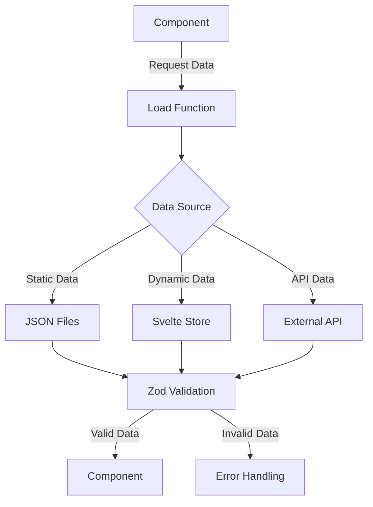
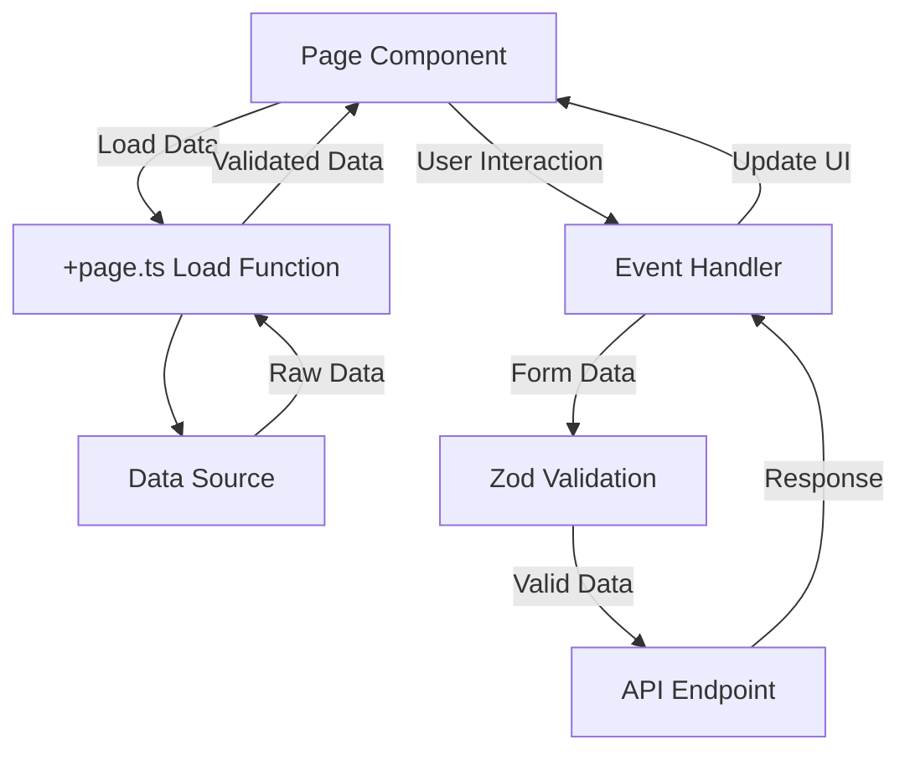

# Data Architecture

## 1. Overview
This document describes the data architecture for the Bulgarian-German Learning App, including data schemas, loading patterns, caching strategies, and validation mechanisms.

---

## 2. Data Sources

### 2.1 Static Data
**Location**: `data/vocab/` and `data/`
**Format**: JSON files
**Purpose**: Vocabulary, grammar rules, and cultural content

**Example Files**:
- `data/vocab/verben-A1.json` - German verbs at A1 level
- `data/vocab/adjektive-A1.json` - German adjectives at A1 level
- `data/cultural-grammar.json` - Cultural grammar rules

### 2.2 Dynamic Data
**Location**: `src/lib/data/`
**Format**: Svelte reactive stores, TypeScript modules
**Purpose**: User progress, session data, and application state

### 2.3 External Data
**Format**: API responses
**Purpose**: Future integration with external language learning APIs

---

## 3. Data Schemas

### 3.1 Vocabulary Schema
**File**: `src/lib/schemas/vocabulary.ts`
**Validation**: Zod schema

```typescript
import { z } from 'zod';

// Base vocabulary item schema
export const VocabularyItemSchema = z.object({
  id: z.string().uuid(),
  german: z.string().min(1).max(100),
  bulgarian: z.string().min(1).max(100),
  partOfSpeech: z.enum([
    'noun', 'verb', 'adjective', 'adverb',
    'preposition', 'pronoun', 'conjunction', 'interjection'
  ]),
  difficulty: z.number().min(1).max(5),
  category: z.string().min(1).max(50),
  examples: z.array(z.string()).optional(),
  gender: z.enum(['der', 'die', 'das', '']).optional(),
  plural: z.string().optional(),
  pastTense: z.string().optional(),
  perfectTense: z.string().optional(),
  audio: z.string().optional(),
  image: z.string().optional(),
  createdAt: z.string().datetime().optional(),
  updatedAt: z.string().datetime().optional()
});

export type VocabularyItem = z.infer<typeof VocabularyItemSchema>;

// Collection schema
export const VocabularyCollectionSchema = z.object({
  id: z.string().uuid(),
  name: z.string().min(1).max(100),
  description: z.string().optional(),
  items: z.array(VocabularyItemSchema),
  level: z.enum(['A1', 'A2', 'B1', 'B2', 'C1', 'C2']),
  category: z.string().optional(),
  createdAt: z.string().datetime(),
  updatedAt: z.string().datetime()
});

export type VocabularyCollection = z.infer<typeof VocabularyCollectionSchema>;
```

### 3.2 User Progress Schema
**File**: `src/lib/schemas/userProgress.ts`
**Validation**: Zod schema

```typescript
import { z } from 'zod';

export const UserProgressSchema = z.object({
  userId: z.string().uuid(),
  vocabularyProgress: z.record(
    z.string().uuid(),
    z.object({
      learned: z.boolean().default(false),
      proficiency: z.number().min(0).max(100).default(0),
      lastReviewed: z.string().datetime().optional(),
      nextReview: z.string().datetime().optional(),
      reviewCount: z.number().min(0).default(0)
    })
  ),
  grammarProgress: z.record(
    z.string(),
    z.object({
      completed: z.boolean().default(false),
      score: z.number().min(0).max(100).default(0)
    })
  ),
  achievements: z.array(
    z.object({
      id: z.string().uuid(),
      name: z.string(),
      description: z.string(),
      earned: z.boolean().default(false),
      earnedAt: z.string().datetime().optional()
    })
  ),
  level: z.number().min(1).max(100).default(1),
  points: z.number().min(0).default(0),
  lastActive: z.string().datetime().optional(),
  createdAt: z.string().datetime(),
  updatedAt: z.string().datetime()
});

export type UserProgress = z.infer<typeof UserProgressSchema>;
```

### 3.3 Quiz Answer Schema
**File**: `src/lib/schemas/quiz.ts`
**Validation**: Zod schema

```typescript
import { z } from 'zod';

export const QuizAnswerSchema = z.object({
  questionId: z.string().uuid(),
  userAnswer: z.string().min(1).max(200),
  correctAnswer: z.string().min(1).max(200),
  isCorrect: z.boolean(),
  timeTaken: z.number().min(0).max(60000), // in milliseconds
  timestamp: z.string().datetime()
});

export type QuizAnswer = z.infer<typeof QuizAnswerSchema>;

export const QuizSessionSchema = z.object({
  sessionId: z.string().uuid(),
  userId: z.string().uuid(),
  quizType: z.enum(['vocabulary', 'grammar', 'listening', 'reading']),
  questions: z.array(z.object({
    questionId: z.string().uuid(),
    question: z.string(),
    options: z.array(z.string()).optional(),
    correctAnswer: z.string()
  })),
  answers: z.array(QuizAnswerSchema),
  score: z.number().min(0).max(100),
  completed: z.boolean().default(false),
  startedAt: z.string().datetime(),
  completedAt: z.string().datetime().optional()
});

export type QuizSession = z.infer<typeof QuizSessionSchema>;
```

---

## 4. Data Loading Architecture

### 4.1 Data Loading Flow


### 4.2 Load Functions
**Location**: `src/routes/[route]/+page.ts` or `src/routes/[route]/+page.server.ts`

**Example Load Function**:
```typescript
// src/routes/vocabulary/+page.ts
import { VocabularyCollectionSchema } from '$lib/schemas/vocabulary';
import type { PageLoad } from './$types';

export const load: PageLoad = async ({ fetch }) => {
  try {
    // Load vocabulary data
    const response = await fetch('/api/vocabulary/A1');
    const data = await response.json();

    // Validate data with Zod
    const result = VocabularyCollectionSchema.safeParse(data);

    if (!result.success) {
      console.error('Validation error:', result.error);
      throw new Error('Invalid vocabulary data');
    }

    return {
      vocabulary: result.data,
      title: 'A1 Vocabulary'
    };
  } catch (error) {
    console.error('Error loading vocabulary:', error);
    throw error;
  }
};
```

### 4.3 Data Loading Patterns

| Pattern | Use Case | Implementation |
|---------|----------|----------------|
| **Static Data** | Vocabulary, grammar rules | Import JSON files directly |
| **Dynamic Data** | User progress, session data | Svelte reactive stores |
| **API Data** | External data sources | Fetch API with Zod validation |
| **Cached Data** | Frequently accessed data | Svelte store with localStorage |
| **Server Data** | Sensitive data | `+page.server.ts` load functions |

---

## 5. Caching Strategy

### 5.1 Client-Side Caching
**Implementation**: Svelte reactive stores with localStorage persistence

```typescript
// src/lib/data/db.svelte.ts
import { $state } from 'svelte';
import { browser } from '$app/environment';

class VocabularyDB {
  vocabulary = $state<VocabularyItem[]>([]);
  userProgress = $state<UserProgress | null>(null);

  constructor() {
    if (browser) {
      // Load from localStorage
      const savedVocabulary = localStorage.getItem('vocabulary');
      const savedProgress = localStorage.getItem('userProgress');

      if (savedVocabulary) {
        this.vocabulary = JSON.parse(savedVocabulary);
      }

      if (savedProgress) {
        this.userProgress = JSON.parse(savedProgress);
      }
    }

    // Save to localStorage when data changes
    $effect(() => {
      if (browser) {
        localStorage.setItem('vocabulary', JSON.stringify(this.vocabulary));
      }
    });

    $effect(() => {
      if (browser && this.userProgress) {
        localStorage.setItem('userProgress', JSON.stringify(this.userProgress));
      }
    });
  }

  async loadVocabulary(level: string) {
    const response = await fetch(`/api/vocabulary/${level}`);
    const data = await response.json();

    const result = VocabularyCollectionSchema.safeParse(data);
    if (result.success) {
      this.vocabulary = result.data.items;
    } else {
      console.error('Invalid vocabulary data:', result.error);
    }
  }
}

export const db = new VocabularyDB();
```

### 5.2 Server-Side Caching
**Implementation**: SvelteKit server-side caching

```typescript
// src/routes/api/vocabulary/[level]/+server.ts
import { json } from '@sveltejs/kit';
import { VocabularyCollectionSchema } from '$lib/schemas/vocabulary';
import type { RequestHandler } from './$types';

// Simple in-memory cache
const cache = new Map<string, { data: unknown; timestamp: number }>();

export const GET: RequestHandler = async ({ params }) => {
  const { level } = params;
  const cacheKey = `vocabulary-${level}`;
  const CACHE_TTL = 3600000; // 1 hour

  // Check cache
  if (cache.has(cacheKey)) {
    const cached = cache.get(cacheKey);
    if (cached && Date.now() - cached.timestamp < CACHE_TTL) {
      return json(cached.data);
    }
  }

  // Load from file system
  const data = await import(`../../../../data/vocab/${level}.json`);

  // Validate data
  const result = VocabularyCollectionSchema.safeParse(data.default);
  if (!result.success) {
    throw new Error('Invalid vocabulary data');
  }

  // Update cache
  cache.set(cacheKey, { data: result.data, timestamp: Date.now() });

  return json(result.data);
};
```

---

## 6. Data Validation

### 6.1 Runtime Validation with Zod
**Implementation**: Zod schemas for all data loading paths

**Example: Form Validation**
```typescript
// src/lib/schemas/forms.ts
import { z } from 'zod';

export const LoginFormSchema = z.object({
  email: z.string().email(),
  password: z.string().min(8).max(100),
  rememberMe: z.boolean().optional()
});

export const QuizAnswerFormSchema = z.object({
  questionId: z.string().uuid(),
  answer: z.string().min(1).max(200),
  timeTaken: z.number().min(0).max(60000)
});

export const UserSettingsFormSchema = z.object({
  language: z.enum(['en', 'de', 'bg']),
  difficulty: z.enum(['beginner', 'intermediate', 'advanced']),
  dailyGoal: z.number().min(5).max(100),
  darkMode: z.boolean()
});
```

**Example: Form Submission**
```svelte
<!-- src/lib/components/forms/LoginForm.svelte -->
<script lang="ts">
  import { $state } from 'svelte';
  import { LoginFormSchema } from '$lib/schemas/forms';

  let email = $state('');
  let password = $state('');
  let rememberMe = $state(false);
  let errors = $state<Record<string, string>>({});

  async function handleSubmit() {
    const formData = { email, password, rememberMe };

    // Validate with Zod
    const result = LoginFormSchema.safeParse(formData);

    if (!result.success) {
      // Convert Zod errors to form errors
      errors = {};
      result.error.errors.forEach(error => {
        errors[error.path[0]] = error.message;
      });
      return;
    }

    // Submit valid data
    try {
      const response = await fetch('/api/auth/login', {
        method: 'POST',
        body: JSON.stringify(result.data)
      });

      if (!response.ok) {
        throw new Error('Login failed');
      }

      // Handle successful login
    } catch (error) {
      console.error('Login error:', error);
    }
  }
</script>

<form onsubmit|preventDefault={handleSubmit}>
  <div>
    <label for="email">Email</label>
    <input id="email" type="email" bind:value={email} />
    {#if errors.email}
      <div class="error">{errors.email}</div>
    {/if}
  </div>

  <div>
    <label for="password">Password</label>
    <input id="password" type="password" bind:value={password} />
    {#if errors.password}
      <div class="error">{errors.password}</div>
    {/if}
  </div>

  <div>
    <label>
      <input type="checkbox" bind:checked={rememberMe} />
      Remember me
    </label>
  </div>

  <button type="submit">Login</button>
</form>
```

---

## 7. Data Flow Architecture

### 7.1 Component Data Flow


### 7.2 Data Flow Examples

**Example 1: Vocabulary Loading**
1. User navigates to `/vocabulary/A1`
2. `+page.ts` load function fetches data from `/api/vocabulary/A1`
3. API endpoint loads data from `data/vocab/A1.json`
4. Data is validated with `VocabularyCollectionSchema`
5. Validated data is passed to the page component
6. Component renders vocabulary list

**Example 2: Quiz Submission**
1. User submits answer to quiz question
2. Form data is validated with `QuizAnswerFormSchema`
3. Valid data is sent to `/api/quiz/answer` endpoint
4. Endpoint validates data with `QuizAnswerSchema`
5. User progress is updated in the database
6. Response is sent back to the component
7. Component updates UI with feedback

---

## 8. Database Architecture

### 8.1 Current Implementation
**Type**: Client-side storage using localStorage
**Data**: User progress, preferences, and cached vocabulary

**Implementation**:
```typescript
// src/lib/utils/localStorage.ts
import { browser } from '$app/environment';

export function getItem<T>(key: string): T | null {
  if (!browser) return null;

  const item = localStorage.getItem(key);
  return item ? JSON.parse(item) : null;
}

export function setItem<T>(key: string, value: T): void {
  if (!browser) return;

  localStorage.setItem(key, JSON.stringify(value));
}

export function removeItem(key: string): void {
  if (!browser) return;

  localStorage.removeItem(key);
}

export function clear(): void {
  if (!browser) return;

  localStorage.clear();
}
```

### 8.2 Future Implementation
**Type**: Server-side database (Firebase, Supabase, or custom backend)
**Data**: User accounts, progress, achievements, and social features

**Proposed Schema**:
```typescript
// Users collection
interface User {
  id: string;
  email: string;
  name: string;
  language: 'en' | 'de' | 'bg';
  createdAt: Date;
  lastLogin: Date;
  preferences: {
    darkMode: boolean;
    dailyGoal: number;
    difficulty: 'beginner' | 'intermediate' | 'advanced';
  };
}

// Progress collection
interface Progress {
  userId: string;
  vocabulary: Record<string, {
    learned: boolean;
    proficiency: number;
    lastReviewed: Date;
    nextReview: Date;
    reviewCount: number;
  }>;
  grammar: Record<string, {
    completed: boolean;
    score: number;
  }>;
  achievements: string[];
  level: number;
  points: number;
  lastActive: Date;
}

// Quiz sessions collection
interface QuizSession {
  id: string;
  userId: string;
  quizType: 'vocabulary' | 'grammar' | 'listening' | 'reading';
  questions: Array<{
    questionId: string;
    question: string;
    options?: string[];
    correctAnswer: string;
  }>;
  answers: Array<{
    questionId: string;
    userAnswer: string;
    correctAnswer: string;
    isCorrect: boolean;
    timeTaken: number;
  }>;
  score: number;
  completed: boolean;
  startedAt: Date;
  completedAt?: Date;
}
```

---

## 9. API Design

### 9.1 REST API Endpoints

| Endpoint | Method | Description | Request Body | Response |
|----------|--------|-------------|--------------|----------|
| `/api/vocabulary/{level}` | GET | Get vocabulary for a level | - | `VocabularyCollection` |
| `/api/vocabulary/{id}` | GET | Get specific vocabulary item | - | `VocabularyItem` |
| `/api/progress` | GET | Get user progress | - | `UserProgress` |
| `/api/progress` | POST | Update user progress | `Partial<UserProgress>` | `UserProgress` |
| `/api/quiz/start` | POST | Start a new quiz session | `{ quizType: string }` | `QuizSession` |
| `/api/quiz/answer` | POST | Submit quiz answer | `QuizAnswer` | `{ isCorrect: boolean, correctAnswer: string }` |
| `/api/quiz/{sessionId}/complete` | POST | Complete quiz session | - | `QuizSession` |
| `/api/auth/login` | POST | User login | `{ email: string, password: string }` | `{ token: string }` |
| `/api/auth/register` | POST | User registration | `{ email: string, password: string, name: string }` | `{ token: string }` |

### 9.2 API Validation
All API endpoints validate incoming and outgoing data using Zod schemas:

```typescript
// src/routes/api/progress/+server.ts
import { json } from '@sveltejs/kit';
import { UserProgressSchema } from '$lib/schemas/userProgress';
import type { RequestHandler } from './$types';

export const GET: RequestHandler = async ({ locals }) => {
  const userId = locals.user?.id;
  if (!userId) {
    return json({ error: 'Unauthorized' }, { status: 401 });
  }

  // Load user progress from database
  const progress = await loadUserProgress(userId);

  // Validate data before returning
  const result = UserProgressSchema.safeParse(progress);
  if (!result.success) {
    console.error('Invalid user progress data:', result.error);
    return json({ error: 'Invalid data' }, { status: 500 });
  }

  return json(result.data);
};

export const POST: RequestHandler = async ({ request, locals }) => {
  const userId = locals.user?.id;
  if (!userId) {
    return json({ error: 'Unauthorized' }, { status: 401 });
  }

  const data = await request.json();

  // Validate incoming data
  const result = UserProgressSchema.partial().safeParse(data);
  if (!result.success) {
    return json({ error: 'Invalid data', details: result.error }, { status: 400 });
  }

  // Update user progress
  const updatedProgress = await updateUserProgress(userId, result.data);

  // Validate outgoing data
  const validation = UserProgressSchema.safeParse(updatedProgress);
  if (!validation.success) {
    console.error('Invalid updated progress data:', validation.error);
    return json({ error: 'Data validation failed' }, { status: 500 });
  }

  return json(validation.data);
};
```

---

## 10. Performance Optimization

### 10.1 Data Loading Optimization
- **Lazy Loading**: Load data only when needed
- **Pagination**: Implement pagination for large datasets
- **Preloading**: Preload data for expected user actions
- **Caching**: Cache frequently accessed data

**Example: Paginated Vocabulary Loading**
```typescript
// src/routes/vocabulary/[level]/+page.ts
import { VocabularyItemSchema } from '$lib/schemas/vocabulary';
import type { PageLoad } from './$types';

export const load: PageLoad = async ({ params, url }) => {
  const { level } = params;
  const page = Number(url.searchParams.get('page')) || 1;
  const limit = Number(url.searchParams.get('limit')) || 20;
  const offset = (page - 1) * limit;

  // Load only the required data
  const response = await fetch(`/api/vocabulary/${level}?page=${page}&limit=${limit}`);
  const data = await response.json();

  // Validate data
  const result = z.object({
    items: z.array(VocabularyItemSchema),
    total: z.number(),
    page: z.number(),
    limit: z.number()
  }).safeParse(data);

  if (!result.success) {
    throw new Error('Invalid vocabulary data');
  }

  return {
    vocabulary: result.data.items,
    pagination: {
      total: result.data.total,
      page: result.data.page,
      limit: result.data.limit,
      totalPages: Math.ceil(result.data.total / result.data.limit)
    },
    title: `${level} Vocabulary - Page ${page}`
  };
};
```

### 10.2 Data Compression
- **JSON Minification**: Minify JSON files in production
- **Gzip Compression**: Enable gzip compression for API responses
- **Image Optimization**: Optimize images for web

**Example: JSON Minification Script**
```javascript
// scripts/minify-json.js
import fs from 'fs/promises';
import path from 'path';
import { glob } from 'glob';

async function minifyJsonFiles() {
  try {
    // Find all JSON files in data directory
    const files = await glob('data/**/*.json');

    for (const file of files) {
      // Skip already minified files
      if (file.includes('.min.json')) continue;

      const content = await fs.readFile(file, 'utf-8');
      const json = JSON.parse(content);

      // Create minified version
      const minifiedContent = JSON.stringify(json);
      const minifiedPath = file.replace(/\.json$/, '.min.json');

      await fs.writeFile(minifiedPath, minifiedContent);
      console.log(`Minified: ${file} → ${minifiedPath}`);
    }

    console.log('JSON minification complete');
  } catch (error) {
    console.error('Error minifying JSON files:', error);
  }
}

minifyJsonFiles();
```

---

## 11. Security Considerations

### 11.1 Data Validation
- **Input Validation**: Validate all user inputs with Zod
- **Output Validation**: Validate all API responses with Zod
- **Type Safety**: Use TypeScript for compile-time type checking
- **Sanitization**: Sanitize user inputs to prevent XSS

### 11.2 Authentication
- **JWT Tokens**: Use JSON Web Tokens for authentication
- **Secure Storage**: Store tokens securely (HttpOnly cookies)
- **Token Expiration**: Implement token expiration and refresh

**Example: Authentication Middleware**
```typescript
// src/hooks.server.ts
import { sequence } from '@sveltejs/kit/hooks';
import { handleAuth } from '$lib/server/auth';
import { handleValidation } from '$lib/server/validation';
import type { Handle } from '@sveltejs/kit';

export const handle: Handle = sequence(
  handleAuth,
  handleValidation
);
```

### 11.3 Data Protection
- **LocalStorage**: Be cautious with sensitive data in localStorage
- **Encryption**: Encrypt sensitive data before storage
- **HTTPS**: Ensure all communications use HTTPS

---

## 12. Testing Strategy

### 12.1 Data Validation Tests
```typescript
// tests/data/validation.test.ts
import { describe, it, expect } from 'vitest';
import { VocabularyItemSchema, UserProgressSchema } from '$lib/schemas';
import { z } from 'zod';

describe('Data Validation', () => {
  describe('VocabularyItemSchema', () => {
    it('validates correct vocabulary item', () => {
      const validItem = {
        id: '550e8400-e29b-41d4-a716-446655440000',
        german: 'Haus',
        bulgarian: 'къща',
        partOfSpeech: 'noun',
        difficulty: 1,
        category: 'home',
        gender: 'das'
      };

      const result = VocabularyItemSchema.safeParse(validItem);
      expect(result.success).toBe(true);
    });

    it('rejects invalid vocabulary item', () => {
      const invalidItem = {
        id: 'invalid-uuid',
        german: '',
        bulgarian: 'къща',
        partOfSpeech: 'invalid',
        difficulty: 6,
        category: ''
      };

      const result = VocabularyItemSchema.safeParse(invalidItem);
      expect(result.success).toBe(false);
    });
  });

  describe('UserProgressSchema', () => {
    it('validates correct user progress', () => {
      const validProgress = {
        userId: '550e8400-e29b-41d4-a716-446655440000',
        vocabularyProgress: {
          '550e8400-e29b-41d4-a716-446655440001': {
            learned: true,
            proficiency: 80,
            lastReviewed: '2025-12-03T12:00:00Z',
            nextReview: '2025-12-10T12:00:00Z',
            reviewCount: 5
          }
        },
        grammarProgress: {},
        achievements: [],
        level: 1,
        points: 100,
        createdAt: '2025-12-01T12:00:00Z',
        updatedAt: '2025-12-03T12:00:00Z'
      };

      const result = UserProgressSchema.safeParse(validProgress);
      expect(result.success).toBe(true);
    });

    it('rejects invalid user progress', () => {
      const invalidProgress = {
        userId: 'invalid-uuid',
        vocabularyProgress: {
          'invalid-id': {
            learned: 'yes', // should be boolean
            proficiency: 150, // should be <= 100
            reviewCount: -5 // should be >= 0
          }
        },
        level: 0, // should be >= 1
        points: -100 // should be >= 0
      };

      const result = UserProgressSchema.safeParse(invalidProgress);
      expect(result.success).toBe(false);
    });
  });
});
```

### 12.2 API Endpoint Tests
```typescript
// tests/api/vocabulary.test.ts
import { test, expect } from '@playwright/test';
import { VocabularyCollectionSchema } from '$lib/schemas/vocabulary';

test('GET /api/vocabulary/{level} returns valid data', async ({ request }) => {
  const response = await request.get('/api/vocabulary/A1');
  expect(response.ok()).toBeTruthy();

  const data = await response.json();

  // Validate response with Zod
  const result = VocabularyCollectionSchema.safeParse(data);
  expect(result.success).toBe(true);

  if (result.success) {
    expect(result.data.items.length).toBeGreaterThan(0);
    expect(result.data.level).toBe('A1');
  }
});

test('GET /api/vocabulary/{level} handles invalid level', async ({ request }) => {
  const response = await request.get('/api/vocabulary/INVALID');
  expect(response.status()).toBe(404);
});
```

---

## 13. Migration Strategy

### 13.1 Current to Future State
**Current State**:
- Client-side localStorage for user progress
- Static JSON files for vocabulary data
- No server-side persistence

**Future State**:
- Server-side database for user data
- CDN-hosted static assets
- API for dynamic data

### 13.2 Migration Plan
1. **Phase 1**: Implement server-side API endpoints
2. **Phase 2**: Add database integration
3. **Phase 3**: Migrate client-side storage to server-side
4. **Phase 4**: Implement data synchronization
5. **Phase 5**: Deprecate localStorage usage

**Migration Script Example**:
```javascript
// scripts/migrate-user-data.js
import { db } from '$lib/server/database';
import { getItem } from '$lib/utils/localStorage';
import { UserProgressSchema } from '$lib/schemas/userProgress';

async function migrateUserData() {
  try {
    // Get user ID from authentication
    const userId = await getCurrentUserId();
    if (!userId) {
      console.log('No user logged in, skipping migration');
      return;
    }

    // Get data from localStorage
    const localProgress = getItem('userProgress');
    if (!localProgress) {
      console.log('No local progress data found');
      return;
    }

    // Validate data
    const result = UserProgressSchema.safeParse(localProgress);
    if (!result.success) {
      console.error('Invalid local progress data:', result.error);
      return;
    }

    // Migrate to server
    const serverProgress = await db.userProgress.upsert({
      where: { userId },
      create: {
        userId,
        ...result.data
      },
      update: {
        ...result.data
      }
    });

    console.log('User data migrated successfully:', serverProgress.id);

    // Optionally clear localStorage
    // localStorage.removeItem('userProgress');
  } catch (error) {
    console.error('Error migrating user data:', error);
  }
}

migrateUserData();
```

---

## 14. Monitoring and Analytics

### 14.1 Data Usage Metrics
- **Vocabulary Data**: Track which vocabulary items are most accessed
- **User Progress**: Monitor user learning patterns
- **Performance**: Track data loading times
- **Errors**: Monitor validation errors and data loading failures

**Example: Data Usage Tracking**
```typescript
// src/lib/utils/analytics.ts
import { browser } from '$app/environment';

export function trackVocabularyAccess(itemId: string, level: string) {
  if (!browser) return;

  // Send analytics event
  if (window.gtag) {
    window.gtag('event', 'vocabulary_access', {
      item_id: itemId,
      level: level,
      timestamp: new Date().toISOString()
    });
  }

  // Log to console for development
  console.log(`Vocabulary accessed: ${itemId} (${level})`);
}

export function trackLearningSession(sessionType: string, duration: number) {
  if (!browser) return;

  if (window.gtag) {
    window.gtag('event', 'learning_session', {
      session_type: sessionType,
      duration: duration,
      timestamp: new Date().toISOString()
    });
  }

  console.log(`Learning session: ${sessionType}, ${duration}ms`);
}
```

---

## 15. Future Enhancements

### 15.1 Data Architecture Improvements
1. **GraphQL API**: Implement GraphQL for more flexible data queries
2. **Real-time Updates**: Add real-time updates for collaborative features
3. **Offline First**: Implement offline-first architecture with conflict resolution
4. **Data Synchronization**: Add data synchronization across devices
5. **Personalization**: Implement machine learning for personalized recommendations

### 15.2 Advanced Features
1. **User-Generated Content**: Allow users to add and share vocabulary
2. **Social Features**: Add social learning features
3. **Content Moderation**: Implement content moderation for user-generated content
4. **Analytics Dashboard**: Add analytics dashboard for users and admins
5. **API for Third Parties**: Create API for integration with other language learning apps

---

## 16. Appendix

### 16.1 Data Schema Reference
| Schema | File | Purpose |
|--------|------|---------|
| `VocabularyItemSchema` | `src/lib/schemas/vocabulary.ts` | Vocabulary item validation |
| `VocabularyCollectionSchema` | `src/lib/schemas/vocabulary.ts` | Vocabulary collection validation |
| `UserProgressSchema` | `src/lib/schemas/userProgress.ts` | User progress validation |
| `QuizAnswerSchema` | `src/lib/schemas/quiz.ts` | Quiz answer validation |
| `QuizSessionSchema` | `src/lib/schemas/quiz.ts` | Quiz session validation |
| `LoginFormSchema` | `src/lib/schemas/forms.ts` | Login form validation |
| `QuizAnswerFormSchema` | `src/lib/schemas/forms.ts` | Quiz answer form validation |
| `UserSettingsFormSchema` | `src/lib/schemas/forms.ts` | User settings form validation |

### 16.2 Key Files
| File | Purpose |
|------|---------|
| `src/lib/data/db.svelte.ts` | Client-side data store |
| `src/lib/data/loader.ts` | Data loading utilities |
| `src/lib/schemas/*.ts` | Zod validation schemas |
| `src/routes/api/**/+server.ts` | API endpoints |
| `src/routes/**/+page.ts` | Page load functions |
| `data/vocab/*.json` | Vocabulary data files |
| `scripts/migrate-vocabulary.js` | Data migration scripts |

### 16.3 Glossary
| Term | Definition |
|------|------------|
| **Zod** | TypeScript-first schema validation library |
| **Svelte Store** | Reactive state management in Svelte |
| **localStorage** | Client-side storage for web applications |
| **CDN** | Content Delivery Network for serving static assets |
| **GraphQL** | Query language for APIs |
| **Offline First** | Design approach prioritizing offline functionality |
| **Conflict Resolution** | Strategies for handling data conflicts in distributed systems |
| **Type Safety** | Programming concept ensuring variables have correct types |
| **Runtime Validation** | Data validation performed during program execution |