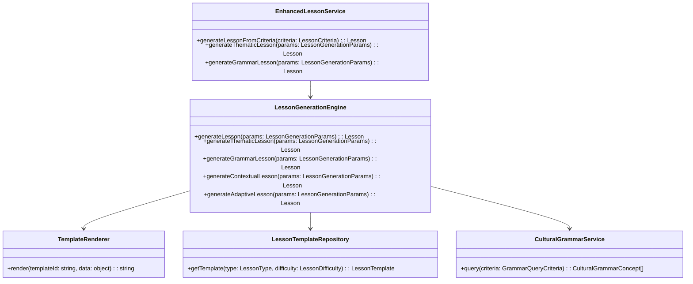
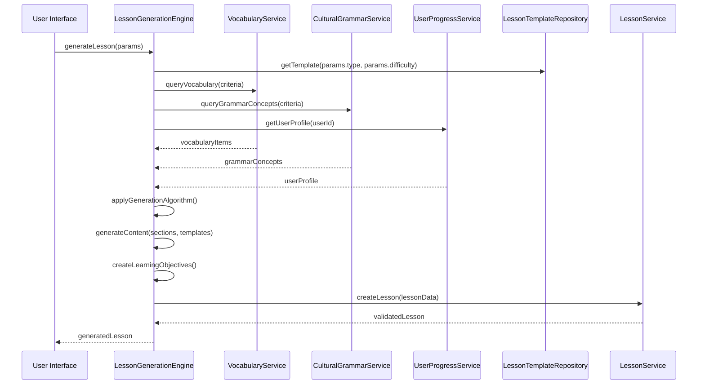

# Dynamic Lesson Generation Architecture

## 📚 Overview

This document outlines the architecture for the dynamic lesson generation system, which extends the existing lesson infrastructure to create personalized, context-rich learning experiences based on vocabulary metadata and cultural-grammar data.

## 🏗️ System Architecture

### Core Components



### Data Flow



## 📦 Data Structures

### LessonGenerationParams

```typescript
interface LessonGenerationParams {
  type: LessonType;
  difficulty: LessonDifficulty;
  criteria: {
    categories?: VocabularyCategory[];
    partOfSpeech?: PartOfSpeech;
    difficulty?: LessonDifficulty;
    limit?: number;
  };
  userId: string;
  metadata?: Record<string, any>;
}
```

### LessonTemplate

```typescript
interface LessonTemplate {
  id: string;
  name: string;
  description: string;
  type: LessonType;
  difficultyRange: [LessonDifficulty, LessonDifficulty];
  template: string;
  variables: TemplateVariable[];
}

interface TemplateVariable {
  name: string;
  type: 'string' | 'number' | 'array' | 'object';
  description: string;
  required: boolean;
  defaultValue?: any;
}
```

### ContentTemplate Examples

#### Vocabulary Introduction Template

```json
{
  "id": "vocabulary_intro_template",
  "name": "Vocabulary Introduction",
  "description": "Introduction section for vocabulary lessons",
  "type": "vocabulary",
  "difficultyRange": ["A1", "C1"],
  "template": "
## {{sectionTitle}}

This section introduces {{count}} {{theme}} vocabulary items at {{difficulty}} level.

{{#each vocabulary}}
### {{german}} / {{bulgarian}}
- **Part of Speech**: {{partOfSpeech}}
- **Difficulty**: {{difficulty}}
{{#if metadata.gender}}
- **Gender**: {{metadata.gender}}
{{/if}}
{{#if metadata.notes}}
- **Notes**: {{metadata.notes}}
{{/if}}
{{#if metadata.mnemonic}}
- **Mnemonic**: {{metadata.mnemonic}}
{{/if}}
{{/each}}

**Learning Tip**: {{learningTip}}
  ",
  "variables": [
    {"name": "sectionTitle", "type": "string", "required": true},
    {"name": "count", "type": "number", "required": true},
    {"name": "theme", "type": "string", "required": true},
    {"name": "difficulty", "type": "string", "required": true},
    {"name": "vocabulary", "type": "array", "required": true},
    {"name": "learningTip", "type": "string", "required": false}
  ]
}
```

#### Grammar Comparison Template

```json
{
  "id": "grammar_comparison_template",
  "name": "Grammar Comparison",
  "description": "Comparison of Bulgarian and German grammar concepts",
  "type": "grammar",
  "difficultyRange": ["A2", "C1"],
  "template": "
## {{sectionTitle}}

### Bulgarian Perspective
{{grammarConcept.cultural_context.bulgarian_perspective}}

### German Perspective
{{grammarConcept.cultural_context.german_perspective}}

### Cross-Linguistic Explanation
**Bulgarian to German**: {{grammarConcept.cross_linguistic_explanation.bg_to_de}}

**German to Bulgarian**: {{grammarConcept.cross_linguistic_explanation.de_to_bg}}

### Examples
{{#each grammarConcept.examples}}
- **Bulgarian**: {{bulgarian}}
- **German**: {{german}}
- **Explanation**: {{explanation_bg_to_de}}
{{/each}}

### Common Mistakes
{{#each grammarConcept.common_mistakes.bg_to_de}}
- {{this}}
{{/each}}
  ",
  "variables": [
    {"name": "sectionTitle", "type": "string", "required": true},
    {"name": "grammarConcept", "type": "object", "required": true}
  ]
}
```

## 🧠 Algorithms

### Difficulty Adjustment Algorithm

```typescript
function adjustDifficulty(
  baseDifficulty: LessonDifficulty,
  userProficiency: Record<LessonDifficulty, number>
): LessonDifficulty {
  // Calculate user's average proficiency
  const avgProficiency = Object.values(userProficiency).reduce((sum, val) => sum + val, 0) /
    Object.keys(userProficiency).length;

  // Adjust difficulty based on proficiency
  if (avgProficiency < 30) {
    // User is struggling - lower difficulty
    return getPreviousDifficulty(baseDifficulty);
  } else if (avgProficiency > 70) {
    // User is excelling - increase difficulty
    return getNextDifficulty(baseDifficulty);
  }
  // Keep current difficulty
  return baseDifficulty;
}

function getPreviousDifficulty(difficulty: LessonDifficulty): LessonDifficulty {
  const order: LessonDifficulty[] = ['A1', 'A2', 'B1', 'B2', 'C1'];
  const index = order.indexOf(difficulty);
  return index > 0 ? order[index - 1] : 'A1';
}

function getNextDifficulty(difficulty: LessonDifficulty): LessonDifficulty {
  const order: LessonDifficulty[] = ['A1', 'A2', 'B1', 'B2', 'C1'];
  const index = order.indexOf(difficulty);
  return index < order.length - 1 ? order[index + 1] : 'C1';
}
```

### Spaced Repetition Integration

```typescript
function prioritizeVocabularyForReview(
  vocabularyItems: VocabularyItem[],
  userProfile: UserLearningProfile,
  limit: number
): VocabularyItem[] {
  // Calculate priority score for each item
  const scoredItems = vocabularyItems.map(item => {
    const history = userProfile.learningHistory[item.id] || {
      lastReviewed: null,
      reviewCount: 0,
      proficiency: 0
    };

    // Calculate priority based on spaced repetition algorithm
    const priority = calculateSpacedRepetitionPriority(
      history.lastReviewed,
      history.reviewCount,
      history.proficiency,
      item.learningPhase
    );

    return { item, priority };
  });

  // Sort by priority (highest first)
  scoredItems.sort((a, b) => b.priority - a.priority);

  // Return top N items
  return scoredItems.slice(0, limit).map(item => item.item);
}

function calculateSpacedRepetitionPriority(
  lastReviewed: Date | null,
  reviewCount: number,
  proficiency: number,
  learningPhase: number
): number {
  // Calculate days since last review
  const daysSinceReview = lastReviewed ?
    (Date.now() - lastReviewed.getTime()) / (1000 * 60 * 60 * 24) : 0;

  // Base priority on learning phase and review history
  let priority = 0;

  // Items in early learning phases have higher priority
  priority += (7 - learningPhase) * 10; // 0-60 points

  // Items with low proficiency have higher priority
  priority += (100 - proficiency) * 0.5; // 0-50 points

  // Items not reviewed recently have higher priority
  if (daysSinceReview > 7) {
    priority += 30; // 30 points for items not reviewed in a week
  } else if (daysSinceReview > 3) {
    priority += 15; // 15 points for items not reviewed in 3 days
  }

  // Items with few reviews have higher priority
  priority += (5 - Math.min(reviewCount, 5)) * 5; // 0-25 points

  return priority;
}
```

## 🔗 Integration Points

### Enhanced LessonService

```typescript
// src/lib/services/lesson.ts
export class EnhancedLessonService extends LessonService {
  private generationEngine: LessonGenerationEngine;

  constructor() {
    super();
    this.generationEngine = new LessonGenerationEngine();
  }

  // Override existing method with enhanced capabilities
  async generateLessonFromCriteria(
    criteria: EnhancedLessonCriteria
  ): Promise<Lesson> {
    return this.generationEngine.generateLesson(criteria);
  }

  // Add new methods for dynamic generation
  async generateThematicLesson(params: LessonGenerationParams): Promise<Lesson> {
    return this.generationEngine.generateThematicLesson(params);
  }

  async generateGrammarLesson(params: LessonGenerationParams): Promise<Lesson> {
    return this.generationEngine.generateGrammarLesson(params);
  }

  async generateContextualLesson(params: LessonGenerationParams): Promise<Lesson> {
    return this.generationEngine.generateContextualLesson(params);
  }

  async generateAdaptiveLesson(params: LessonGenerationParams): Promise<Lesson> {
    return this.generationEngine.generateAdaptiveLesson(params);
  }
}
```

### Service Implementations

#### CulturalGrammarService

```typescript
// src/lib/services/cultural-grammar.ts
class CulturalGrammarService {
  private grammarConcepts: CulturalGrammarConcept[] = [];
  private initialized = $state(false);

  async initialize() {
    if (this.initialized) return;
    const data = await this.loadGrammarData();
    this.grammarConcepts = this.validateData(data);
    this.initialized = true;
  }

  async query(criteria: {
    difficulty?: LessonDifficulty;
    partOfSpeech?: PartOfSpeech;
    limit?: number;
  }): Promise<CulturalGrammarConcept[]> {
    if (!this.initialized) await this.initialize();

    return this.grammarConcepts.filter(concept => {
      const difficultyMatch = criteria.difficulty ?
        concept.difficulty === criteria.difficulty : true;
      const posMatch = criteria.partOfSpeech ?
        this.conceptAppliesToPartOfSpeech(concept, criteria.partOfSpeech) : true;
      return difficultyMatch && posMatch;
    }).slice(0, criteria.limit || 1);
  }

  private conceptAppliesToPartOfSpeech(
    concept: CulturalGrammarConcept,
    partOfSpeech: PartOfSpeech
  ): boolean {
    // Logic to determine if grammar concept applies to part of speech
    return true;
  }
}
```

#### LessonTemplateRepository

```typescript
// src/lib/services/lesson-templates.ts
class LessonTemplateRepository {
  private templates: LessonTemplate[] = [];
  private initialized = $state(false);

  async initialize() {
    if (this.initialized) return;
    this.templates = await this.loadTemplates();
    this.initialized = true;
  }

  async getTemplate(
    type: LessonType,
    difficulty: LessonDifficulty
  ): Promise<LessonTemplate> {
    if (!this.initialized) await this.initialize();

    const matchingTemplates = this.templates.filter(template =>
      template.type === type &&
      template.difficultyRange[0] <= difficulty &&
      template.difficultyRange[1] >= difficulty
    );

    if (matchingTemplates.length === 0) {
      throw new Error(`No template found for type ${type} and difficulty ${difficulty}`);
    }

    // Return random template from matching ones
    return matchingTemplates[
      Math.floor(Math.random() * matchingTemplates.length)
    ];
  }
}
```

## 🧪 Testing Strategy

### Unit Tests

**LessonGenerationEngine Tests** (`tests/unit/lesson-generation.test.ts`):

```typescript
describe('LessonGenerationEngine', () => {
  let engine: LessonGenerationEngine;
  let mockVocabularyService: any;
  let mockCulturalGrammarService: any;
  let mockUserProgressService: any;
  let mockTemplateRepository: any;

  beforeEach(() => {
    mockVocabularyService = {
      query: vi.fn().mockResolvedValue([])
    };
    mockCulturalGrammarService = {
      query: vi.fn().mockResolvedValue([])
    };
    mockUserProgressService = {
      getUserProfile: vi.fn().mockResolvedValue({ proficiency: {} })
    };
    mockTemplateRepository = {
      getTemplate: vi.fn().mockResolvedValue({ id: 'test', template: '' })
    };

    engine = new LessonGenerationEngine(
      mockVocabularyService,
      mockCulturalGrammarService,
      mockUserProgressService,
      mockTemplateRepository
    );
  });

  test('should generate thematic lesson with valid parameters', async () => {
    mockVocabularyService.query.mockResolvedValue([
      { id: '1', german: 'Haus', bulgarian: 'къща' }
    ]);

    const lesson = await engine.generateThematicLesson({
      type: 'vocabulary',
      difficulty: 'A1',
      criteria: { categories: ['home'] },
      userId: 'test-user'
    });

    expect(lesson).toBeDefined();
    expect(lesson.type).toBe('vocabulary');
    expect(lesson.difficulty).toBe('A1');
    expect(lesson.vocabulary.length).toBeGreaterThan(0);
  });

  test('should throw error when not enough vocabulary items', async () => {
    mockVocabularyService.query.mockResolvedValue([]);

    await expect(engine.generateThematicLesson({
      type: 'vocabulary',
      difficulty: 'A1',
      criteria: { categories: ['home'] },
      userId: 'test-user'
    })).rejects.toThrow('Not enough vocabulary items');
  });
});
```

### Integration Tests

**Lesson Service Integration Tests** (`tests/integration/lesson-service.test.ts`):

```typescript
describe('EnhancedLessonService', () => {
  let service: EnhancedLessonService;

  beforeEach(() => {
    service = new EnhancedLessonService();
  });

  test('should generate lesson from legacy criteria', async () => {
    const lesson = await service.generateLessonFromCriteria({
      categories: ['home'],
      difficulty: 'A1',
      limit: 5
    });

    expect(lesson).toBeDefined();
    expect(lesson.type).toBe('mixed'); // Default type
    expect(lesson.difficulty).toBe('A1');
  });

  test('should generate thematic lesson', async () => {
    const lesson = await service.generateThematicLesson({
      type: 'vocabulary',
      difficulty: 'A1',
      criteria: { categories: ['home'] },
      userId: 'test-user'
    });

    expect(lesson).toBeDefined();
    expect(lesson.type).toBe('vocabulary');
  });
});
```

## 📅 Implementation Roadmap

### Phase 2: Lesson Integration Engine

| Milestone | Description | Timeline | Owner | Status |
|-----------|-------------|----------|-------|--------|
| Core Infrastructure | Implement base services and components | Week 1 | Dev Team | Not Started |
| Thematic Lessons | Implement thematic lesson generation | Week 2 | Dev Team | Not Started |
| Grammar Lessons | Implement grammar-focused lesson generation | Week 3 | Dev Team | Not Started |
| Integration | Integrate with existing lesson system | Week 4 | Dev Team | Not Started |
| Testing | Comprehensive testing and validation | Week 5 | QA Team | Not Started |
| Documentation | Update documentation and guides | Week 5 | Docs Team | Not Started |

### Detailed Timeline

**Week 1: Core Infrastructure**
- [ ] Implement LessonGenerationEngine
- [ ] Implement TemplateRenderer
- [ ] Create CulturalGrammarService
- [ ] Set up template repository
- [ ] Create base templates

**Week 2: Thematic Lessons**
- [ ] Implement thematic lesson algorithm
- [ ] Create thematic lesson templates
- [ ] Add personalization features
- [ ] Implement unit tests
- [ ] Create integration tests

**Week 3: Grammar Lessons**
- [ ] Implement grammar lesson algorithm
- [ ] Create grammar lesson templates
- [ ] Add cultural-grammar integration
- [ ] Implement unit tests
- [ ] Create integration tests

**Week 4: Integration**
- [ ] Extend LessonService with dynamic generation
- [ ] Add UI integration points
- [ ] Implement end-to-end tests
- [ ] Conduct integration testing
- [ ] Fix integration issues

**Week 5: Testing & Documentation**
- [ ] Comprehensive testing
- [ ] Performance optimization
- [ ] Update architecture documentation
- [ ] Create development guides
- [ ] Final validation

## 📝 GitHub Issues

### Core Infrastructure

1. **Implement LessonGenerationEngine**
   - Create core engine for dynamic lesson generation
   - Implement data collection and content generation
   - Add unit tests

2. **Implement TemplateRenderer**
   - Create template loading and validation
   - Implement rendering with template engine
   - Add error handling

3. **Create CulturalGrammarService**
   - Implement grammar data loading
   - Add query functionality
   - Create validation

4. **Set up LessonTemplateRepository**
   - Implement template loading
   - Add template selection logic
   - Create validation

### Algorithm Implementation

5. **Implement Thematic Lesson Generation**
   - Create thematic lesson algorithm
   - Add difficulty adjustment
   - Implement content generation

6. **Implement Grammar Lesson Generation**
   - Create grammar lesson algorithm
   - Add cultural-grammar integration
   - Implement content generation

7. **Implement Contextual Lesson Generation**
   - Create contextual lesson algorithm
   - Add personalization features
   - Implement content generation

8. **Implement Adaptive Lesson Generation**
   - Create adaptive learning algorithm
   - Add spaced repetition integration
   - Implement content generation

### Integration

9. **Extend LessonService with Dynamic Generation**
   - Override existing methods
   - Add new dynamic generation methods
   - Ensure backward compatibility

10. **Create UI Integration Points**
    - Add lesson generation UI
    - Implement parameter selection
    - Add lesson display components

11. **Implement End-to-End Tests**
    - Create lesson generation tests
    - Add UI integration tests
    - Implement performance tests

## 🔄 Version History

| Version | Date | Author | Changes |
|---------|------|--------|---------|
| 1.0 | 2025-12-08 | Roo | Initial architecture design |
| 1.1 | YYYY-MM-DD | | Implementation updates |