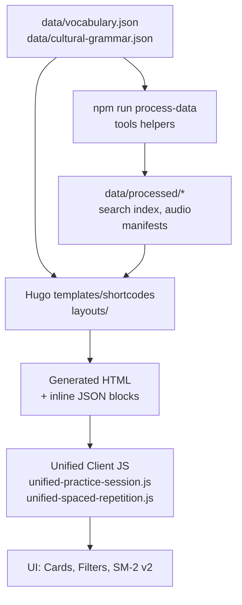

# Development Guide

This document summarizes the day-to-day workflow for the Bulgarian–German Learning App. The stack is Hugo Extended + vanilla ES modules + SCSS with light Go tooling.

## Prerequisites

- Hugo Extended **v0.128.0+**
- Go **v1.21+** (for building helpers in `tools/`)
- Node.js **v18+** (for npm scripts / optional tooling)
- Git

## Local Setup

1. Clone the repository.
2. Install the prerequisites above.
3. Install npm dependencies (optional but convenient):

    ```bash
    npm install
    ```

4. Start the Hugo server with drafts + future content:

    ```bash
    hugo server -D --logLevel=debug
    # or
    npm run dev
    ```

5. Visit `http://localhost:1313/` to preview the site.

## Project Structure Snapshot

```text
├── assets/            # SCSS + JS source (ES modules)
│   ├── scss/          # Component-driven SCSS
│   ├── js/            # Unified ES modules (v2.0)
│   │   ├── modules/   # Specialized modules
│   │   └── unified-*.js # Core unified modules
├── content/           # Hugo content pages / sections
├── data/              # JSON sources - consolidated
│   ├── vocabulary.json # Single vocabulary database
│   ├── cultural-grammar.json # Grammar rules
│   └── archive-data-cleanup/ # Legacy files (archived)
├── docs/              # Streamlined documentation
│   ├── archive-docs-cleanup/ # Historical reports (archived)
│   └── *.md          # Current essential docs
├── layouts/           # Hugo templates, partials, shortcodes
├── static/            # Manifest, service worker, static assets
├── tools/             # Go helper utilities (built on demand)
└── CLAUDE.md          # Claude Code guidance
```

## Common Commands

```bash
# Dev server with live reload (drafts + future)
hugo server -D --logLevel=debug

# Production build with GC + minify
npm run build          # wraps `hugo --gc --minify`

# Build Go helper binary (writes ./hugo-bg-de)
npm run build-tools

# Regenerate derived JSON/Search data
npm run process-data
```

### Data & Helper Tooling

- **`npm run process-data`** – Executes the Go helper under `tools/` to regenerate derived JSON (search index, pronunciation metadata). Rerun whenever `data/vocabulary.json` or `data/grammar.json` changes to keep the generated artifacts in sync.
- **`npm run build-tools`** – Compiles the Go binary to `bin/hugo-bg-de`. This command is idempotent; use it after updating sources in `tools/` or when setting up a fresh environment.
- **Manual helper invocation** – From `tools/`, run `go run ./cmd/process-data` to debug data transforms without triggering the full npm script. Ensure Go 1.21+ is installed.

## Asset Pipeline

- SCSS is compiled via `css.Sass | resources.Minify | resources.Fingerprint` in `layouts/_default/baseof.html`.
- JavaScript uses unified ES modules (v2.0) in `assets/js/` - no bundler needed; Hugo fingerprints the compiled output.
- Single vocabulary database (`data/vocabulary.json`) feeds Hugo templates and client-side scripts for better performance.

## Testing & QA

- **Hugo**: `hugo server -D --logLevel=debug` must start cleanly with no console errors.
- **JavaScript syntax**: run `npm run lint:esm` (wraps the offline ES module parser) before shipping JS changes.
- **Accessibility**: confirm keyboard support (space/enter to flip cards, digits 0–5 for grading) and screen-reader announcements.
- **Responsive layout**: verify UI at ~360 px width and desktop.
- **PWA**: ensure service worker install, update flow, and offline shell still behave after asset changes.
- **Go utilities**: run `GOCACHE=$(pwd)/.gocache go test ./tools/...` from the repo root to exercise the helper module.

## Recent Refactoring (October 2025)

- **Code Consolidation**: Merged legacy `flashcards.js` and `spaced-repetition.js` into unified modules (`unified-practice-session.js`, `unified-spaced-repetition.js`) for better maintainability.
- **Data Cleanup**: Consolidated 24 vocabulary batch files into single `vocabulary.json` source, archived legacy files in `data/archive-data-cleanup/`.
- **Documentation Streamlining**: Moved 25 historical completion reports to `docs/archive-docs-cleanup/`, keeping only essential documentation active.
- **Performance Optimization**: Eliminated duplicate JS modules and fragmented data loading for faster builds and runtime performance.
- **Module Organization**: Established consistent structure with `assets/js/modules/` for specialized functionality and unified core modules.

## Troubleshooting

- **Hugo fails to compile SCSS** → confirm you are using Hugo Extended and check `assets/scss/_variables.scss` for typos.
- **JS import errors** → ensure the script tag uses `type="module"` (handled in templates) and paths are relative to `assets/` pipeline output.
- **LocalStorage quota errors** → spaced repetition engine logs warnings; clear `bgde:` keys in dev tools if needed.
- **Go test cache errors** → run `GOCACHE=$(pwd)/.gocache go test ./tools/...` to keep build artifacts inside the repo.

## Contribution Workflow

1. Create a feature branch from `main`.
2. Draft a plan in `docs/notes/TODAY.md` (goal, context, acceptance tests).
3. Make minimal, well-scoped changes following project constraints (Hugo + vanilla JS + SCSS only).
4. Validate locally (Hugo server, accessibility checks, targeted JS syntax check).
5. Document results in `docs/notes/TODAY.md` and update relevant docs if behavior changed.
6. Open a PR with summary, acceptance checklist, and visuals for UI tweaks.

## Reference Docs

- `README.md` – project overview and quick links.
- `docs/ARCHITECTURE.md` – high-level architecture (Hugo + client modules).
- `docs/TESTING.md` – detailed testing matrix.
- `docs/PROGRAMMING_LINKS.md` – external references for Hugo, Go, JS, accessibility.
- `AGENTS.md` – instructions for AI coding assistants.

Stay within the approved stack: Hugo Extended, Go tooling in `tools/`, vanilla JS ES modules, SCSS compiled by Hugo Pipes. No external JS frameworks or additional build tools.

## Service Worker Runbook

The app uses a minimal `static/sw.js` with cache versioning and safe strategies.

### Update

1. Bump `CACHE_NAME` (and `DATA_CACHE_NAME` if data strategy changes) in `static/sw.js`.
2. Keep the precache list small; prefer runtime caching with stale-while-revalidate.
3. Build and load the site locally, then open DevTools > Application > Service Workers.
4. Check "Update on reload" and reload to verify the new SW takes control.
5. Confirm the update toast/notice appears (if implemented) and that old caches are cleaned in logs.

### Rollback

1. Revert `static/sw.js` changes (including cache version) and redeploy.
2. In DevTools, unregister the service worker and clear site data.
3. Reload to ensure the previous, working SW is active.

### Offline Verification

1. With the site loaded once, toggle DevTools Network to "Offline".
2. Navigate to `/vocabulary/` and confirm cards render from inline JSON.
3. Verify offline fallback for pages: `/offline/` is served when a page isn't cached.

## Data Pipeline Diagram

The following diagram illustrates the flow from source JSON to UI:


