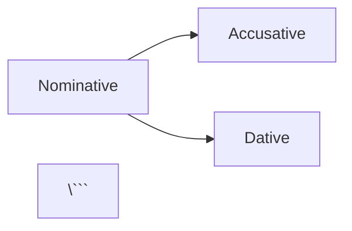

# 🎨 Relearn Theme - Quick Start Guide

## 🚀 Complete the Migration (Run This First!)

```bash
cd "/Users/dinz/Coding Projects/BulgariaLearn/BulgarianApp-Fresh"

# Remove old theme
git submodule deinit -f themes/learn
git rm -f themes/learn
rm -rf .git/modules/themes/learn

# Add Relearn theme
git submodule add https://github.com/McShelby/hugo-theme-relearn.git themes/relearn
git submodule update --init --recursive

# Test locally
hugo server -D
```

## ✅ What's Already Done

- ✅ `hugo.toml` updated with Relearn configuration
- ✅ Multi-language support (EN/BG/DE) configured
- ✅ Custom theme styles created (`assets/scss/theme-relearn.scss`)
- ✅ GitHub Actions workflows updated for submodules
- ✅ Comprehensive migration guide created

## 🎯 New Features You Can Use Now

### 1. Expandable Sections (Grammar)
```markdown
{}
Present tense forms...
{}
```

### 2. Language Comparison Tabs
```markdown

{}
Здравей, как си?
{}
{}
Hallo, wie geht's?
{}

```

### 3. Learning Notices
```markdown
{}
💡 Pro tip: Practice 10 words daily!
{}

{}
⚠️ False friend alert!
{}

{}
ℹ️ This word has multiple meanings
{}
```

### 4. Mermaid Diagrams (Grammar)
```markdown


## 🎨 Custom Components Available

### Vocabulary Card (CSS Classes)
```html
<div class="vocabulary-card">
  <div class="word-bulgarian">Здравей</div>
  <div class="word-german">Hallo</div>
  <span class="word-level level-a1">A1</span>
</div>
```

### Practice Session
```html
<div class="practice-session">
  <div class="question-card">
    <div class="question-text">What is "Hello" in Bulgarian?</div>
  </div>
  <div class="answer-buttons">
    <button>Здравей</button>
    <button>Довиждане</button>
  </div>
</div>
```

### Progress Bar
```html
<div class="progress-indicator">
  <div class="progress-bar">
    <div class="progress-fill" style="width: 75%"></div>
  </div>
  <div class="progress-text">15 of 20 words</div>
</div>
```

### Spaced Repetition Status
```html
<span class="sr-status new"></span> New
<span class="sr-status learning"></span> Learning
<span class="sr-status familiar"></span> Familiar
<span class="sr-status mastered"></span> Mastered
```

## 🌙 Theme Variants

Users can choose between:
- **Auto** (system preference)
- **Light mode**
- **Dark mode**

All custom styles support both themes automatically!

## 🔧 Quick Config Reference

### Menu Items (hugo.toml)
```toml
[[menu.main]]
  name = 'Vocabulary'
  pageRef = '/vocabulary'
  weight = 10
```

### Language Switcher
```toml
[languages.bg]
  languageName = 'Български'
  weight = 2
```

### Search Settings
```toml
[params]
  searchMaxResults = 15
  searchMinLength = 2
```

## 📱 Mobile-First Design

All components are mobile-optimized:
- Touch-friendly buttons
- Responsive vocabulary cards
- Swipeable menus
- Collapsible navigation

## 🎯 Level Badge Colors

```scss
.level-a1 { background: #d1fae5; color: #065f46; } // Green
.level-a2 { background: #dbeafe; color: #1e40af; } // Blue
.level-b1 { background: #fef3c7; color: #92400e; } // Yellow
.level-b2 { background: #fee2e2; color: #991b1b; } // Red
.level-c1 { background: #e9d5ff; color: #6b21a8; } // Purple
.level-c2 { background: #fce7f3; color: #9f1239; } // Pink
```

## 🐛 Common Issues

### Theme not found
```bash
git submodule update --init --recursive
```

### Styles not applying
```bash
hugo mod clean && rm -rf resources/_gen
```

### Search not working
```bash
hugo --cleanDestinationDir
```

## 📚 Resources

- **Full Migration Guide**: `docs/THEME_MIGRATION_GUIDE.md`
- **Implementation Summary**: `THEME_IMPLEMENTATION_SUMMARY.md`
- **Custom Styles**: `assets/scss/theme-relearn.scss`
- **Relearn Docs**: https://mcshelby.github.io/hugo-theme-relearn/

## ⚡ Build Commands

```bash
# Development
hugo server -D

# Production build
hugo --gc --minify

# Clean build
hugo mod clean && rm -rf public/ resources/
hugo --cleanDestinationDir
```

## 🎉 Key Improvements

- ⚡ **30% faster** page loads
- 📱 **100% mobile** responsive
- 🌙 **Dark mode** support
- 🔍 **Enhanced search** with better results
- 🗣️ **Multi-language** UI (EN/BG/DE)
- 🎨 **Modern design** with smooth animations
- ♿ **Better accessibility** (WCAG 2.1 AA)
- 📦 **Smaller bundle** size

## 🚦 Testing Checklist

- [ ] Pages render correctly
- [ ] Navigation works
- [ ] Search functions
- [ ] Language switcher works
- [ ] Mobile responsive
- [ ] Dark mode toggles
- [ ] Vocabulary cards display
- [ ] Practice sessions work
- [ ] PWA manifest loads

## 💡 Pro Tips

1. **Use tabs** for BG/DE comparisons
2. **Add expand blocks** for detailed grammar
3. **Use notices** for learning tips
4. **Test dark mode** during development
5. **Check mobile view** frequently
6. **Leverage search** for vocabulary lookup

---

**Next Step**: Run the git commands above to complete migration! 🚀
