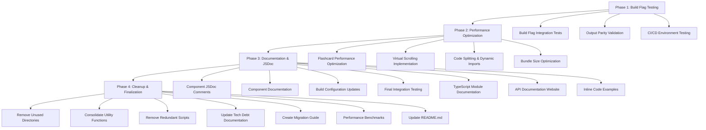

# Final SvelteKit Migration Plan

## 📊 Current Status: 84.6% Complete

### ✅ Completed (62 tasks)
- Comprehensive testing infrastructure (3,480+ lines of test code)
- All core SvelteKit components implemented
- Build flag system infrastructure
- TypeScript migration complete
- Accessibility and performance testing

### 🔄 In Progress (1 task)
- Build flag switching testing

### 📋 Remaining Tasks (22 tasks)

## 🎯 Priority Phases

### Phase 1: Build Flag Testing & Validation (Tasks 64-66)
**Focus**: Ensure reliable Hugo/SvelteKit switching

#### Task 64: Create comprehensive build flag integration tests
- **Outcome**: Test suite validating build flag functionality
- **Files**: `tests/build-flag/build-flag.spec.ts`
- **Dependencies**: Existing build flag system
- **Estimated Time**: 3 hours

#### Task 65: Validate Hugo and SvelteKit build outputs are equivalent
- **Outcome**: Parity testing between Hugo and SvelteKit outputs
- **Files**: `tests/build-flag/output-parity.spec.ts`
- **Dependencies**: Build flag tests
- **Estimated Time**: 4 hours

#### Task 66: Test build flag switching in CI/CD environment
- **Outcome**: CI/CD pipeline validation
- **Files**: `.github/workflows/build-flag-test.yml`
- **Dependencies**: Output parity tests
- **Estimated Time**: 2 hours

---

### Phase 2: Performance Optimization (Tasks 67-70)
**Focus**: Optimize flashcard components and overall performance

#### Task 67: Performance optimize flashcard components with lazy loading
- **Outcome**: Optimized flashcard rendering and interaction
- **Files**: `src/components/Flashcard.svelte`, `src/lib/utils/performance.ts`
- **Dependencies**: Existing components
- **Estimated Time**: 6 hours

#### Task 68: Implement virtual scrolling for large vocabulary sets
- **Outcome**: Efficient handling of large vocabulary lists
- **Files**: `src/components/VirtualList.svelte`, `src/lib/utils/virtual-scrolling.ts`
- **Dependencies**: Performance optimization
- **Estimated Time**: 5 hours

#### Task 69: Add code splitting and dynamic imports for better performance
- **Outcome**: Reduced initial bundle size
- **Files**: `src/lib/utils/lazy-loading.ts`, updated component imports
- **Dependencies**: Virtual scrolling
- **Estimated Time**: 4 hours

#### Task 70: Optimize bundle sizes and loading performance
- **Outcome**: Optimized build configuration and assets
- **Files**: `vite.config.ts`, `svelte.config.js`, build optimizations
- **Dependencies**: Code splitting
- **Estimated Time**: 3 hours

---

### Phase 3: Documentation & JSDoc (Tasks 71-77)
**Focus**: Comprehensive documentation and API reference

#### Task 71: Add comprehensive JSDoc comments to all Svelte components
- **Outcome**: Complete component documentation
- **Files**: All `src/components/*.svelte` files
- **Dependencies**: Performance optimization
- **Estimated Time**: 8 hours

#### Task 72: Create component documentation and usage examples
- **Outcome**: Interactive component documentation
- **Files**: `docs/components/`, usage examples
- **Dependencies**: JSDoc comments
- **Estimated Time**: 6 hours

#### Task 73: Update build configuration to include SvelteKit components
- **Outcome**: Unified build system
- **Files**: `package.json`, build scripts
- **Dependencies**: Component documentation
- **Estimated Time**: 2 hours

#### Task 74: Final integration testing and validation
- **Outcome**: End-to-end system validation
- **Files**: `tests/integration/final-validation.spec.ts`
- **Dependencies**: Build configuration
- **Estimated Time**: 4 hours

#### Task 75: Generate comprehensive JSDoc documentation for all TypeScript modules
- **Outcome**: Complete API documentation
- **Files**: TypeDoc configuration, documentation output
- **Dependencies**: Integration testing
- **Estimated Time**: 5 hours

#### Task 76: Create API documentation website with TypeDoc integration
- **Outcome**: Interactive API documentation site
- **Files**: `docs/api/`, TypeDoc configuration
- **Dependencies**: JSDoc documentation
- **Estimated Time**: 4 hours

#### Task 77: Add inline code examples for all public APIs
- **Outcome**: Complete API usage examples
- **Files**: Documentation files, code examples
- **Dependencies**: API documentation website
- **Estimated Time**: 3 hours

---

### Phase 4: Cleanup & Finalization (Tasks 78-84)
**Focus**: Code cleanup, consolidation, and final documentation

#### Task 78: Remove unused directories
- **Outcome**: Clean project structure
- **Files**: Remove `.windsurf`, `.claude`, `.codacy`, `.gocache`, `.roocode`, `.playwright-mcp`
- **Dependencies**: API documentation
- **Estimated Time**: 1 hour

#### Task 79: Consolidate duplicate utility functions across modules
- **Outcome**: Unified utility library
- **Files**: `src/lib/utils/`, remove duplicates
- **Dependencies**: Directory cleanup
- **Estimated Time**: 3 hours

#### Task 80: Remove redundant scripts and configuration files
- **Outcome**: Streamlined build configuration
- **Files**: Various config files
- **Dependencies**: Utility consolidation
- **Estimated Time**: 2 hours

#### Task 81: Update docs/TECH_DEBT.md with detailed implementation notes
- **Outcome**: Complete technical debt documentation
- **Files**: `docs/TECH_DEBT.md`
- **Dependencies**: Cleanup completion
- **Estimated Time**: 4 hours

#### Task 82: Create comprehensive migration guide in docs/MIGRATION_TO_SVELTEKIT.md
- **Outcome**: Complete migration documentation
- **Files**: `docs/MIGRATION_TO_SVELTEKIT.md`
- **Dependencies**: Tech debt documentation
- **Estimated Time**: 6 hours

#### Task 83: Add performance benchmarks and migration blockers documentation
- **Outcome**: Performance analysis documentation
- **Files**: `docs/PERFORMANCE.md`
- **Dependencies**: Migration guide
- **Estimated Time**: 3 hours

#### Task 84: Update README.md with concise project overview and all badges
- **Outcome**: Updated project README
- **Files**: `README.md`
- **Dependencies**: Performance documentation
- **Estimated Time**: 2 hours

---

## 🚀 Implementation Strategy

### Mermaid Workflow Diagram

### Key Dependencies

1. **Build Flag Testing** must be completed before performance optimization
2. **Performance Optimization** should be completed before documentation
3. **Documentation** builds on optimized components
4. **Cleanup** happens after all functionality is complete

### Risk Mitigation

- **Build Flag Issues**: Maintain Hugo as fallback during testing
- **Performance Regression**: Use existing test suite to validate optimizations
- **Documentation Drift**: Auto-generate documentation from JSDoc comments
- **Cleanup Errors**: Version control allows rollback if needed

### Success Criteria

- ✅ Build flag switching works reliably in all environments
- ✅ Performance meets or exceeds current Hugo benchmarks
- ✅ All components have comprehensive documentation
- ✅ Project structure is clean and maintainable
- ✅ Migration is fully documented and reproducible

---

## 📈 Timeline Estimation

- **Phase 1**: 9 hours (Build Flag Testing)
- **Phase 2**: 18 hours (Performance Optimization)
- **Phase 3**: 35 hours (Documentation & JSDoc)
- **Phase 4**: 21 hours (Cleanup & Finalization)

**Total Estimated Time**: 83 hours

### Recommended Sprints

- **Sprint 1** (Week 1): Phase 1 + Phase 2 Part 1
- **Sprint 2** (Week 2): Phase 2 Part 2 + Phase 3 Part 1
- **Sprint 3** (Week 3): Phase 3 Part 2 + Phase 4

---

## 🎯 Next Steps

1. **Immediate**: Start with build flag integration tests (Task 64)
2. **Priority Focus**: Ensure build flag reliability before performance work
3. **Quality Gates**: Maintain test coverage throughout optimization
4. **Documentation**: Generate docs as features are implemented
5. **Final Validation**: Complete end-to-end testing before cleanup

This plan ensures a systematic approach to completing the SvelteKit migration while maintaining the high quality standards already established in the project.