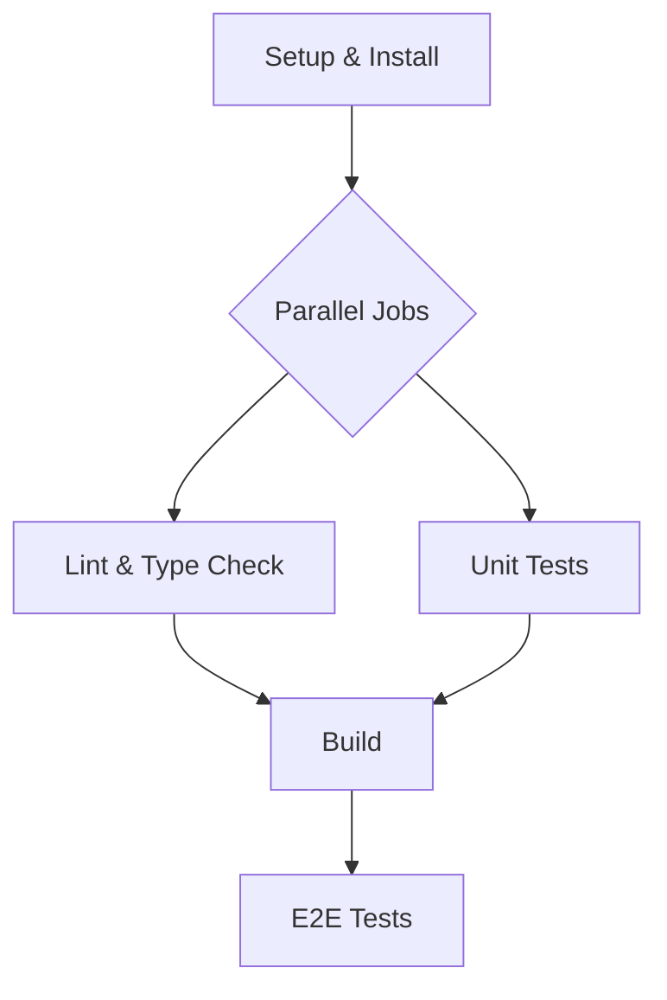

# CI/CD Workflow Architecture

## 🎯 Overview
This document defines the Continuous Integration and Deployment (CI/CD) workflow for the Bulgarian-German Learning App. It aims to ensure code quality, prevent regressions, and streamline the release process through a unified local and remote testing strategy.

---

## 🏗️ Architecture

The workflow is designed to be **symmetrical**, meaning the local simulation and the remote GitHub Actions pipeline run the same core steps. This ensures that "it works on my machine" translates to "it works in CI."

### **1. Workflow Stages**
1.  **Dependencies**: Installation and validation of dependencies.
2.  **Lint & Static Analysis**: Code style, linting, and type checking.
3.  **Unit Testing**: Fast, isolated tests for logic and components.
4.  **Build**: Production build verification.
5.  **Integration/E2E Testing**: Comprehensive end-to-end tests (limited coverage in local simulation for speed, full coverage in CI).

### **2. Execution Environments**

| Environment | Tool | Scope | Trigger |
| :--- | :--- | :--- | :--- |
| **Local** | `pnpm run simulate-ci` | Full Suite (Modular) | Manual (Pre-push) |
| **Remote** | GitHub Actions | Full Suite | Push to `main`/`develop`, PRs |

---

## 🛠️ Modular CI Pipeline Design

The CI simulation script (`scripts/simulate-ci.js`) is being evolved into a modular runner. This allows developers to run specific parts of the pipeline or the entire suite.

### **Planned Modules**

*   **`core`**: Installs dependencies (`pnpm install --frozen-lockfile`).
*   **`static`**: Runs linting and type checking (`lint`, `check`).
*   **`unit`**: Runs unit tests (`test:unit`).
*   **`build`**: Runs the build process (`build`).
*   **`e2e`**: Runs end-to-end tests (`test:e2e`, `test:components`).

### **Usage Examples (Future State)**
```bash
# Run everything
pnpm run simulate-ci

# Run only static analysis (lint + types)
pnpm run simulate-ci --only static

# Run tests and build
pnpm run simulate-ci --skip static
```

---

## 🤖 GitHub Actions Integration

The remote pipeline mirrors the local steps but adds caching, parallel execution, and artifact management.

### **Workflow Configuration**
*   **Runner**: `ubuntu-latest`
*   **Node.js**: 20.x
*   **Package Manager**: `pnpm` (latest)

### **Job Structure**


### **Architectural Constraints & Known Issues**
*   **DataLoader Dynamic Imports**: Some E2E tests involving `DataLoader` fail because dynamic imports (`import('./vocabulary.json')`) cannot be easily mocked in the current Playwright setup.
    *   *Mitigation*: The CI pipeline acknowledges this constraint. Failing tests related to this specific issue are tracked but do not block the pipeline if the success rate meets the threshold (75%).
    *   *Long-term Fix*: Refactor `DataLoader` to use dependency injection or standard fetch requests that can be intercepted.

---

## 📊 Error Handling & Reporting

### **1. Local Simulation**
*   **Console Output**: clear, color-coded steps with pass/fail status.
*   **JSON Report**: `ci-simulation-results.json` containing detailed execution data (timestamps, duration, error messages).
*   **Exit Codes**: Non-zero exit code on failure to prevent chaining commands.

### **2. GitHub Actions**
*   **Annotations**: GitHub annotations for linting and type errors.
*   **Test Reports**: JUnit XML or HTML reports uploaded as artifacts.
*   **Step Summaries**: Markdown summaries of test results attached to the job run.

---

## 📈 Monitoring Strategy

*   **Success Rate**: Track pass/fail ratio of `main` branch builds.
*   **Duration**: Monitor the time taken for the critical path (Install -> Build).
*   **Flakiness**: Identify tests that fail intermittently without code changes.

---

## 🔗 References
*   [CI Best Practices](../development/CI_BEST_PRACTICES.md)
*   [CI Improvement Roadmap](../roadmap/CI_IMPROVEMENT_PLAN.md)
*   [Playwright Configuration](../../playwright.config.ts)
*   [Vitest Configuration](../../vite.config.ts)