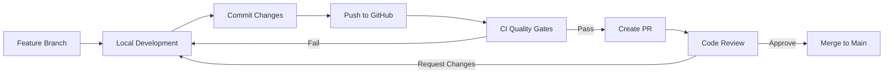
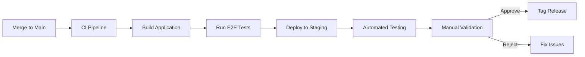
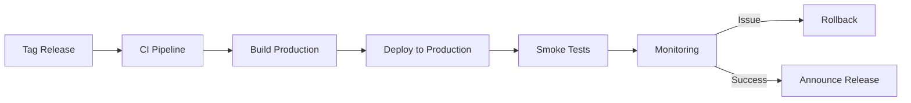

# Deployment Strategy & Workflow

## 🚀 Overview

This document outlines the comprehensive deployment strategy for the Bulgarian-German Learning App. It defines environments, workflows, best practices, and operational procedures to ensure reliable, secure, and scalable deployments.

---

## 🌍 Environments

### 1. Development Environment
- **Purpose**: Local development and feature implementation
- **Trigger**: Manual (developer initiated)
- **Branch**: Feature branches (`feature/*`, `bugfix/*`, `refactor/*`)
- **CI Pipeline**: Quality gates only (linting, unit tests)
- **Deployment**: Local development server (`pnpm dev`)

### 2. Staging Environment
- **Purpose**: Pre-production testing and validation
- **Trigger**: Automatic on merge to `main` branch
- **Branch**: `main`
- **CI Pipeline**: Full CI pipeline + staging deployment
- **Deployment**: GitHub Pages (staging subdomain)
- **URL**: https://staging.bulgarianapp.com (example)

### 3. Production Environment
- **Purpose**: Public-facing application
- **Trigger**: Manual approval from staging
- **Branch**: Git tags (`v*.*.*`)
- **CI Pipeline**: Full CI pipeline + production deployment
- **Deployment**: GitHub Pages
- **URL**: https://bulgarianapp.com

---

## 🔄 Deployment Workflow

### 1. Feature Development Workflow


### 2. Staging Deployment Workflow


### 3. Production Deployment Workflow


---

## 🛠️ Deployment Configuration

### GitHub Pages Setup
The application uses `@sveltejs/adapter-static` for static site generation:

```javascript
// svelte.config.js
import adapter from '@sveltejs/adapter-static';
import { vitePreprocess } from '@sveltejs/vite-plugin-svelte';

export default {
  preprocess: vitePreprocess(),
  kit: {
    adapter: adapter({
      // Options for static adapter
      pages: 'build',
      assets: 'build',
      fallback: 'index.html',
      precompress: false,
      strict: true
    }),
    // Base path for GitHub Pages
    paths: {
      base: process.env.NODE_ENV === 'production' ? '/repo-name' : ''
    }
  }
};
```

### Environment Variables
| Variable | Development | Staging | Production | Description |
|----------|-------------|---------|------------|-------------|
| `NODE_ENV` | development | staging | production | Node environment |
| `BASE_PATH` | (empty) | /staging | / | Base path for assets |
| `API_URL` | http://localhost:5173 | https://staging.api.bulgarianapp.com | https://api.bulgarianapp.com | API endpoint |
| `SENTRY_DSN` | (empty) | staging-dsn | production-dsn | Error tracking |

---

## 📦 Deployment Artifacts

### Build Output
The production build generates the following artifacts:
- **Static Files**: HTML, CSS, JavaScript
- **Assets**: Images, fonts, media files
- **Manifest**: `build/manifest.json`
- **Service Worker**: `build/sw.js` (if applicable)

### Artifact Management
- **Storage**: GitHub Pages (built-in)
- **Retention**: 30 days for rollback capability
- **Versioning**: Semantic versioning with Git tags

---

## 🔐 Security & Compliance

### Deployment Security
- **Branch Protection**: Main branch requires pull requests and approvals
- **CODEOWNERS**: Critical paths require review from designated owners
- **Secrets Management**: Environment variables stored in GitHub Secrets
- **Dependency Scanning**: Automated vulnerability scanning in CI

### Compliance Requirements
- **Accessibility**: WCAG 2.1 AA compliance verified in CI
- **Data Protection**: GDPR compliance for user data
- **Audit Logging**: Deployment history maintained in GitHub

---

## 🚦 Quality Gates

### Pre-Deployment Checks
| Gate | Environment | Description | Enforcement |
|------|-------------|-------------|-------------|
| Linting | All | ESLint validation | Hard fail |
| Type Checking | All | TypeScript and Svelte checks | Hard fail |
| Unit Tests | All | Vitest unit tests | Hard fail (100% pass) |
| Build Success | All | Production build | Hard fail |
| E2E Tests | Staging, Production | Playwright E2E tests | Hard fail (90% pass) |
| Accessibility | Staging, Production | WCAG compliance | Hard fail |
| Dependency Scan | Staging, Production | Vulnerability scanning | Hard fail (no critical) |

### Post-Deployment Verification
- **Smoke Tests**: Basic functionality verification
- **Health Checks**: Endpoint availability monitoring
- **Performance Metrics**: Lighthouse scores
- **Error Monitoring**: Sentry error tracking

---

## 🔄 Rollback Procedure

### Automated Rollback
1. **Trigger**: Deployment failure or critical post-deployment issue
2. **Action**: GitHub Actions workflow automatically deploys previous stable version
3. **Verification**: Smoke tests and health checks

### Manual Rollback
```bash
# Revert to previous commit
git checkout main
git revert HEAD --no-edit
git push origin main

# Or deploy specific tag
git checkout v1.2.3
git tag -f production
git push origin production --force
```

### Rollback Verification
- **Smoke Tests**: Basic functionality verification
- **Monitoring**: Error rate and performance metrics
- **User Feedback**: Manual validation by QA team

---

## 📊 Monitoring & Observability

### Deployment Monitoring
- **GitHub Actions**: Workflow execution and logs
- **Sentry**: Error tracking and performance monitoring
- **Lighthouse**: Performance and accessibility metrics
- **Custom Dashboard**: Deployment health and metrics

### Key Metrics
| Metric | Target | Measurement |
|--------|--------|-------------|
| Deployment Success Rate | 100% | GitHub Actions |
| Build Time | < 5 minutes | CI pipeline |
| Error Rate | < 0.1% | Sentry |
| Performance Score | > 90 | Lighthouse |
| Uptime | 99.9% | Monitoring service |

---

## 🔧 Operational Procedures

### Regular Maintenance
- **Dependency Updates**: Weekly dependency scanning and updates
- **Security Patches**: Immediate application of critical security updates
- **Performance Optimization**: Quarterly performance review

### Incident Response
1. **Detection**: Monitoring alerts or user reports
2. **Triage**: Identify root cause and impact
3. **Mitigation**: Apply temporary fix or rollback
4. **Resolution**: Implement permanent fix
5. **Post-Mortem**: Document incident and preventive measures

### Disaster Recovery
- **Backup**: Daily backups of critical data
- **Recovery Time Objective (RTO)**: < 1 hour
- **Recovery Point Objective (RPO)**: < 15 minutes
- **Testing**: Quarterly disaster recovery drills

---

## 🚀 Release Management

### Versioning Strategy
- **Semantic Versioning**: `MAJOR.MINOR.PATCH`
- **Release Types**:
  - **Major**: Breaking changes
  - **Minor**: New features, backward-compatible
  - **Patch**: Bug fixes, backward-compatible

### Release Process
1. **Feature Complete**: All planned features implemented
2. **Testing**: Full test suite execution
3. **Documentation**: Update changelog and release notes
4. **Tagging**: Create Git tag with version number
5. **Deployment**: Deploy to production
6. **Announcement**: Notify stakeholders

### Changelog Management
- **Automated**: Generated from commit messages
- **Format**: Keep a Changelog (https://keepachangelog.com)
- **Location**: `CHANGELOG.md` in project root

---

## 📈 Scaling Strategy

### Current Architecture
- **Hosting**: GitHub Pages (static hosting)
- **CDN**: GitHub's global CDN
- **Scalability**: Automatic scaling based on demand

### Future Scaling Options
1. **Containerization**: Docker for consistent environments
2. **Orchestration**: Kubernetes for container management
3. **Multi-Region**: Deploy to multiple geographic regions
4. **Serverless**: Consider serverless architecture for API components
5. **Database**: Add persistent storage for user data

### Performance Optimization
- **Code Splitting**: Optimize bundle size
- **Lazy Loading**: Load components on demand
- **Caching**: Implement service worker for offline support
- **Image Optimization**: Use modern image formats and compression

---

## 🛡️ Best Practices

### Git Workflow
- **Branching Strategy**: GitHub Flow (feature branches + main)
- **Commit Messages**: Conventional Commits (https://www.conventionalcommits.org)
- **Pull Requests**: Small, focused changes with clear descriptions
- **Code Reviews**: Mandatory for all changes to main branch

### Deployment Practices
- **Blue-Green**: Zero-downtime deployments
- **Canary**: Gradual rollout of new features
- **Feature Flags**: Enable/disable features without deployment
- **Immutable Deployments**: No changes to running instances

### Documentation
- **Runbooks**: Step-by-step operational procedures
- **Architecture Decisions**: Document key architectural choices
- **Post-Mortems**: Document incidents and lessons learned

---

## 📅 Maintenance Schedule

| Task | Frequency | Owner |
|------|-----------|-------|
| Dependency Updates | Weekly | CI Pipeline |
| Security Scanning | Weekly | CI Pipeline |
| Performance Review | Quarterly | Development Team |
| Disaster Recovery Drill | Quarterly | Operations Team |
| Documentation Review | Monthly | Documentation Team |
| CI Pipeline Optimization | Monthly | DevOps Team |

---

## 📚 Related Documentation

- [CI Quality Gates](CI_QUALITY_GATES.md)
- [CI Workflow Design](CI_WORKFLOW_DESIGN.md)
- [Phase 6 CI/CD Deployment](PHASE_6_CICD_DEPLOYMENT.md)
- [Architecture Decision Records](../architecture/ARCHITECTURE.md)
- [Testing Strategy](../development/TESTING.md)

---

## 🔄 Change Log

| Date | Author | Change |
|------|--------|--------|
| 2025-12-09 | Roo | Initial version |
| YYYY-MM-DD | Name | Description of change |

---

## 📋 Checklist

### Pre-Deployment Checklist
- [ ] All CI quality gates pass
- [ ] Code review completed and approved
- [ ] Changelog updated
- [ ] Release notes prepared
- [ ] Environment variables configured
- [ ] Rollback procedure tested
- [ ] Monitoring in place
- [ ] Stakeholders notified

### Post-Deployment Checklist
- [ ] Smoke tests pass
- [ ] Health checks successful
- [ ] Performance metrics within targets
- [ ] Error monitoring shows no critical issues
- [ ] User feedback collected
- [ ] Documentation updated
- [ ] Post-mortem conducted (if applicable)

---

## 🆘 Troubleshooting

### Common Deployment Issues

**Issue: Build fails in CI but works locally**
- **Solution**: Check environment differences (Node version, dependencies)
- **Debugging**: Compare CI logs with local build output
- **Prevention**: Use consistent environments with Docker

**Issue: Deployment succeeds but application doesn't load**
- **Solution**: Check base path configuration in `svelte.config.js`
- **Debugging**: Inspect browser console for 404 errors
- **Prevention**: Test staging deployment before production

**Issue: E2E tests fail in CI but pass locally**
- **Solution**: Check for timing issues or environment-specific behavior
- **Debugging**: Download test artifacts and review screenshots
- **Prevention**: Use consistent test environments

**Issue: Dependency vulnerabilities detected**
- **Solution**: Update vulnerable dependencies
- **Debugging**: Run `pnpm audit` locally
- **Prevention**: Regular dependency scanning

**Issue: Performance regression in production**
- **Solution**: Compare Lighthouse scores with previous deployment
- **Debugging**: Profile application with Chrome DevTools
- **Prevention**: Performance budget in CI

---

## 🎯 Success Metrics

1. **Deployment Success Rate**: 100% of planned deployments complete successfully
2. **Deployment Frequency**: At least 1 deployment per week
3. **Mean Time to Recovery (MTTR)**: < 30 minutes for critical issues
4. **Change Failure Rate**: < 5% of deployments require rollback
5. **Lead Time for Changes**: < 1 day from commit to production
6. **Availability**: 99.9% uptime
7. **Performance**: Lighthouse score > 90 for all metrics

---

This comprehensive deployment strategy provides a solid foundation for reliable, secure, and scalable deployments while allowing for future growth and complexity as the application evolves.