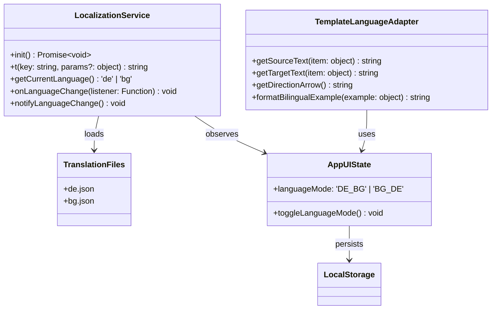
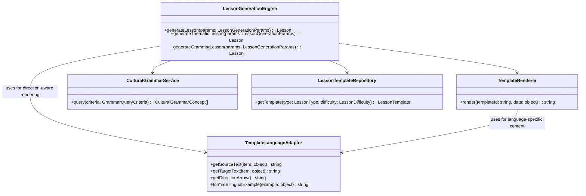

# Bulgarian-German Learning App: Design Concept & Strategy

## 1. Executive Summary
We are evolving the application from a simple vocabulary trainer into a "Rich Context" learning platform. The core philosophy is **Contextual Intelligence**—words are never learned in isolation but tied to emotion, grammar, and nuance. We will leverage Svelte 5's reactivity to create a fluid, gamified experience with comprehensive bilingual support.

## 2. Information Quality: The "Rich Context" Data Model
We will extend the existing `VocabularyItem` interface to support deeper learning and bilingual functionality.

### New Interface Structure (Draft)
```typescript
interface RichVocabularyItem extends VocabularyItem {
  // Core Meaning
  contextual_nuance?: {
    de?: string;  // German contextual nuance
    bg?: string;  // Bulgarian contextual nuance
  };
  mnemonics?: {
    de?: string;  // German mnemonic
    bg?: string;  // Bulgarian mnemonic
  };

  // Visual & Audio
  emoji?: string;             // ⚡️ Visual anchor
  image_url?: string;         // Unsplash/local image for immersion
  audio_url?: {
    de?: string;  // German pronunciation audio
    bg?: string;  // Bulgarian pronunciation audio
  };

  // Grammar Deep-Dive
  grammar_details?: {
    verb_aspect?: 'perfective' | 'imperfective';
    verb_partner_id?: string; // ID of the aspectual pair
    noun_gender?: 'masculine' | 'feminine' | 'neuter';
    plural_form?: {
      de?: string;  // German plural form
      bg?: string;  // Bulgarian plural form
    };
  };

  // Gamification Data
  xp_value?: number;          // Default: 10, Hard words: 20
}
```

## 3. UX/UI & Interaction Design
The interface will shift from a "List View" to a "Card-First" experience with comprehensive bilingual support.

### Gamified Learning Flow
1.  **The Stage**: A focused, distraction-free center card with language direction indicator.
2.  **Interaction**:
    -   **Flip Animation**: 3D CSS transform for "revealing" answers in the target language.
    -   **Micro-interactions**:
        -   *Success*: Green border glow + subtle scale up with language-specific feedback.
        -   *Fail*: Shake animation + red tint with correct answer in target language.
        -   *Streak*: Fire emoji counter animating on increment with bilingual streak counter.
3.  **Progress System**:
    -   **XP Bar**: Top of screen, tweened using `svelte/motion` with bilingual labels.
    -   **Daily Goals**: Visual ring chart for daily word targets with language-specific labels.
    -   **Language Toggle**: Prominent language toggle button for instant language switching.

### Bilingual UI Design Principles
- **Language Consistency**: All UI elements adapt to the selected language
- **Direction Awareness**: Content adapts to language direction (DE→BG or BG→DE)
- **Cultural Sensitivity**: Design elements respect cultural differences
- **Visual Language Indicators**: Clear visual indicators of current language and direction

### Accessibility & Styling
-   **Palette**: High contrast text on off-white backgrounds (e.g., `bg-slate-50`) with WCAG 2.1 AA compliance
-   **Typography**: Large, readable fonts (Inter/Roboto) with distinct weights for Bulgarian vs German text
-   **Touch**: Minimum 44x44px touch targets for mobile with language-aware spacing
-   **Keyboard Navigation**: Full keyboard support for all interactive elements in both languages
-   **ARIA Attributes**: Comprehensive ARIA attributes with language-specific labels
-   **Focus Management**: Proper focus management for dynamic content and language changes
-   **Live Regions**: `aria-live` regions for dynamic feedback and loading states with language awareness
-   **Language Attributes**: Proper `lang` attributes for screen reader support

### Type Safety & Localization Architecture
-   **Zod Schemas**: All runtime data validated with Zod schemas including translation validation
-   **TypeScript Strict Mode**: No `any` types in critical paths, especially localization
-   **LocalStorage Validation**: Runtime validation for all LocalStorage operations including language preferences
-   **Type Guards**: Comprehensive type guards for JSON parsing and translation data
-   **Union Types**: Standardized to single types where possible, with language-specific types
-   **Translation Validation**: Schema validation for translation files
-   **Fallback Mechanism**: Graceful fallback for missing translations

## 4. Technical Strategy

### Localization Architecture
The application implements a comprehensive localization system with the following key components:



### Libraries & Tools
-   **State Management**: Fully embrace Svelte 5 Runes (`$state`, `$derived`) for a global `LearningSession` store with language state.
-   **UI Components**: Continue using `bits-ui` for accessible primitives (dialogs, toggles) if needed, but build core Flashcards with pure Tailwind + Svelte.
-   **Animations**: Use `svelte/transition` (fly, fade) and `svelte/motion` (tweened, spring) for fluid state changes, including language transitions.
-   **Icons**: `lucide-svelte` for consistent UI iconography with language-aware labels.
-   **Localization**: Custom `LocalizationService` for dynamic translation management.

### Refactoring Plan
1.  **Data**: Migrate `vocabulary-unified.json` to include new fields with bilingual support (gradually).
2.  **Components**: Break `TandemPractice.svelte` into smaller, composed units with localization support:
    -   `FlashCard.svelte` (Presentational with bilingual content)
    -   `QuizControls.svelte` (Buttons with localized labels)
    -   `ProgressBar.svelte` (Visual with bilingual labels)
    -   `SessionManager.svelte.ts` (Logic/State with language management)
    -   `LanguageToggle.svelte` (Language switching component)

## 5. Dynamic Lesson Generation System

### Contextual Intelligence in Lesson Generation
The dynamic lesson generation system extends the "Rich Context" philosophy by creating personalized learning experiences that adapt to user needs, proficiency levels, learning patterns, and **language direction**.

### System Architecture Overview


### Key Design Principles

1. **Personalization Algorithm**
   - Adapts lesson difficulty based on user proficiency
   - Integrates spaced repetition for optimal learning
   - Prioritizes vocabulary items needing review
   - **Language Direction Awareness**: Adapts content based on DE→BG or BG→DE direction

2. **Contextual Content Generation**
   - Creates lessons around themes and categories
   - Incorporates cultural-grammar comparisons
   - Generates learning objectives dynamically
   - **Bilingual Context**: Provides context in both source and target languages

3. **Template-Based Rendering**
   - Uses flexible template system for lesson content
   - Supports multiple lesson types (vocabulary, grammar, mixed)
   - Enables easy customization and extension
   - **Direction-Aware Templates**: Templates adapt to language direction

### Template System Design with Bilingual Support
The template system uses a declarative approach with support for:
- **Variables**: Dynamic content placeholders with language awareness
- **Conditionals**: Context-aware content inclusion based on language
- **Loops**: Iteration over vocabulary items with direction-aware rendering
- **Partials**: Reusable content blocks with language-specific variants
- **Language Directives**: Special directives for bilingual content

Example template structure with bilingual support:
```json
{
  "id": "vocabulary_intro_template",
  "type": "vocabulary",
  "difficultyRange": ["A1", "C1"],
  "template": "
## {{sectionTitle}}

{{#if languageDirection === 'DE_BG'}}
This section introduces {{count}} {{theme}} vocabulary items for German → Bulgarian learning.
{{else}}
Този раздел представя {{count}} {{theme}} думи за учене от български на немски.
{{/if}}

{{#each vocabulary}}
### {{sourceText}} {{directionArrow}} {{targetText}}
- **Part of Speech**: {{partOfSpeech}}
{{#if metadata.gender}}
- **Gender**: {{metadata.gender}}
{{/if}}
- **Example**:
  {{formatBilingualExample example}}
{{/each}}
  ",
  "variables": [
    {"name": "sectionTitle", "type": "string", "required": true},
    {"name": "vocabulary", "type": "array", "required": true},
    {"name": "languageDirection", "type": "string", "default": "DE_BG"},
    {"name": "directionArrow", "type": "string", "default": "→"}
  ]
}
```

### Adaptive Learning Algorithm
The system implements a spaced repetition algorithm that:
- Calculates priority scores for vocabulary items
- Adjusts review frequency based on learning phase
- Considers user proficiency and review history
- Prioritizes items not reviewed recently

### Adaptive Learning Algorithm with Bilingual Support
The system implements a spaced repetition algorithm that:
- Calculates priority scores for vocabulary items based on language direction
- Adjusts review frequency based on learning phase and language
- Considers user proficiency and review history for each language direction
- Prioritizes items not reviewed recently in the current language direction
- Adapts difficulty based on bilingual performance metrics

## 6. Localization Architecture Deep Dive

### Localization Service Design
The `LocalizationService` provides comprehensive translation functionality:

```typescript
class LocalizationService {
    // Current language state
    private static currentLanguage: 'de' | 'bg' = 'de';

    // Loaded translations
    private static translations: Translations = {} as Translations;

    // Event system for language changes
    private static languageChangeListeners: LanguageChangeListener[] = [];

    /**
     * Initialize the localization service
     */
    static async init(): Promise<void> { /* ... */ }

    /**
     * Load translations for the current language
     */
    private static async loadTranslations(): Promise<void> { /* ... */ }

    /**
     * Get a translation for a specific key
     * @param key The translation key in dot notation
     * @param params Optional parameters for dynamic values
     */
    static t(key: string, params?: Record<string, string>): string { /* ... */ }

    /**
     * Register a listener for language changes
     * @param listener The function to call when language changes
     */
    static onLanguageChange(listener: LanguageChangeListener): void { /* ... */ }

    /**
     * Notify all listeners that the language has changed
     */
    static notifyLanguageChange(): void { /* ... */ }
}
```

### Language State Management
The application uses Svelte 5 Runes for reactive language state management:

```typescript
export class AppUIState {
    // Language state
    languageMode = $state<LanguageMode>('DE_BG');

    // Derived state for display
    displayDirection = $derived(
        this.languageMode === 'DE_BG' ? 'German → Bulgarian' : 'Bulgarian → German'
    );

    /**
     * Toggle between language directions
     */
    toggleLanguageMode() {
        this.languageMode = this.languageMode === 'DE_BG' ? 'BG_DE' : 'DE_BG';
        this.triggerLanguageModePersistence();

        // Notify localization service about language change
        LocalizationService.notifyLanguageChange();
    }

    /**
     * Initialize language state from localStorage
     */
    init(): void {
        // Load saved language preference
        const saved = localStorage.getItem('app-language-mode');
        if (saved === 'DE_BG' || saved === 'BG_DE') {
            this.languageMode = saved as LanguageMode;
        } else {
            // Default to German → Bulgarian
            this.languageMode = 'DE_BG';
        }
    }
}
```

### Template Language Adapter
The `TemplateLanguageAdapter` provides direction-aware content rendering:

```typescript
/**
 * Get the source language text based on current direction
 * @param item The vocabulary item
 * @returns The text in the source language
 */
export function getSourceText(item: { german: string; bulgarian: string }): string {
    return appState.languageMode === 'DE_BG' ? item.german : item.bulgarian;
}

/**
 * Get the appropriate template for the current language direction
 * @param templateDE The German template
 * @param templateBG The Bulgarian template
 * @returns The appropriate template based on current direction
 */
export function getDirectionalTemplate(templateDE: string, templateBG: string): string {
    return appState.languageMode === 'DE_BG' ? templateDE : templateBG;
}

/**
 * Format a bilingual example
 * @param example The example object with sentence and translation
 * @returns Formatted example string
 */
export function formatBilingualExample(example: { sentence: string; translation: string }): string {
    const sourceText = getSourceText(example);
    const targetText = getTargetText(example);

    return `- ${sourceText}\n- ${targetText}`;
}
```

## 7. Next Steps
Once approved, we will proceed to **Phase 3: The Implementation Roadmap**, starting with the **Bilingual Support Implementation** and **Dynamic Lesson Generation Epic** to create a fully localized learning experience.