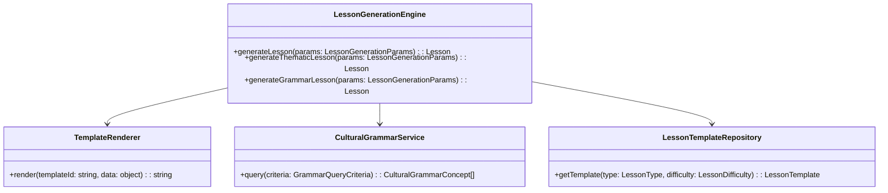

# Bulgarian-German Learning App: Design Concept & Strategy

## 1. Executive Summary
We are evolving the application from a simple vocabulary trainer into a "Rich Context" learning platform. The core philosophy is **Contextual Intelligence**—words are never learned in isolation but tied to emotion, grammar, and nuance. We will leverage Svelte 5's reactivity to create a fluid, gamified experience.

## 2. Information Quality: The "Rich Context" Data Model
We will extend the existing `VocabularyItem` interface to support deeper learning.

### New Interface Structure (Draft)
```typescript
interface RichVocabularyItem extends VocabularyItem {
  // Core Meaning
  contextual_nuance?: string; // e.g., "za edno" -> "together" vs "for one"
  mnemonics?: string;         // e.g., "Think of 'Sonne' for 'Slantse'"
  
  // Visual & Audio
  emoji?: string;             // ⚡️ Visual anchor
  image_url?: string;         // Unsplash/local image for immersion
  audio_url?: string;         // /audio/bg/word_id.mp3
  
  // Grammar Deep-Dive
  grammar_details?: {
    verb_aspect?: 'perfective' | 'imperfective';
    verb_partner_id?: string; // ID of the aspectual pair
    noun_gender?: 'masculine' | 'feminine' | 'neuter';
    plural_form?: string;
  };

  // Gamification Data
  xp_value?: number;          // Default: 10, Hard words: 20
}
```

## 3. UX/UI & Interaction Design
The interface will shift from a "List View" to a "Card-First" experience.

### Gamified Learning Flow
1.  **The Stage**: A focused, distraction-free center card.
2.  **Interaction**:
    -   **Flip Animation**: 3D CSS transform for "revealing" answers.
    -   **Micro-interactions**:
        -   *Success*: Green border glow + subtle scale up.
        -   *Fail*: Shake animation + red tint.
        -   *Streak*: Fire emoji counter animating on increment.
3.  **Progress System**:
    -   **XP Bar**: Top of screen, tweened using `svelte/motion`.
    -   **Daily Goals**: Visual ring chart for daily word targets.

### Accessibility & Styling
-   **Palette**: High contrast text on off-white backgrounds (e.g., `bg-slate-50`) with WCAG 2.1 AA compliance
-   **Typography**: Large, readable fonts (Inter/Roboto) with distinct weights for Bulgarian vs German text
-   **Touch**: Minimum 44x44px touch targets for mobile
-   **Keyboard Navigation**: Full keyboard support for all interactive elements
-   **ARIA Attributes**: Comprehensive ARIA attributes for screen reader support
-   **Focus Management**: Proper focus management for dynamic content
-   **Live Regions**: `aria-live` regions for dynamic feedback and loading states

### Type Safety Architecture
-   **Zod Schemas**: All runtime data validated with Zod schemas
-   **TypeScript Strict Mode**: No `any` types in critical paths
-   **LocalStorage Validation**: Runtime validation for all LocalStorage operations
-   **Type Guards**: Comprehensive type guards for JSON parsing
-   **Union Types**: Standardized to single types where possible

## 4. Technical Strategy
### Libraries & Tools
-   **State Management**: Fully embrace Svelte 5 Runes (`$state`, `$derived`) for a global `LearningSession` store.
-   **UI Components**: Continue using `bits-ui` for accessible primitives (dialogs, toggles) if needed, but build core Flashcards with pure Tailwind + Svelte.
-   **Animations**: Use `svelte/transition` (fly, fade) and `svelte/motion` (tweened, spring) for fluid state changes.
-   **Icons**: `lucide-svelte` for consistent UI iconography.

### Refactoring Plan
1.  **Data**: Migrate `vocabulary-unified.json` to include new fields (gradually).
2.  **Components**: Break `TandemPractice.svelte` into smaller, composed units:
    -   `FlashCard.svelte` (Presentational)
    -   `QuizControls.svelte` (Buttons)
    -   `ProgressBar.svelte` (Visual)
    -   `SessionManager.svelte.ts` (Logic/State)

## 5. Dynamic Lesson Generation System

### Contextual Intelligence in Lesson Generation
The dynamic lesson generation system extends the "Rich Context" philosophy by creating personalized learning experiences that adapt to user needs, proficiency levels, and learning patterns.

### System Architecture Overview


### Key Design Principles

1. **Personalization Algorithm**
   - Adapts lesson difficulty based on user proficiency
   - Integrates spaced repetition for optimal learning
   - Prioritizes vocabulary items needing review

2. **Contextual Content Generation**
   - Creates lessons around themes and categories
   - Incorporates cultural-grammar comparisons
   - Generates learning objectives dynamically

3. **Template-Based Rendering**
   - Uses flexible template system for lesson content
   - Supports multiple lesson types (vocabulary, grammar, mixed)
   - Enables easy customization and extension

### Template System Design
The template system uses a declarative approach with support for:
- **Variables**: Dynamic content placeholders
- **Conditionals**: Context-aware content inclusion
- **Loops**: Iteration over vocabulary items and examples
- **Partials**: Reusable content blocks

Example template structure:
```json
{
  "id": "vocabulary_intro_template",
  "type": "vocabulary",
  "difficultyRange": ["A1", "C1"],
  "template": "
## {{sectionTitle}}

This section introduces {{count}} {{theme}} vocabulary items.

{{#each vocabulary}}
### {{german}} / {{bulgarian}}
- **Part of Speech**: {{partOfSpeech}}
{{#if metadata.gender}}
- **Gender**: {{metadata.gender}}
{{/if}}
{{/each}}
  ",
  "variables": [
    {"name": "sectionTitle", "type": "string", "required": true},
    {"name": "vocabulary", "type": "array", "required": true}
  ]
}
```

### Adaptive Learning Algorithm
The system implements a spaced repetition algorithm that:
- Calculates priority scores for vocabulary items
- Adjusts review frequency based on learning phase
- Considers user proficiency and review history
- Prioritizes items not reviewed recently

## 6. Next Steps
Once approved, we will proceed to **Phase 3: The Implementation Roadmap**, starting with the Dynamic Lesson Generation Epic.