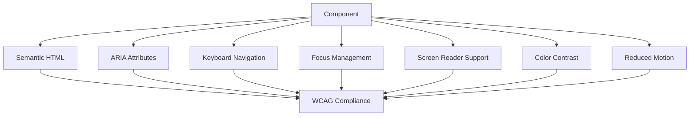

# Accessibility Guidelines

## 1. Overview
This document provides comprehensive accessibility guidelines for the Bulgarian-German Learning App. Our goal is to achieve WCAG 2.1 AA compliance and ensure the application is accessible to all users, including those with disabilities.

---

## 2. Accessibility Principles

### 2.1 WCAG 2.1 AA Compliance
Our application targets WCAG 2.1 Level AA compliance, which includes:

- **Perceivable**: Information and UI components must be presentable to users in ways they can perceive
- **Operable**: UI components and navigation must be operable
- **Understandable**: Information and UI operation must be understandable
- **Robust**: Content must be robust enough to be interpreted by a wide variety of user agents

### 2.2 Key Accessibility Requirements
| Requirement | Description | WCAG Criteria |
|-------------|-------------|---------------|
| **Keyboard Accessibility** | All functionality available via keyboard | 2.1.1, 2.1.2 |
| **Screen Reader Support** | Compatible with screen readers | 1.1.1, 1.3.1, 4.1.2 |
| **Color Contrast** | Sufficient color contrast | 1.4.3, 1.4.11 |
| **Focus Management** | Logical focus order and visible focus indicators | 2.4.3, 2.4.7 |
| **Semantic HTML** | Proper use of HTML elements | 1.3.1, 4.1.1 |
| **ARIA Attributes** | Appropriate ARIA roles, states, and properties | 4.1.2 |
| **Form Accessibility** | Accessible forms with proper labels and instructions | 1.3.5, 3.3.2 |
| **Error Handling** | Clear error messages and suggestions | 3.3.1, 3.3.3 |
| **Reduced Motion** | Respect user motion preferences | 2.3.3 |

---

## 3. Accessibility Architecture

### 3.1 Accessibility Layer


### 3.2 Accessibility Utilities
**Accessibility Store**:
```typescript
// src/lib/state/accessibility.svelte.ts
import { $state } from 'svelte';
import { browser } from '$app/environment';

class AccessibilityState {
  prefersReducedMotion = $state(false);
  prefersDarkMode = $state(false