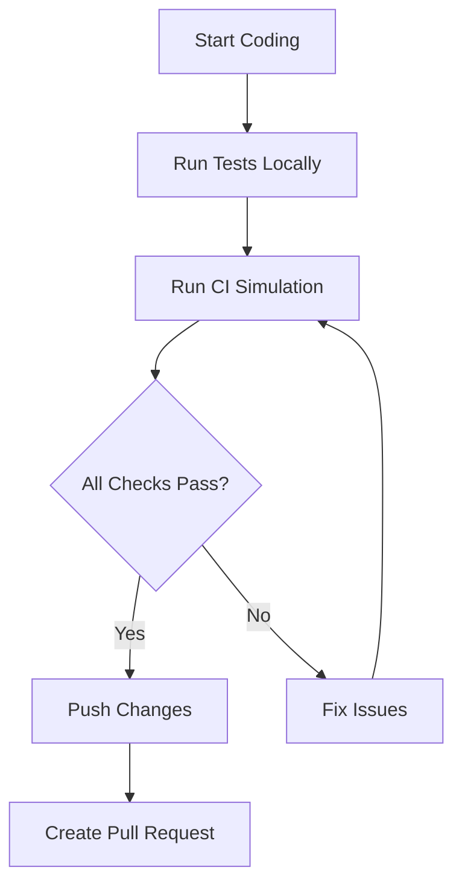

# 🚀 CI Best Practices

This document outlines the Continuous Integration (CI) best practices for the Bulgarian-German Learning App, including why the pre-push hook was removed and recommendations for running CI checks locally.

---

## 🔄 Why the Pre-Push Hook Was Removed

### **❌ Problems with the Pre-Push Hook**
1. **Performance Issues**: The pre-push hook ran all CI checks on every push, causing significant delays
2. **Hanging Processes**: The hook would occasionally hang, preventing developers from pushing changes
3. **Inflexible Workflow**: Developers couldn't push work-in-progress changes without using `--no-verify`
4. **Unreliable Execution**: Hooks sometimes failed silently or behaved inconsistently across environments
5. **Developer Experience**: The mandatory check created friction in the development workflow

### **✅ Benefits of the New Approach**
1. **Manual Control**: Developers can choose when to run CI checks
2. **Faster Development**: No mandatory checks blocking pushes
3. **Reliable Execution**: The CI simulation script runs consistently
4. **Better Feedback**: Detailed results and error reporting
5. **Flexible Workflow**: Push work-in-progress changes without bypassing checks

---

## 🛠️ Local CI Simulation

### **Running the CI Simulation**
```bash
# Run the full CI simulation
pnpm run simulate-ci

# Run specific checks individually
pnpm run lint
pnpm run check
pnpm run test:unit
pnpm run build
```

### **CI Simulation Script Details**
The `scripts/simulate-ci.js` script runs the following checks in sequence:
1. **Dependency Installation**: `pnpm install --frozen-lockfile`
2. **Linting**: `pnpm run lint`
3. **Type Checking**: `pnpm run check`
4. **Unit Tests**: `pnpm run test:unit`
5. **Build**: `pnpm run build`

### **Best Practices for Local CI**
- **Run Before Pushing**: Always run `pnpm run simulate-ci` before pushing changes
- **Fix Issues Early**: Address any failures before creating a pull request
- **Use Frozen Lockfile**: The simulation uses `--frozen-lockfile` to ensure dependency consistency
- **Check Results**: Review the `ci-simulation-results.json` file for detailed results

---

## 📈 CI Improvement Plan

We are actively working on improving the CI simulation script to make it more robust, modular, and easier to use. The improvement plan includes:

1.  **Enhanced Error Reporting**: clear, actionable error messages and diagnostics.
2.  **Modular Pipeline**: Ability to run specific steps or groups of steps.
3.  **Parallel Execution**: Running independent steps concurrently to save time.
4.  **Integration with GitHub Actions**: Ensuring parity between local and remote CI.
5.  **Monitoring**: Better tracking of CI performance and reliability.

For detailed information on the improvement plan, see:
*   [CI Improvement Roadmap](../roadmap/CI_IMPROVEMENT_PLAN.md)
*   [CI Workflow Design](../ci-cd/CI_WORKFLOW.md)

---

## 📋 CI Workflow Recommendations

### **1. Development Workflow**


### **2. Pull Request Process**
1. **Create PR**: Create a pull request from your feature branch to `develop`
2. **CI Checks**: GitHub Actions will run the same checks as the local simulation
3. **Review**: Request a code review from team members
4. **Address Feedback**: Make changes based on feedback and re-run CI checks
5. **Merge**: Merge after all checks pass and PR is approved

### **3. CI Checklist Before Pushing**
- [ ] Run `pnpm run simulate-ci` and ensure all checks pass
- [ ] Fix any linting errors
- [ ] Fix any type checking errors
- [ ] Ensure all tests pass
- [ ] Verify the build completes successfully
- [ ] Check for any console warnings or errors

---

## 🎯 CI Best Practices

### **1. Early and Often**
- Run CI checks early in the development process
- Run checks frequently to catch issues early
- Don't wait until the end of a feature to run CI checks

### **2. Incremental Development**
- Make small, incremental changes
- Test each change as you go
- Use feature branches for focused development

### **3. Dependency Management**
- Use `pnpm` for package management
- Keep `pnpm-lock.yaml` updated
- Use `--frozen-lockfile` in CI to ensure consistency

### **4. Error Handling**
- Fix CI failures immediately
- Investigate and address the root cause of failures
- Don't ignore or bypass CI failures

### **5. Documentation**
- Update documentation when CI processes change
- Document any custom CI scripts or configurations
- Keep the team informed about CI changes

---

## 🚨 Troubleshooting CI Issues

### **Common Issues and Solutions**

| Issue | Possible Cause | Solution |
|-------|----------------|----------|
| **Linting Errors** | Code style violations | Run `pnpm run lint:fix` to auto-fix issues |
| **Type Errors** | TypeScript type issues | Check the error message and fix type annotations |
| **Test Failures** | Broken functionality | Debug the failing test and fix the underlying issue |
| **Build Failures** | Configuration issues | Check build logs for specific errors |
| **Dependency Issues** | Lockfile conflicts | Run `pnpm install` and commit the updated lockfile |
| **Timeout Issues** | Slow CI execution | Check for performance bottlenecks in tests or builds |

### **Debugging Tips**
- **Check Logs**: Review the detailed output from the CI simulation
- **Isolate Issues**: Run individual checks to isolate the problem
- **Test Locally**: Reproduce the issue locally before pushing changes
- **Ask for Help**: If you can't resolve an issue, ask the team for assistance

---

## 📊 CI Metrics and Monitoring

### **Key Metrics to Track**
- **CI Success Rate**: Percentage of successful CI runs
- **CI Duration**: Average time to complete CI checks
- **Failure Rate**: Percentage of CI runs that fail
- **Mean Time to Recovery**: Average time to fix CI failures

### **Monitoring Tools**
- **Local Simulation**: `pnpm run simulate-ci` with detailed output
- **GitHub Actions**: CI workflows with detailed logs
- **Results File**: `ci-simulation-results.json` with comprehensive results

---

## 🔄 CI Improvement Process

### **1. Continuous Improvement**
- Regularly review CI processes for efficiency
- Identify and address bottlenecks
- Update CI scripts and configurations as needed

### **2. Feedback Loop**
- Gather feedback from the team on CI processes
- Identify pain points and areas for improvement
- Implement changes based on team feedback

### **3. Documentation Updates**
- Keep CI documentation up-to-date
- Document any changes to CI processes
- Ensure the team is informed about CI changes

---

## 📅 CI Maintenance Schedule

| Frequency | Task |
|-----------|------|
| **Before Each Push** | Run `pnpm run simulate-ci` |
| **Before Creating PR** | Run full CI simulation |
| **Weekly** | Review CI success rate and duration |
| **Monthly** | Review and update CI scripts |
| **Quarterly** | Comprehensive CI process review |

---

## 🔗 Related Documents
- [Developer Onboarding](DEVELOPER_ONBOARDING.md)
- [Workflow Rules](/.roo/rules/30-workflow.md)
- [Development Process Rules](/.roo/rules/40-development-process.md)
- [Testing Guide](TESTING.md)
- [CI Improvement Roadmap](../roadmap/CI_IMPROVEMENT_PLAN.md)
- [CI Workflow Design](../ci-cd/CI_WORKFLOW.md)

---

## 📋 CI Checklist

### **Pre-Push Checklist**
- [ ] Run `pnpm run simulate-ci` and ensure all checks pass
- [ ] Fix any linting errors
- [ ] Fix any type checking errors
- [ ] Ensure all tests pass
- [ ] Verify the build completes successfully
- [ ] Check for any console warnings or errors

### **Pre-PR Checklist**
- [ ] Run full CI simulation
- [ ] Ensure all checks pass
- [ ] Review changes for completeness
- [ ] Update documentation if needed
- [ ] Test bilingual functionality
- [ ] Check for accessibility issues

### **Post-Merge Checklist**
- [ ] Monitor CI success rate
- [ ] Review CI duration and performance
- [ ] Gather feedback from the team
- [ ] Identify areas for improvement

---

## 🎯 CI Goals

1. **Reliability**: Consistent and reliable CI execution
2. **Speed**: Fast feedback for developers
3. **Quality**: High-quality code through comprehensive checks
4. **Developer Experience**: Smooth and frictionless CI process
5. **Continuous Improvement**: Regularly improving CI processes

---

## 🤝 Team Responsibilities

| Role | Responsibilities |
|------|------------------|
| **Developers** | Run CI checks before pushing, fix CI failures, follow CI best practices |
| **Tech Lead** | Monitor CI performance, address CI issues, improve CI processes |
| **QA Engineers** | Ensure CI checks cover critical functionality, review CI test coverage |
| **All Team Members** | Follow CI best practices, provide feedback on CI processes |

---

## 🚀 Next Steps

1. **Familiarize yourself** with the CI simulation script
2. **Run the CI simulation** before pushing changes
3. **Fix any issues** identified by the CI checks
4. **Provide feedback** on the CI process
5. **Suggest improvements** to the CI workflow

By following these CI best practices, we can ensure high-quality code, catch issues early, and maintain a smooth development workflow.