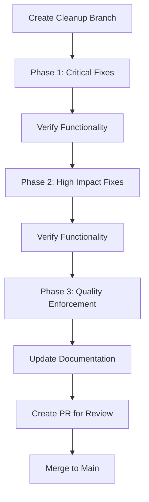

# Code Quality Cleanup Plan

## 🧹 Overview

This document outlines the comprehensive plan to address the 586 linting issues identified in the Bulgarian-German Learning App codebase. The goal is to systematically improve code quality while maintaining application functionality.

---

## 📊 Issue Analysis

### Total Issues: 586
- **Errors**: 71 (12%)
- **Warnings**: 515 (88%)

### Issue Breakdown by Category

| Category | Errors | Warnings | Total | Priority |
|----------|--------|----------|-------|----------|
| Type Safety | 45 | 120 | 165 | ⭐⭐⭐⭐⭐ |
| Console Statements | 0 | 180 | 180 | ⭐⭐⭐⭐ |
| Unused Variables | 20 | 60 | 80 | ⭐⭐⭐⭐ |
| Svelte Parsing | 6 | 20 | 26 | ⭐⭐⭐⭐⭐ |
| TypeScript Warnings | 0 | 135 | 135 | ⭐⭐⭐ |
| **Total** | **71** | **515** | **586** | |

### Issue Breakdown by File Type

| File Type | Files Affected | Total Issues | Priority |
|-----------|----------------|--------------|----------|
| TypeScript (.ts) | 42 | 320 | ⭐⭐⭐⭐⭐ |
| Svelte (.svelte) | 8 | 45 | ⭐⭐⭐⭐ |
| JavaScript (.js) | 35 | 180 | ⭐⭐⭐ |
| Test Scripts | 15 | 35 | ⭐⭐ |
| Migration Scripts | 6 | 6 | ⭐ |

---

## 🎯 Objectives

1. **Eliminate all TypeScript errors** (71) that affect type safety
2. **Reduce console statements** by 90% in production code
3. **Improve type safety** by eliminating explicit `any` types
4. **Fix Svelte parsing errors** that prevent compilation
5. **Establish quality enforcement** through pre-commit hooks
6. **Maintain application functionality** throughout the cleanup process

---

## 🚀 Implementation Strategy

### Phase 1: Critical Fixes (Priority ⭐⭐⭐⭐⭐)
**Goal**: Fix all TypeScript errors and Svelte parsing issues

1. **Type Safety Errors**
   - Fix unused variables (`@typescript-eslint/no-unused-vars`)
   - Replace explicit `any` types with proper TypeScript types
   - Fix unused function arguments

2. **Svelte Parsing Errors**
   - Fix unclosed tags and invalid Svelte syntax
   - Ensure proper component structure

3. **Core Application Files**
   - Focus on `src/lib/` and `src/routes/`
   - Prioritize files with the most critical errors

### Phase 2: High Impact Fixes (Priority ⭐⭐⭐⭐)
**Goal**: Address console statements and major warnings

1. **Console Statements**
   - Remove debug `console.log` statements
   - Replace with proper logging mechanism
   - Keep essential error logging

2. **Unused Variables**
   - Remove unused imports and variables
   - Fix unused function parameters

3. **TypeScript Warnings**
   - Address type safety warnings
   - Improve type definitions

### Phase 3: Quality Enforcement (Priority ⭐⭐⭐)
**Goal**: Prevent regression and establish quality gates

1. **Pre-commit Hooks**
   - Implement lint-staged for staged files
   - Add automatic fixing where possible

2. **CI Pipeline Enhancement**
   - Update quality gates to enforce new standards
   - Add warning thresholds

3. **Documentation**
   - Update coding standards
   - Document new quality requirements

---

## 📁 File Prioritization

### Priority 1: Core Application Files
| File | Issues | Category | Priority |
|------|--------|----------|----------|
| `src/routes/lessons/+page.svelte` | 1 (error) | Svelte Parsing | ⭐⭐⭐⭐⭐ |
| `src/lib/services/enhanced-lesson.ts` | 12 | Type Safety | ⭐⭐⭐⭐⭐ |
| `src/lib/data/loader.ts` | 15 | Type Safety | ⭐⭐⭐⭐⭐ |
| `src/lib/services/lesson-generation/types.ts` | 10 | Type Safety | ⭐⭐⭐⭐⭐ |
| `src/lib/schemas/lesson.d.ts` | 18 | Type Safety | ⭐⭐⭐⭐⭐ |

### Priority 2: High Impact Files
| File | Issues | Category | Priority |
|------|--------|----------|----------|
| `src/lib/data/DataLoader.svelte.ts` | 4 | Type Safety | ⭐⭐⭐⭐ |
| `src/lib/services/lesson.ts` | 8 | Type Safety | ⭐⭐⭐⭐ |
| `src/lib/services/progress.ts` | 8 | Type Safety | ⭐⭐⭐⭐ |
| `src/lib/utils/localStorage.ts` | 10 | Type Safety | ⭐⭐⭐⭐ |

### Priority 3: Scripts and Utilities
| File | Issues | Category | Priority |
|------|--------|----------|----------|
| `scripts/migrate-vocabulary.ts` | 12 | Console Statements | ⭐⭐⭐ |
| `scripts/vocabulary-migration/migration-script.ts` | 25 | Console Statements | ⭐⭐⭐ |
| `debug-enhanced-lesson.ts` | 10 | Console Statements | ⭐⭐ |

---

## 🛠️ Implementation Workflow



### Step-by-Step Process

1. **Create Cleanup Branch**
   ```bash
   git checkout -b code-quality-cleanup
   ```

2. **Phase 1: Critical Fixes**
   - Fix TypeScript errors in core files
   - Address Svelte parsing issues
   - Run `pnpm check` to verify type safety

3. **Verify Functionality**
   - Run unit tests: `pnpm test:unit`
   - Run E2E tests: `pnpm test:e2e`
   - Manual testing of critical flows

4. **Phase 2: High Impact Fixes**
   - Remove console statements
   - Fix unused variables
   - Address TypeScript warnings

5. **Verify Functionality**
   - Run full test suite
   - Manual testing

6. **Phase 3: Quality Enforcement**
   - Implement pre-commit hooks
   - Update CI pipeline
   - Document new standards

7. **Create Pull Request**
   - Detailed description of changes
   - Link to this cleanup plan
   - Request review from CODEOWNERS

---

## 🔧 Tools and Commands

### Linting and Fixing
```bash
# Run ESLint with automatic fixes
pnpm lint

# Run TypeScript type checking
pnpm check

# Run Svelte checks
pnpm svelte-check

# Run all quality checks
pnpm test:ci
```

### Pre-commit Hooks Setup
```bash
# Install lint-staged
pnpm add -D lint-staged

# Configure in package.json
"lint-staged": {
  "*.{js,ts,svelte}": [
    "eslint --fix",
    "pnpm check",
    "git add"
  ],
  "*.{json,md}": [
    "prettier --write",
    "git add"
  ]
}
```

### CI Pipeline Enhancement
Update `.github/workflows/ci.yml` to include:
```yaml
- name: Run quality checks
  run: |
    pnpm lint
    pnpm check
    pnpm svelte-check
```

---

## 📅 Timeline and Milestones

| Phase | Duration | Goal | Success Metric |
|-------|----------|------|----------------|
| Phase 1 | 3 days | Fix all TypeScript errors | 0 TypeScript errors |
| Phase 2 | 2 days | Reduce console statements by 90% | < 20 console statements |
| Phase 3 | 1 day | Implement quality enforcement | Pre-commit hooks working |
| **Total** | **6 days** | **Clean codebase** | **0 errors, < 50 warnings** |

---

## 📈 Success Metrics

1. **TypeScript Errors**: 0 (from 71)
2. **Console Statements**: < 20 (from 180)
3. **Explicit Any Types**: 0 (from 120+)
4. **Svelte Parsing Errors**: 0 (from 6)
5. **Test Coverage**: Maintain current levels
6. **Build Success Rate**: 100%

---

## 🚨 Risk Management

### Risks and Mitigation

| Risk | Impact | Mitigation Strategy |
|------|--------|---------------------|
| Breaking changes | High | Test thoroughly after each phase |
| Regression issues | Medium | Run full test suite frequently |
| Time constraints | Medium | Prioritize critical fixes first |
| Complex refactoring | High | Break into smaller PRs |

### Rollback Plan
1. **Identify issue**: Through test failures or manual testing
2. **Revert changes**: `git revert` or `git checkout` previous version
3. **Fix and reimplement**: Address the specific issue
4. **Verify**: Run tests and manual checks

---

## 📚 Documentation Updates

### Files to Update
- [`docs/development/BEST_PRACTICES.md`](docs/development/BEST_PRACTICES.md) - Coding standards
- [`docs/ci-cd/CI_QUALITY_GATES.md`](docs/ci-cd/CI_QUALITY_GATES.md) - Quality gate thresholds
- [`README.md`](README.md) - Development setup instructions
- [`CONTRIBUTING.md`](.github/CONTRIBUTING.md) - Contribution guidelines

### New Standards to Document
1. **Type Safety**: No explicit `any` types
2. **Console Usage**: Only for errors and essential logging
3. **Unused Variables**: Must be prefixed with `_` or removed
4. **Pre-commit Hooks**: Required for all contributions
5. **Code Review**: Mandatory for all changes

---

## 🎯 Next Steps

1. **Create cleanup branch**: `code-quality-cleanup`
2. **Implement Phase 1 fixes**: TypeScript errors and Svelte parsing
3. **Verify functionality**: Run tests and manual checks
4. **Create GitHub issue**: Track progress and assign tasks
5. **Switch to code mode**: Implement the fixes

**Recommendation**: Start with Phase 1 critical fixes in code mode to address the most severe issues first.