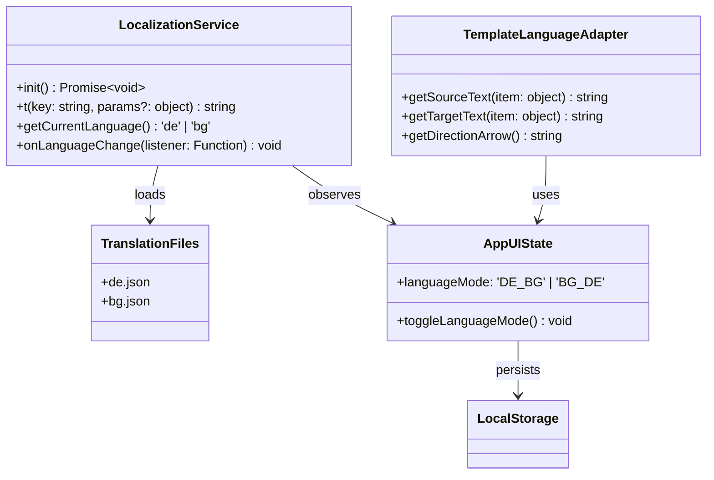

# 🚀 Developer Onboarding Guide

Welcome to the Bulgarian-German Learning App! This guide will help you set up the project, understand the codebase, and start contributing effectively.

---

## 🛠️ Tech Stack Overview

| Technology       | Purpose                          | Documentation Link                     | Key Features |
|------------------|----------------------------------|----------------------------------------|--------------|
| **Svelte 5**     | Frontend framework               | [Svelte 5 Docs](https://svelte.dev/docs/svelte-5) | Runes (`$state`, `$derived`, `$effect`, `$props`), reactivity |
| **SvelteKit**    | Full-stack framework             | [SvelteKit Docs](https://kit.svelte.dev/) | File-based routing, SSR/SSG, load functions |
| **TypeScript**   | Type-safe JavaScript             | [TypeScript Docs](https://www.typescriptlang.org/docs/) | Strict mode, Zod integration |
| **Zod**          | Runtime validation               | [Zod Docs](https://zod.dev/) | Schema validation, type inference, translation validation |
| **Playwright**   | E2E and Component testing        | [Playwright Docs](https://playwright.dev/) | Cross-browser testing, axe-core integration, bilingual testing |
| **Vitest**       | Unit testing                     | [Vitest Docs](https://vitest.dev/) | Fast unit tests, mocking, localization testing |
| **Tailwind CSS** | Styling                          | [Tailwind Docs](https://tailwindcss.com/docs) | Utility-first CSS, responsive design, language-aware spacing |
| **bits-ui**      | Headless UI components           | [bits-ui Docs](https://bits-ui.com/) | Accessible, unstyled components, bilingual support |
| **shadcn-svelte**| Styled components                | [shadcn-svelte Docs](https://www.shadcn-svelte.com/) | Beautiful, customizable components, localization-ready |
| **Localization** | Bilingual support                | [BILINGUAL_SUPPORT.md](docs/BILINGUAL_SUPPORT.md) | Dynamic translation, language switching, direction-aware content |

---

## 📁 Project Structure

```
.
├── .github/                # GitHub workflows and issue templates
├── .roo/                   # Project configuration and rules
├── data/                   # Vocabulary and grammar data
├── docs/                   # Project documentation
│   ├── architecture/       # Technical architecture
│   ├── development/        # Development guides (this directory)
│   ├── roadmap/            # Project roadmap
│   └── CHANGELOG.md        # Project changelog
├── scripts/                # Utility scripts
├── src/
│   ├── lib/
│   │   ├── components/     # Reusable UI components (Svelte 5)
│   │   │   ├── ui/         # Atomic components (buttons, dialogs)
│   │   │   ├── flashcard/  # Flashcard components
│   │   │   ├── gamification/ # Gamification components
│   │   │   └── LessonCard.svelte # Lesson display component
│   │   ├── data/           # Data loading and processing
│   │   │   ├── db.svelte.ts # Vocabulary database service
│   │   │   └── loader.ts   # Data loading service
│   │   ├── schemas/        # Zod schemas for validation
│   │   │   ├── vocabulary.ts # Vocabulary schema
│   │   │   ├── lesson.ts   # Lesson schema
│   │   │   └── progress.ts # Progress tracking schemas
│   │   ├── services/       # Business logic services
│   │   │   ├── di-container.ts # Dependency Injection Container
│   │   │   ├── event-bus.ts # Event Bus implementation
│   │   │   ├── errors.ts   # Error handling utilities
│   │   │   ├── progress.ts # Progress tracking service
│   │   │   ├── lesson.ts   # Lesson service
│   │   │   ├── search.ts   # Search service
│   │   │   └── lesson-generation/ # Lesson generation system
│   │   ├── state/          # Global state managers (Svelte 5 Runes)
│   │   │   ├── app-ui.svelte.ts # UI state management
│   │   │   ├── app-data.svelte.ts # Data state management
│   │   │   └── app.svelte.ts # Backward-compatible facade
│   │   ├── types/          # TypeScript type definitions
│   │   └── utils/          # Utility functions
│   ├── routes/             # SvelteKit pages and routes
│   └── app.html            # Root HTML template
├── static/                 # Static assets (images, fonts, etc.)
├── tests/                  # Test files
│   ├── unit/               # Unit tests
│   ├── components/         # Component tests
│   ├── e2e/                # End-to-end tests
│   └── architecture/       # Architectural tests
├── package.json            # Project dependencies and scripts
└── README.md               # Project overview and quick start
```

---

## 💻 Local Development Setup

### Prerequisites
- **Node.js**: 20+ (LTS recommended)
- **pnpm**: Install via `npm install -g pnpm`
- **Git**: Version control system
- **Language Tools**: German and Bulgarian language support (optional for testing)

### Installation
1. Clone the repository:
   ```bash
   git clone <repository-url>
   cd bulgarian-german-learning-app
   ```

2. Install dependencies:
   ```bash
   pnpm install
   ```

3. Start the development server:
   ```bash
   pnpm run dev
   ```

4. Open your browser and navigate to:
   ```
   http://localhost:5173
   ```

---

## 📜 Development Workflow

### Key Commands

| Command | Description | Usage |
|---------|-------------|-------|
| `pnpm run dev` | Start local dev server | Development |
| `pnpm run build` | Build for production | Production build |
| `pnpm run preview` | Preview production build | Testing production build |
| `pnpm run test` | Run all tests | Testing |
| `pnpm run test:unit` | Run unit tests | Unit testing |
| `pnpm run test:components` | Run component tests | Component testing |
| `pnpm run test:e2e` | Run end-to-end tests | E2E testing |
| `pnpm run test:architecture` | Run architectural tests | Architectural testing |
| `pnpm run test:accessibility` | Run accessibility tests | Accessibility testing |
| `pnpm run lint` | Run ESLint | Code quality |
| `pnpm run check` | Run Svelte/TypeScript checks | Type checking |

### Branching Strategy
- **`main`**: Production-ready code (protected)
- **`develop`**: Integration branch for features (protected)
- **Feature branches**: `feature/[description]` (e.g., `feature/accessibility-wcag-audit`)
- **Bugfix branches**: `fix/[description]` (e.g., `fix/flashcard-flip-bug`)
- **Documentation branches**: `docs/[description]` (e.g., `docs/onboarding-guide`)
- **Localization branches**: `l10n/[description]` (e.g., `l10n/add-spanish-support`)

### Pull Request Process
1. Create a feature branch from `develop`
2. Implement changes and commit with descriptive messages
3. Push changes to remote repository
4. Create a pull request to `develop`
5. Ensure all checks pass (tests, linting, type checking)
6. Request review from at least one team member
7. Address feedback and update PR
8. Merge after approval

---

## 🧪 Testing Workflow

### Test Types

| Test Type | Framework | Location | Purpose |
|-----------|-----------|----------|---------|
| Unit | Vitest | `tests/unit/` | Test individual functions and logic |
| Component | Playwright CT | `tests/components/` | Test UI components in isolation |
| E2E | Playwright | `tests/e2e/` | Test critical user flows |
| Accessibility | Playwright + axe-core | `tests/accessibility/` | Test WCAG 2.1 AA compliance |
| Architectural | Vitest | `tests/architecture/` | Test architectural patterns and constraints |

### Running Tests
```bash
# Run all tests
pnpm run test:all

# Run specific test suites
pnpm run test:unit          # Unit tests
pnpm run test:components    # Component tests
pnpm run test:e2e           # End-to-end tests
pnpm run test:accessibility # Accessibility tests
pnpm run test:architecture  # Architectural tests

# Run tests in watch mode
pnpm run test:unit:watch
```

### Adding Tests

1. **Unit Tests**: Add to `tests/unit/` with `.test.ts` extension
   ```typescript
   // Example: tests/unit/progress.test.ts
   import { describe, it, expect } from 'vitest';
   import { calculateMasteryLevel } from '$lib/schemas/progress';

   describe('Progress Calculations', () => {
     it('should calculate mastery level correctly', () => {
       expect(calculateMasteryLevel(5, 1)).toBeGreaterThan(calculateMasteryLevel(3, 2));
     });
   });
   ```

2. **Component Tests**: Add to `tests/components/` with `.test.ts` extension
   ```typescript
   // Example: tests/components/FlashCard.test.ts
   import { test, expect } from '@playwright/experimental-ct-svelte';
   import FlashCard from '$lib/components/flashcard/FlashCard.svelte';

   test('FlashCard flips when clicked', async ({ mount }) => {
     const component = await mount(FlashCard, {
       props: { item: { german: 'Hallo', bulgarian: 'Здравей' } }
     });
     await expect(component).toContainText('Hallo');
     await component.click();
     await expect(component).toContainText('Здравей');
   });
   ```

3. **E2E Tests**: Add to `tests/e2e/` with `.test.ts` extension
   ```typescript
   // Example: tests/e2e/practiceFlow.test.ts
   import { test, expect } from '@playwright/test';

   test('Practice flow works correctly', async ({ page }) => {
     await page.goto('/practice');
     await expect(page).toHaveTitle(/Practice/);
     await page.click('text=Start Practice');
     await expect(page.locator('.flashcard')).toBeVisible();
   });
   ```

4. **Accessibility Tests**: Add to `tests/accessibility/` with `.test.ts` extension
   ```typescript
   // Example: tests/accessibility/flashCard.test.ts
   import { test, expect } from '@playwright/test';
   import { injectAxe, checkA11y } from 'axe-playwright';

   test('FlashCard has no accessibility violations', async ({ page }) => {
     await page.goto('/practice');
     await injectAxe(page);
     await checkA11y(page, {
       axeOptions: {
         rules: {
           'aria-allowed-attr': { enabled: true },
           'aria-required-attr': { enabled: true }
         }
       }
     });
   });
   ```

5. **Architectural Tests**: Add to `tests/architecture/` with `.test.ts` extension
   ```typescript
   // Example: tests/architecture/state-separation.test.ts
   import { describe, it, expect } from 'vitest';
   import { appUIState, appDataState } from '$lib/state/app.svelte';

   describe('State Separation Architecture', () => {
     it('should maintain separation between UI and Data state', () => {
       // UI state should not contain persistent data
       expect(appUIState.practiceStats).toBeUndefined();

       // Data state should not contain UI-specific state
       expect(appDataState.languageMode).toBeUndefined();
     });
   });
   ```

---

## 🔒 Type Safety & Validation

### Zod Schema Validation
All runtime data is validated using Zod schemas with TypeScript type inference.

**Example: Vocabulary Item Schema**
```typescript
// src/lib/schemas/vocabulary.ts
import { z } from 'zod';

export const VocabularyItemSchema = z.object({
  id: z.string(),
  type: z.enum(['word', 'rule']),
  bulgarian: z.string(),
  german: z.string(),
  difficulty: z.number().min(1).max(5),
  category: z.string().optional(),
  tags: z.array(z.string()).optional(),
  partOfSpeech: z.enum(['noun', 'verb', 'adjective', 'adverb', 'pronoun', 'preposition', 'conjunction', 'interjection', 'article', 'number', 'phrase']),
  categories: z.array(z.string()).optional()
});

export type VocabularyItem = z.infer<typeof VocabularyItemSchema>;
```

**Example: Progress Data Validation**
```typescript
// src/lib/schemas/progress.ts
import { z } from 'zod';

export const VocabularyMasterySchema = z.object({
  id: z.string(),
  itemId: z.string(),
  correctCount: z.number().min(0),
  incorrectCount: z.number().min(0),
  totalAttempts: z.number().min(0),
  lastPracticed: z.string().datetime().nullable(),
  masteryLevel: z.number().min(0).max(100),
  isMastered: z.boolean(),
  createdAt: z.string().datetime(),
  updatedAt: z.string().datetime()
});

export function calculateMasteryLevel(correct: number, incorrect: number): number {
  const total = correct + incorrect;
  if (total === 0) return 0;
  return Math.round((correct / total) * 100);
}
```

### Type Guards
Use type guards for safe JSON parsing and runtime validation.

```typescript
// src/lib/utils/localStorage.ts
import { validateUserProgressStorage } from '$lib/schemas/localStorage';

export function getUserProgress(): UserProgress | null {
  const data = localStorage.getItem('userProgress');
  if (!data) return null;

  try {
    const parsedData = JSON.parse(data);
    const validationResult = validateUserProgressStorage(parsedData);

    if (!validationResult.success) {
      console.error('Invalid user progress data:', validationResult.error);
      return null;
    }

    return validationResult.data;
  } catch (error) {
    console.error('Error parsing user progress:', error);
    return null;
  }
}
```

---

## ♿ Accessibility Guidelines

### ARIA Attributes
All interactive components must include proper ARIA attributes.

| Component | ARIA Attribute | Purpose |
|-----------|----------------|---------|
| FlashCard | `aria-expanded` | Indicates flip state |
| Dialog | `aria-modal="true"` | Indicates modal dialog |
| Button | `aria-label` | Describes button purpose |
| Feedback | `aria-live="polite"` | Announces feedback messages |
| Loading | `aria-live="polite"` | Announces loading states |

**Example: Accessible FlashCard**
```svelte
<!-- src/lib/components/flashcard/FlashCard.svelte -->
<script lang="ts">
  import { $state } from 'svelte';
  let flipped = $state(false);

  function onFlip() {
    flipped = !flipped;
  }

  function handleKeydown(e: KeyboardEvent) {
    if (e.key === 'Enter' || e.key === ' ') {
      e.preventDefault();
      onFlip();
    }
  }
</script>

<div
  class="scene"
  role="button"
  tabindex="0"
  onclick={onFlip}
  onkeydown={handleKeydown}
  aria-label="Flashcard: {item.german}. Click or press Enter to flip."
  aria-expanded={flipped}
>
  <div class="card {flipped ? 'flipped' : ''}">
    <div class="card-face front">
      {item.german}
    </div>
    <div class="card-face back">
      {item.bulgarian}
    </div>
  </div>
</div>
```

### Keyboard Navigation
- **FlashCard**: Enter/Space to flip
- **Recommendations**: Arrow keys to navigate, Enter to select
- **All Buttons**: Keyboard accessible with proper focus management

### Focus Management
Use `$effect` for proper focus management in dynamic content.

```svelte
<script lang="ts">
  import { $state, $effect } from 'svelte';

  let open = $state(false);
  let triggerElement = $state<HTMLButtonElement | null>(null);

  $effect(() => {
    if (!open && triggerElement) {
      triggerElement.focus(); // Return focus when dialog closes
    }
  });
</script>
```

### Screen Reader Support
- Use `aria-live` regions for dynamic content changes
- Ensure all interactive elements have descriptive labels
- Test with screen readers (VoiceOver, NVDA, JAWS)

---

## 🚀 Svelte 5 Best Practices

### Runes Usage

| Rune | Purpose | Example |
|------|---------|---------|
| `$state` | Reactive state | `let count = $state(0);` |
| `$derived` | Derived values | `let double = $derived(count * 2);` |
| `$effect` | Side effects | `$effect(() => { console.log(count); });` |
| `$props` | Component props | `let { open = $state(false) } = $props();` |

**Example: Reactive State Management**
```svelte
<script lang="ts">
  let count = $state(0);
  let double = $derived(count * 2);

  $effect(() => {
    console.log(`Count changed to: ${count}`);
  });
</script>

<button onclick={() => count++}>
  Count: {count}, Double: {double}
</button>
```

### Event Handling
Use standard HTML event attributes instead of Svelte's `on:` directive.

**Legacy (Svelte 4):**
```svelte
<button on:click={handleClick}>Click</button>
```

**Svelte 5:**
```svelte
<button onclick={handleClick}>Click</button>
```

### Props with `$state`
Use `$state` for default prop values to make them reactive.

```svelte
<script lang="ts">
  let { open = $state(false) } = $props();
</script>
```

---

## 🏗️ Architecture Overview

### State Management Architecture
The application uses a **clean architecture pattern** with clear separation of concerns and bilingual support:

1. **UI State** (`AppUIState`) - Manages ephemeral UI state including language mode
2. **Data State** (`AppDataState`) - Manages persistent application data
3. **Service Layer** - Business logic services including localization
4. **Dependency Injection Container** - Manages service dependencies
5. **Event Bus** - Decoupled communication between components including language change events

### Localization Architecture
The application implements a comprehensive localization system:



Key localization components:
- **LocalizationService**: Core translation functionality
- **AppUIState**: Language state management with Svelte 5 Runes
- **TemplateLanguageAdapter**: Direction-aware content rendering
- **Translation Files**: JSON-based translation dictionaries

**State Initialization:**
```typescript
// src/lib/state/app.svelte.ts
import { AppUIState } from './app-ui.svelte';
import { AppDataState } from './app-data.svelte';
import { diContainer } from '../services/di-container.js';

// Create the data state instance
export const appDataState = new AppDataState();
appDataState.init();

// Create the UI state instance with reference to data state
export const appUIState = new AppUIState(appDataState);
appUIState.init();

// Export async initialization function
export async function initializeAppState() {
    try {
        // Ensure DI container is initialized
        await diContainer.initialize();

        return {
            appDataState,
            appUIState
        };
    } catch (error) {
        console.error('Failed to initialize app state:', error);
        throw error;
    }
}
```

### Dependency Injection System
The application uses a **centralized dependency injection container** to manage service dependencies:

```typescript
// src/lib/services/di-container.ts
import { ProgressService } from './progress';
import { VocabularyService } from '../data/vocabulary';
import { LessonGenerationEngine } from './lesson-generation/lesson-generator';
import { EventBus } from './event-bus';

// Singleton DI container
class DIContainer {
    private static instance: DIContainer;
    private services: Partial<ServiceTypes> = {};
    private eventBus: EventBus;
    private isInitialized = false;

    private constructor() {
        // Initialize event bus
        this.eventBus = new EventBus();
        this.services.eventBus = this.eventBus;
    }

    public static getInstance(): DIContainer {
        if (!DIContainer.instance) {
            DIContainer.instance = new DIContainer();
        }
        return DIContainer.instance;
    }

    public async initialize(): Promise<void> {
        if (this.isInitialized) return;

        try {
            // Initialize services in the correct order
            this.services.progressService = new ProgressService(this.eventBus);
            this.services.appDataState = new AppDataState();
            this.services.appDataState.init();
            this.services.vocabularyService = await VocabularyService.getInstance();

            this.isInitialized = true;
        } catch (error) {
            console.error('DI Container initialization failed:', error);
            throw error;
        }
    }

    public getService(serviceName: keyof ServiceTypes): any {
        if (!this.isInitialized) {
            throw new Error(`Service ${serviceName} cannot be accessed: DI container not initialized.`);
        }

        if (!this.services[serviceName]) {
            throw new Error(`Service ${serviceName} not initialized.`);
        }

        return this.services[serviceName];
    }
}

// Create and initialize the DI container
export const diContainer = DIContainer.getInstance();
diContainer.initialize().catch(error => {
    console.error('Failed to initialize DI container:', error);
});
```

### Event Bus System
The application implements a **decoupled event bus system** for communication between components and services:

```typescript
// src/lib/services/event-bus.ts
export class EventBus {
    private listeners: Map<string, Set<EventCallback>> = new Map();

    subscribe<T = any>(eventType: string, callback: EventCallback<T>): () => void {
        if (!this.listeners.has(eventType)) {
            this.listeners.set(eventType, new Set());
        }

        const listeners = this.listeners.get(eventType)!;
        listeners.add(callback);

        // Return unsubscribe function
        return () => {
            listeners.delete(callback);
            if (listeners.size === 0) {
                this.listeners.delete(eventType);
            }
        };
    }

    async emit<T = any>(eventType: string, data: T): Promise<void> {
        const listeners = this.listeners.get(eventType);
        if (listeners) {
            // Create a copy to avoid issues if listeners are modified during iteration
            const listenersCopy = Array.from(listeners);
            for (const listener of listenersCopy) {
                try {
                    await listener(data);
                } catch (error) {
                    console.error(`Error in event listener for ${eventType}:`, error);
                }
            }
        }
    }

    clear(eventType?: string): void {
        if (eventType) {
            this.listeners.delete(eventType);
        } else {
            this.listeners.clear();
        }
    }
}

// Event types
export const EventTypes = {
    XP_EARNED: 'xp_earned',
    LEVEL_UP: 'level_up',
    PRACTICE_RESULT: 'practice_result',
    LESSON_COMPLETED: 'lesson_completed',
    QUIZ_COMPLETED: 'quiz_completed',
    STATE_CHANGED: 'state_changed',
    ERROR: 'error'
} as const;
```

### Error Handling System
The application implements **consistent error handling** across all services:

```typescript
// src/lib/services/errors.ts
export class AppError extends Error {
    constructor(message: string, public context?: any) {
        super(message);
        this.name = 'AppError';
    }
}

export class StateError extends AppError {
    constructor(message: string, context?: any) {
        super(message, context);
        this.name = 'StateError';
    }
}

export class StorageError extends AppError {
    constructor(message: string, context?: any) {
        super(message, context);
        this.name = 'StorageError';
    }
}

export class ErrorHandler {
    static handleError(error: unknown, context?: string, eventBus?: { emit: (type: string, data: any) => Promise<void> }): void {
        // Log the error
        console.error(`[${error instanceof Error ? error.name : 'Error'}] ${context || 'Error'}:`,
                     error instanceof Error ? error.message : error);

        // Emit error event if event bus is available
        if (eventBus) {
            eventBus.emit('error', {
                error: error instanceof Error ? error : new Error(String(error)),
                context,
                timestamp: new Date()
            }).catch(emitError => {
                console.error('Failed to emit error event:', emitError);
            });
        }
    }
}
```

---

## 📊 Working with the State Management System

### Accessing State
The application provides multiple ways to access state:

1. **Direct Access** (recommended for new components):
```typescript
import { appUIState, appDataState } from '$lib/state/app.svelte';

// Access UI state
const currentItem = appUIState.currentItem;
const searchQuery = appUIState.searchQuery;

// Access Data state
const favorites = appDataState.favorites;
const practiceStats = appDataState.practiceStats;
```

2. **Backward Compatible Access** (for existing components):
```typescript
import { appState } from '$lib/state/app.svelte';

// Access through the facade
const languageMode = appState.languageMode;
const favorites = appState.favorites;
```

3. **Service Access** (for business logic):
```typescript
import { getProgressService } from '$lib/services/di-container';

const progressService = getProgressService();
const overallProgress = progressService.getOverallProgress();
```

### Updating State
State should be updated through the provided methods:

```typescript
// UI State updates
appUIState.setSearchQuery('hello');
appUIState.toggleLanguageMode();
appUIState.startPracticeSession(vocabularyItem);

// Data State updates
appDataState.toggleFavorite(itemId);
appDataState.recordPracticeResult(itemId, true);
```

### Working with the Event Bus
The event bus enables decoupled communication between components:

```typescript
import { eventBus, EventTypes } from '$lib/services/event-bus';

// Subscribe to events
const unsubscribe = eventBus.subscribe(EventTypes.XP_EARNED, (data: XPEvent) => {
    console.log(`Earned ${data.amount} XP for ${data.reason}`);
});

// Emit events
await eventBus.emit(EventTypes.PRACTICE_RESULT, {
    itemId: 'word-123',
    correct: true,
    timestamp: new Date()
});

// Clean up subscriptions when component is destroyed
onDestroy(() => {
    unsubscribe();
});
```

---

## 🎯 Project Roadmap

### Current Priorities
1. **Enhanced Gamification**: Badges, achievements, and leaderboards
2. **Advanced Progress Analytics**: Detailed progress visualization
3. **Adaptive Learning**: Personalized learning paths
4. **Audio Integration**: Pronunciation guides and listening exercises
5. **Social Features**: Progress sharing and community features
6. **Offline Mode**: Full offline functionality with sync

### Upcoming Features
- **Spaced Repetition Algorithm**: Optimize learning with adaptive scheduling
- **Audio Pronunciation**: Add audio support for vocabulary items
- **Grammar Exercises**: Interactive grammar practice
- **User Accounts**: Sync progress across devices
- **Social Features**: Share progress with friends

---

## 🤝 Contributing

### Code Quality Standards
- **TypeScript**: Strict mode, no `any` types
- **Testing**: 100% test coverage for new features
- **Accessibility**: WCAG 2.1 AA compliant
- **Performance**: Optimized bundle size and rendering
- **Documentation**: Comprehensive and up-to-date

### Getting Help
- **Questions**: Ask in GitHub Discussions or Slack
- **Bug Reports**: Create a GitHub issue with reproduction steps
- **Feature Requests**: Create a GitHub issue with detailed proposal

---

## 🌐 Bilingual Support Setup

### Localization System Overview
The application includes a comprehensive bilingual support system:

1. **Translation Files**: JSON files in `src/lib/data/translations/`
2. **Localization Service**: `src/lib/services/localization.ts`
3. **Language State**: `src/lib/state/app-ui.svelte.ts`
4. **Template Adapter**: `src/lib/services/lesson-generation/template-language-adapter.ts`
5. **Testing**: Comprehensive bilingual test suite

### Adding New Translations
1. **Add translation keys** to both `de.json` and `bg.json` files
2. **Use dot notation** for nested keys: `category.subcategory.key`
3. **Test translations** using the `t()` function in components
4. **Follow existing patterns** for consistency

Example translation file structure:
```json
{
  "navigation": {
    "dashboard": "Dashboard",
    "vocabulary": "Vokabular"
  },
  "common": {
    "check_answer": "Antwort prüfen",
    "next_word": "Nächstes Wort"
  }
}
```

### Using the Translation System
```svelte
<script lang="ts">
  import { t } from '$lib/services/localization';
</script>

<button>
  {t('common.check_answer')}
</button>
```

### Testing Bilingual Functionality
```bash
# Run bilingual tests
pnpm run test:bilingual

# Test language switching
pnpm run test:e2e --grep '@language-switching'

# Test translation coverage
pnpm run test:e2e --grep '@translation-coverage'
```

## 🎯 Component Localization Guide

### Key Components with Localization

| Component | Location | Localization Features |
|-----------|----------|-----------------------|
| **Navigation** | `src/lib/components/Navigation.svelte` | Bilingual navigation labels, language toggle integration |
| **LanguageToggle** | `src/lib/components/LanguageToggle.svelte` | Language switching, ARIA labels, visual indicators |
| **FlashCard** | `src/lib/components/flashcard/FlashCard.svelte` | Direction-aware content, bilingual examples, flip animation |
| **TandemPractice** | `src/lib/components/TandemPractice.svelte` | Bilingual practice interface, feedback messages, direction-aware prompts |
| **GeneratedLesson** | `src/lib/components/GeneratedLesson.svelte` | Direction-aware lesson content, bilingual templates, language-specific formatting |
| **LessonGenerator** | `src/lib/components/LessonGenerator.svelte` | Bilingual UI, direction-aware parameters, localized instructions |
| **SearchList** | `src/lib/components/SearchList.svelte` | Bilingual search results, direction-aware display, localized placeholders |
| **ProgressDashboard** | `src/lib/components/ProgressDashboard.svelte` | Bilingual labels, localized statistics, language-specific date formatting |
| **ContextCard** | `src/lib/components/ContextCard.svelte` | Bilingual context information, direction-aware examples, localized grammar details |

### Localization Patterns for Components

1. **Simple Text Localization**
```svelte
<script lang="ts">
  import { t } from '$lib/services/localization';
</script>

<button>
  {t('common.submit_button')}
</button>
```

2. **Dynamic Text with Parameters**
```svelte
<script lang="ts">
  import { t } from '$lib/services/localization';

  let userName = "Alex";
</script>

<div>
  {t('common.welcome_message', { name: userName })}
</div>
```

3. **Direction-Aware Content**
```svelte
<script lang="ts">
  import { getSourceText, getTargetText, getDirectionArrow } from '$lib/services/lesson-generation/template-language-adapter';
  import type { VocabularyItem } from '$lib/types/vocabulary';

  export let item: VocabularyItem;
  export let languageMode: 'DE_BG' | 'BG_DE' = 'DE_BG';
</script>

<div class="vocabulary-item">
  <div class="source-text">
    {getSourceText(item, languageMode)}
  </div>
  <div class="direction-arrow">
    {getDirectionArrow(languageMode)}
  </div>
  <div class="target-text">
    {getTargetText(item, languageMode)}
  </div>
  <div class="part-of-speech">
    {item.partOfSpeech}
  </div>
</div>
```

4. **Conditional Content Based on Language**
```svelte
<script lang="ts">
  import { currentLanguage } from '$lib/services/localization';
</script>

{#if currentLanguage() === 'de'}
  <p>Deutscher Inhalt mit spezifischen Beispielen.</p>
{:else if currentLanguage() === 'bg'}
  <p>Българско съдържание с примери на български.</p>
{/if}
```

5. **Language-Specific Styling**
```svelte
<script lang="ts">
  import { currentLanguage } from '$lib/services/localization';
</script>

<div class="content" class:bg={currentLanguage() === 'bg'}>
  <!-- Content -->
</div>

<style>
  .content.bg {
    /* Bulgarian-specific styling */
    font-family: 'Noto Sans Bulgarian', sans-serif;
    line-height: 1.6;
  }

  .content {
    /* German-specific styling */
    font-family: 'Roboto', sans-serif;
    line-height: 1.5;
  }
</style>
```

6. **Accessible Components with Language Support**
```svelte
<script lang="ts">
  import { t } from '$lib/services/localization';
  let showExamples = $state(false);
</script>

<button
  aria-label={t('common.toggle_examples')}
  aria-expanded={showExamples}
  onclick={() => showExamples = !showExamples}
>
  {showExamples ? t('common.hide_examples') : t('common.show_examples')}
</button>

<div aria-live="polite">
  {#if showExamples}
    {t('common.examples_section')}
  {/if}
</div>
```

7. **Component with Language Change Listener**
```svelte
<script lang="ts">
  import { t, LocalizationService } from '$lib/services/localization';
  import { onMount } from 'svelte';

  let currentLanguage = 'de';

  onMount(() => {
    // Subscribe to language changes
    const unsubscribe = LocalizationService.onLanguageChange((lang) => {
      currentLanguage = lang;
    });

    return () => {
      // Clean up subscription
      unsubscribe();
    };
  });
</script>

<div lang={currentLanguage}>
  <h2>{t('common.welcome_title')}</h2>
  <p>{t('common.welcome_message')}</p>
</div>
```

8. **Bilingual Form Validation**
```svelte
<script lang="ts">
  import { t } from '$lib/services/localization';

  let answer = $state('');
  let error = $state('');

  function checkAnswer() {
    if (!answer.trim()) {
      error = t('validation.answer_required');
      return;
    }

    if (answer.length < 2) {
      error = t('validation.answer_too_short');
      return;
    }

    // Process answer...
    error = '';
  }
</script>

<input
  type="text"
  bind:value={answer}
  placeholder={t('practice.type_answer')}
  aria-label={t('practice.type_answer')}
/>

{#if error}
  <div class="error-message" aria-live="assertive">
    {error}
  </div>
{/if}

<button onclick={checkAnswer}>
  {t('common.check_answer')}
</button>
```

## 🎯 Next Steps for New Contributors

1. **Set up the project** using the instructions above
2. **Run the tests** to ensure everything works, including bilingual tests
3. **Check the roadmap** for current priorities
4. **Pick an issue** from GitHub or create a new one
5. **Create a branch** and start coding!
6. **Submit a PR** and request a review
7. **Update documentation** if you add new features or translations
8. **Test bilingual functionality** in your components

Welcome to the team! 🚀