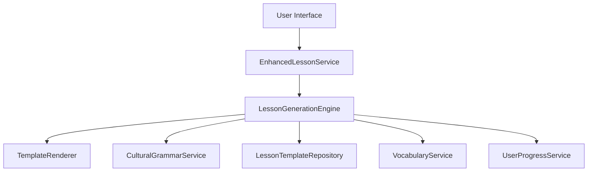
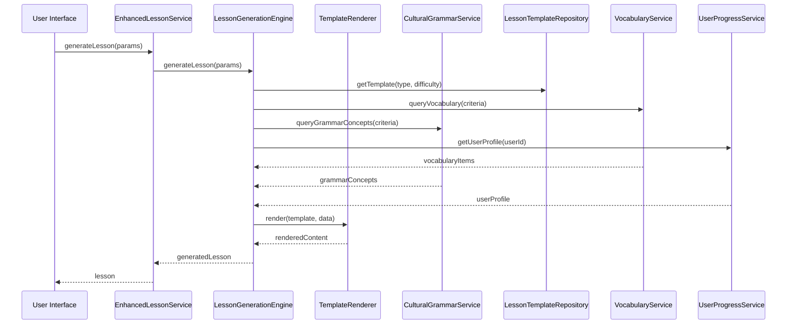

# Dynamic Lesson Generation: Development Guide

## 📋 Overview

This guide provides comprehensive documentation for developers working on the dynamic lesson generation system. It covers architecture, development practices, extension points, and maintenance procedures.

## 🏗️ System Architecture

### Component Overview



### Data Flow



## 📁 Project Structure

```
src/lib/services/lesson-generation/
├── lesson-generation.ts         # LessonGenerationEngine
├── template-renderer.ts         # TemplateRenderer
├── cultural-grammar.ts          # CulturalGrammarService
├── lesson-templates.ts          # LessonTemplateRepository
├── types.ts                     # Type definitions
└── index.ts                     # Exports

src/lib/data/templates/
├── vocabulary/                  # Vocabulary lesson templates
├── grammar/                     # Grammar lesson templates
├── mixed/                       # Mixed content templates
└── [template-name].json         # Individual template files

src/lib/services/
└── enhanced-lesson.ts           # EnhancedLessonService

tests/
├── unit/lesson-generation/      # Unit tests
├── integration/lesson-generation/ # Integration tests
└── e2e/                         # End-to-end tests
```

## 🚀 Development Setup

### Prerequisites

1. **Node.js**: v20.x or higher
2. **pnpm**: v8.x or higher
3. **TypeScript**: v5.x or higher
4. **Svelte**: v5.x with Runes enabled

### Installation

```bash
# Clone the repository
git clone <repository-url>
cd bulgarian-german-learning-app

# Install dependencies
pnpm install

# Set up environment variables
cp .env.example .env
# Edit .env with appropriate values
```

### Development Commands

| Command | Description |
|---------|-------------|
| `pnpm run dev` | Start development server |
| `pnpm run build` | Build for production |
| `pnpm run test` | Run all tests |
| `pnpm run test:unit` | Run unit tests |
| `pnpm run test:integration` | Run integration tests |
| `pnpm run test:e2e` | Run end-to-end tests |
| `pnpm run coverage` | Generate test coverage report |
| `pnpm run lint` | Run ESLint |
| `pnpm run format` | Run Prettier formatting |

## 🛠️ Development Practices

### 1. Coding Standards

1. **TypeScript**: Use strict mode with no `any` types
2. **Svelte 5**: Use Runes syntax (`$state`, `$derived`, `$effect`)
3. **Naming Conventions**:
   - **Classes**: PascalCase (e.g., `LessonGenerationEngine`)
   - **Methods**: camelCase (e.g., `generateLesson`)
   - **Variables**: camelCase (e.g., `lessonTemplate`)
   - **Constants**: UPPER_SNAKE_CASE (e.g., `MAX_LESSON_ITEMS`)
   - **Interfaces**: PascalCase with `I` prefix (e.g., `ILessonTemplate`)
4. **Error Handling**: Use try-catch blocks for async operations
5. **Logging**: Use appropriate log levels (error, warn, info, debug)
6. **Documentation**: Document all public methods and interfaces

### 2. Template Development

1. **Template Structure**: Follow the template specifications
2. **Variable Naming**: Use descriptive variable names
3. **Conditional Logic**: Use `{{#if}}` blocks for optional content
4. **Loops**: Use `{{#each}}` blocks for repeating content
5. **Error Handling**: Provide fallback content for missing data
6. **Accessibility**: Ensure templates generate accessible content

### 3. Testing Practices

1. **Test Coverage**: Aim for 90%+ coverage for all components
2. **Test Types**: Write unit, integration, and end-to-end tests
3. **Test Data**: Use realistic test data that covers edge cases
4. **Test Naming**: Use descriptive test names (e.g., `should generate thematic lesson with valid parameters`)
5. **Test Isolation**: Ensure tests don't depend on each other
6. **Performance Tests**: Include performance tests for critical paths

### 4. Performance Considerations

1. **Lazy Loading**: Load templates and data on demand
2. **Caching**: Cache frequently used templates and data
3. **Batch Processing**: Process data in batches when possible
4. **Memory Management**: Avoid memory leaks with large data sets
5. **Optimized Algorithms**: Use efficient algorithms for lesson generation

## 🔧 API Documentation

### LessonGenerationEngine

#### `generateLesson(params: LessonGenerationParams): Promise<GeneratedLesson>`

**Description**: Generate a lesson based on the provided parameters.

**Parameters**:
- `params`: Lesson generation parameters
  - `type`: Lesson type (`'vocabulary'`, `'grammar'`, `'mixed'`)
  - `difficulty`: Lesson difficulty (`'A1'`, `'A2'`, `'B1'`, `'B2'`, `'C1'`)
  - `criteria`: Query criteria for content selection
    - `categories`: Vocabulary categories to include
    - `partOfSpeech`: Part of speech to focus on
    - `difficulty`: Difficulty level for content
    - `limit`: Maximum number of items to include
  - `userId`: User ID for personalized content
  - `metadata`: Additional metadata for the lesson

**Returns**: Promise resolving to a generated lesson.

**Example**:
```typescript
const lesson = await lessonGenerationEngine.generateLesson({
  type: 'vocabulary',
  difficulty: 'A1',
  criteria: { categories: ['house'] },
  userId: 'user-123'
});
```

#### `generateThematicLesson(params: LessonGenerationParams): Promise<GeneratedLesson>`

**Description**: Generate a thematic vocabulary lesson.

**Parameters**: Same as `generateLesson`.

**Returns**: Promise resolving to a generated thematic lesson.

#### `generateGrammarLesson(params: LessonGenerationParams): Promise<GeneratedLesson>`

**Description**: Generate a grammar-focused lesson.

**Parameters**: Same as `generateLesson`.

**Returns**: Promise resolving to a generated grammar lesson.

### TemplateRenderer

#### `render(template: LessonTemplate, data: Record<string, any>): string`

**Description**: Render a template with the provided data.

**Parameters**:
- `template`: Lesson template to render
- `data`: Data to render into the template

**Returns**: Rendered content as a string.

**Example**:
```typescript
const content = templateRenderer.render(template, {
  sectionTitle: 'House Vocabulary',
  count: 5,
  vocabulary: vocabularyItems
});
```

### CulturalGrammarService

#### `query(criteria: GrammarQueryCriteria): Promise<CulturalGrammarConcept[]>`

**Description**: Query grammar concepts based on criteria.

**Parameters**:
- `criteria`: Query criteria
  - `difficulty`: Difficulty level
  - `partOfSpeech`: Part of speech
  - `limit`: Maximum number of concepts to return

**Returns**: Promise resolving to an array of grammar concepts.

**Example**:
```typescript
const concepts = await culturalGrammarService.query({
  difficulty: 'A2',
  partOfSpeech: 'noun',
  limit: 1
});
```

### LessonTemplateRepository

#### `getTemplate(type: LessonType, difficulty: LessonDifficulty): Promise<LessonTemplate>`

**Description**: Get a template by type and difficulty.

**Parameters**:
- `type`: Lesson type
- `difficulty`: Lesson difficulty

**Returns**: Promise resolving to a lesson template.

**Example**:
```typescript
const template = await lessonTemplateRepository.getTemplate('vocabulary', 'A1');
```

### EnhancedLessonService

#### `generateLessonFromCriteria(criteria: EnhancedLessonCriteria): Promise<Lesson>`

**Description**: Generate a lesson from enhanced criteria (extends legacy method).

**Parameters**:
- `criteria`: Enhanced lesson criteria
  - `userId`: User ID for personalized content
  - `type`: Lesson type
  - `difficulty`: Lesson difficulty
  - `categories`: Vocabulary categories
  - `partOfSpeech`: Part of speech
  - `limit`: Maximum number of items
  - `metadata`: Additional metadata

**Returns**: Promise resolving to a lesson in legacy format.

**Example**:
```typescript
const lesson = await enhancedLessonService.generateLessonFromCriteria({
  userId: 'user-123',
  categories: ['house'],
  difficulty: 'A1',
  limit: 5
});
```

#### `generateThematicLesson(params: LessonGenerationParams): Promise<Lesson>`

**Description**: Generate a thematic lesson.

**Parameters**: Same as `LessonGenerationParams`.

**Returns**: Promise resolving to a lesson in legacy format.

#### `generateGrammarLesson(params: LessonGenerationParams): Promise<Lesson>`

**Description**: Generate a grammar lesson.

**Parameters**: Same as `LessonGenerationParams`.

**Returns**: Promise resolving to a lesson in legacy format.

## 🧩 Extension Points

### 1. Adding New Lesson Types

1. **Define Type**: Add the new type to the `LessonType` enum in `types.ts`
2. **Create Templates**: Add templates for the new lesson type in the appropriate directory
3. **Update Engine**: Add generation logic to `LessonGenerationEngine`
4. **Update Service**: Add method to `EnhancedLessonService` if needed
5. **Add Tests**: Create tests for the new lesson type

### 2. Adding New Template Variables

1. **Define Variable**: Add the variable to the template's `variables` array
2. **Update Template**: Use the variable in the template content
3. **Update Renderer**: Ensure the renderer can handle the variable type
4. **Add Tests**: Test the variable in template rendering

### 3. Adding New Grammar Concepts

1. **Add Data**: Add the concept to `data/cultural-grammar.json`
2. **Update Service**: Ensure the service can query the new concept
3. **Create Templates**: Add templates for the new concept type
4. **Add Tests**: Test the concept in lesson generation

### 4. Adding New Algorithms

1. **Implement Algorithm**: Add the algorithm to the appropriate service
2. **Integrate**: Connect the algorithm to the lesson generation flow
3. **Add Configuration**: Make the algorithm configurable if needed
4. **Add Tests**: Test the algorithm thoroughly

## 🛠️ Troubleshooting Guide

### Common Issues and Solutions

| Issue | Symptoms | Solution |
|-------|----------|----------|
| **Template Rendering Errors** | Missing content, error messages about variables | Check template variables, ensure all required variables are provided |
| **Lesson Generation Failures** | Lesson generation returns fallback lesson | Check error logs, verify data sources are available |
| **Missing Templates** | Error about no template found | Verify template exists, check type and difficulty range |
| **Slow Performance** | Lesson generation takes > 100ms | Profile the code, optimize algorithms, check data loading |
| **Incorrect Difficulty** | Lesson difficulty doesn't match user proficiency | Check user profile data, verify difficulty adjustment algorithm |
| **Missing Vocabulary** | No vocabulary items in generated lesson | Check vocabulary query criteria, verify data availability |
| **Missing Grammar Concepts** | No grammar concepts in generated lesson | Check grammar query criteria, verify data availability |
| **Type Errors** | TypeScript compilation errors | Check type definitions, ensure proper typing throughout |
| **Template Syntax Errors** | Template rendering fails with syntax errors | Validate template syntax, check for unclosed blocks |
| **Data Loading Errors** | Errors loading vocabulary or grammar data | Check data file paths, verify data format, test data loading |

### Debugging Procedures

1. **Enable Debug Logging**:
   ```typescript
   // Add to your code
   console.debug('Debug information:', {
     template: template.id,
     data: templateData,
     rendered: renderedContent
   });
   ```

2. **Check Data Sources**:
   ```typescript
   // Check vocabulary data
   const vocab = await db.getVocabulary();
   console.log('Vocabulary items:', vocab.length);

   // Check grammar data
   const grammar = await culturalGrammarService.getAllConcepts();
   console.log('Grammar concepts:', grammar.length);
   ```

3. **Test Template Rendering**:
   ```typescript
   // Test template rendering with sample data
   const testData = template.exampleData || {
     sectionTitle: 'Test',
     count: 1,
     vocabulary: [{
       german: 'Test',
       bulgarian: 'тест',
       partOfSpeech: 'noun',
       difficulty: 1.0,
       categories: ['uncategorized']
     }]
   };

   const rendered = templateRenderer.render(template, testData);
   console.log('Rendered content:', rendered);
   ```

4. **Profile Performance**:
   ```typescript
   // Measure performance
   const start = performance.now();
   await lessonGenerationEngine.generateLesson(params);
   const end = performance.now();
   console.log(`Generation took ${end - start}ms`);
   ```

5. **Validate Data**:
   ```typescript
   // Validate vocabulary data
   const vocab = await db.getVocabulary();
   vocab.forEach(item => {
     if (!item.id || !item.german || !item.bulgarian) {
       console.warn('Invalid vocabulary item:', item);
     }
   });

   // Validate grammar data
   const grammar = await culturalGrammarService.getAllConcepts();
   grammar.forEach(concept => {
     if (!concept.id || !concept.difficulty) {
       console.warn('Invalid grammar concept:', concept);
     }
   });
   ```

## 🔄 Maintenance Procedures

### 1. Template Maintenance

1. **Template Updates**:
   - Regularly review and update templates for quality
   - Add new templates for new lesson types or difficulty levels
   - Remove unused or outdated templates

2. **Template Validation**:
   ```bash
   # Validate all templates
   pnpm run validate-templates
   ```

3. **Template Testing**:
   ```bash
   # Test all templates with sample data
   pnpm run test-templates
   ```

### 2. Data Maintenance

1. **Vocabulary Data**:
   - Regularly update vocabulary data with new words
   - Clean and validate existing vocabulary data
   - Backup vocabulary data before making changes

2. **Grammar Data**:
   - Add new grammar concepts as needed
   - Update existing concepts with new insights
   - Validate grammar data structure

3. **Data Backup**:
   ```bash
   # Backup vocabulary data
   cp data/vocabulary.json data/backups/vocabulary-$(date +%Y%m%d).json

   # Backup grammar data
   cp data/cultural-grammar.json data/backups/cultural-grammar-$(date +%Y%m%d).json
   ```

### 3. Performance Monitoring

1. **Performance Metrics**:
   - Monitor lesson generation time
   - Track template rendering performance
   - Measure memory usage

2. **Performance Optimization**:
   - Profile slow operations
   - Optimize algorithms
   - Implement caching where appropriate

3. **Performance Testing**:
   ```bash
   # Run performance tests
   pnpm run test:performance
   ```

### 4. Dependency Management

1. **Dependency Updates**:
   - Regularly update dependencies
   - Test updates in a staging environment
   - Update documentation for breaking changes

2. **Dependency Audit**:
   ```bash
   # Check for vulnerable dependencies
   pnpm audit

   # Update dependencies
   pnpm update
   ```

### 5. Documentation Updates

1. **Keep Documentation Current**:
   - Update documentation when adding new features
   - Document breaking changes
   - Maintain API documentation

2. **Documentation Review**:
   ```bash
   # Review documentation for completeness
   pnpm run review-docs
   ```

## 📅 Release Process

### 1. Release Checklist

1. [ ] All tests pass
2. [ ] Test coverage meets targets
3. [ ] Performance targets met
4. [ ] Documentation updated
5. [ ] Breaking changes documented
6. [ ] Migration guide created (if needed)
7. [ ] Release notes prepared
8. [ ] Version number updated

### 2. Versioning

- **Major**: Breaking changes, significant new features
- **Minor**: Backward-compatible new features
- **Patch**: Backward-compatible bug fixes

### 3. Release Steps

1. **Prepare Release**:
   ```bash
   # Update version in package.json
   pnpm version major|minor|patch

   # Create release branch
   git checkout -b release/vX.X.X
   ```

2. **Test Release**:
   ```bash
   # Run all tests
   pnpm test

   # Test in staging environment
   pnpm run build
   pnpm run preview
   ```

3. **Document Release**:
   ```bash
   # Generate changelog
   pnpm run changelog

   # Update release notes
   # Edit RELEASE_NOTES.md
   ```

4. **Publish Release**:
   ```bash
   # Merge to main
   git checkout main
   git merge release/vX.X.X

   # Tag release
   git tag vX.X.X
   git push origin vX.X.X

   # Publish to npm (if applicable)
   pnpm publish
   ```

## 🎯 Future Enhancements

### 1. Planned Features

| Feature | Description | Priority |
|---------|-------------|----------|
| **Adaptive Learning** | Lessons that adapt to user performance in real-time | High |
| **Contextual Lessons** | Lessons based on user's current learning context | High |
| **User-Generated Content** | Allow users to create and share custom lessons | Medium |
| **Lesson Analytics** | Track lesson effectiveness and user engagement | Medium |
| **Collaborative Learning** | Support for group lessons and study sessions | Low |
| **Offline Mode** | Generate lessons without internet connection | Low |

### 2. Research Areas

1. **Machine Learning Integration**:
   - Personalized lesson recommendations
   - Adaptive difficulty adjustment
   - Content optimization based on user performance

2. **Natural Language Processing**:
   - Automated content generation
   - Grammar error detection
   - Language proficiency assessment

3. **Gamification**:
   - Lesson completion rewards
   - Progress tracking
   - Competitive learning features

4. **Multimedia Integration**:
   - Audio pronunciation
   - Video examples
   - Interactive exercises

## 📚 Additional Resources

### 1. Related Documentation

- [Lesson Generation Architecture](docs/architecture/LESSON_GENERATION_ARCHITECTURE.md)
- [Template Specifications](docs/development/TEMPLATE_SPECIFICATIONS.md)
- [Testing Plan](docs/development/TESTING_PLAN.md)
- [Integration Guide](docs/development/INTEGRATION_GUIDE.md)

### 2. External Resources

- [Svelte 5 Documentation](https://svelte.dev/docs/svelte-5)
- [TypeScript Handbook](https://www.typescriptlang.org/docs/handbook/)
- [Zod Validation](https://zod.dev/)
- [Playwright Testing](https://playwright.dev/)
- [Vitest Testing](https://vitest.dev/)
- [WCAG 2.1 Guidelines](https://www.w3.org/TR/WCAG21/)

### 3. Community Resources

- [Bulgarian-German Learning Community](https://example.com/community)
- [Language Learning Research](https://example.com/research)
- [Open Educational Resources](https://example.com/oer)