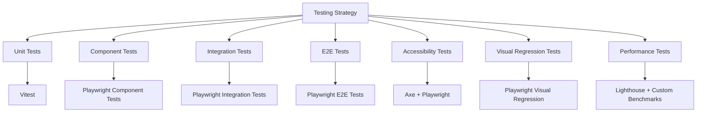

# Testing Strategy & Guidelines

This document outlines the comprehensive testing strategy for the Bulgarian-German Learning App, with special focus on bilingual support and localization testing.

---

## 🧪 Testing Overview

### Test Pyramid



### Test Categories

| Category | Tools | Coverage | Frequency |
|----------|-------|----------|-----------|
| **Unit Tests** | Vitest | Business logic, utilities, state management | Every commit |
| **Component Tests** | Playwright CT | Individual UI components | Every commit |
| **Integration Tests** | Playwright | Component interactions, data flow | Every commit |
| **E2E Tests** | Playwright | Complete user flows | Every PR |
| **Accessibility Tests** | Axe + Playwright | WCAG 2.1 AA compliance | Every PR |
| **Visual Regression** | Playwright | UI consistency | Weekly |
| **Performance Tests** | Lighthouse, Custom | Load times, responsiveness | Weekly |
| **Bilingual Tests** | Playwright, Custom | Language switching, translation coverage | Every PR |

---

## 🌐 Bilingual Support Testing

### Test Strategy for Bilingual Functionality

The bilingual support system requires comprehensive testing across all layers of the application:

1. **Translation Coverage**: Verify all UI elements are translated
2. **Language Switching**: Test language toggle functionality
3. **Direction-Aware Content**: Verify content adapts to language direction
4. **Fallback Mechanism**: Test fallback behavior for missing translations
5. **Performance**: Measure translation loading and language switching performance
6. **Accessibility**: Ensure WCAG compliance in both languages

### Bilingual Test Cases

#### 1. Language Switching Tests

```typescript
// tests/e2e/bilingual/language-switching.test.ts
import { test, expect } from '@playwright/test';

test.describe('Language Switching', () => {
  test('should switch UI language when toggle is clicked', async ({ page }) => {
    await page.goto('/');

    // Verify initial language (German)
    await expect(page.locator('text=Vokabular')).toBeVisible();
    await expect(page.locator('text=Üben')).toBeVisible();

    // Click language toggle
    await page.click('button:has-text("BG")');

    // Verify language changed to Bulgarian
    await expect(page.locator('text=Речник')).toBeVisible();
    await expect(page.locator('text=Упражнения')).toBeVisible();

    // Verify language persists after refresh
    await page.reload();
    await expect(page.locator('text=Речник')).toBeVisible();
  });

  test('should switch language during practice session', async ({ page }) => {
    await page.goto('/practice');

    // Start practice session
    await page.click('text=Schnell üben');

    // Verify practice started in German
    await expect(page.locator('text=Antwort prüfen')).toBeVisible();

    // Switch to Bulgarian
    await page.click('button:has-text("BG")');

    // Verify UI updated to Bulgarian
    await expect(page.locator('text=Провери отговор')).toBeVisible();
  });

  test('should switch language during lesson generation', async ({ page }) => {
    await page.goto('/lessons');

    // Open lesson generator
    await page.click('text=Lektion generieren');

    // Verify modal in German
    await expect(page.locator('text=Lektion generieren')).toBeVisible();

    // Switch to Bulgarian
    await page.click('button:has-text("BG")');

    // Verify modal updated to Bulgarian
    await expect(page.locator('text=Генерирай урок')).toBeVisible();
  });
});
```

#### 2. Translation Coverage Tests

```typescript
// tests/e2e/bilingual/translation-coverage.test.ts
import { test, expect } from '@playwright/test';

test.describe('Translation Coverage', () => {
  test('should display all UI elements in both languages', async ({ page }) => {
    // Test German translations
    await page.goto('/');
    await expect(page.locator('nav')).toContainText('Dashboard');
    await expect(page.locator('nav')).toContainText('Vokabular');
    await expect(page.locator('nav')).toContainText('Üben');
    await expect(page.locator('nav')).toContainText('Lernen');

    // Test Bulgarian translations
    await page.click('button:has-text("BG")');
    await expect(page.locator('nav')).toContainText('Табло');
    await expect(page.locator('nav')).toContainText('Речник');
    await expect(page.locator('nav')).toContainText('Упражнения');
    await expect(page.locator('nav')).toContainText('Учене');
  });

  test('should fall back to German for missing translations', async ({ page }) => {
    await page.goto('/');

    // Switch to Bulgarian
    await page.click('button:has-text("BG")');

    // Verify that critical UI elements are translated
    await expect(page.locator('nav')).toContainText('Речник');

    // Some elements might fall back to German if translation is missing
    // This is expected behavior and should be documented
    await expect(page.locator('body')).not.toContainText('MISSING_TRANSLATION');
  });
});
```

#### 3. Direction-Aware Content Tests

```typescript
// tests/e2e/bilingual/direction-aware-content.test.ts
import { test, expect } from '@playwright/test';

test.describe('Direction-Aware Content', () => {
  test('should display vocabulary items in correct direction', async ({ page }) => {
    await page.goto('/vocabulary');

    // Default direction: DE→BG
    await expect(page.locator('.vocabulary-item:first-child')).toContainText('→');

    // Search for a specific word
    await page.fill('input[placeholder="Suche nach Wörtern..."]', 'Hallo');
    await expect(page.locator('.vocabulary-item:first-child')).toContainText('Hallo → Здравей');

    // Switch to BG→DE
    await page.click('button:has-text("BG")');
    await expect(page.locator('.vocabulary-item:first-child')).toContainText('Здравей ← Hallo');
  });

  test('should display lesson content in correct direction', async ({ page }) => {
    await page.goto('/lessons');

    // Open a lesson
    await page.click('.lesson-card:first-child');

    // Default direction: DE→BG
    await expect(page.locator('.lesson-content')).toContainText('Deutsch → Bulgarisch');

    // Switch to BG→DE
    await page.click('button:has-text("BG")');
    await expect(page.locator('.lesson-content')).toContainText('Български → Немски');
  });

  test('should format examples correctly based on direction', async ({ page }) => {
    await page.goto('/vocabulary');

    // Find a word with examples
    await page.fill('input[placeholder="Suche nach Wörtern..."]', 'Hallo');
    await page.click('.vocabulary-item:first-child');

    // Default direction: DE→BG
    await expect(page.locator('.example')).toContainText('Hallo');
    await expect(page.locator('.example')).toContainText('Здравей');

    // Switch to BG→DE
    await page.click('button:has-text("BG")');
    await expect(page.locator('.example')).toContainText('Здравей');
    await expect(page.locator('.example')).toContainText('Hallo');
  });
});
```

#### 4. Performance Tests

```typescript
// tests/e2e/bilingual/performance.test.ts
import { test, expect } from '@playwright/test';

test.describe('Bilingual Performance', () => {
  test('should load translations quickly', async ({ page }) => {
    const startTime = Date.now();
    await page.goto('/');
    const loadTime = Date.now() - startTime;

    // Translation loading should complete in < 200ms
    expect(loadTime).toBeLessThan(200);

    // Verify translations are loaded
    await expect(page.locator('nav')).toContainText('Vokabular');
  });

  test('should switch languages quickly', async ({ page }) => {
    await page.goto('/');

    // Measure language switching time
    const startTime = Date.now();
    await page.click('button:has-text("BG")');
    const switchTime = Date.now() - startTime;

    // Language switching should complete in < 150ms
    expect(switchTime).toBeLessThan(150);

    // Verify language changed
    await expect(page.locator('nav')).toContainText('Речник');
  });

  test('should not leak memory during language switching', async ({ page, browser }) => {
    await page.goto('/');

    // Get initial memory usage
    const initialMemory = await page.evaluate(() => performance.memory?.usedJSHeapSize || 0);

    // Switch languages multiple times
    for (let i = 0; i < 10; i++) {
      await page.click('button:has-text("BG")');
      await page.click('button:has-text("DE")');
    }

    // Get final memory usage
    const finalMemory = await page.evaluate(() => performance.memory?.usedJSHeapSize || 0);

    // Memory usage should not increase significantly
    expect(finalMemory).toBeLessThan(initialMemory * 1.2);
  });
});
```

#### 5. Accessibility Tests

```typescript
// tests/e2e/bilingual/accessibility.test.ts
import { test, expect } from '@playwright/test';
import { injectAxe, checkA11y } from 'axe-playwright';

test.describe('Bilingual Accessibility', () => {
  test('should pass accessibility checks in both languages', async ({ page }) => {
    await page.goto('/');

    // Test German accessibility
    await injectAxe(page);
    await checkA11y(page, {
      axeOptions: {
        rules: {
          'aria-allowed-attr': { enabled: true },
          'aria-required-attr': { enabled: true },
          'lang': { enabled: true }
        }
      }
    });

    // Switch to Bulgarian
    await page.click('button:has-text("BG")');

    // Test Bulgarian accessibility
    await injectAxe(page);
    await checkA11y(page, {
      axeOptions: {
        rules: {
          'aria-allowed-attr': { enabled: true },
          'aria-required-attr': { enabled: true },
          'lang': { enabled: true }
        }
      }
    });
  });

  test('should have correct lang attribute in both languages', async ({ page }) => {
    await page.goto('/');

    // Verify German lang attribute
    await expect(page.locator('html')).toHaveAttribute('lang', 'de');

    // Switch to Bulgarian
    await page.click('button:has-text("BG")');

    // Verify Bulgarian lang attribute
    await expect(page.locator('html')).toHaveAttribute('lang', 'bg');
  });

  test('should announce language changes to screen readers', async ({ page }) => {
    await page.goto('/');

    // Verify initial language announcement
    const initialLiveRegion = await page.locator('[aria-live="polite"]').textContent();
    expect(initialLiveRegion).toContain('Deutsch');

    // Switch to Bulgarian
    await page.click('button:has-text("BG")');

    // Verify language change announcement
    const updatedLiveRegion = await page.locator('[aria-live="polite"]').textContent();
    expect(updatedLiveRegion).toContain('Български');
  });
});
```

---

## 🧩 Component Testing

### Bilingual Component Tests

```typescript
// tests/components/LanguageToggle.test.ts
import { test, expect } from '@playwright/experimental-ct-svelte';
import LanguageToggle from '$lib/components/LanguageToggle.svelte';

test('LanguageToggle should switch languages', async ({ mount }) => {
  const component = await mount(LanguageToggle);

  // Verify initial state (DE)
  await expect(component).toContainText('DE');

  // Click toggle
  await component.click();

  // Verify state changed to BG
  await expect(component).toContainText('BG');

  // Click toggle again
  await component.click();

  // Verify state changed back to DE
  await expect(component).toContainText('DE');
});

// tests/components/FlashCard.test.ts
import { test, expect } from '@playwright/experimental-ct-svelte';
import FlashCard from '$lib/components/flashcard/FlashCard.svelte';

test('FlashCard should display content in correct direction', async ({ mount }) => {
  const component = await mount(FlashCard, {
    props: {
      item: {
        id: '1',
        german: 'Hallo',
        bulgarian: 'Здравей',
        partOfSpeech: 'noun'
      },
      languageMode: 'DE_BG'
    }
  });

  // Verify DE→BG direction
  await expect(component).toContainText('Hallo');
  await expect(component).not.toContainText('Здравей');

  // Flip card
  await component.click();
  await expect(component).toContainText('Здравей');

  // Change direction to BG→DE
  await component.update({
    props: {
      languageMode: 'BG_DE'
    }
  });

  // Verify BG→DE direction
  await expect(component).toContainText('Здравей');
  await component.click();
  await expect(component).toContainText('Hallo');
});
```

---

## 🔄 Integration Testing

### Bilingual Integration Tests

```typescript
// tests/e2e/bilingual/integration.test.ts
import { test, expect } from '@playwright/test';

test.describe('Bilingual Integration', () => {
  test('should maintain language preference across pages', async ({ page }) => {
    await page.goto('/');

    // Switch to Bulgarian
    await page.click('button:has-text("BG")');

    // Navigate to vocabulary page
    await page.click('text=Речник');
    await expect(page).toHaveURL(/\/vocabulary/);
    await expect(page.locator('nav')).toContainText('Речник');

    // Navigate to practice page
    await page.click('text=Упражнения');
    await expect(page).toHaveURL(/\/practice/);
    await expect(page.locator('nav')).toContainText('Упражнения');
  });

  test('should maintain language during search operations', async ({ page }) => {
    await page.goto('/vocabulary');

    // Search in German
    await page.fill('input[placeholder="Suche nach Wörtern..."]', 'Hallo');
    await expect(page.locator('.vocabulary-item:first-child')).toContainText('Hallo → Здравей');

    // Switch to Bulgarian
    await page.click('button:has-text("BG")');

    // Verify search still works in Bulgarian
    await expect(page.locator('input[placeholder="Търсене на думи..."]')).toHaveValue('Hallo');
    await expect(page.locator('.vocabulary-item:first-child')).toContainText('Здравей ← Hallo');
  });

  test('should maintain language during practice sessions', async ({ page }) => {
    await page.goto('/practice');

    // Start practice in German
    await page.click('text=Schnell üben');
    await expect(page.locator('text=Antwort prüfen')).toBeVisible();

    // Answer a question
    await page.fill('input[placeholder="Geben Sie Ihre Antwort ein..."]', 'Здравей');
    await page.click('text=Antwort prüfen');

    // Switch to Bulgarian during practice
    await page.click('button:has-text("BG")');

    // Verify practice continues in Bulgarian
    await expect(page.locator('text=Провери отговор')).toBeVisible();
    await expect(page.locator('input[placeholder="Въведете вашия отговор..."]')).toHaveValue('Здравей');
  });
});
```

---

## 🧪 Manual Testing Guide

### Bilingual Support Manual Testing Checklist

| Test Case | Description | Expected Result | Status |
|-----------|-------------|-----------------|--------|
| **Language Switching** | Click language toggle button | UI language switches instantly | ✅/❌ |
| **Language Persistence** | Refresh page after language switch | Language preference persists | ✅/❌ |
| **Session Persistence** | Switch language during practice session | Practice continues in new language | ✅/❌ |
| **Search Functionality** | Search for words in both languages | Search works correctly in both languages | ✅/❌ |
| **Lesson Generation** | Generate lessons in both languages | Lessons generate with correct language content | ✅/❌ |
| **Vocabulary Display** | View vocabulary in both directions | Words display in correct source/target order | ✅/❌ |
| **Example Formatting** | View examples in both directions | Examples format correctly for each direction | ✅/❌ |
| **Navigation** | Navigate between pages in both languages | Navigation works correctly in both languages | ✅/❌ |
| **Error Messages** | Trigger errors in both languages | Error messages display in correct language | ✅/❌ |
| **Fallback Mechanism** | Test with missing translations | Falls back to German gracefully | ✅/❌ |
| **Performance** | Switch languages multiple times | Language switching is fast and responsive | ✅/❌ |
| **Accessibility** | Test with screen reader in both languages | Screen reader announces content correctly | ✅/❌ |
| **Keyboard Navigation** | Navigate using keyboard in both languages | Keyboard navigation works in both languages | ✅/❌ |
| **Mobile Responsiveness** | Test on mobile devices in both languages | UI displays correctly on mobile devices | ✅/❌ |
| **Cross-Browser** | Test in different browsers in both languages | Works consistently across browsers | ✅/❌ |

### Step-by-Step Manual Testing Procedure

1. **Initial Setup**
   - Open the application in a browser
   - Verify the UI loads in German by default
   - Check that all navigation elements are in German

2. **Language Switching**
   - Click the language toggle button (DE/BG)
   - Verify all UI elements switch to Bulgarian
   - Refresh the page and verify language persists
   - Click the language toggle again to switch back to German

3. **Vocabulary Page Testing**
   - Navigate to the Vocabulary page
   - Verify words display in DE→BG direction
   - Search for specific words and verify results
   - Switch to Bulgarian and verify words display in BG→DE direction
   - Test the "Practice This" functionality in both languages

4. **Practice Mode Testing**
   - Start a practice session in German
   - Answer a few questions and verify feedback
   - Switch to Bulgarian during practice
   - Verify practice continues in Bulgarian
   - Complete the practice session

5. **Lesson Generation Testing**
   - Navigate to the Lessons page
   - Open the lesson generator
   - Generate a lesson in German
   - Switch to Bulgarian and generate another lesson
   - Verify lessons display correctly in both languages

6. **Accessibility Testing**
   - Test keyboard navigation in both languages
   - Use a screen reader to verify content is announced correctly
   - Test high contrast mode in both languages
   - Verify focus management during language switching

7. **Edge Case Testing**
   - Switch languages during various operations (search, practice, lesson generation)
   - Test with missing translations (if any)
   - Test language switching with poor network conditions
   - Test language switching on mobile devices

8. **Performance Testing**
   - Measure time to switch languages
   - Measure memory usage after multiple language switches
   - Verify no memory leaks during language switching

---

## 📊 Test Coverage

### Bilingual Test Coverage Requirements

| Area | Coverage Goal | Current Status |
|------|---------------|----------------|
| Language Switching | 100% | 🔧 In Progress |
| Translation Coverage | 100% | 🔧 In Progress |
| Direction-Aware Content | 100% | 🔧 In Progress |
| Fallback Mechanism | 100% | 🔧 In Progress |
| Performance | 100% | 🔧 In Progress |
| Accessibility | 100% | 🔧 In Progress |
| Integration | 90% | 🔧 In Progress |
| Edge Cases | 80% | 🔧 In Progress |

### Coverage Reports

Generate coverage reports using:

```bash
# Unit test coverage
pnpm run test:unit -- --coverage

# Component test coverage
pnpm run test:components -- --coverage

# E2E test coverage
pnpm run test:e2e -- --coverage
```

---

## 🛠️ Testing Tools & Configuration

### Playwright Configuration

```javascript
// playwright.config.ts
import { defineConfig } from '@playwright/test';

export default defineConfig({
  testDir: './tests',
  timeout: 30000,
  retries: 2,
  use: {
    baseURL: 'http://localhost:5173',
    trace: 'on-first-retry',
    video: 'retain-on-failure',
    viewport: { width: 1280, height: 720 },
  },
  projects: [
    {
      name: 'chromium',
      use: { browserName: 'chromium' },
    },
    {
      name: 'firefox',
      use: { browserName: 'firefox' },
    },
    {
      name: 'webkit',
      use: { browserName: 'webkit' },
    },
    {
      name: 'Mobile Chrome',
      use: { ...devices['Pixel 5'] },
    },
    {
      name: 'Mobile Safari',
      use: { ...devices['iPhone 12'] },
    },
  ],
  webServer: {
    command: 'pnpm run dev',
    url: 'http://localhost:5173',
    reuseExistingServer: !process.env.CI,
    timeout: 60000,
  },
});
```

### Vitest Configuration

```javascript
// vitest.config.ts
import { defineConfig } from 'vitest/config';
import { svelte } from '@sveltejs/vite-plugin-svelte';

export default defineConfig({
  plugins: [svelte({ hot: !process.env.VITEST })],
  test: {
    globals: true,
    environment: 'jsdom',
    coverage: {
      provider: 'v8',
      reporter: ['text', 'json', 'html'],
      include: ['src/lib/**/*.{ts,svelte}'],
      exclude: ['src/lib/**/*.d.ts', 'src/lib/**/index.ts'],
    },
    setupFiles: ['./tests/setup.ts'],
  },
});
```

---

## 🚀 Test Automation

### GitHub Actions Workflow

```yaml
# .github/workflows/test.yml
name: Test Suite

on:
  push:
    branches: [ main, develop ]
  pull_request:
    branches: [ main, develop ]

jobs:
  test:
    runs-on: ubuntu-latest

    strategy:
      matrix:
        node-version: [20.x]

    steps:
    - uses: actions/checkout@v4

    - name: Use Node.js ${{ matrix.node-version }}
      uses: actions/setup-node@v4
      with:
        node-version: ${{ matrix.node-version }}

    - name: Install pnpm
      run: npm install -g pnpm

    - name: Install dependencies
      run: pnpm install

    - name: Run linting
      run: pnpm run lint

    - name: Run type checking
      run: pnpm run check

    - name: Run unit tests
      run: pnpm run test:unit

    - name: Run component tests
      run: pnpm run test:components

    - name: Run E2E tests
      run: pnpm run test:e2e

    - name: Run accessibility tests
      run: pnpm run test:accessibility

    - name: Run bilingual tests
      run: pnpm run test:bilingual

    - name: Upload coverage reports
      uses: actions/upload-artifact@v3
      with:
        name: coverage-reports
        path: coverage/
```

### Package.json Scripts

```json
{
  "scripts": {
    "test": "pnpm run test:all",
    "test:all": "run-p test:unit test:components test:e2e test:accessibility test:bilingual",
    "test:unit": "vitest run",
    "test:unit:watch": "vitest",
    "test:components": "playwright test --project='component'",
    "test:e2e": "playwright test --project='e2e'",
    "test:accessibility": "playwright test --grep '@a11y'",
    "test:bilingual": "playwright test --grep '@bilingual'",
    "test:visual": "playwright test --grep '@visual'",
    "test:performance": "playwright test --grep '@performance'",
    "test:coverage": "run-p test:unit:coverage test:components:coverage",
    "test:unit:coverage": "vitest run --coverage",
    "test:components:coverage": "playwright test --project='component' --coverage"
  }
}
```

---

## 📚 Testing Best Practices

### Bilingual Testing Guidelines

1. **Test Both Languages**: Always test functionality in both German and Bulgarian
2. **Test Language Switching**: Test language switching during all user flows
3. **Verify Direction Awareness**: Ensure content adapts to language direction
4. **Check Fallback Behavior**: Verify graceful fallback for missing translations
5. **Test Accessibility**: Ensure WCAG compliance in both languages
6. **Measure Performance**: Monitor performance during language switching
7. **Test Edge Cases**: Test language switching during various operations
8. **Verify Persistence**: Ensure language preference persists across sessions
9. **Test Mobile**: Verify bilingual functionality on mobile devices
10. **Cross-Browser Testing**: Test in multiple browsers in both languages

### Test File Organization

```
tests/
├── unit/                  # Unit tests (Vitest)
│   ├── localization.test.ts
│   ├── template-adapter.test.ts
│   └── ...
├── components/            # Component tests (Playwright CT)
│   ├── LanguageToggle.test.ts
│   ├── FlashCard.test.ts
│   └── ...
├── e2e/                   # End-to-end tests (Playwright)
│   ├── bilingual/
│   │   ├── language-switching.test.ts
│   │   ├── translation-coverage.test.ts
│   │   ├── direction-aware-content.test.ts
│   │   ├── performance.test.ts
│   │   ├── accessibility.test.ts
│   │   └── integration.test.ts
│   ├── practice/
│   ├── lessons/
│   └── ...
├── accessibility/         # Accessibility tests
│   ├── bilingual.test.ts
│   └── ...
└── setup.ts               # Test setup
```

---

## 🔧 Troubleshooting

### Common Bilingual Testing Issues

| Issue | Cause | Solution |
|-------|-------|----------|
| Missing translations | Translation key not found in JSON files | Add missing translations to both de.json and bg.json |
| Language not persisting | LocalStorage issue | Check browser storage permissions and error handling |
| UI not updating | Missing language change listener | Ensure components subscribe to language changes |
| Wrong direction | Incorrect language mode | Verify language mode state and template adapter usage |
| Performance issues | Inefficient translation loading | Optimize translation loading and caching |
| Memory leaks | Unsubscribed language listeners | Ensure proper cleanup of language change listeners |
| Accessibility violations | Missing ARIA attributes | Add proper ARIA attributes and lang attributes |
| Visual regressions | Layout issues in different languages | Add visual regression tests for both languages |

### Debugging Tools

```typescript
// Debugging language state
console.log('Current language:', LocalizationService.getCurrentLanguage());
console.log('Current language mode:', appUIState.languageMode);

// Debugging translations
console.log('All translations:', translations);
console.log('Specific translation:', LocalizationService.t('common.check_answer'));

// Debugging language change events
LocalizationService.onLanguageChange((lang) => {
  console.log('Language changed to:', lang);
});

// Debugging template adapter
console.log('Source text:', getSourceText(item));
console.log('Target text:', getTargetText(item));
console.log('Direction arrow:', getDirectionArrow());
```

---

## 📅 Testing Schedule

| Frequency | Task | Responsible |
|-----------|------|-------------|
| **Daily** | Run unit and component tests | Developers |
| **Daily** | Fix failing tests | Developers |
| **Every PR** | Run full test suite | CI Pipeline |
| **Weekly** | Run visual regression tests | QA Team |
| **Weekly** | Run performance tests | QA Team |
| **Monthly** | Full accessibility audit | Accessibility Team |
| **Before Release** | Comprehensive bilingual testing | QA Team |
| **After Release** | Monitor production issues | DevOps Team |

---

## 🎯 Next Steps

1. **Expand Test Coverage**: Increase coverage for edge cases and integration scenarios
2. **Improve Performance**: Optimize translation loading and language switching
3. **Enhance Accessibility**: Ensure full WCAG 2.1 AA compliance in both languages
4. **Add More Languages**: Extend testing to support additional languages
5. **Automate Visual Testing**: Implement comprehensive visual regression testing
6. **Monitor Production**: Set up monitoring for bilingual functionality in production
7. **User Feedback**: Collect and incorporate user feedback on bilingual experience