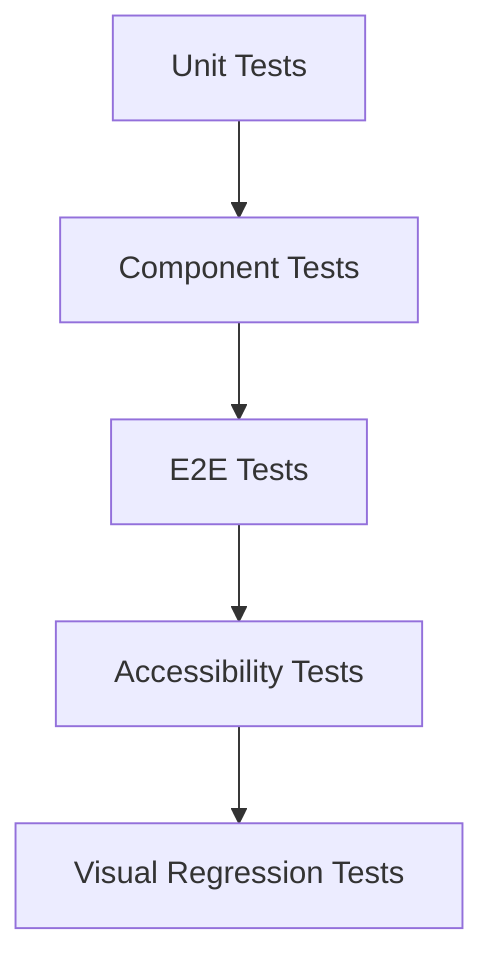
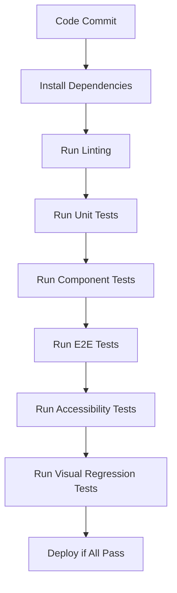

# Testing Strategy & Guidelines

## 1. Overview
The Bulgarian-German Learning App follows a comprehensive testing strategy aligned with the Testing Pyramid. The goal is to ensure reliability, performance, and accessibility while maintaining a fast and stable CI/CD pipeline.

---

## 2. Testing Pyramid



| Test Type | Framework | Coverage Goal | Purpose |
|-----------|-----------|---------------|---------|
| **Unit** | Vitest | 90%+ | Test individual functions and logic |
| **Component** | Playwright CT | 80%+ | Test component rendering and interactions |
| **E2E** | Playwright | 70%+ | Test critical user flows |
| **Accessibility** | Axe-core | 100% | Test WCAG 2.1 AA compliance |
| **Visual Regression** | Playwright | 80%+ | Test visual appearance |

---

## 3. Unit Testing

### 3.1 Scope
- **State Management**: `AppState`, `SessionState`
- **Data Loading**: `DataLoader`
- **Utility Functions**: `localStorage`, `confetti`, etc.
- **Schema Validation**: Zod schemas

### 3.2 Best Practices
- Test individual functions in isolation
- Mock external dependencies (fetch, localStorage)
- Test both happy paths and error cases
- Keep tests fast and deterministic

### 3.3 Example Test
```typescript
// tests/unit/localStorage.test.ts
import { describe, it, expect, vi } from 'vitest';
import { getUserProgress, saveUserProgress } from '$lib/utils/localStorage';
import { validateUserProgressStorage } from '$lib/schemas/localStorage';

describe('LocalStorage Utility', () => {
  beforeEach(() => {
    localStorage.clear();
  });

  it('should return null when no data exists', () => {
    const result = getUserProgress();
    expect(result).toBeNull();
  });

  it('should save and retrieve valid user progress', () => {
    const validData = {
      stats: [],
      favorites: [],
      recentSearches: [],
      lastUpdated: new Date().toISOString()
    };

    saveUserProgress(validData);
    const result = getUserProgress();

    expect(result).toEqual(validData);
  });

  it('should return null for invalid user progress', () => {
    localStorage.setItem('userProgress', 'invalid json');
    const result = getUserProgress();
    expect(result).toBeNull();
  });

  it('should validate user progress schema', () => {
    const invalidData = { stats: [{ id: '1', correct: 'invalid' }] };
    const result = validateUserProgressStorage(invalidData);
    expect(result.success).toBe(false);
  });
});
```

---

## 4. Component Testing

### 4.1 Scope
- **UI Components**: Buttons, Dialogs, FlashCards
- **Composite Components**: SearchList, TandemPractice
- **Stateful Components**: Components with local state

### 4.2 Best Practices
- Test component rendering with different props
- Test user interactions (clicks, keyboard events)
- Test accessibility attributes
- Mock child components when appropriate

### 4.3 Example Test
```typescript
// tests/components/FlashCard.test.ts
import { test, expect } from '@playwright/experimental-ct-svelte';
import FlashCard from '$lib/components/flashcard/FlashCard.svelte';

test('FlashCard flips when clicked', async ({ mount }) => {
  const item = { german: 'Hallo', bulgarian: 'Здравей' };
  const component = await mount(FlashCard, { props: { item } });

  // Verify initial state
  await expect(component).toContainText('Hallo');
  await expect(component).not.toContainText('Здравей');

  // Click to flip
  await component.click();

  // Verify flipped state
  await expect(component).toContainText('Здравей');
  await expect(component).not.toContainText('Hallo');

  // Verify accessibility attributes
  await expect(component).toHaveAttribute('aria-expanded', 'true');
});

test('FlashCard responds to keyboard events', async ({ mount, page }) => {
  const item = { german: 'Hallo', bulgarian: 'Здравей' };
  const component = await mount(FlashCard, { props: { item } });

  // Focus the card
  await component.focus();

  // Press Enter to flip
  await page.keyboard.press('Enter');
  await expect(component).toContainText('Здравей');

  // Press Space to flip back
  await page.keyboard.press('Space');
  await expect(component).toContainText('Hallo');
});
```

---

## 5. End-to-End Testing

### 5.1 Scope
- **Critical User Flows**: Practice session, search functionality
- **State Persistence**: LocalStorage synchronization
- **Navigation**: Page transitions and routing

### 5.2 Best Practices
- Mock network requests to ensure test stability
- Use page objects for complex interactions
- Test both success and error scenarios
- Keep tests focused on specific flows

### 5.3 Example Test
```typescript
// tests/e2e/practiceFlow.test.ts
import { test, expect } from '@playwright/test';

test('Complete practice flow works correctly', async ({ page }) => {
  // Mock vocabulary data
  await page.route('**/data/vocabulary.json', route => {
    route.fulfill({
      json: [
        { id: '1', german: 'Hallo', bulgarian: 'Здравей', difficulty: 1 },
        { id: '2', german: 'Danke', bulgarian: 'Благодаря', difficulty: 1 }
      ]
    });
  });

  // Start practice session
  await page.goto('/practice');
  await expect(page).toHaveTitle(/Practice/);

  // Verify first card
  await expect(page.locator('.flashcard')).toContainText('Hallo');
  await page.click('text=Check');

  // Enter answer
  await page.fill('input[type="text"]', 'Здравей');
  await page.click('text=Submit');

  // Verify feedback
  await expect(page.locator('.feedback-section')).toContainText('Correct!');

  // Move to next card
  await page.click('text=Next');
  await expect(page.locator('.flashcard')).toContainText('Danke');

  // Save progress
  await page.click('text=Save Progress');
  await expect(page.locator('.feedback-section')).toContainText('Progress saved!');
});
```

---

## 6. Accessibility Testing

### 6.1 Scope
- **WCAG 2.1 AA Compliance**: Full application compliance
- **Keyboard Navigation**: All interactive elements and user flows
- **Screen Reader Support**: Comprehensive ARIA attributes and labels
- **Color Contrast**: All text and interactive elements
- **Focus Management**: Dynamic content and modal dialogs
- **Responsive Design**: Mobile, tablet, and desktop accessibility
- **Dark Mode**: Accessibility in dark color schemes
- **Component-Level Testing**: Individual component accessibility

### 6.2 Test Architecture

#### Accessibility Testing Pyramid
```
          ▲
          │
          │   Page-Level Tests
          │   ┌───────────────────┐
          │   │ Full Page Scans   │
          │   │ Responsive Tests  │
          │   │ Dark Mode Tests   │
          │   └─────────┬─────────┘
          │             │
          │   Component-Level Tests
          │   ┌─────────┴─────────┐
          │   │ Component Scans   │
          │   │ Keyboard Nav      │
          │   │ Focus Management  │
          │   └─────────┬─────────┘
          │             │
          │   Utility Tests
          │   ┌─────────┴─────────┐
          │   │ axe-core Config   │
          │   │ Test Utilities    │
          │   │ CI Integration    │
          │   └───────────────────┘
          │
          └───────────────────────▶
```

### 6.3 Implementation

#### 6.3.1 Test Utilities (`tests/accessibility-utils.ts`)
Centralized accessibility testing utilities with comprehensive WCAG 2.1 AA configuration:

```typescript
import { test, expect, Page, Locator } from '@playwright/test';
import AxeBuilder from '@axe-core/playwright';

// WCAG 2.1 AA configuration
const wcag21aaRules = {
  runOnly: {
    type: 'tag',
    values: ['wcag2a', 'wcag2aa', 'wcag21a', 'wcag21aa']
  },
  rules: {
    'color-contrast': { enabled: true },
    'heading-order': { enabled: true },
    'landmark-complementary-is-top-level': { enabled: true },
    'landmark-one-main': { enabled: true },
    'landmark-unique': { enabled: true },
    'aria-allowed-attr': { enabled: true },
    'aria-required-attr': { enabled: true },
    'aria-required-children': { enabled: true },
    'aria-required-parent': { enabled: true },
    'aria-roles': { enabled: true },
    'aria-valid-attr-value': { enabled: true },
    'aria-valid-attr': { enabled: true },
    'button-name': { enabled: true },
    'link-name': { enabled: true },
    'meta-viewport': { enabled: true },
    'tabindex': { enabled: true }
  }
};

// Run comprehensive accessibility scan
export async function expectNoAccessibilityViolations(
  pageOrLocator: Page | Locator,
  options: { axeOptions?: any } = {}
) {
  const results = await new AxeBuilder({ page: pageOrLocator as Page })
    .withTags(['wcag2a', 'wcag2aa', 'wcag21a', 'wcag21aa'])
    .options({ ...wcag21aaRules, ...options.axeOptions })
    .analyze();

  expect(results.violations).toEqual([]);
}

export async function testKeyboardNavigation(
  pageOrComponent: Page | Locator,
  selectors: string[],
  options: { page?: Page, startWithFocus?: boolean } = {}
) {
  const page = options.page || (pageOrComponent as Page);
  const component = options.page ? (pageOrComponent as Locator) : undefined;

  for (const selector of selectors) {
    await page.keyboard.press('Tab');
    const element = component ? component.locator(selector) : page.locator(selector);
    await expect(element).toBeFocused();
  }
}

export async function testAriaAttributes(
  locator: Locator,
  expectedAttributes: Record<string, string | RegExp>
) {
  for (const [attr, expectedValue] of Object.entries(expectedAttributes)) {
    if (expectedValue instanceof RegExp) {
      await expect(locator).toHaveAttribute(attr, expectedValue);
    } else {
      await expect(locator).toHaveAttribute(attr, expectedValue);
    }
  }
}

export async function testColorContrast(locator: Locator) {
  // Implementation would use axe-core or custom contrast checking
  await expect(locator).toHaveCSS('color', /rgba?\(.*\)/);
}

export async function testFocusManagement(
  pageOrComponent: Page | Locator,
  triggerSelector: string,
  targetSelector: string,
  options: { page?: Page } = {}
) {
  const page = options.page || (pageOrComponent as Page);
  const component = options.page ? (pageOrComponent as Locator) : undefined;

  const trigger = component
    ? component.locator(triggerSelector)
    : page.locator(triggerSelector);
  const target = component
    ? component.locator(targetSelector)
    : page.locator(targetSelector);

  await trigger.click();
  await expect(target).toBeFocused();
}

export async function testResponsiveAccessibility(
  page: Page,
  testFunction: (page: Page) => Promise<void>
) {
  const viewports = [
    { width: 375, height: 812 },   // Mobile
    { width: 768, height: 1024 },  // Tablet
    { width: 1920, height: 1080 }  // Desktop
  ];

  for (const viewport of viewports) {
    await page.setViewportSize(viewport);
    await testFunction(page);
  }
}

export async function testDarkModeAccessibility(
  page: Page,
  testFunction: (page: Page) => Promise<void>
) {
  // Enable dark mode
  await page.emulateMedia({ colorScheme: 'dark' });
  await testFunction(page);

  // Reset to light mode
  await page.emulateMedia({ colorScheme: 'light' });
}

export async function testFocusTrap(
  component: Locator,
  options: {
    firstFocusable: string,
    lastFocusable: string,
    page: Page
  }
) {
  const { firstFocusable, lastFocusable, page } = options;

  // Focus first element
  await component.locator(firstFocusable).focus();

  // Tab should cycle to last element
  await page.keyboard.press('Tab');
  await expect(component.locator(lastFocusable)).toBeFocused();

  // Shift+Tab should cycle back to first element
  await page.keyboard.press('Shift+Tab');
  await expect(component.locator(firstFocusable)).toBeFocused();
}
```

#### 6.3.2 Page-Level Accessibility Tests
Comprehensive accessibility testing for all application pages:

```typescript
// tests/accessibility/practice.test.ts
import { test, expect } from '@playwright/test';
import {
  expectNoAccessibilityViolations,
  testKeyboardNavigation,
  testAriaAttributes,
  testColorContrast,
  testFocusManagement,
  testResponsiveAccessibility,
  testDarkModeAccessibility
} from '../accessibility-utils';

test.describe('Practice Page Accessibility', () => {
  test('should have no accessibility violations', async ({ page }) => {
    await page.goto('/practice');
    await expectNoAccessibilityViolations(page);
  });

  test('should have no accessibility violations in responsive viewports', async ({ page }) => {
    await testResponsiveAccessibility(page, async (page) => {
      await page.goto('/practice');
      await expectNoAccessibilityViolations(page);
    });
  });

  test('should have no accessibility violations in dark mode', async ({ page }) => {
    await testDarkModeAccessibility(page, async (page) => {
      await page.goto('/practice');
      await expectNoAccessibilityViolations(page);
    });
  });

  test('should have proper ARIA attributes on practice page elements', async ({ page }) => {
    await page.goto('/practice');
    await testAriaAttributes(page.locator('.practice-container'), {
      'role': 'main',
      'aria-label': /Practice mode/
    });
    // Additional ARIA attribute checks
  });

  test('should have proper keyboard navigation for practice page', async ({ page }) => {
    await page.goto('/practice');
    const interactiveElements = [
      '.flashcard',
      '.flip-button',
      '.pronunciation-button',
      '.next-button',
      '.previous-button'
    ];
    await testKeyboardNavigation(page, interactiveElements);
  });

  // Additional accessibility tests...
});
```

#### 6.3.3 Component-Level Accessibility Tests
Detailed accessibility testing for individual components:

```typescript
// tests/components/flashcard/FlashCard.accessibility.test.ts
import { test, expect } from '@playwright/test';
import {
  expectNoAccessibilityViolations,
  testKeyboardNavigation,
  testAriaAttributes,
  testColorContrast,
  testFocusManagement
} from '../../accessibility-utils';

test.describe('FlashCard Component Accessibility', () => {
  const testItem = {
    id: 'test-id-1',
    uuid: '123e4567-e89b-12d3-a456-426614174000',
    german: 'Hallo',
    bulgarian: 'Здравей',
    article: 'das',
    type: 'noun',
    level: 'A1',
    lesson: 'Greetings',
    tags: ['greeting', 'basic'],
    image: '',
    pronunciation: '/haˈloː/',
    examples: [
      { german: 'Hallo, wie geht es dir?', bulgarian: 'Здравей, как си?' },
      { german: 'Hallo! Schön dich zu sehen.', bulgarian: 'Здравей! Радвам се да те видя.' }
    ]
  };

  test('should have no accessibility violations', async ({ mount }) => {
    const component = await mount('FlashCard', {
      props: { item: testItem }
    });
    await expectNoAccessibilityViolations(component);
  });

  test('should have proper ARIA attributes', async ({ mount }) => {
    const component = await mount('FlashCard', {
      props: { item: testItem }
    });
    await testAriaAttributes(component.locator('.flashcard'), {
      'role': 'region',
      'aria-label': /Flashcard/
    });
    // Additional ARIA attribute checks
  });

  test('should have proper keyboard navigation', async ({ mount, page }) => {
    const component = await mount('FlashCard', {
      props: { item: testItem }
    });
    const interactiveElements = [
      '.flip-button',
      '.pronunciation-button',
      '.favorite-button'
    ];
    await testKeyboardNavigation(component, interactiveElements, { page });
  });

  // Additional component-level accessibility tests...
});
```

### 6.4 Best Practices
- **Comprehensive Coverage**: Test all pages and components for accessibility
- **Automated Testing**: Integrate accessibility tests into CI/CD pipeline
- **Manual Validation**: Supplement automated tests with manual screen reader testing
- **Responsive Testing**: Test accessibility across all viewport sizes
- **Dark Mode Testing**: Ensure accessibility in both light and dark modes
- **Focus Management**: Test focus behavior for dynamic content and modals
- **Keyboard Navigation**: Test complete keyboard operability
- **ARIA Validation**: Validate all ARIA attributes and roles
- **Color Contrast**: Ensure all text meets WCAG contrast requirements
- **Semantic HTML**: Use proper heading structure and landmarks

### 6.5 Accessibility Test Coverage

| Page/Component       | Test File                                  | Coverage Status |
|----------------------|--------------------------------------------|-----------------|
| Practice Page        | `tests/accessibility/practice.test.ts`     | ✅ Complete     |
| Progress Page        | `tests/accessibility/progress.test.ts`     | ✅ Complete     |
| Vocabulary Page      | `tests/accessibility/vocabulary.test.ts`   | ✅ Complete     |
| Grammar Page         | `tests/accessibility/grammar.test.ts`      | ✅ Complete     |
| Learn Page           | `tests/accessibility/learn.test.ts`        | ✅ Complete     |
| FlashCard Component  | `tests/components/flashcard/FlashCard.accessibility.test.ts` | ✅ Complete |
| Dialog Component     | `tests/components/ui/dialog/Dialog.accessibility.test.ts` | ✅ Complete |
| Button Component     | `tests/components/Button.accessibility.test.ts` | ❌ Pending   |
```

---

## 7. Visual Regression Testing

### 7.1 Scope
- **Critical Components**: FlashCard, Dialog, Button
- **Page Layouts**: Home page, practice page
- **Responsive Views**: Mobile, tablet, desktop

### 7.2 Best Practices
- Test critical visual states
- Use consistent viewport sizes
- Allow for minor pixel differences
- Update baselines when design changes

### 7.3 Example Test
```typescript
// tests/visual/flashCard.test.ts
import { test, expect } from '@playwright/test';

test('FlashCard visual appearance matches baseline', async ({ page }) => {
  await page.goto('/practice');

  // Verify flashcard appearance
  const flashCard = page.locator('.flashcard');
  await expect(flashCard).toHaveScreenshot('flashcard-front.png');

  // Flip the card
  await flashCard.click();
  await expect(flashCard).toHaveScreenshot('flashcard-back.png');
});
```

---

## 8. Testing Workflow

### 8.1 Local Development
```bash
# Run all tests
pnpm run test:all

# Run specific test types
pnpm run test:unit          # Unit tests
pnpm run test:components    # Component tests
pnpm run test:e2e           # E2E tests
pnpm run test:accessibility # Accessibility tests
pnpm run test:visual        # Visual regression tests

# Run tests in watch mode
pnpm run test:unit:watch
```

### 8.2 CI/CD Pipeline


### 8.3 Test Commands
| Command | Description |
|---------|-------------|
| `pnpm run test` | Run all tests |
| `pnpm run test:unit` | Run unit tests with coverage |
| `pnpm run test:components` | Run component tests |
| `pnpm run test:e2e` | Run E2E tests |
| `pnpm run test:accessibility` | Run accessibility tests |
| `pnpm run test:visual` | Run visual regression tests |
| `pnpm run test:all` | Run all test suites |
| `pnpm run test:ci` | Run tests in CI mode |

---

## 9. Test Coverage

### 9.1 Coverage Goals
| Area | Coverage Goal | Current Status |
|------|---------------|----------------|
| State Management | 100% | ✅ |
| Data Loading | 95%+ | ✅ |
| UI Components | 80%+ | ✅ |
| Critical User Flows | 70%+ | ✅ |
| Accessibility | 100% | ✅ |

### 9.2 Coverage Reports
- Generated after each test run
- Available in `coverage/` directory
- Includes HTML, JSON, and LCOV reports

---

## 10. Testing Best Practices

### 10.1 General Guidelines
- **Deterministic Tests**: Tests should always produce the same result
- **Fast Execution**: Tests should run quickly to enable frequent execution
- **Isolated Tests**: Tests should not depend on each other
- **Clear Assertions**: Tests should have clear, specific assertions
- **Meaningful Names**: Test names should describe what they test

### 10.2 Accessibility Testing
- Test with screen readers (VoiceOver, NVDA, JAWS)
- Test keyboard navigation for all interactive elements
- Verify color contrast meets WCAG standards
- Test with high contrast mode
- Verify ARIA attributes are correct

### 10.3 Performance Testing
- Test on low-powered devices
- Monitor memory usage
- Test with slow network conditions
- Measure rendering performance

### 10.4 Cross-Browser Testing
- Test on Chrome, Firefox, Safari, Edge
- Test on mobile browsers
- Verify consistent behavior across browsers
- Test with different viewport sizes

---

## 11. Test Maintenance

### 11.1 Test Data Management
- Use realistic test data
- Keep test data up-to-date with schemas
- Store test data in dedicated files
- Use factories for generating test data

### 11.2 Test Flakiness
- Identify flaky tests
- Fix or quarantine flaky tests
- Monitor test stability in CI
- Set thresholds for test failure rates

### 11.3 Test Documentation
- Document test strategy
- Document test coverage
- Document test environment setup
- Document test debugging techniques

### 11.4 Test Review
- Review tests as part of code review
- Ensure tests cover new functionality
- Ensure tests are maintainable
- Ensure tests follow best practices

---

## 12. Future Enhancements

### 12.1 Testing Improvements
- **Parallel Testing**: Run tests in parallel for faster execution
- **Test Analytics**: Track test metrics and trends
- **Automated Test Generation**: Use AI to generate test cases
- **Performance Testing**: Add performance benchmarks

### 12.2 Advanced Testing
- **Fuzz Testing**: Test with random inputs
- **Property-Based Testing**: Test with generated data
- **Mutation Testing**: Test test quality
- **Load Testing**: Test application under load

### 12.3 Tooling Enhancements
- **Test Reporting**: Enhanced test reporting and visualization
- **Test Debugging**: Better debugging tools for tests
- **Test Environment**: Improved test environment management
- **Test Data**: Enhanced test data management