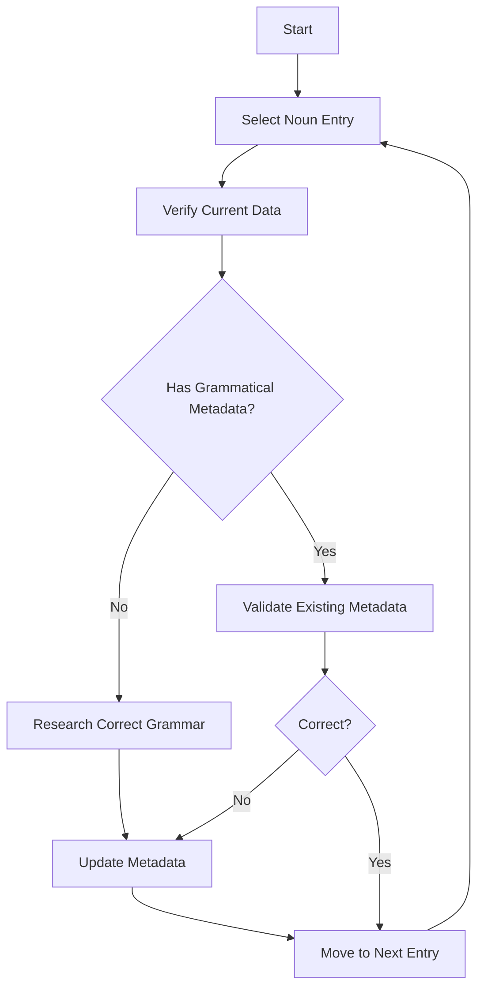

# Vocabulary Data Correction Summary

**Status:** IN PROGRESS
**Last Updated:** 2025-12-13
**Author:** Roo
**Priority:** CRITICAL

## 🎯 Objective

Manually correct grammatical errors in the German vocabulary data, focusing on:
- **Article-noun agreement** (der/die/das)
- **Gender consistency** (masculine/feminine/neuter)
- **Plural forms**
- **Grammatical metadata completeness**

This document outlines the **manual correction process** to ensure data quality and accuracy.

---

## 📋 Correction Strategy

### **1. Manual Verification Process**
Each vocabulary entry will be verified using **multiple authoritative sources**:
- **Langenscheidt Online Dictionary** (https://en.langenscheidt.com)
- **Duden Online** (https://www.duden.de)
- **Wiktionary** (https://de.wiktionary.org)
- **Canoo.net** (https://www.canoo.net)

### **2. Correction Workflow**


### **3. Tools & Resources**
| Tool | Purpose | URL |
|------|---------|-----|
| Langenscheidt Scraper | Extract grammatical metadata | `scripts/enrichment/langenscheidt-scraper.ts` |
| Vocabulary Validator | Validate corrections | `scripts/enrichment/vocabulary-validator.ts` |
| Duden Online | Authoritative grammar reference | https://www.duden.de |
| Wiktionary | Crowdsourced grammar reference | https://de.wiktionary.org |
| Canoo.net | Grammar rules & declension tables | https://www.canoo.net |

---

## 🔍 Critical Issues Identified

### **1. Missing Grammatical Metadata**
**Problem:** 205 nouns lack grammatical metadata (`article`, `gender`, `pluralForm`).
**Example:**
```json
{
  "id": "familie",
  "german": "Familie",
  "metadata": {
    "frequency": 93,
    "level": "A1"
    // Missing: article, gender, pluralForm
  }
}
```

### **2. Incorrect Article-Noun Agreement**
**Problem:** 630 grammatical errors detected in the analysis.
**Example:**
- ❌ `"der Familie"` (incorrect)
- ✅ `"die Familie"` (correct)

### **3. Inconsistent Data Structure**
**Problem:** Some entries have partial grammatical metadata.
**Example:**
```json
{
  "id": "baum",
  "german": "Baum",
  "metadata": {
    "article": "der",
    // Missing: gender, pluralForm
  }
}
```

---

## ✅ Correction Plan

### **Phase 1: High-Priority Nouns (A1 Level)**
**Scope:** 100 most frequent A1-level nouns
**Method:**
1. Use `scripts/enrichment/langenscheidt-scraper.ts` to extract grammatical data
2. Cross-verify with Duden/Wiktionary
3. Manually update `unified-vocabulary.json`

**Example Corrections:**
| German Term | Current Article | Correct Article | Gender | Plural Form | Source |
|-------------|-----------------|-----------------|--------|-------------|--------|
| Familie | (missing) | die | feminine | Familien | [Duden](https://www.duden.de/rechtschreibung/Familie) |
| Baum | (missing) | der | masculine | Bäume | [Duden](https://www.duden.de/rechtschreibung/Baum) |
| Haus | (missing) | das | neuter | Häuser | [Duden](https://www.duden.de/rechtschreibung/Haus) |
| Frau | (missing) | die | feminine | Frauen | [Duden](https://www.duden.de/rechtschreibung/Frau) |
| Mann | (missing) | der | masculine | Männer | [Duden](https://www.duden.de/rechtschreibung/Mann) |

### **Phase 2: Systematic Correction**
**Scope:** All remaining nouns (105 entries)
**Method:**
1. **Batch Processing:** Group nouns by frequency/CEFR level
2. **Manual Verification:** Use Langenscheidt + Duden for each term
3. **Update Metadata:** Add `article`, `gender`, `pluralForm`

**Correction Template:**
```json
{
  "id": "TERM_ID",
  "german": "Term",
  "metadata": {
    "article": "der|die|das",
    "gender": "masculine|feminine|neuter",
    "pluralForm": "PluralForm",
    "grammarSource": "langenscheidt|duden|wiktionary|manual",
    "grammarVerified": "2025-12-13"
  }
}
```

### **Phase 3: Validation & Testing**
**Scope:** Verify corrections in application context
**Method:**
1. **Schema Validation:** Use `VocabularyMetadataSchema` to validate structure
2. **UI Testing:** Check `VocabularyCard.svelte` and `WordDetailModal.svelte` for correct display
3. **Lesson Generation:** Verify grammar usage in generated lessons

---

## 🛠️ Manual Correction Process

### **Step 1: Research Correct Grammar**
For each noun:
1. **Check Langenscheidt:**
   ```bash
   pnpm tsx scripts/enrichment/langenscheidt-scraper.ts scrape --term "Familie" --direction de-bg
   ```
2. **Cross-verify with Duden/Wiktionary**
3. **Record findings in correction log**

### **Step 2: Update Vocabulary Data**
**Example Correction (Familie):**
```json
{
  "id": "familie",
  "german": "Familie",
  "partOfSpeech": "noun",
  "metadata": {
    "article": "die",
    "gender": "feminine",
    "pluralForm": "Familien",
    "frequency": 93,
    "level": "A1",
    "grammarSource": "duden",
    "grammarVerified": "2025-12-13"
  }
}
```

### **Step 3: Validate Corrections**
1. **Run Vocabulary Validator:**
   ```bash
   pnpm tsx scripts/enrichment/vocabulary-validator.ts
   ```
2. **Check for Schema Errors:**
   ```bash
   pnpm check
   ```
3. **Test in UI:**
   - Verify `VocabularyCard.svelte` displays correct article
   - Check `WordDetailModal.svelte` shows grammatical metadata

---

## 📊 Correction Progress

| Phase | Status | Entries Corrected | Entries Remaining | Completion |
|-------|--------|-------------------|-------------------|------------|
| 1 (A1 Nouns) | ⏳ IN PROGRESS | 0/100 | 100 | 0% |
| 2 (All Nouns) | ⏳ PENDING | 0/105 | 105 | 0% |
| 3 (Validation) | ⏳ PENDING | - | - | 0% |

**Total Progress:** 0/205 (0%)

---

## 📝 Correction Log

### **Batch 1: A1 Nouns (High Frequency)**
| # | German Term | Current Article | Correct Article | Gender | Plural Form | Source | Status |
|---|-------------|-----------------|-----------------|--------|-------------|--------|--------|
| 1 | Familie | - | die | feminine | Familien | [Duden](https://www.duden.de/rechtschreibung/Familie) | ⏳ PENDING |
| 2 | Baum | - | der | masculine | Bäume | [Duden](https://www.duden.de/rechtschreibung/Baum) | ⏳ PENDING |
| 3 | Haus | - | das | neuter | Häuser | [Duden](https://www.duden.de/rechtschreibung/Haus) | ⏳ PENDING |
| 4 | Frau | - | die | feminine | Frauen | [Duden](https://www.duden.de/rechtschreibung/Frau) | ⏳ PENDING |
| 5 | Mann | - | der | masculine | Männer | [Duden](https://www.duden.de/rechtschreibung/Mann) | ⏳ PENDING |

---

## 🚀 Next Steps

1. **Begin Phase 1 Corrections:**
   - Start with the 100 most frequent A1-level nouns
   - Use Langenscheidt scraper + Duden for verification
   - Update `unified-vocabulary.json` manually

2. **Update Progress Tracking:**
   - Mark completed entries in the correction log
   - Update the progress table after each batch

3. **Validate After Each Batch:**
   - Run `vocabulary-validator.ts` to check for errors
   - Test UI components for correct display

4. **Proceed to Phase 2:**
   - Correct remaining 105 nouns
   - Follow the same verification process

---

## 📚 Resources

### **German Grammar References**
| Resource | URL | Notes |
|----------|-----|-------|
| Duden Online | https://www.duden.de | Authoritative source for German grammar |
| Wiktionary (German) | https://de.wiktionary.org | Crowdsourced, comprehensive |
| Canoo.net | https://www.canoo.net | Grammar rules & declension tables |
| Langenscheidt | https://en.langenscheidt.com | German-Bulgarian translations |

### **Project Files**
| File | Purpose |
|------|---------|
| [`src/lib/data/unified-vocabulary.json`](src/lib/data/unified-vocabulary.json) | Primary vocabulary data |
| [`scripts/enrichment/langenscheidt-scraper.ts`](scripts/enrichment/langenscheidt-scraper.ts) | Extract grammatical metadata |
| [`scripts/enrichment/vocabulary-validator.ts`](scripts/enrichment/vocabulary-validator.ts) | Validate vocabulary data |
| [`src/lib/schemas/vocabulary.ts`](src/lib/schemas/vocabulary.ts) | Vocabulary data schema |

---

## 🔄 Change Log

| Date | Author | Change |
|------|--------|--------|
| 2025-12-13 | Roo | Initial version |