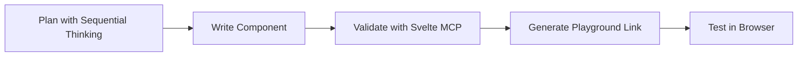
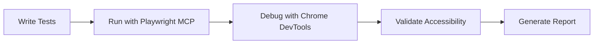
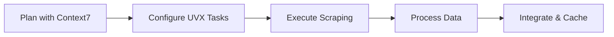

# MCP Server Setup Summary for Bulgarian-German Learning App

## ✅ Setup Complete

The MCP (Model Context Protocol) server configuration has been successfully implemented for the Bulgarian-German Learning App project. This setup provides powerful development tools that integrate seamlessly with the existing project structure.

## 📁 Files Created

### UVX Fetch MCP Server Configuration (`./uvx/`)

```bash
.uvx/
├── config.json              # Main UVX Fetch MCP configuration
├── endpoints.json           # API endpoint definitions
├── package.json             # UVX package configuration
├── README.md                # UVX configuration overview
├── test-config.js           # Configuration validation script
├── USAGE_GUIDE.md           # Comprehensive usage guide
└── cache/                   # Cache directory (auto-created)
```

### MCP Server Configuration (`./.vscode/`)

```bash
.vscode/
├── mcp-config.json          # Main MCP server configuration
├── MCP_SERVER_CONFIGURATION.md  # Server documentation
├── MCP_SETUP_COMPLETE.md    # Setup completion summary
├── MCP_WORKFLOWS.md         # Workflow guides
└── test-mcp-config.js       # Configuration validation script
```

### Root Documentation

```bash
MCP_SERVER_SETUP_SUMMARY.md  # This file - overall summary
```

## 🔧 Configured MCP Servers

### 1. Svelte MCP Server
- **Identifier**: `svelte`
- **Package**: `@sveltejs/mcp@latest`
- **Default**: ✅ Yes
- **Capabilities**: Svelte 5 runes validation, component validation, accessibility checking, playground generation

### 2. Context7 MCP Server
- **Identifier**: `context7`
- **Package**: `@upstash/context7-mcp@latest`
- **Capabilities**: Contextual analysis, multi-step reasoning, problem solving, strategic planning

### 3. Sequential Thinking MCP Server
- **Identifier**: `sequentialthinking`
- **Package**: `@modelcontextprotocol/server-sequential-thinking`
- **Capabilities**: Complex problem breakdown, iterative reasoning, hypothesis generation

### 4. Chrome DevTools MCP Server
- **Identifier**: `chrome-devtools`
- **Package**: `chrome-devtools-mcp@0.12.0`
- **Capabilities**: Browser automation, debugging, performance analysis, network monitoring

### 5. Playwright MCP Server
- **Identifier**: `playwright`
- **Package**: `@playwright/mcp@latest`
- **Capabilities**: End-to-end testing, component testing, accessibility testing, visual regression

### 6. UVX Fetch MCP Server
- **Identifier**: `uvx-fetch`
- **Package**: `uvx-fetch-mcp@latest`
- **Capabilities**: Web scraping, data fetching, HTML parsing, JSON extraction, content analysis

## 🎯 Server Groups

### Development Group
**Servers**: `svelte`, `sequentialthinking`
**Purpose**: Component development and architecture planning

### Testing Group
**Servers**: `playwright`, `chrome-devtools`
**Purpose**: End-to-end testing and browser debugging

### Data Enrichment Group
**Servers**: `uvx-fetch`, `context7`
**Purpose**: Vocabulary enrichment and data processing

### Full Stack Group
**Servers**: All servers
**Purpose**: Comprehensive development and testing

## 🚀 Quick Start

### 1. Install Required Packages
```bash
npm install -g @sveltejs/mcp @playwright/mcp uvx-fetch-mcp
```

### 2. Install VS Code MCP Extension
- Open VS Code
- Install "MCP Server Protocol" extension
- Restart VS Code

### 3. Verify Configurations
```bash
# Test UVX Fetch MCP configuration
cd .uvx && node test-config.js

# Test MCP server configuration
cd .vscode && node test-mcp-config.js
```

### 4. Start Using MCP Servers
```bash
# Manual server start (if needed)
npx @sveltejs/mcp@latest
npx @playwright/mcp@latest
npx uvx-fetch-mcp@latest

# In VS Code:
# 1. Open command palette (Ctrl+Shift+P)
# 2. Search for "MCP: Show Server View"
# 3. Select desired server
# 4. Use available capabilities
```

## 📚 Documentation

### Configuration Documentation
- `.vscode/MCP_SERVER_CONFIGURATION.md` - Detailed server capabilities and usage
- `.vscode/MCP_WORKFLOWS.md` - Comprehensive workflow guides
- `.vscode/MCP_SETUP_COMPLETE.md` - Setup completion details

### UVX Fetch Documentation
- `.uvx/README.md` - UVX configuration overview
- `.uvx/USAGE_GUIDE.md` - Usage examples and integration guides

### Quick Reference
- `MCP_SERVER_SETUP_SUMMARY.md` - This file (overall summary)

## 🎯 Common Use Cases

### Svelte Component Development


### Testing Workflow


### Data Enrichment


## ✅ Verification Results

Both configurations have been tested and validated:

### UVX Fetch MCP Configuration ✅
- Version: 1.0
- Default Server: uvx-fetch-mcp
- Servers Configured: 1
- All plugins enabled
- Configuration valid

### MCP Server Configuration ✅
- Version: 1.0
- Default Server: svelte
- Total Servers: 6
- Server Groups: 4
- All servers enabled
- Configuration valid

## 🛠️ Integration with Project

### Vocabulary Enrichment
Use UVX Fetch MCP to:
- Scrape additional vocabulary examples
- Fetch grammar rules and cultural notes
- Retrieve pronunciation audio files
- Enrich existing vocabulary data

### Component Development
Use Svelte MCP to:
- Validate Svelte 5 components
- Check accessibility compliance
- Generate playground links for sharing
- Ensure best practices

### Testing
Use Playwright MCP and Chrome DevTools MCP to:
- Run end-to-end tests
- Debug browser issues
- Validate accessibility
- Perform visual regression testing

### Architecture Decisions
Use Sequential Thinking MCP and Context7 MCP to:
- Break down complex problems
- Evaluate architecture options
- Make informed decisions
- Plan strategic improvements

## 📈 Configuration Summary

### UVX Fetch MCP
- **Server URL**: `http://localhost:3000`
- **Timeout**: 30,000ms
- **Rate Limiting**: 120 requests/minute, 20 burst
- **Caching**: 100MB max, 24-hour TTL
- **Logging**: Info level, 5MB rotation
- **Security**: SSL verification enabled

### MCP Servers
- **Total Servers**: 6
- **Default Server**: `svelte`
- **Server Groups**: 4 (development, testing, data_enrichment, full_stack)
- **Input Configurations**: 11
- **Logging**: 10MB max, 5 files rotation

## 🎓 Learning Resources

### Getting Started
1. **Read documentation** in `.vscode/` and `.uvx/` directories
2. **Test configurations** with provided scripts
3. **Explore MCP capabilities** in VS Code
4. **Integrate with workflow** gradually

### Best Practices
- Use server groups for common tasks
- Leverage caching for repeated operations
- Combine servers for complex tasks
- Monitor logs for issues
- Keep configurations version controlled

## 🛠️ Troubleshooting

### Common Issues and Solutions

**Issue**: MCP server not starting
```bash
npm cache clean --force
npm install -g @sveltejs/mcp @playwright/mcp uvx-fetch-mcp
```

**Issue**: Configuration problems
```bash
cd .uvx && node test-config.js
cd .vscode && node test-mcp-config.js
```

**Issue**: Connection issues
```bash
# Check logs
tail -f .vscode/mcp-server.log
tail -f .uvx/uvx-fetch.log

# Restart VS Code
code --disable-extensions && code --enable-extensions
```

## 🎉 Benefits of This Setup

### Enhanced Development Productivity
- **Automated validation** for Svelte components
- **Powerful testing** capabilities
- **Efficient data enrichment** tools
- **Intelligent decision making** support
- **Comprehensive debugging** utilities

### Improved Code Quality
- Consistent component validation
- Accessibility compliance checking
- Best practice enforcement
- Automated testing integration

### Streamlined Workflows
- Pre-configured server groups
- Comprehensive documentation
- Integration guides
- Test scripts for verification

### Future-Proof Architecture
- Modular server configuration
- Easy to add new servers
- Version-controlled configurations
- Scalable for project growth

## 🚀 Next Steps

### Immediate Actions
1. ✅ Review this summary
2. ✅ Read detailed documentation
3. ✅ Test configurations
4. ✅ Install required packages
5. ✅ Install VS Code MCP extension

### Integration Plan
1. **Start with Svelte MCP** for component development
2. **Add Playwright MCP** for testing
3. **Integrate UVX Fetch MCP** for data enrichment
4. **Use Sequential Thinking** for architecture decisions
5. **Gradually adopt** all MCP capabilities

### Long-Term Benefits
- **Faster development** with automated tools
- **Higher quality** with consistent validation
- **Better decisions** with intelligent analysis
- **Easier maintenance** with comprehensive testing
- **Enhanced collaboration** with shared workflows

## 📞 Support

For issues with MCP server setup:

1. **Check configuration files**
2. **Review documentation**
3. **Test configurations**
4. **Check logs**
5. **Consult MCP documentation**

## 🎊 Conclusion

The MCP server configuration is now complete and ready to significantly enhance the development experience for the Bulgarian-German Learning App project. With 6 powerful MCP servers configured and comprehensive documentation provided, the team can now leverage:

- **Automated Svelte component validation**
- **Powerful testing capabilities**
- **Efficient data enrichment tools**
- **Intelligent decision making support**
- **Comprehensive debugging utilities**

**Happy coding!** 🚀

The MCP servers will transform the development workflow by providing intelligent assistance, automated validation, and powerful testing capabilities that integrate seamlessly with the existing project structure.

## 📝 Version Information

- **MCP Configuration Version**: 1.0
- **UVX Fetch MCP Version**: 1.0
- **Documentation Last Updated**: December 19, 2025
- **Project**: Bulgarian-German Learning App
- **Status**: ✅ Setup Complete and Verified