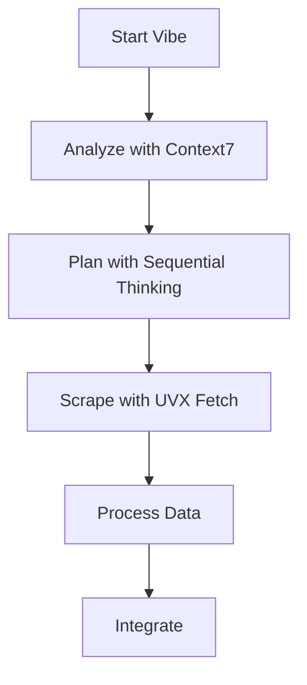
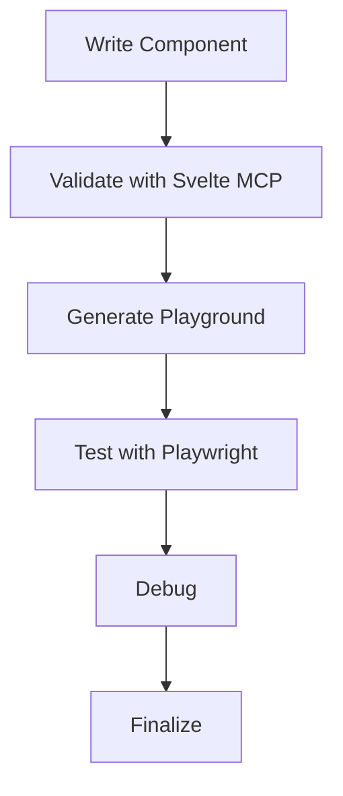

# Vibe MCP Configuration Summary for Bulgarian-German Learning App

## ✅ Vibe MCP Configuration Complete

The Vibe MCP (Model Context Protocol) configuration has been successfully created to extend Vibe's capabilities with the MCP servers configured for the Bulgarian-German Learning App project.

## 📁 Files Created

### Vibe MCP Configuration (`./vibe-mcp-config/`)

```bash
vibe-mcp-config/
├── vibe-mcp-config.toml  # Main Vibe MCP configuration
└── README.md             # Configuration documentation
```

### Root Documentation

```bash
VIBE_MCP_CONFIGURATION_SUMMARY.md  # This file - overall summary
```

## 🚀 Setup Instructions

### 1. Install Vibe

```bash
npm install -g @mistral/vibe
```

### 2. Configure Vibe Home Directory

```bash
# Set VIBE_HOME environment variable
export VIBE_HOME="/path/to/this/project/vibe-config"

# Add to shell configuration
echo 'export VIBE_HOME="/path/to/this/project/vibe-config"' >> ~/.zshrc
source ~/.zshrc
```

### 3. Set Up Configuration

```bash
mkdir -p $VIBE_HOME
cp vibe-mcp-config/vibe-mcp-config.toml $VIBE_HOME/config.toml
```

### 4. Install Required MCP Packages

```bash
npm install -g uvx-fetch-mcp @sveltejs/mcp @playwright/mcp @upstash/context7-mcp @modelcontextprotocol/server-sequential-thinking
```

## 🔧 Configured MCP Servers

### 1. UVX Fetch MCP Server

**Name**: `uvx_fetch_mcp`
**Transport**: `stdio`
**Command**: `uvx-fetch-mcp start`

**Tools**:
- `uvx_fetch_mcp_fetch` - Fetch content from URLs
- `uvx_fetch_mcp_scrape` - Scrape structured data
- `uvx_fetch_mcp_parse` - Parse HTML content
- `uvx_fetch_mcp_extract` - Extract data patterns

### 2. Svelte MCP Server

**Name**: `svelte_mcp`
**Transport**: `stdio`
**Command**: `npx -y @sveltejs/mcp@latest`

**Tools**:
- `svelte_mcp_validate` - Validate Svelte components
- `svelte_mcp_playground` - Generate playground links
- `svelte_mcp_accessibility` - Check accessibility

### 3. Playwright MCP Server

**Name**: `playwright_mcp`
**Transport**: `stdio`
**Command**: `npx @playwright/mcp@latest`

**Tools**:
- `playwright_mcp_test` - Run Playwright tests
- `playwright_mcp_debug` - Debug with Playwright
- `playwright_mcp_accessibility` - Validate accessibility

### 4. Context7 MCP Server

**Name**: `context7_mcp`
**Transport**: `stdio`
**Command**: `npx -y @upstash/context7-mcp@latest`

**Tools**:
- `context7_mcp_analyze` - Contextual analysis
- `context7_mcp_reason` - Multi-step reasoning

### 5. Sequential Thinking MCP Server

**Name**: `sequential_thinking_mcp`
**Transport**: `stdio`
**Command**: `npx -y @modelcontextprotocol/server-sequential-thinking`

**Tools**:
- `sequential_thinking_mcp_think` - Complex problem breakdown
- `sequential_thinking_mcp_hypothesis` - Hypothesis generation

## 📋 Configuration Details

### Tool Permissions

All MCP tools are configured with `"always"` permission for immediate access.

### Enabled Tools

```toml
enabled_tools = [
    "uvx_*",
    "svelte_*",
    "playwright_*",
    "context7_*",
    "sequential_*"
]
```

### Disabled Tools

```toml
disabled_tools = []
```

## 🎯 Usage Examples

### Vocabulary Enrichment

```bash
vibe
vibe> Use uvx_fetch_mcp_scrape to get vocabulary examples from https://language-examples.org
```

### Component Validation

```bash
vibe> Use svelte_mcp_validate to check the VocabularyCard component
```

### Testing

```bash
vibe> Use playwright_mcp_test to run the vocabulary search test
```

### Architecture Analysis

```bash
vibe> Use sequential_thinking_mcp_think to analyze the Vocabulary vs Learn page merge
```

## 🛠️ Troubleshooting

### MCP Server Issues

```bash
# Check installations
uvx-fetch-mcp --version
npx @sveltejs/mcp@latest --version

# Reinstall
npm install -g uvx-fetch-mcp @sveltejs/mcp @playwright/mcp
```

### Vibe Configuration

```bash
# Verify setup
echo $VIBE_HOME
cat $VIBE_HOME/config.toml

# Debug
vibe --debug
```

## 📚 Integration Workflows

### Vocabulary Enrichment



### Component Development



## 🎉 Benefits

### Enhanced Vibe Capabilities

- **Web Scraping**: Fetch external data efficiently
- **Component Validation**: Ensure Svelte best practices
- **Testing**: Run and debug tests seamlessly
- **Analysis**: Contextual reasoning and problem solving
- **Development**: Streamlined component creation

### Seamless Integration

- All MCP servers pre-configured for Vibe
- Consistent tool naming and permissions
- Easy to extend with additional servers
- Comprehensive documentation

## 🚀 Next Steps

1. **Set up Vibe home directory** with this configuration
2. **Install required MCP packages** globally
3. **Test Vibe with MCP servers**
4. **Integrate with your workflow**
5. **Explore advanced capabilities**

## 📞 Support

For issues:
1. Check Vibe logs
2. Verify MCP package installations
3. Test individual MCP servers
4. Review configuration file
5. Consult Vibe documentation

## 🎊 Conclusion

The Vibe MCP configuration is now complete and ready to use. This configuration extends Vibe's capabilities with:

- **5 powerful MCP servers** for different development tasks
- **Comprehensive tool permissions** for immediate access
- **Pre-configured workflows** for common tasks
- **Integration guides** for project workflows

**Happy coding with enhanced Vibe capabilities!** 🚀

The MCP servers will significantly enhance Vibe's functionality by providing intelligent assistance, automated validation, and powerful testing capabilities that integrate seamlessly with the Bulgarian-German Learning App project.

## 📝 Version Information

- **Vibe MCP Configuration Version**: 1.0
- **Documentation Last Updated**: December 19, 2025
- **Project**: Bulgarian-German Learning App
- **Status**: ✅ Setup Complete and Ready to Use