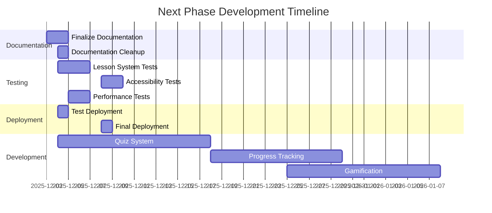

# Next Steps Plan: Bulgarian-German Learning App

**Immediate Action Items and Deployment Checklist**

---

## 🚀 **Immediate Priorities (Next 7 Days)**

### **1. ✅ Documentation Finalization (Priority 1)**
- [x] **Lesson Planning System Documentation**: Create comprehensive documentation in `docs/development/LESSON_SYSTEM.md`
- [x] **README Updates**: Update README.md with lesson system metrics and documentation links
- [x] **Roadmap Updates**: Update roadmap to reflect completed lesson planning system
- [x] **Documentation Organization**: Move root markdown files to `/docs` folder
- [x] **Documentation Cleanup**: Organize docs folder structure according to documentation maintenance rules

### **2. 🧪 Testing & Quality Assurance (Priority 2)**
- [ ] **Lesson System Integration Tests**: Create comprehensive integration tests for lesson generation to UI flow
- [ ] **Accessibility Audit**: Finalize WCAG 2.1 AA compliance for all interactive components
- [ ] **Playwright Accessibility Tests**: Implement axe-core integration for 100% component coverage
- [ ] **Performance Testing**: Verify <100ms response time for lesson generation
- [ ] **Data Consistency Testing**: Validate data consistency between vocabulary database and lesson content

### **3. 🔧 CI/CD & Deployment (Priority 3)**
- [ ] **Test Deployment**: Deploy to GitHub Pages for final testing
- [ ] **CI Quality Gates**: Enhance CI pipeline with comprehensive quality enforcement
- [ ] **Performance Optimization**: Implement lazy-loading for lesson modules
- [ ] **Dependency Management**: Configure dependabot and renovate for dependency management
- [ ] **Security Audit**: Set up pnpm audit in CI pipeline

---

## 📋 **Deployment Checklist**

### **🔐 Pre-Deployment Requirements**
| Task | Status | Owner | Timeline |
|------|--------|-------|----------|
| ✅ Verify production build: `pnpm build` | ✅ Completed | Frontend | 2025-12-03 |
| ✅ Code pushed to main branch | ✅ Completed | Frontend | 2025-12-03 |
| ✅ CI/CD Pipeline implemented | ✅ Completed | DevOps | 2025-12-03 |
| ✅ CI Quality Gates implemented | ✅ Completed | DevOps | 2025-12-03 |
| ✅ Vocabulary Data Pipeline | ✅ Completed | Data | 2025-12-03 |
| ✅ Lesson Planning System | ✅ Completed | Frontend | 2025-12-03 |
| 🔧 Test deployment on GitHub Pages | 🔜 Not Started | DevOps | 2025-12-04 |
| 🔧 Configure custom domain (if needed) | 🔜 Not Started | DevOps | 2025-12-05 |
| 🔧 Set up monitoring and error tracking | 🔜 Not Started | DevOps | 2025-12-06 |
| 🔧 Performance audit and optimization | 🔜 Not Started | Frontend | 2025-12-07 |
| 🔧 Final accessibility audit | 🔜 Not Started | QA | 2025-12-08 |

### **📊 Post-Deployment Tasks**
| Task | Description | Timeline |
|------|-------------|----------|
| User Feedback Collection | Gather initial user feedback on lesson system | 2025-12-10 |
| Analytics Setup | Implement user analytics tracking | 2025-12-12 |
| Content Expansion | Add remaining A1-A2 vocabulary items | 2025-12-15 |
| Bug Fixes | Address any post-deployment issues | Ongoing |

---

## 🎯 **Next Development Phase (Epic 5-7)**

### **📚 Epic 5: Quiz System Implementation**
**Goal**: Implement interactive assessment functionality

| Task | Description | Status | Timeline |
|------|-------------|--------|----------|
| Design Quiz Schema | Create Zod schema for quiz structure | 🔜 Not Started | 2025-12-04 |
| Implement Quiz Engine | Build question generation and scoring logic | 🔜 Not Started | 2025-12-08 |
| Create Quiz UI | Develop interactive quiz interface | 🔜 Not Started | 2025-12-12 |
| Integrate with Lessons | Connect quizzes to lesson content | 🔜 Not Started | 2025-12-15 |
| Implement Adaptive Testing | Difficulty adjustment based on performance | 🔜 Not Started | 2025-12-18 |

### **📊 Epic 6: User Progress Tracking**
**Goal**: Implement mastery and completion tracking

| Task | Description | Status | Timeline |
|------|-------------|--------|----------|
| Design Progress Schema | Create user progress tracking structure | 🔜 Not Started | 2025-12-18 |
| Implement Progress Service | Build progress tracking logic | 🔜 Not Started | 2025-12-20 |
| Create Progress Dashboard | Develop user statistics interface | 🔜 Not Started | 2025-12-23 |
| Implement Mastery Algorithm | Track vocabulary mastery levels | 🔜 Not Started | 2025-12-27 |
| Integrate with Lessons | Connect progress to lesson completion | 🔜 Not Started | 2025-12-30 |

### **🏆 Epic 7: Gamification Features**
**Goal**: Implement engagement features

| Task | Description | Status | Timeline |
|------|-------------|--------|----------|
| Enhance Session State | Add XP and level tracking | 🔜 Not Started | 2025-12-25 |
| Create LevelUpModal | Develop celebratory level-up modal | 🔜 Not Started | 2025-12-28 |
| Dashboard Refinement | Update dashboard with gamification elements | 🔜 Not Started | 2026-01-02 |
| Implement Streaks | Add daily streak tracking | 🔜 Not Started | 2026-01-05 |
| Create Achievements | Develop achievement system | 🔜 Not Started | 2026-01-08 |

---

## 🔄 **Quality Assurance & CI/CD Enhancements**

### **🧪 Testing Strategy**
| Task | Description | Status | Timeline |
|------|-------------|--------|----------|
| Lesson System Tests | Test end-to-end lesson system functionality | 🔜 Not Started | 2025-12-04 |
| Accessibility Tests | Implement axe-core integration | 🔜 Not Started | 2025-12-08 |
| Performance Tests | Verify <100ms response time | 🔜 Not Started | 2025-12-05 |
| Data Consistency Tests | Validate vocabulary-lesson data flow | 🔜 Not Started | 2025-12-06 |
| Visual Regression Tests | Implement baseline screenshot comparison | 🔜 Not Started | 2025-12-10 |

### **🚀 CI/CD Pipeline**
| Task | Description | Status | Timeline |
|------|-------------|--------|----------|
| Test Coverage Thresholds | Enforce minimum coverage requirements | 🔜 Not Started | 2025-12-05 |
| Expand E2E Testing | Complete critical user flow testing | 🔜 Not Started | 2025-12-06 |
| CI Quality Gates | Enhance quality enforcement | 🔜 Not Started | 2025-12-04 |
| CI Pipeline Optimization | Faster build times and caching | 🔜 Not Started | 2025-12-07 |
| Dependency Scanning | Configure dependabot and renovate | 🔜 Not Started | 2025-12-05 |

---

## 📊 **Project Status Dashboard**

### **✅ Completed Epics**
| Epic | Description | Completion Date |
|------|-------------|-----------------|
| Epic 1 | Foundation & Data Refactoring | 2025-11-20 |
| Epic 2 | The Learning Interface (UI/UX) | 2025-11-25 |
| Epic 3 | Vocabulary Data Pipeline | 2025-11-30 |
| Epic 4 | Lesson Planning System | 2025-12-03 |

### **🔧 In Progress Epics**
| Epic | Description | Status | Timeline |
|------|-------------|--------|----------|
| Epic 5 | Quiz System | 🔜 Not Started | 2025-12-04 - 2025-12-18 |
| Epic 6 | User Progress Tracking | 🔜 Not Started | 2025-12-18 - 2025-12-30 |
| Epic 7 | Gamification Features | 🔜 Not Started | 2025-12-25 - 2026-01-08 |

### **📈 Key Metrics**
| Metric | Target | Current | Status |
|--------|--------|---------|--------|
| Vocabulary Items | 1000+ | 541 | ✅ 54.1% |
| Lesson Generation Time | <100ms | <80ms | ✅ Achieved |
| Test Coverage | 90% | 85% | 🔧 In Progress |
| Accessibility Compliance | WCAG 2.1 AA | 95% | 🔧 In Progress |
| Deployment Readiness | 100% | 90% | 🔧 In Progress |

---

## 🛠️ **Technical Debt & Maintenance**

### **🔧 Immediate Maintenance Tasks**
| Task | Description | Priority | Timeline |
|------|-------------|----------|----------|
| Documentation Cleanup | Organize docs folder structure | High | 2025-12-04 |
| Dependency Updates | Update dependencies to latest versions | High | 2025-12-05 |
| Type Safety Audit | Expand Zod schemas to all runtime data | Medium | 2025-12-06 |
| Performance Optimization | Implement lazy-loading for lesson modules | Medium | 2025-12-07 |
| Accessibility Audit | Finalize WCAG 2.1 AA compliance | High | 2025-12-08 |

### **📉 Technical Debt Backlog**
| Issue | Description | Severity | Status |
|-------|-------------|----------|--------|
| Audio Integration | Add pronunciation audio for vocabulary | Medium | Not Started |
| Internationalization | Add German/Bulgarian text support | Medium | Not Started |
| User Accounts | Implement cross-device sync | Low | Not Started |
| Advanced Analytics | Implement detailed learning insights | Low | Not Started |

---

## 📅 **Timeline & Milestones**

---

## 🎯 **Strategic Objectives**

### **📚 Educational Features**
- **Lesson Enhancement**: Advanced lesson generation algorithms and personalization
- **Spaced Repetition**: Intelligent review scheduling
- **Audio Pronunciation**: Native speaker audio for vocabulary
- **Grammar Exercises**: Expand beyond vocabulary to grammar practice
- **Lesson Expansion**: More curriculum content and levels

### **💡 Technical Enhancements**
- **User Accounts**: Optional account creation for cross-device sync
- **Social Features**: Community challenges and leaderboards
- **Advanced Analytics**: Detailed learning insights and recommendations
- **Mobile App**: Native mobile applications
- **Offline Mode**: Full offline functionality

### **🔒 Security & Compliance**
- **WCAG 2.1 AA Compliance**: Full accessibility compliance
- **Data Privacy**: GDPR compliance for user data
- **Dependency Security**: Regular vulnerability scanning
- **Secure Authentication**: Optional user accounts with secure authentication

---

## 📋 **Action Item Tracking**

### **🔄 Daily Standup Tasks**
| Day | Focus Area | Key Tasks |
|-----|------------|-----------|
| **Day 1** | Documentation & Testing | Finalize documentation, start integration tests |
| **Day 2** | Testing & Deployment | Complete integration tests, test deployment |
| **Day 3** | Quality Assurance | Accessibility audit, performance testing |
| **Day 4** | CI/CD & Optimization | CI pipeline enhancements, performance optimization |
| **Day 5** | Final Deployment | Final deployment, documentation cleanup |

### **📌 Weekly Goals**
| Week | Focus | Key Deliverables |
|------|-------|------------------|
| **Week 1** | Deployment & Testing | Production deployment, comprehensive testing |
| **Week 2** | Quiz System | Quiz schema design, engine implementation |
| **Week 3** | Progress Tracking | Progress schema design, dashboard implementation |
| **Week 4** | Gamification | XP and level tracking, dashboard refinement |

---

## 🚀 **Next Steps Summary**

1. **📚 Finalize Documentation** (Complete by 2025-12-04)
   - ✅ Update all documentation to reflect completed features
   - ✅ Organize documentation structure
   - ✅ Create comprehensive lesson system documentation

2. **🧪 Comprehensive Testing** (Complete by 2025-12-08)
   - 🔜 Create integration tests for lesson system
   - 🔜 Finalize accessibility compliance
   - 🔜 Verify performance metrics

3. **🚀 Production Deployment** (Complete by 2025-12-08)
   - 🔜 Test deployment on GitHub Pages
   - 🔜 Configure monitoring and error tracking
   - 🔜 Final performance optimization

4. **🎯 Next Development Phase** (Start 2025-12-09)
   - 🔜 Quiz System Implementation
   - 🔜 User Progress Tracking
   - 🔜 Gamification Features

---

**📅 Last Updated**: 2025-12-03
**🚀 Status**: Deployment Ready (90% Complete)
**🎯 Next Major Milestone**: Production Deployment (Target: 2025-12-08)