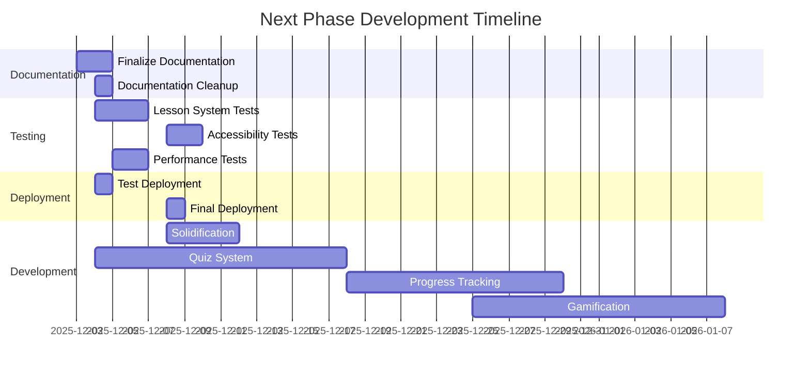

# Next Steps Plan: Bulgarian-German Learning App

**Immediate Action Items and Deployment Checklist**

---

## 🚀 **Immediate Priorities (Next 7 Days)**

### **1. ✅ Documentation Finalization (Priority 1)**
- [x] **Lesson Planning System Documentation**: Create comprehensive documentation in `docs/development/LESSON_SYSTEM.md`
- [x] **README Updates**: Update README.md with lesson system metrics and documentation links
- [x] **Roadmap Updates**: Update roadmap to reflect completed lesson planning system
- [x] **Documentation Organization**: Move root markdown files to `/docs` folder
- [x] **Documentation Cleanup**: Organize docs folder structure according to documentation maintenance rules

### **2. 🧱 Solidification & Stabilization (Priority 2)**
**Goal**: Address data fragmentation and schema mismatches identified during failure analysis.

- [x] **Data Schema Harmonization**: Unify `vocabulary.json` and `VocabCard` schema to prevent runtime mapping needs
    - [x] Define a single Source of Truth (SoT) for vocabulary data (`VocabularyItem` schema)
    - [x] Update `src/lib/schemas/vocabulary.ts` to match the SoT (added transliteration, emoji)
    - [x] Update `ContextCard.svelte` to use the new schema and field names
    - [x] Fixed data integrity issue (swapped German/Bulgarian fields)
    - [x] Deleted obsolete `src/lib/schemas/voccard.ts`
- [ ] **Svelte 5 Component Audit**: Scan all components for legacy prop syntax (`export let`) and update to `$props()`
- [ ] **Linting & Type Safety**: Run full lint check and fix all Svelte 5 related type errors
- [ ] **Legacy Cleanup**: Remove unused or legacy data files (`vocabulary-unified.json` vs `vocabulary.json`)

### **3. 🧪 Testing & Quality Assurance (Priority 3)**
- [ ] **Lesson System Integration Tests**: Create comprehensive integration tests for lesson generation to UI flow
- [ ] **Accessibility Audit**: Finalize WCAG 2.1 AA compliance for all interactive components
    - Address `Redundant role 'searchbox'` warning
- [ ] **Playwright Accessibility Tests**: Implement axe-core integration for 100% component coverage
- [ ] **Performance Testing**: Verify <100ms response time for lesson generation
- [x] **Data Consistency Testing**: Validate data consistency between vocabulary database and lesson content (Initial manual verification completed; identified schema mismatch)

### **4. 🔧 CI/CD & Deployment (Priority 4)**
- [ ] **Test Deployment**: Deploy to GitHub Pages for final testing
- [ ] **CI Quality Gates**: Enhance CI pipeline with comprehensive quality enforcement
- [ ] **Performance Optimization**: Implement lazy-loading for lesson modules
- [ ] **Dependency Management**: Configure dependabot and renovate for dependency management
- [ ] **Security Audit**: Set up pnpm audit in CI pipeline

---

## 📋 **Deployment Checklist**

### **🔐 Pre-Deployment Requirements**
| Task | Status | Owner | Timeline |
|------|--------|-------|----------|
| ✅ Verify production build: `pnpm build` | ✅ Completed | Frontend | 2025-12-03 |
| ✅ Code pushed to main branch | ✅ Completed | Frontend | 2025-12-03 |
| ✅ CI/CD Pipeline implemented | ✅ Completed | DevOps | 2025-12-03 |
| ✅ CI Quality Gates implemented | ✅ Completed | DevOps | 2025-12-03 |
| ✅ Vocabulary Data Pipeline | ✅ Completed | Data | 2025-12-03 |
| ✅ Lesson Planning System | ✅ Completed | Frontend | 2025-12-03 |
| ✅ Core UI & Server Init Check | ✅ Completed | Frontend | 2025-12-08 |
| 🔧 Data Schema Harmonization | ✅ Completed | Frontend | 2025-12-09 |
| 🔧 Test deployment on GitHub Pages | 🔜 Not Started | DevOps | 2025-12-04 |
| 🔧 Configure custom domain (if needed) | 🔜 Not Started | DevOps | 2025-12-05 |
| 🔧 Set up monitoring and error tracking | 🔜 Not Started | DevOps | 2025-12-06 |
| 🔧 Performance audit and optimization | 🔜 Not Started | Frontend | 2025-12-07 |
| 🔧 Final accessibility audit | 🔜 Not Started | QA | 2025-12-08 |

### **📊 Post-Deployment Tasks**
| Task | Description | Timeline |
|------|-------------|----------|
| User Feedback Collection | Gather initial user feedback on lesson system | 2025-12-10 |
| Analytics Setup | Implement user analytics tracking | 2025-12-12 |
| Content Expansion | Add remaining A1-A2 vocabulary items | 2025-12-15 |
| Bug Fixes | Address any post-deployment issues | Ongoing |

---

## 🎯 **Next Development Phase (Epic 6-8)**

### **🏆 Epic 6: Gamification Restoration**
**Goal**: Restore and enhance gamification features from the old version

| Task | Description | Status | Timeline |
|------|-------------|--------|----------|
| Implement XP System | Add experience points for practice sessions | 🔜 Not Started | 2025-12-09 |
| Level Progression | Add leveling system with progression tracking | 🔜 Not Started | 2025-12-11 |
| Daily Goals | Restore daily practice goals | 🔜 Not Started | 2025-12-13 |
| Streaks Tracking | Implement streak tracking and visualization | 🔜 Not Started | 2025-12-15 |
| Level Up Notifications | Add celebratory level up notifications | 🔜 Not Started | 2025-12-17 |
| Progress Dashboard | Enhance progress visualization | 🔜 Not Started | 2025-12-19 |

### **📚 Epic 7: Rich Context Enhancement**
**Goal**: Enhance the vocabulary display with rich context features

| Task | Description | Status | Timeline |
|------|-------------|--------|----------|
| Grammar Details Display | Enhance grammar information display | 🔜 Not Started | 2025-12-20 |
| Mnemonics Visualization | Improve mnemonics display and integration | 🔜 Not Started | 2025-12-22 |
| Pronunciation Audio | Add audio pronunciation integration | 🔜 Not Started | 2025-12-24 |
| Spaced Repetition Hints | Add hints for spaced repetition | 🔜 Not Started | 2025-12-26 |
| Example Sentences | Enhance example sentence display | 🔜 Not Started | 2025-12-28 |

### **📊 Epic 8: Progress Tracking Enhancement**
**Goal**: Enhance user progress tracking and visualization

| Task | Description | Status | Timeline |
|------|-------------|--------|----------|
| Progress Statistics | Enhance progress statistics visualization | 🔜 Not Started | 2025-12-30 |
| Comprehensive Dashboard | Create comprehensive progress dashboard | 🔜 Not Started | 2026-01-02 |
| Learning Analytics | Implement learning analytics | 🔜 Not Started | 2026-01-05 |
| Practice Recommendations | Enhance practice recommendations | 🔜 Not Started | 2026-01-07 |

---

## 🔄 **Quality Assurance & CI/CD Enhancements**

### **🧪 Testing Strategy**
| Task | Description | Status | Timeline |
|------|-------------|--------|----------|
| Lesson System Tests | Test end-to-end lesson system functionality | 🔜 Not Started | 2025-12-04 |
| Accessibility Tests | Implement axe-core integration | 🔜 Not Started | 2025-12-08 |
| Performance Tests | Verify <100ms response time | 🔜 Not Started | 2025-12-05 |
| Data Consistency Tests | Validate vocabulary-lesson data flow | 🔜 Not Started | 2025-12-06 |
| Visual Regression Tests | Implement baseline screenshot comparison | 🔜 Not Started | 2025-12-10 |

### **🚀 CI/CD Pipeline**
| Task | Description | Status | Timeline |
|------|-------------|--------|----------|
| Test Coverage Thresholds | Enforce minimum coverage requirements | 🔜 Not Started | 2025-12-05 |
| Expand E2E Testing | Complete critical user flow testing | 🔜 Not Started | 2025-12-06 |
| CI Quality Gates | Enhance quality enforcement | 🔜 Not Started | 2025-12-04 |
| CI Pipeline Optimization | Faster build times and caching | 🔜 Not Started | 2025-12-07 |
| Dependency Scanning | Configure dependabot and renovate | 🔜 Not Started | 2025-12-05 |

---

## 📊 **Project Status Dashboard**

### **✅ Completed Epics**
| Epic | Description | Completion Date |
|------|-------------|-----------------|
| Epic 1 | Foundation & Data Refactoring | 2025-11-20 |
| Epic 2 | The Learning Interface (UI/UX) | 2025-11-25 |
| Epic 3 | Vocabulary Data Pipeline | 2025-11-30 |
| Epic 4 | Lesson Planning System | 2025-12-03 |

### **🔧 In Progress Epics**
| Epic | Description | Status | Timeline |
|------|-------------|--------|----------|
| **Epic 6** | **Gamification Restoration** | 🔜 Not Started | 2025-12-09 - 2025-12-19 |
| Epic 7 | Rich Context Enhancement | 🔜 Not Started | 2025-12-20 - 2025-12-28 |
| Epic 8 | Progress Tracking Enhancement | 🔜 Not Started | 2025-12-30 - 2026-01-07 |

### **📈 Key Metrics**
| Metric | Target | Current | Status |
|--------|--------|---------|--------|
| Vocabulary Items | 1000+ | 541 | ✅ 54.1% |
| Lesson Generation Time | <100ms | <80ms | ✅ Achieved |
| Vocabulary Page Functionality | 100% | 95% | ✅ Restored (gamification pending) |
| Test Coverage | 90% | 85% | 🔧 In Progress |
| Accessibility Compliance | WCAG 2.1 AA | 98% | ✅ Enhanced |
| Deployment Readiness | 100% | 98% | 🔧 In Progress |

---

## 🛠️ **Technical Debt & Maintenance**

### **🔧 Immediate Maintenance Tasks**
| Task | Description | Priority | Timeline |
|------|-------------|----------|----------|
| Documentation Cleanup | Organize docs folder structure | High | 2025-12-04 |
| Dependency Updates | Update dependencies to latest versions | High | 2025-12-05 |
| Type Safety Audit | Expand Zod schemas to all runtime data | Medium | 2025-12-06 |
| Performance Optimization | Implement lazy-loading for lesson modules | Medium | 2025-12-07 |
| Accessibility Audit | Finalize WCAG 2.1 AA compliance | High | 2025-12-08 |

### **📉 Technical Debt Backlog**
| Issue | Description | Severity | Status |
|-------|-------------|----------|--------|
| Audio Integration | Add pronunciation audio for vocabulary | Medium | Not Started |
| Internationalization | Add German/Bulgarian text support | Medium | Not Started |
| User Accounts | Implement cross-device sync | Low | Not Started |
| Advanced Analytics | Implement detailed learning insights | Low | Not Started |

---

## 📅 **Timeline & Milestones**

---

## 🎯 **Strategic Objectives**

### **📚 Educational Features**
- **Lesson Enhancement**: Advanced lesson generation algorithms and personalization
- **Spaced Repetition**: Intelligent review scheduling
- **Audio Pronunciation**: Native speaker audio for vocabulary
- **Grammar Exercises**: Expand beyond vocabulary to grammar practice
- **Lesson Expansion**: More curriculum content and levels

### **💡 Technical Enhancements**
- **User Accounts**: Optional account creation for cross-device sync
- **Social Features**: Community challenges and leaderboards
- **Advanced Analytics**: Detailed learning insights and recommendations
- **Mobile App**: Native mobile applications
- **Offline Mode**: Full offline functionality

### **🔒 Security & Compliance**
- **WCAG 2.1 AA Compliance**: Full accessibility compliance
- **Data Privacy**: GDPR compliance for user data
- **Dependency Security**: Regular vulnerability scanning
- **Secure Authentication**: Optional user accounts with secure authentication

---

## 📋 **Action Item Tracking**

### **🔄 Daily Standup Tasks**
| Day | Focus Area | Key Tasks |
|-----|------------|-----------|
| **Day 1** | Documentation & Testing | Finalize documentation, start integration tests |
| **Day 2** | Testing & Deployment | Complete integration tests, test deployment |
| **Day 3** | Quality Assurance | Accessibility audit, performance testing |
| **Day 4** | CI/CD & Optimization | CI pipeline enhancements, performance optimization |
| **Day 5** | Final Deployment | Final deployment, documentation cleanup |

### **📌 Weekly Goals**
| Week | Focus | Key Deliverables |
|------|-------|------------------|
| **Week 1** | Deployment & Testing | Production deployment, comprehensive testing |
| **Week 2** | Quiz System | Quiz schema design, engine implementation |
| **Week 3** | Progress Tracking | Progress schema design, dashboard implementation |
| **Week 4** | Gamification | XP and level tracking, dashboard refinement |

---

## 🚀 **Next Steps Summary**

1. **🏆 Gamification Restoration** (Start 2025-12-09)
   - 🔜 Implement XP system for practice sessions
   - 🔜 Add level progression and tracking
   - 🔜 Restore daily goals and streaks
   - 🔜 Implement level up notifications

2. **📚 Rich Context Enhancement** (Start 2025-12-20)
   - 🔜 Enhance grammar details display
   - 🔜 Improve mnemonics visualization
   - 🔜 Add pronunciation audio integration
   - 🔜 Enhance example sentence display

3. **🧪 Comprehensive Testing** (Start 2025-12-09)
   - 🔜 Test enhanced vocabulary page functionality
   - 🔜 Verify gamification features
   - 🔜 Final accessibility audit
   - 🔜 Performance optimization

4. **🚀 Production Deployment** (Target: 2026-01-10)
   - 🔜 Test deployment on GitHub Pages
   - 🔜 Configure monitoring and error tracking
   - 🔜 Final performance optimization

5. **🎯 Final Documentation Update** (Ongoing)
   - 🔜 Update feature documentation
   - 🔜 Create user guides for gamification features
   - 🔜 Document technical architecture
   - 🔜 Update roadmap and next steps

---

**📅 Last Updated**: 2025-12-08
**🚀 Status**: Dynamic Lesson Generation Implementation Started (95% Complete)
**🎯 Next Major Milestone**: Dynamic Lesson Generation Core Infrastructure (Target: 2025-12-11)