# Vocabulary API Architecture

## System Architecture Overview

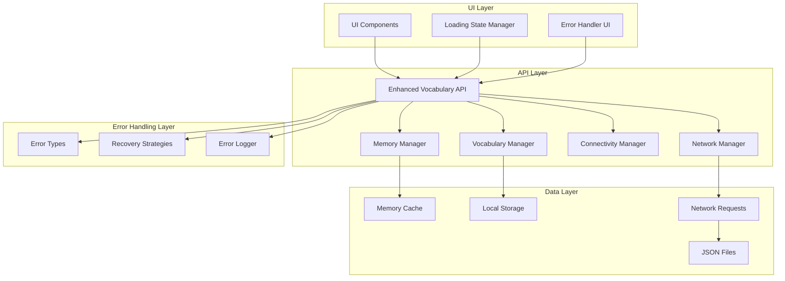

## Error Handling Flow

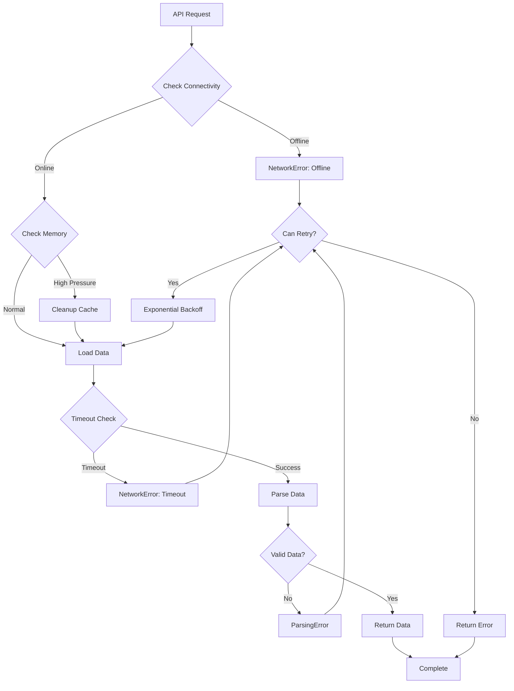

## Loading State Management

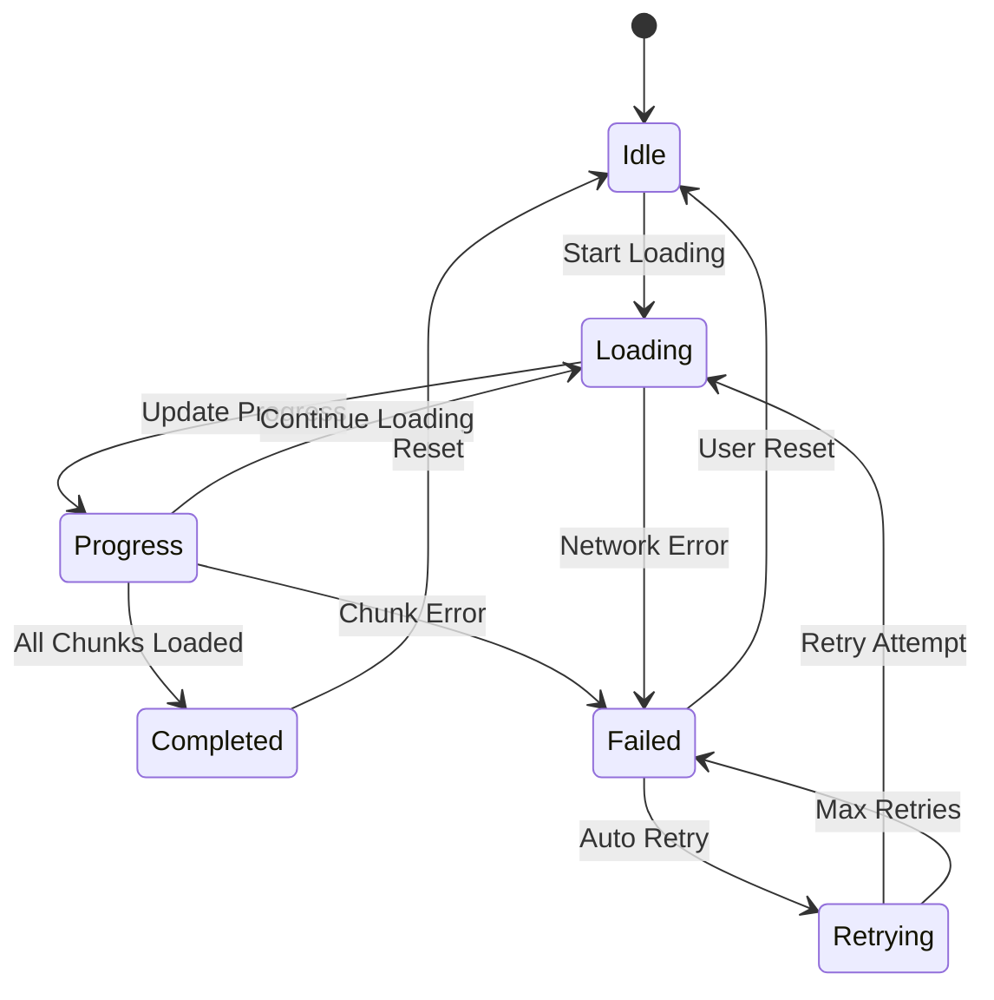

## Component Interaction

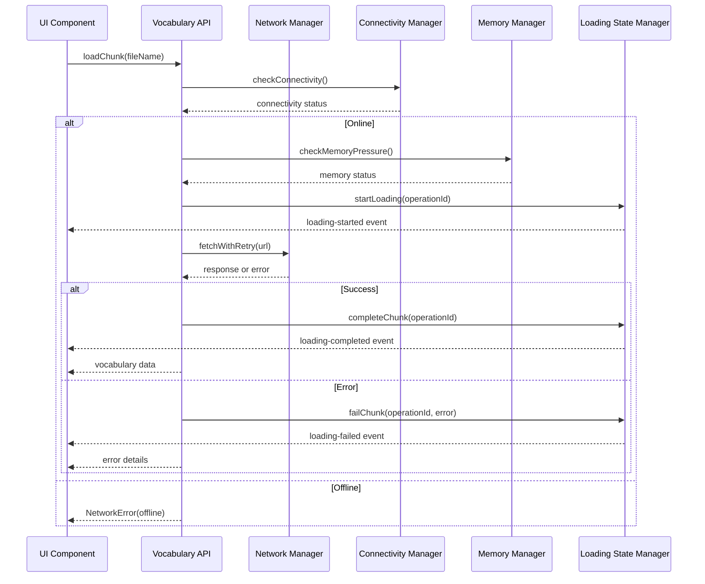

## Data Flow Architecture

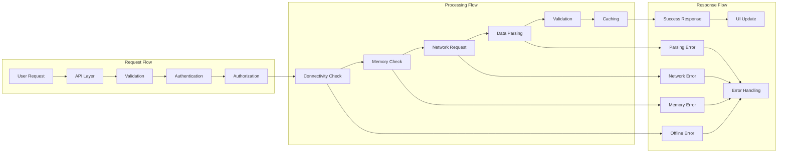

## Error Classification System

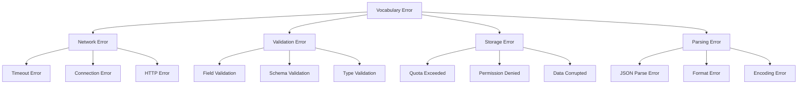

## Memory Management Strategy

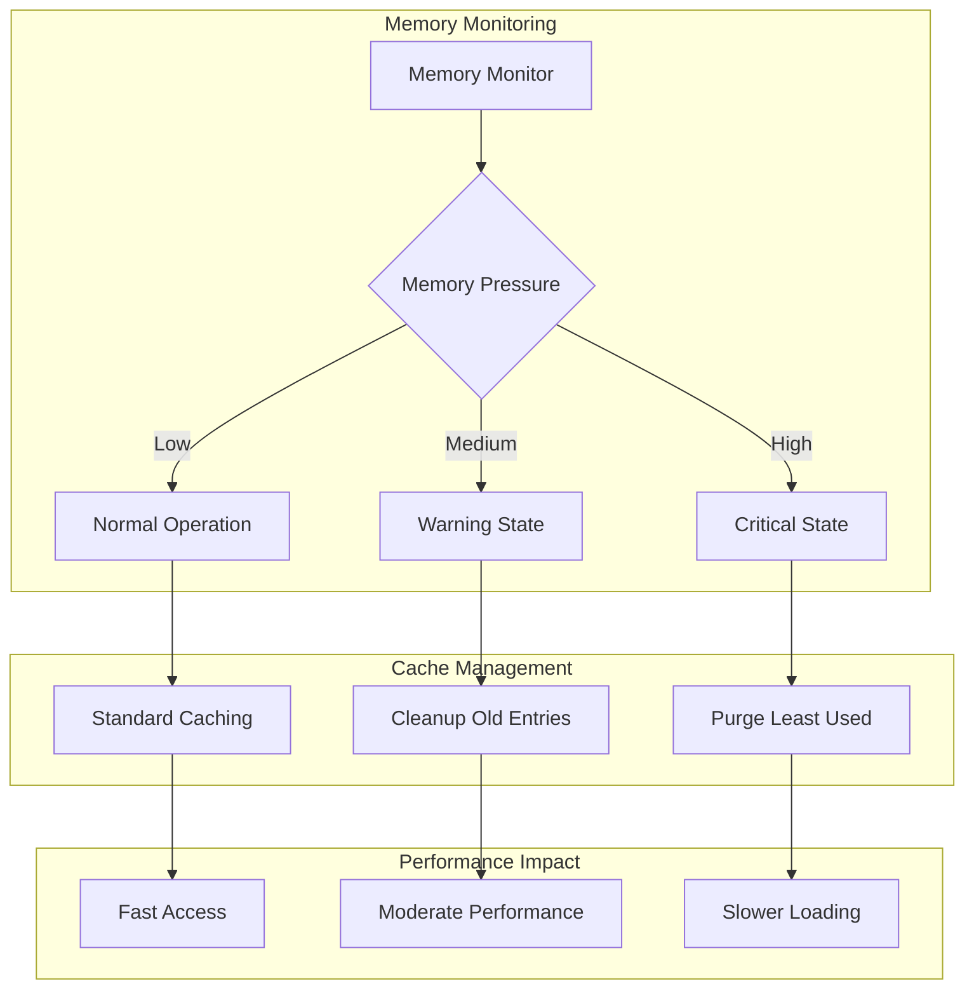

## Retry Strategy Flow

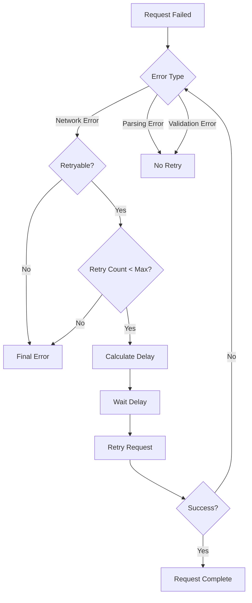

## Integration Points

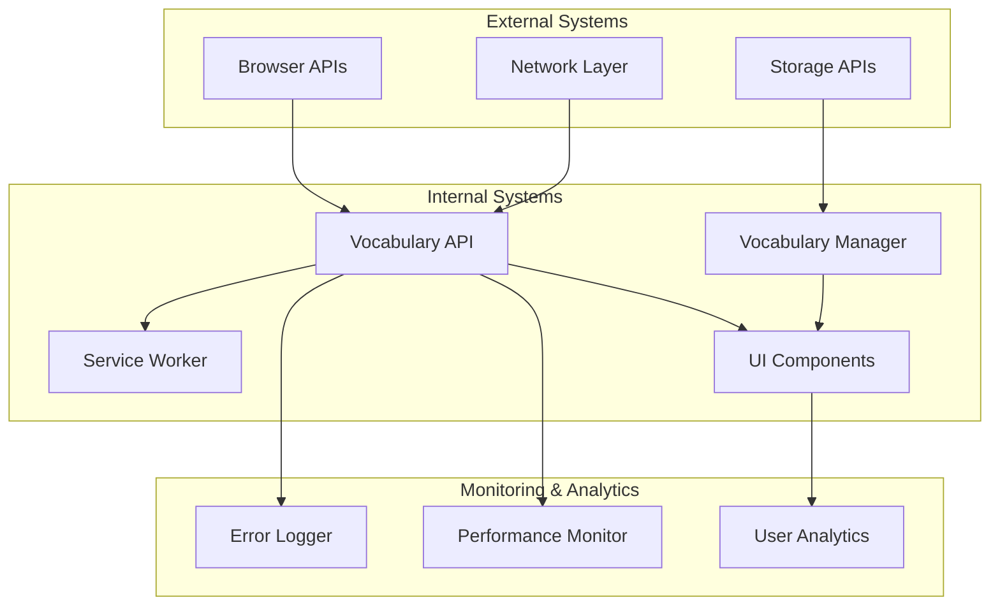

## Deployment Architecture

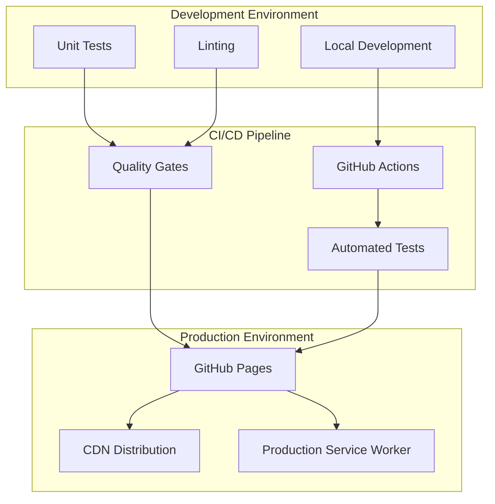

## Security Considerations

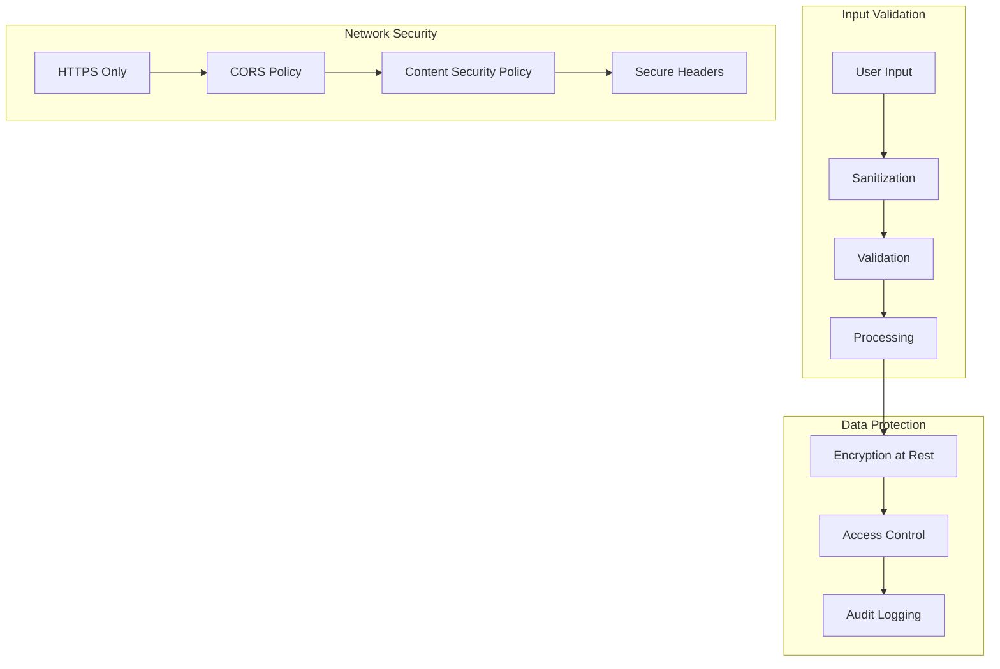

## Performance Optimization

```mermaid
graph TB
    subgraph "Loading Performance"
        LazyLoad[Lazy Loading] --> Prefetch[Prefetching]
        Prefetch --> Cache[Strategic Caching]
        Cache --> Compress[Compression]
    end

    subgraph "Runtime Performance"
        Debounce[Debouncing] --> Throttle[Throttling]
        Throttle --> Memoize[Memoization]
        Memoize --> Optimize[Optimization]
    end

    subgraph "Memory Performance"
        Cleanup[Automatic Cleanup] --> Monitor[Memory Monitoring]
        Monitor --> OptimizeCache[Cache Optimization]
        OptimizeCache --> GC[Garbage Collection]
    end
```

This architecture provides a comprehensive foundation for the enhanced vocabulary API with robust error handling, loading state management, and performance optimization. The modular design ensures maintainability and extensibility while maintaining backward compatibility.