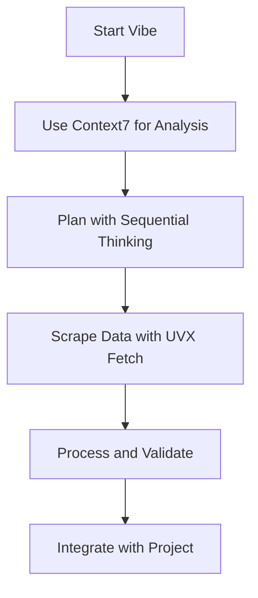
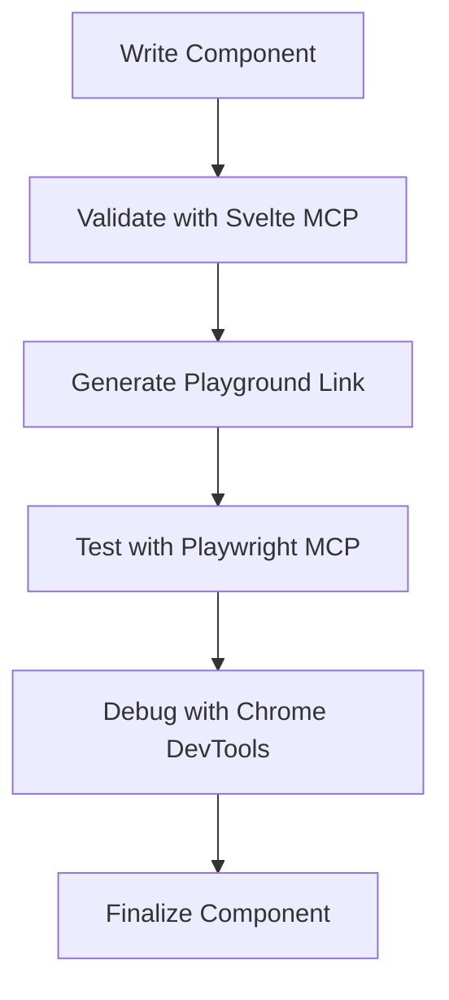

# Vibe MCP Server Configuration

This directory contains the MCP (Model Context Protocol) server configuration for Vibe, extending its capabilities with the MCP servers configured for the Bulgarian-German Learning App project.

## 📁 Configuration Files

- `vibe-mcp-config.toml` - Main Vibe MCP configuration file
- `README.md` - This file

## 🚀 Setup Instructions

### 1. Install Vibe

First, ensure you have Vibe installed:

```bash
# Install Vibe (if not already installed)
npm install -g @mistral/vibe
```

### 2. Configure Vibe Home Directory

Set up the Vibe home directory to use this configuration:

```bash
# Set VIBE_HOME environment variable
export VIBE_HOME="/path/to/this/project/vibe-config"

# Or add to your shell configuration (.bashrc, .zshrc, etc.)
echo 'export VIBE_HOME="/path/to/this/project/vibe-config"' >> ~/.zshrc
source ~/.zshrc
```

### 3. Create Vibe Configuration Directory

```bash
mkdir -p $VIBE_HOME
cp vibe-mcp-config.toml $VIBE_HOME/config.toml
```

### 4. Install Required MCP Packages

```bash
# Install all required MCP packages globally
npm install -g uvx-fetch-mcp @sveltejs/mcp @playwright/mcp @upstash/context7-mcp @modelcontextprotocol/server-sequential-thinking
```

## 🔧 Configured MCP Servers

### 1. UVX Fetch MCP Server

**Name**: `uvx_fetch_mcp`
**Transport**: `stdio`
**Command**: `uvx-fetch-mcp start`

**Tools Available**:
- `uvx_fetch_mcp_fetch` - Fetch content from URLs
- `uvx_fetch_mcp_scrape` - Scrape structured data from websites
- `uvx_fetch_mcp_parse` - Parse HTML content
- `uvx_fetch_mcp_extract` - Extract specific data patterns

### 2. Svelte MCP Server

**Name**: `svelte_mcp`
**Transport**: `stdio`
**Command**: `npx -y @sveltejs/mcp@latest`

**Tools Available**:
- `svelte_mcp_validate` - Validate Svelte components
- `svelte_mcp_playground` - Generate Svelte REPL playground links
- `svelte_mcp_accessibility` - Check accessibility compliance

### 3. Playwright MCP Server

**Name**: `playwright_mcp`
**Transport**: `stdio`
**Command**: `npx @playwright/mcp@latest`

**Tools Available**:
- `playwright_mcp_test` - Run Playwright tests
- `playwright_mcp_debug` - Debug with Playwright
- `playwright_mcp_accessibility` - Validate accessibility

### 4. Context7 MCP Server

**Name**: `context7_mcp`
**Transport**: `stdio`
**Command**: `npx -y @upstash/context7-mcp@latest`

**Tools Available**:
- `context7_mcp_analyze` - Contextual analysis
- `context7_mcp_reason` - Multi-step reasoning

### 5. Sequential Thinking MCP Server

**Name**: `sequential_thinking_mcp`
**Transport**: `stdio`
**Command**: `npx -y @modelcontextprotocol/server-sequential-thinking`

**Tools Available**:
- `sequential_thinking_mcp_think` - Complex problem breakdown
- `sequential_thinking_mcp_hypothesis` - Hypothesis generation

## 📋 Configuration Details

### Tool Permissions

All MCP tools are configured with `"always"` permission, meaning they can be used without additional confirmation.

### Enabled Tools

The configuration enables all MCP tools using glob patterns:

```toml
enabled_tools = [
    "uvx_*",
    "svelte_*",
    "playwright_*",
    "context7_*",
    "sequential_*"
]
```

### Disabled Tools

No tools are disabled by default:

```toml
disabled_tools = []
```

## 🎯 Usage Examples

### Using UVX Fetch MCP

```bash
# Start Vibe with MCP configuration
vibe

# Use UVX Fetch MCP to scrape vocabulary data
vibe> Use uvx_fetch_mcp_scrape to get vocabulary examples from https://language-examples.org
```

### Using Svelte MCP

```bash
# Validate a Svelte component
vibe> Use svelte_mcp_validate to check the VocabularyCard component
```

### Using Playwright MCP

```bash
# Run Playwright tests
vibe> Use playwright_mcp_test to run the vocabulary search test
```

## 🛠️ Troubleshooting

### MCP Server Not Starting

```bash
# Check if MCP packages are installed
uvx-fetch-mcp --version
npx @sveltejs/mcp@latest --version

# Reinstall if needed
npm install -g uvx-fetch-mcp @sveltejs/mcp @playwright/mcp
```

### Vibe Configuration Issues

```bash
# Verify Vibe home directory
echo $VIBE_HOME

# Check configuration file
cat $VIBE_HOME/config.toml

# Test Vibe with configuration
vibe --debug
```

### Permission Issues

```bash
# Check file permissions
ls -la $VIBE_HOME

# Ensure Vibe has access
chmod -R 755 $VIBE_HOME
```

## 📚 Integration with Project

### Vocabulary Enrichment Workflow



### Component Development Workflow



## 🎉 Benefits

### Enhanced Vibe Capabilities

- **Web Scraping**: Fetch and process external data
- **Component Validation**: Ensure Svelte best practices
- **Testing**: Run and debug tests efficiently
- **Analysis**: Contextual reasoning and problem solving
- **Development**: Streamlined component creation

### Seamless Integration

- All MCP servers configured for Vibe
- Consistent tool naming and permissions
- Easy to extend with additional servers
- Comprehensive documentation

## 🚀 Next Steps

1. **Set up Vibe home directory** with this configuration
2. **Install required MCP packages** globally
3. **Test Vibe with MCP servers**
4. **Integrate with your workflow**
5. **Explore advanced capabilities**

## 📞 Support

For issues with Vibe MCP configuration:

1. **Check Vibe logs** for detailed error information
2. **Verify MCP package installations**
3. **Test individual MCP servers** manually
4. **Review configuration file** for syntax errors
5. **Consult Vibe documentation** for advanced usage

## 📝 License

This configuration is licensed under the MIT License. See the main project LICENSE for details.